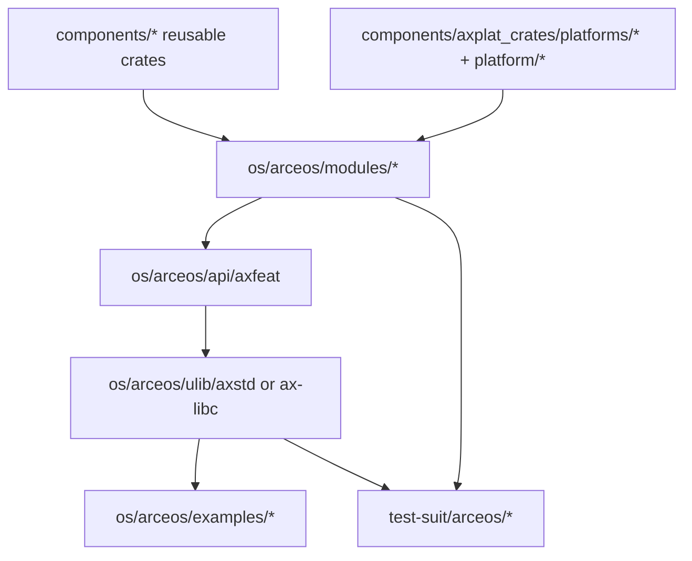

# ArceOS 开发指南

在 TGOSKits 里，ArceOS 既是一个可以单独运行的模块化操作系统，也是 StarryOS 与 Axvisor 复用的基础能力提供者。

## 1. ArceOS 在仓库里的位置

| 路径 | 角色 | 什么时候会改到 |
| --- | --- | --- |
| `os/arceos/modules/` | 内核模块层 | HAL、调度、驱动、网络、文件系统、运行时 |
| `os/arceos/api/` | feature 与对外 API 聚合 | 新增 feature、能力开关或统一入口 |
| `os/arceos/ulib/` | 用户侧库 | 要把能力暴露给应用时 |
| `os/arceos/examples/` | 示例应用 | 做最小验证、写新 demo |
| `test-suit/arceos/` | 系统级测试 | 做自动化回归 |
| `components/axplat_crates/platforms/*` 与 `platform/*` | 平台实现 | 新平台或板级适配 |

最重要的认知是：

- `components/` 里的基础 crate 和 `os/arceos/modules/*` 经常一起构成 ArceOS 能力
- 你改了 ArceOS 的基础层，StarryOS 和 Axvisor 也可能被连带影响

## 2. 最短运行路径

### 仓库根目录的推荐入口

```bash
cargo arceos build --package ax-helloworld --target riscv64gc-unknown-none-elf
cargo arceos qemu --package ax-helloworld --target riscv64gc-unknown-none-elf
```

当前根 CLI 的真实子命令是：

- `build`: 只构建
- `qemu`: 构建并在 QEMU 中运行
- `uboot`: 构建并走 U-Boot 路径运行

常用参数：

- `--package`: 选择应用包，例如 `ax-helloworld`
- `--target`: 选择目标 triple，例如 `riscv64gc-unknown-none-elf`
- `--config`: 显式指定应用目录下的 build info 文件
- `--plat_dyn`: 控制是否启用动态平台

当前根 CLI 不再直接暴露 `--arch`、`--platform`、`--features`、`--smp`、`--net`、`--blk` 这类旧参数。  
如果你需要这些能力，请修改应用目录下的 `.build-<target>.toml` / `build-<target>.toml`，或者使用 `os/arceos/Makefile` 本地入口。

### `os/arceos/` 里的本地入口

```bash
cd os/arceos
make A=examples/helloworld ARCH=riscv64 run
make A=examples/httpserver ARCH=riscv64 NET=y run
make A=examples/shell ARCH=riscv64 BLK=y run
```

什么时候更适合用 `make`：

- 你在调试 ArceOS 自己的 Makefile 变量
- 你需要显式操控 `NET=y`、`BLK=y`、`LOG=debug` 这类本地入口参数

## 3. 从组件到应用的典型链路



## 4. 常见开发动作

### 4.1 修改基础组件或模块

如果你改的是：

- `components/axerrno`、`components/kspin`、`components/page_table_multiarch`
- 或 `os/arceos/modules/axhal`、`ax-task`、`ax-driver`、`ax-net`、`ax-fs`

建议先跑最小消费者：

```bash
cargo arceos qemu --package ax-helloworld --target riscv64gc-unknown-none-elf
```

如果改动依赖特定功能，再换对应示例，或者修改该示例目录下的 build info 文件后再跑：

```bash
cargo arceos qemu --package ax-httpclient --target riscv64gc-unknown-none-elf
```

### 4.2 新增 feature 或暴露给应用

常见接线顺序是：

1. 在 `os/arceos/modules/*` 完成或接入实现
2. 在 `os/arceos/api/axfeat` 暴露 feature
3. 需要给应用直接用时，再接到 `os/arceos/ulib/axstd` 或 `ax-libc`

### 4.3 添加一个新示例应用

新增示例通常放在 `os/arceos/examples/<name>/`。最小 `Cargo.toml` 可以参考：

```toml
[package]
name = "myapp"
version = "0.1.0"
edition.workspace = true

[dependencies]
ax-std.workspace = true
```

最小 `src/main.rs` 可以参考：

```rust
#![cfg_attr(feature = "ax-std", no_std)]
#![cfg_attr(feature = "ax-std", no_main)]

#[cfg(feature = "ax-std")]
use ax_std::println;

#[cfg_attr(feature = "ax-std", unsafe(no_mangle))]
fn main() {
    println!("Hello from myapp!");
}
```

然后运行：

```bash
cargo arceos qemu --package myapp --target riscv64gc-unknown-none-elf
```

### 4.4 添加或修改平台

如果你改的是平台逻辑，需要一起看：

- `components/axplat_crates/platforms/*`
- `platform/axplat-dyn`
- `platform/x86-qemu-q35`

验证时通常要显式指定 target triple；如果需要切平台或 feature，请配合 `--config` 指向对应 build info 文件，或者回到 `os/arceos/Makefile`。

## 5. 最常用的验证入口

### 示例应用

```bash
cargo arceos qemu --package ax-helloworld --target riscv64gc-unknown-none-elf
cargo arceos qemu --package ax-httpclient --target riscv64gc-unknown-none-elf
```

### 系统测试

```bash
cargo arceos test qemu --target riscv64gc-unknown-none-elf
```

这条命令会自动发现 `test-suit/arceos/` 下的测试包。

### host / unit 测试

```bash
cargo test -p ax-errno
```

## 6. 调试建议

### 看更详细的运行日志

```bash
cd os/arceos
make A=examples/helloworld ARCH=riscv64 LOG=debug run
```

### 启动 GDB 调试

```bash
cd os/arceos
make A=examples/helloworld ARCH=riscv64 debug
```

这比在根目录命令里硬塞额外 QEMU 参数更可靠，因为根 `cargo arceos qemu` 当前并不直接暴露原始 QEMU 参数透传接口。

### 什么时候优先用根目录入口

- 你要验证集成行为
- 你要和 `test-suit`、StarryOS 或 Axvisor 的共享依赖对齐
- 你希望命令风格和 CI 更接近

## 7. 继续往哪里读

- [arceos-internals.md](arceos-internals.md): 系统理解 ArceOS 的分层、feature 装配、启动路径和内部机制
- [components.md](components.md): 从组件视角继续看共享依赖怎么接到三个系统
- [build-system.md](build-system.md): 理解根 xtask、Makefile 和 workspace 的边界
- [starryos-guide.md](starryos-guide.md): 如果你的 ArceOS 改动会波及 StarryOS
- [axvisor-guide.md](axvisor-guide.md): 如果你的 ArceOS 改动会波及 Axvisor
