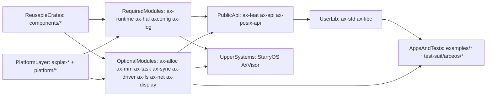
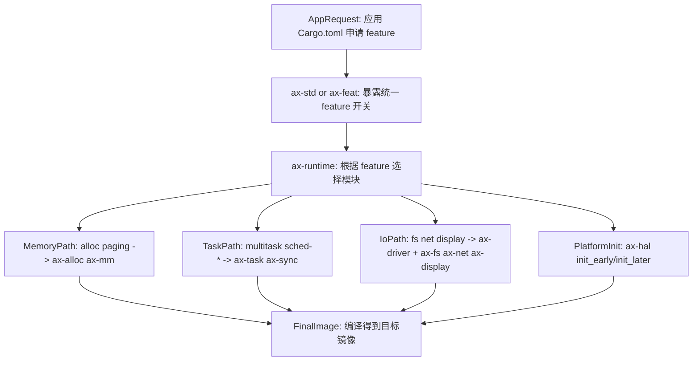
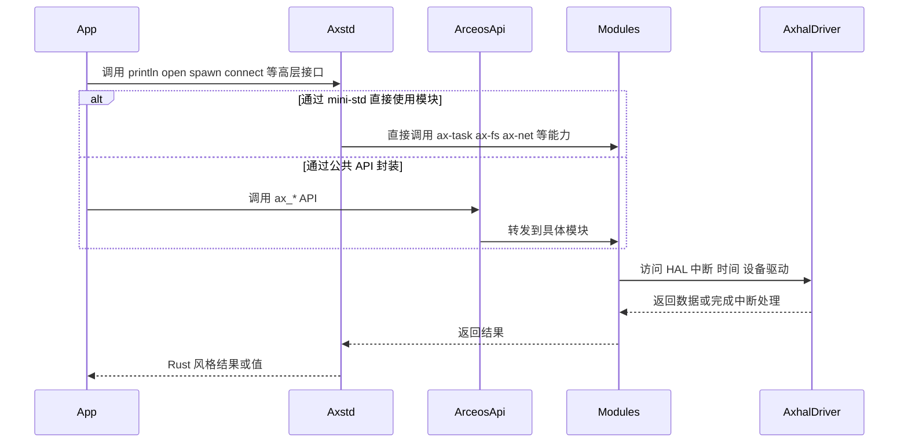
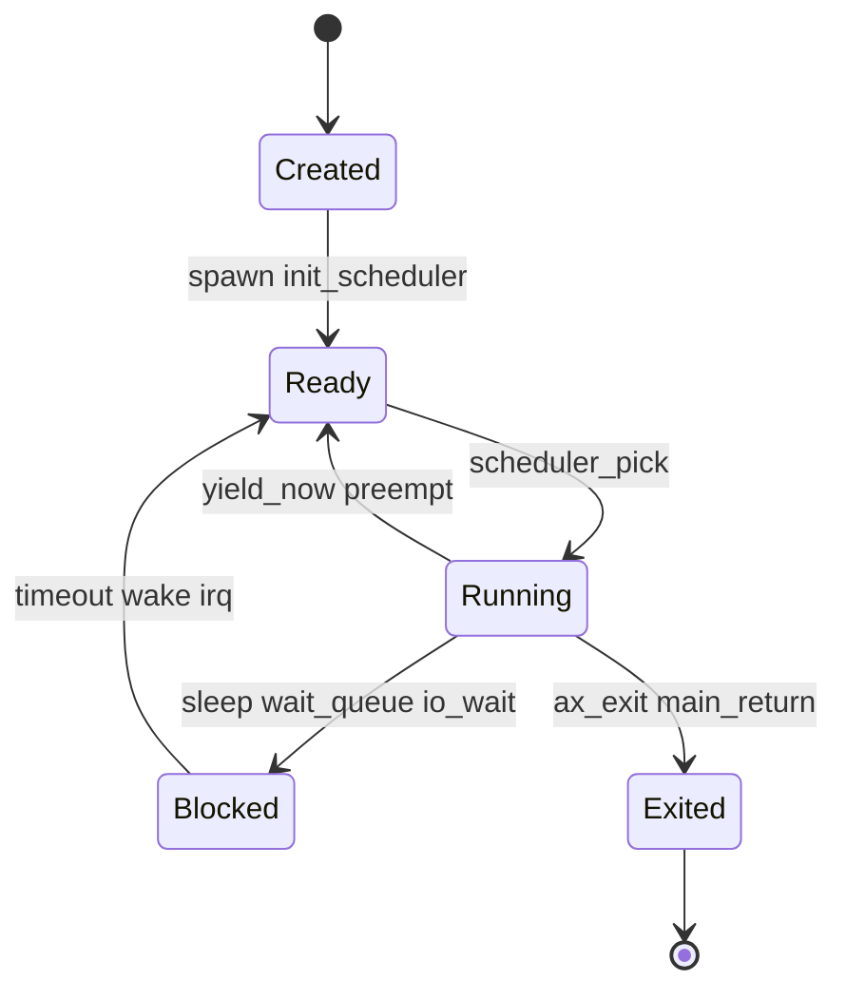
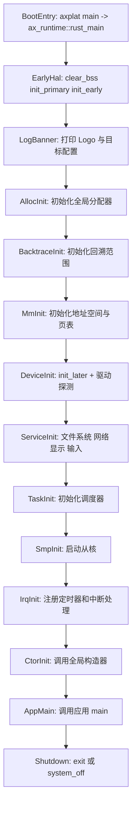

# ArceOS 内部机制

本文档面向准备修改内核模块、进行性能分析、补充特性或向上层系统复用 ArceOS 能力的开发者，重点阐述以下内容：

- ArceOS 在 TGOSKits 中的分层边界。
- 能力如何从 `Cargo feature` 装配到运行时模块。
- 启动、调度、文件系统、网络等核心子系统的内部协作机制。
- 功能改进、性能优化或二次开发的推荐切入点。

若仅需要运行示例，请先阅读 [quick-start.md](quick-start.md) 和 [arceos-guide.md](arceos-guide.md)。

## 1. 系统定位与设计目标

ArceOS 在本仓库中同时扮演三种角色：

| 角色 | 含义 | 在 TGOSKits 中的体现 |
| --- | --- | --- |
| 组件化单内核 | 通过 Rust crate 与 feature 做编译期装配，尽量减少不需要的运行时负担 | `os/arceos/modules/*`、`os/arceos/api/*`、`os/arceos/ulib/*` |
| 基础系统平台 | 直接承载示例应用、测试包和实验性系统程序 | `os/arceos/examples/*`、`test-suit/arceos/*` |
| 共享能力提供者 | 为 StarryOS 和 AxVisor 复用 HAL、任务、内存、驱动等基础能力 | `ax-hal`、`ax-task`、`ax-mm`、`ax-driver` 等模块被上层系统直接依赖 |

ArceOS 的设计目标并非构建"大而全"的宏内核，而是强调以下原则：

| 目标 | 含义 | 典型实现 |
| --- | --- | --- |
| 编译期可裁剪 | 只链接被 feature 选中的能力，避免把不需要的子系统塞进镜像 | `ax-feat`、`ax-runtime/Cargo.toml` |
| 层次分离 | 把可复用 crate、OS 相关模块、API 封装、用户库和应用分开管理 | `components/`、`modules/`、`api/`、`ulib/` |
| 跨平台 | 用统一 HAL 和平台 crate 支撑多架构与多板级目标 | `ax-hal`、`axplat-*`、`platform/*` |
| 低抽象损耗 | `ax-std` 直接调用 ArceOS 模块，而不是先走 libc 和 syscall | `os/arceos/ulib/axstd/src/lib.rs` |
| Rust 安全性 | 利用所有权、trait、类型系统和同步原语减少数据竞争和空悬引用 | `ax-sync`、`ax-task`、`ax-crate-interface` |

## 2. 架构概览

从仓库结构来看，ArceOS 的核心价值在于这些 crate 被有意识地组织成一条从底层平台到上层应用的能力传递链。



理解此图可从两个方向入手：

- 自下而上：应用最终经由 `user lib -> API -> modules -> HAL/platform` 链路获取能力。
- 自右向左：StarryOS 和 AxVisor 复用的是底层模块能力，修改 `ax-hal`、`ax-task`、`ax-driver` 等模块可能同时影响多个系统。

### 2.1 分层职责

| 层次 | 主要目录 | 关注点 |
| --- | --- | --- |
| 可复用 crate 层 | `components/*` | 算法、同步、容器、地址空间、设备抽象等可被多个系统复用的基础构件 |
| 平台与 HAL 层 | `platform/*`、`components/axplat_crates/platforms/*`、`os/arceos/modules/axhal` | 架构相关启动、时钟、中断、内存映射、设备访问 |
| 内核服务模块层 | `os/arceos/modules/*` | 内存分配、页表、任务调度、驱动、文件系统、网络、图形等 OS 能力 |
| API 聚合层 | `os/arceos/api/*` | feature 选择、稳定 API 封装、POSIX 兼容接口 |
| 用户库层 | `os/arceos/ulib/*` | `ax-std`、`ax-libc` 等高层开发接口 |
| 应用与测试层 | `os/arceos/examples/*`、`test-suit/arceos/*` | 场景化验证与系统回归 |

### 2.2 必选模块与可选模块

ArceOS 的基础骨架由四个必选模块组成：

- `ax-runtime`：启动与初始化总控。
- `ax-hal`：统一硬件抽象层。
- `axconfig`：平台常量、栈大小、物理内存、目标平台等构建时参数。
- `ax-log`：日志输出与格式化。

其余模块大多按 feature 启用，以下按功能域分类列出：

| 模块 | 典型 feature | 作用 |
| --- | --- | --- |
| `ax-alloc` | `alloc` | 全局内存分配器（支持 TLSF、buddy、slab 等策略） |
| `ax-mm` | `paging` | 地址空间与页表管理 |
| `ax-task` | `multitask`、`sched-*` | 任务创建、调度（FIFO/RR/CFS）、sleep、wait queue |
| `ax-sync` | `multitask` | mutex、信号量等同步原语 |
| `ax-driver` | `driver-*`、`fs`、`net`、`display` | 设备探测与驱动初始化（virtio、AHCI、SDMMC 等） |
| `ax-fs` | `fs` | 文件系统（FAT、ramfs、ext4） |
| `ax-fs-ng` | `fs-ng` | 下一代文件系统（FAT、ext4，带 LRU 缓存） |
| `ax-net` | `net` | 网络栈（基于 smoltcp） |
| `ax-net-ng` | `net-ng` | 下一代网络栈（异步感知） |
| `ax-display` | `display` | 图形显示（帧缓冲） |
| `ax-input` | `input` | 输入设备管理 |
| `ax-dma` | `dma` | DMA 内存分配与管理 |
| `ax-ipi` | `ipi` | 处理器间中断管理 |

## 3. 核心设计机制

### 3.1 Crates 与 Modules 的边界

ArceOS 文档中 `Crates` 与 `Modules` 的区别如下：

- `components/*` 中的 crate 偏向通用基础构件，尽量与具体 OS 设计解耦。
- `modules/*` 则体现 ArceOS 的设计取向，如任务模型、驱动装配方式、文件系统初始化路径等。

分层的收益：

- 更多基础能力可在 StarryOS、AxVisor 等系统中复用。
- OS 语义集中在 `modules/*` 和 `api/*`，降低 API 污染。
- 能力启用由 Cargo feature 控制，而非运行时动态决策。

### 3.2 Feature 驱动的系统装配

ArceOS 的装配逻辑分布在应用依赖、`ax-std/ax-feat` feature 以及 `ax-runtime` 的 feature 依赖图中。



一个很典型的例子是 `httpserver` 示例应用只在依赖里声明：

```toml
[dependencies]
ax-std = { workspace = true, features = ["alloc", "multitask", "net"], optional = true }
```

而 `ax-runtime` 将这些 feature 继续映射为更底层的模块依赖：

```toml
[features]
# 内存
alloc = ["dep:ax-alloc"]
paging = ["dep:ax-mm"]
dma = ["dep:ax-dma"]
# 并发
multitask = ["ax-task/multitask", "dep:ax-sync"]
smp = ["ax-hal/smp"]
tls = ["ax-hal/tls"]
ipi = ["dep:ax-ipi", "ax-hal/ipi"]
# 中断与时间
irq = ["ax-hal/irq"]
rtc = ["ax-hal/rtc"]
# 虚拟化
hv = ["ax-hal/hv", "ax-alloc/hv"]
# 平台
plat-dyn = ["ax-hal/plat-dyn"]
ax-driver = ["dep:ax-driver"]
# 文件系统
fs = ["ax-driver", "dep:ax-fs"]
fs-ng = ["ax-driver", "dep:ax-fs-ng"]
# 网络
net = ["ax-driver", "dep:ax-net"]
net-ng = ["ax-driver", "dep:ax-net-ng"]
vsock = ["dep:ax-net", "dep:ax-net-ng"]
# 显示与输入
display = ["ax-driver", "dep:ax-display"]
input = ["ax-driver", "dep:ax-input"]
```

这意味着对开发者而言：**ArceOS 的"功能是否存在"本质上是编译期装配问题，而非运行时开关问题。**

### 3.3 API 封装策略

ArceOS 提供三种不同粒度的对外接口：

| 接口层 | 目录 | 适合谁使用 | 特点 |
| --- | --- | --- | --- |
| `ax-api` | `os/arceos/api/arceos_api` | 内核模块、系统软件、需要直接使用 ArceOS 能力的上层系统 | 提供 `sys`、`time`、`mem`、`task`、`fs`、`net`、`display` 等明确分类的 API |
| `ax-posix-api` | `os/arceos/api/arceos_posix_api` | 需要 POSIX 风格接口的用户层或兼容层 | 更接近 C / POSIX 习惯 |
| `ax-std` / `ax-libc` | `os/arceos/ulib/*` | 应用开发者 | 分别提供 Rust 风格 mini-std 与 libc 风格接口 |

`ax-api` 的组织方式很直接：按能力域导出稳定函数。例如：

| API 模块 | 典型能力 |
| --- | --- |
| `sys` | CPU 数、关机 |
| `time` | 单调时间、实时时间 |
| `mem` | 内存分配、DMA 分配 |
| `task` | `spawn`、sleep、yield、wait queue |
| `fs` | 文件与目录操作 |
| `net` | TCP/UDP socket 与 DNS |
| `display` | 帧缓冲与刷新 |
| `modules` | 在需要时直接回落到具体模块 |

### 3.4 `ax-std` 不走 syscall 的原因

`ax-std` 提供类似 Rust `std` 的接口，但其实现不是通过 libc 和 syscall，而是**直接调用 ArceOS 模块**。这带来两个影响：

- 单内核应用调用路径更短，减少中间 ABI 层开销。
- 应用接口与内核能力之间的对应关系更清晰，便于 feature 裁剪和性能分析。

以下时序图展示了 ArceOS 中两条典型的能力调用路径：



分析此图需注意：

- `ax-std` 路径偏向应用开发接口。
- `ax-api` 路径偏向系统软件与内部组件接口。
- 两者最终均落到 `modules/*` 和 `ax-hal`，性能瓶颈与行为差异通常在此层。

## 4. 功能组件与模块

本节从模块总览、交互主线和任务调度模型三个角度介绍 ArceOS 的核心功能组件。

### 4.1 核心模块总览

以下表格汇总了 ArceOS 各核心模块的目录位置、职责及常见联动对象：

| 组件 | 目录 | 关键职责 | 常见联动对象 |
| --- | --- | --- | --- |
| `ax-runtime` | `os/arceos/modules/axruntime` | 系统主入口、初始化顺序、主核/从核协同 | `ax-hal`、`ax-log`、`ax-alloc`、`ax-mm`、`ax-task`、`ax-driver` |
| `ax-hal` | `os/arceos/modules/axhal` | CPU、内存、时间、中断、页表、TLS、DTB 等硬件抽象 | 平台 crate、`ax-runtime` |
| `ax-alloc` | `os/arceos/modules/axalloc` | 全局堆分配、DMA 相关地址转换 | `ax-runtime`、`ax-mm` |
| `ax-mm` | `os/arceos/modules/axmm` | 地址空间、页表、映射后端 | `ax-runtime`、上层内存管理逻辑 |
| `ax-task` | `os/arceos/modules/axtask` | 调度器、任务创建、等待队列、定时器驱动的 sleep | `ax-runtime`、`ax-sync` |
| `ax-sync` | `os/arceos/modules/axsync` | mutex 等同步原语 | `ax-task`、任意并发模块 |
| `ax-driver` | `os/arceos/modules/axdriver` | 设备探测与驱动初始化 | `ax-fs`、`ax-net`、`ax-display` |
| `ax-fs` | `os/arceos/modules/axfs` | 文件系统挂载、文件/目录 API | `ax-driver` |
| `ax-net` | `os/arceos/modules/ax-net` | 网络栈、socket 抽象 | `ax-driver` |
| `axconfig` | `os/arceos/modules/axconfig` | 构建期常量与目标参数 | 所有模块 |
| `ax-log` | `os/arceos/modules/axlog` | 多级日志与格式化输出 | 所有模块 |
| `ax-fs-ng` | `os/arceos/modules/axfs-ng` | 下一代文件系统（FAT、ext4，LRU 缓存） | `ax-driver` |
| `ax-net-ng` | `os/arceos/modules/axnet-ng` | 下一代网络栈（异步感知，基于 starry-smoltcp） | `ax-driver` |
| `ax-dma` | `os/arceos/modules/axdma` | DMA 内存分配与管理 | `ax-runtime`、`ax-mm` |
| `ax-ipi` | `os/arceos/modules/axipi` | 处理器间中断管理 | `ax-hal` |
| `ax-input` | `os/arceos/modules/axinput` | 输入设备管理与事件分发 | `ax-driver` |

### 4.2 模块交互

ArceOS 的模块间交互可归纳为四条主线，覆盖从系统启动到应用调用的完整数据与控制流：

1. 启动主线  
   `ax-runtime -> ax-hal -> ax-alloc/ax-mm -> ax-task -> ax-driver -> ax-fs/ax-net`

2. API 主线  
   `ax-std/arceos_api -> ax-task/ax-fs/ax-net/... -> ax-hal`

3. 平台主线  
   `axplat-* / platform/* -> ax-hal -> ax-runtime`

4. 测试主线  
   `examples/* / test-suit/* -> ax-std or ax-api -> modules/*`

### 4.3 任务与调度模型

`ax-task` 是 ArceOS 并发模型的核心，其设计有几个值得注意的点：

- `multitask` 打开前后，模块会走完全不同的实现路径。
- 调度算法由 `sched-fifo`、`sched-rr`、`sched-cfs` 等 feature 选择。
- 如果启用了 `irq`，sleep、定时等待和 timer tick 才能利用中断驱动；否则很多时间相关行为只能退化为更朴素的实现。

下面的状态图可以帮助你理解大部分任务 API 最终如何影响调度状态：



这张图适合用来判断：

- 一个“卡住”的任务更可能是在 `Blocked` 等待某个唤醒事件，还是根本没有被放进 `Ready` 队列。
- 一个调度问题究竟是“没有启用正确 scheduler feature”，还是“唤醒条件没有成立”。

## 5. 关键执行流程

本节描述 ArceOS 从引导入口到应用运行的启动初始化流程、Feature 装配对启动路径的影响，以及从应用入口到模块能力的典型调用链。

### 5.1 系统启动与运行时初始化

ArceOS 的主入口位于 `ax_runtime::rust_main()`，从平台引导代码跳入后，按固定顺序建立运行时环境。



此流程中有几个需注意的要点：

- `ax-hal::init_early()` 与 `ax-hal::init_later()` 分两阶段执行，平台初始化并非一次性完成。
- 文件系统、网络、显示等服务依赖 `ax-driver::init_drivers()` 的探测结果，而非自行初始化。
- `main()` 被调用前，调度器、中断、构造器可能已完成初始化，应用拿到的是"已具备最小运行时"的环境。

### 5.2 Feature 装配对启动路径的影响

启动流程虽固定，但每一步是否执行取决于 feature 是否启用：

- 没有 `alloc`，就不会初始化全局堆。
- 没有 `paging`，就不会进入 `ax-mm::init_memory_management()`。
- 没有 `multitask`，则不会初始化调度器，`main()` 返回后会直接 `system_off()`。
- 没有 `fs`、`net`、`display`，相应的驱动初始化与子系统初始化也不会发生。

这也是定位问题时应优先检查 Cargo feature，而非先怀疑运行时分支的原因。

### 5.3 从应用入口到模块能力的调用链

最小 `Hello World` 示例如下：

```rust
#![cfg_attr(feature = "ax-std", no_std)]
#![cfg_attr(feature = "ax-std", no_main)]

#[cfg(feature = "ax-std")]
use ax_std::println;

#[cfg_attr(feature = "ax-std", unsafe(no_mangle))]
fn main() {
    println!("Hello, world!");
}
```

但此示例已隐含以下事实：

- 应用必须通过 `ax-std` 或其他用户接口接入 ArceOS 运行时。
- `println!` 最终落到控制台输出能力，由 `ax-hal` 的平台控制台接口承接。
- 若替换为 `httpserver` 示例，则额外要求 `alloc`、`multitask`、`net` 三类 feature，网络栈与任务系统随之装配进镜像。

## 6. 开发环境与构建

本节介绍 ArceOS 的环境配置、构建入口及面向不同模块改动类型的验证顺序。

### 6.1 环境配置

首次进行 ArceOS 开发，建议直接复用仓库已有约定：

- Linux 开发环境。
- 安装 Rust 工具链与目标三元组。
- 使用 QEMU 做最小验证。
- 首次固定 `riscv64` 架构，流程稳定后再切换至 `x86_64`、`aarch64` 或 `loongarch64`。

最小工具准备可直接参考 [quick-start.md](quick-start.md)，此处仅列出 ArceOS 最常用的部分：

```bash
rustup target add riscv64gc-unknown-none-elf
rustup target add aarch64-unknown-none-softfloat
rustup target add x86_64-unknown-none
rustup target add loongarch64-unknown-none-softfloat

cargo install cargo-binutils
```

Makefile 中常用的构建变量包括：

| 变量 | 默认值 | 说明 |
| --- | --- | --- |
| `ARCH` | `x86_64` | 目标架构，支持 `x86_64`、`riscv64`、`aarch64`、`loongarch64` |
| `A` | `examples/helloworld` | 应用路径 |
| `FEATURES` | 空 | 额外启用的 ArceOS feature |
| `LOG` | `warn` | 日志级别（`off`、`error`、`warn`、`info`、`debug`、`trace`） |
| `MODE` | `release` | 构建模式（`release` 或 `debug`） |
| `SMP` | 配置文件决定 | CPU 核数 |
| `BLK` | `n` | 启用 `y` 时附加 virtio-blk 设备 |
| `NET` | `n` | 启用 `y` 时附加 virtio-net 设备 |
| `BUS` | `pci` | 设备总线类型（`pci` 或 `mmio`） |

### 6.2 构建入口

| 入口 | 适用场景 | 典型命令 |
| --- | --- | --- |
| 根目录 `cargo xtask arceos ...` | 集成开发、和 CI 风格保持一致、联调共享组件 | `cargo xtask arceos run --package ax-helloworld --arch riscv64` |
| `os/arceos/Makefile` | 调试 ArceOS 原生 Makefile 参数、手工控制 QEMU 选项与日志 | `cd os/arceos && make A=examples/helloworld ARCH=riscv64 LOG=debug run` |

Makefile 常用目标（在 `os/arceos/` 下执行）：

| 目标 | 说明 |
| --- | --- |
| `run` | 构建并在 QEMU 中运行（默认） |
| `build` / `justrun` | 仅构建 / 仅运行已构建的镜像 |
| `debug` | 通过 GDB（端口 1234）调试运行 |
| `disk_img` | 创建 FAT32 虚拟磁盘镜像 |
| `unittest` | 运行单元测试 |
| `clippy` / `fmt` / `doc` | 代码检查、格式化、文档生成 |

推荐最小验证闭环：

```bash
cargo xtask arceos run --package ax-helloworld --arch riscv64
cargo xtask arceos run --package ax-httpserver --arch riscv64 --net
cargo xtask arceos run --package ax-shell --arch riscv64 --blk
```

### 6.3 面向模块开发的验证顺序

不同类型的模块改动需要不同的验证路径，以下表格给出了推荐的优先级：

| 改动类型 | 第一条验证路径 | 第二条验证路径 |
| --- | --- | --- |
| 基础 crate 或 `ax-hal`、`ax-task` | `ax-helloworld` | `cargo arceos test qemu --target riscv64gc-unknown-none-elf` |
| 网络栈 | `ax-httpserver --net` | 对应网络测试或上层消费者 |
| 文件系统 | `ax-shell --blk` | `test-suit/arceos` 中相关测试 |
| API/用户库 | 使用该 API 的最小示例 | 再补系统级测试 |

## 7. API 与配置参考

本节介绍 ArceOS 提供的三种对外接口及其使用方式：`ax-std`（应用开发）、`ax-api`（系统软件）和 `ax-libc`（POSIX 兼容）。

### 7.1 `ax-std` 使用方式

编写 Rust 应用时，优先从 `ax-std` 开始。它将最常见的能力组织为类似标准库的模块：

| 模块 | Feature 条件 | 说明 |
| --- | --- | --- |
| `ax_std::io` | 始终可用 | 标准 I/O（Read/Write traits） |
| `ax_std::env` | 始终可用 | 环境变量与命令行参数 |
| `ax_std::os` | 始终可用 | OS 特定接口 |
| `ax_std::time` | 始终可用 | 时间接口（SystemTime、Duration） |
| `ax_std::thread` | `multitask` | 线程创建与 sleep |
| `ax_std::sync` | `multitask` | 同步原语（Mutex、RwLock、Condvar） |
| `ax_std::fs` | `fs` 或 `fs-ng` | 文件系统操作 |
| `ax_std::net` | `net` 或 `net-ng` | 网络栈（TCP/UDP socket） |
| `ax_std::process` | `multitask` | 进程相关抽象 |

应用最小模板通常就是：

```rust
#![cfg_attr(feature = "ax-std", no_std)]
#![cfg_attr(feature = "ax-std", no_main)]

#[cfg(feature = "ax-std")]
use ax_std::println;

#[cfg_attr(feature = "ax-std", unsafe(no_mangle))]
fn main() {
    println!("Hello from ArceOS!");
}
```

### 7.2 `ax-api` 使用方式

进行系统软件、共享组件开发或需要绕过 `ax-std` 使用更稳定的接口时，优先考虑 `ax-api`，适用于：

- 上层系统复用 ArceOS 能力。
- 编写对 feature 敏感的中间层代码。
- 需明确依赖的 OS 能力范围。

典型调用域包括：

- `task::ax_spawn()`、`task::ax_yield_now()`、`task::ax_wait_queue_wait()`
- `fs::ax_open_file()`、`fs::ax_read_file()`、`fs::ax_set_current_dir()`
- `net::ax_tcp_socket()`、`net::ax_tcp_connect()`、`net::ax_poll_interfaces()`

### 7.3 `ax-libc` 与 POSIX 兼容层

若目标为兼容 C 程序或 POSIX 风格接口，需关注：

- `os/arceos/api/arceos_posix_api` — 提供 POSIX 风格的 syscall 封装，覆盖文件 I/O、socket、epoll、pthread、pipe、时间等类别。
- `os/arceos/ulib/axlibc` — 将上述 API 编译为静态库，供 C 程序链接使用。

`ax-posix-api` 支持的主要 syscall 类别：

| 类别 | 典型接口 |
| --- | --- |
| 文件操作 | `sys_open`、`sys_read`、`sys_write`、`sys_close`、`sys_stat`、`sys_lseek` |
| Socket | `sys_socket`、`sys_bind`、`sys_listen`、`sys_accept`、`sys_connect`、`sys_send`、`sys_recv` |
| I/O 多路复用 | `sys_select`、`sys_epoll_create`、`sys_epoll_ctl`、`sys_epoll_wait` |
| 线程 | `sys_pthread_create`、`sys_pthread_join`、`sys_pthread_mutex_lock` |
| 管道 | `sys_pipe` |
| 时间 | `sys_clock_gettime`、`sys_nanosleep` |
| 网络 | `sys_getaddrinfo`、`sys_getsockname`、`sys_getpeername` |

此路径更适合迁移已有用户态程序，但其语义边界、覆盖率和调试方式更接近兼容层。

## 8. 调试与排障

本节提供 ArceOS 的排障流程、常见问题汇总及性能优化切入点。

### 8.1 排障顺序

建议按以下顺序排查问题：

1. 确认日志级别是否足够。
2. 确认应用和运行时启用了哪些 feature。
3. 进入具体模块源码分析。

本地调试命令：

```bash
cd os/arceos
make A=examples/helloworld ARCH=riscv64 LOG=debug run
make A=examples/helloworld ARCH=riscv64 debug
```

### 8.2 常见问题

以下表格汇总了 ArceOS 开发中最常遇到的问题、典型原因及建议的排查路径：

| 现象 | 常见原因 | 建议排查路径 |
| --- | --- | --- |
| 链接失败或缺少 `rust-lld` / target | 未安装目标三元组 | 先检查 `rustup target list --installed` |
| 应用编译通过但运行时缺能力 | Cargo feature 没有透传到 `ax-std` / `ax-feat` / `ax-runtime` | 从应用 `Cargo.toml` 逆推 feature 链 |
| 网络或块设备功能无效 | 没有启用 `--net`、`--blk` 或相应驱动 feature | 先看命令参数，再看 `ax-driver` 初始化 |
| 多任务行为异常 | `multitask` 或 scheduler feature 组合不正确 | 检查 `ax-task` 的 feature 和调度器选择 |
| 示例正常、上层系统异常 | 改动影响了 StarryOS / AxVisor 的复用路径 | 补跑对应系统的最小消费者 |

### 8.3 性能优化切入点

优化 ArceOS 时，通常从以下方向切入：

- 启动路径：减少不必要的模块初始化，检查 `ax-runtime` 中的 feature 分支。
- 内存路径：关注 `ax-alloc`、`ax-mm` 以及是否存在过度映射或不必要分配。
- 调度路径：分析 `ax-task` 调度器选择与 wait queue 唤醒开销。
- I/O 路径：检查 `ax-driver -> ax-fs/ax-net` 的调用链是否存在多余层次。
- 跨系统影响：若模块被 StarryOS 或 AxVisor 复用，优化不能仅看 ArceOS 自身的表现。

## 9. 深入阅读

建议按以下顺序继续深入：

1. 从 `os/arceos/modules/axruntime/src/lib.rs` 阅读完整初始化路径。
2. 阅读 `os/arceos/api/axfeat` 与 `ax-runtime/Cargo.toml`，理解 feature 到模块的装配关系。
3. 根据关注的子系统分别进入 `ax-task`、`ax-mm`、`ax-driver`、`ax-fs`、`ax-net`。
4. 若改动波及上层系统，继续阅读 [starryos-internals.md](starryos-internals.md) 与 [axvisor-internals.md](axvisor-internals.md)。

关联文档：

- [arceos-guide.md](arceos-guide.md)：更偏“目录、命令和验证闭环”。
- [components.md](components.md)：更偏“组件如何流向三个系统”。
- [build-system.md](build-system.md)：更偏“workspace、xtask、Makefile、CI 测试入口”。
