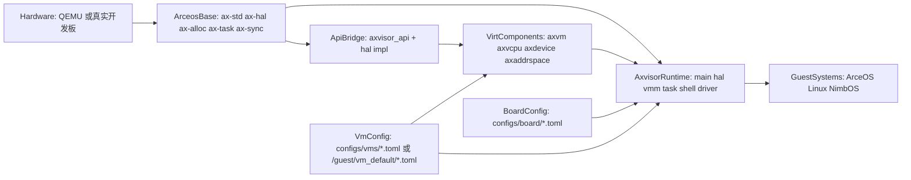
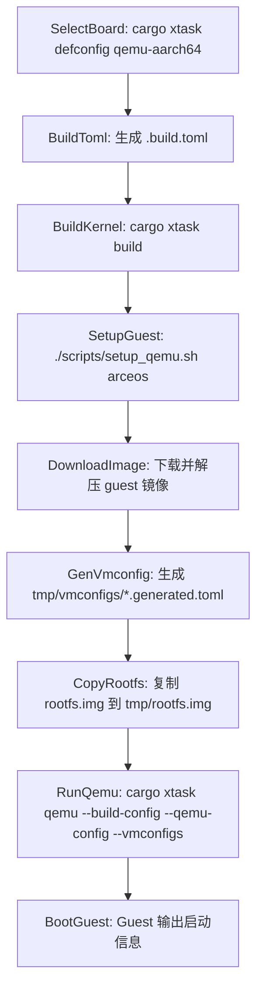
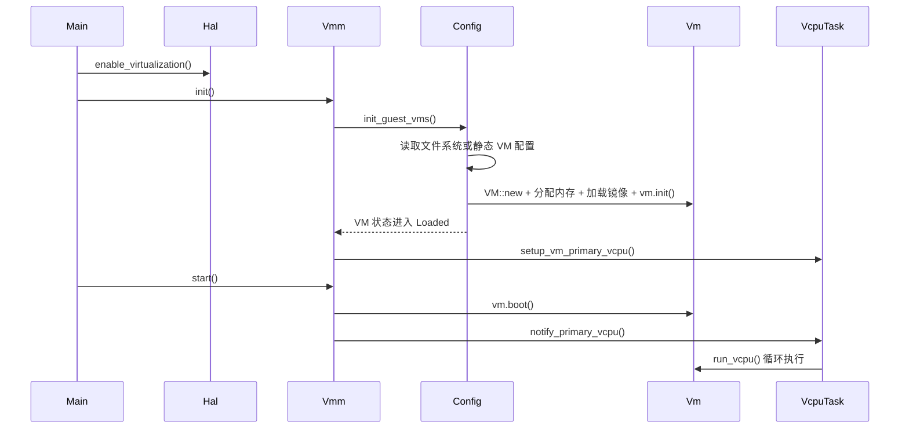
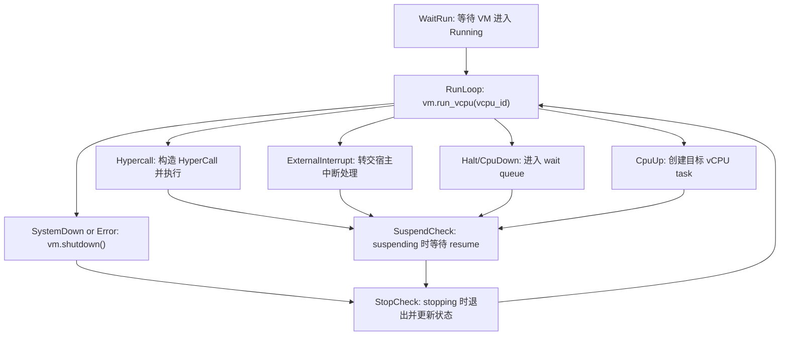
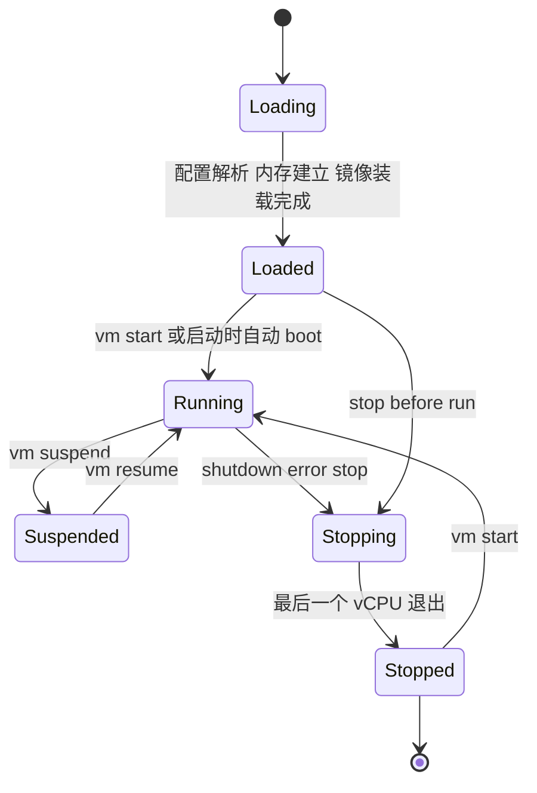

# AxVisor 内部机制

本文档面向准备修改 Hypervisor 运行时、VMM、vCPU 调度、板级配置、Guest 启动流程或 `axvisor_api` 的开发者，重点阐述 AxVisor 的组织原理与关键执行路径。

若需要先运行 QEMU 示例，请先阅读 [quick-start.md](quick-start.md) 和 [axvisor-guide.md](axvisor-guide.md)。

## 1. 系统定位与设计目标

AxVisor 是基于 ArceOS 的统一组件化 Type-I Hypervisor。它既非直接包裹 KVM 的用户态工具，也非单体式虚拟机管理程序，而是建立在 ArceOS 运行时、虚拟化组件库与分层配置系统之上的 Hypervisor 软件栈。

核心设计目标：

| 目标 | 含义 | 典型落点 |
| --- | --- | --- |
| 统一 | 尽可能用同一套代码覆盖多架构平台 | `hal/arch/*`、`configs/board/*` |
| 组件化 | 将 VM、vCPU、虚拟设备、地址空间、API 注入等能力拆成独立组件 | `components/axvm`、`axvcpu`、`axdevice`、`axaddrspace`、`axvisor_api` |
| 可配置 | 通过板级配置与 VM 配置控制构建与运行行为 | `configs/board/*.toml`、`configs/vms/*.toml`、`.build.toml` |
| 可验证 | 通过本地 xtask、`setup_qemu.sh`、QEMU workflow 和统一测试入口形成闭环 | `os/axvisor/xtask`、`.github/workflows/*.toml`、根 `cargo axvisor test qemu` |

从开发体验上看，AxVisor 与 ArceOS/StarryOS 的最大差异在于：**代码、配置和 Guest 镜像同等重要**。许多"看起来像代码 bug"的问题，根因通常是 `.build.toml`、`vm_configs`、`kernel_path` 或 `tmp/rootfs.img` 未对齐。

## 2. 架构概览

AxVisor 的运行结构可概括为"ArceOS 作为宿主运行时 + 虚拟化组件作为能力核 + AxVisor 运行时负责编排 + Guest 作为最终负载"。



此图可从两条主线理解：

- **运行主线**：`hardware -> ArceOS base -> virt components -> Axvisor runtime -> guests`
- **配置主线**：`board config + vm config -> Axvisor runtime / virt components`

AxVisor 的实际行为同时取决于 Rust 代码和运行时加载的 TOML 配置。

### 2.1 主要分层职责

| 层次 | 目录 | 职责 |
| --- | --- | --- |
| 宿主运行时层 | `ax-std`、`ax-hal`、`ax-alloc`、`ax-task` | 提供宿主机上的调度、内存、时间、控制台与硬件抽象 |
| 虚拟化能力层 | `components/axvm`、`axvcpu`、`axdevice`、`axaddrspace` | 抽象 VM、vCPU、设备模拟/直通与客户机地址空间 |
| API 注入层 | `components/axvisor_api`、`src/hal` 中的 `api_mod_impl` | 将 ArceOS 的能力注入到更底层虚拟化组件 |
| AxVisor 编排层 | `os/axvisor/src/*` | 初始化、VMM、shell、任务组织、Guest 启停 |
| 配置与镜像层 | `configs/board/*`、`configs/vms/*`、`tmp/*`、镜像仓库 | 控制“构建什么”和“启动哪个 Guest” |

### 2.2 板级与平台支持

当前仓库中的板级配置包括：

- `qemu-aarch64.toml`（AArch64，默认推荐）
- `qemu-riscv64.toml`（RISC-V 64）
- `qemu-x86_64.toml`（x86_64，当前为 stub 实现）
- `orangepi-5-plus.toml`（Orange Pi 5 Plus，RK3588）
- `phytiumpi.toml`（飞腾派，E2000）
- `roc-rk3568-pc.toml`（RK3568 PC）

此外，`configs/vms/` 中包含 40 余份 Guest VM 配置，覆盖 ArceOS、Linux、NimbOS、RT-Thread 四类 Guest，按 `{os}-{arch}-{board}-smp{N}` 命名。

本地开发推荐使用 `qemu-aarch64`：

- 当前仓库文档与 CI 主要围绕此路径组织。
- `setup_qemu.sh` 对 `arceos` 和 `linux` 两类 AArch64 Guest 支持最直接。
- WSL2 或无硬件虚拟化环境下，更适合使用纯软件仿真路径。

## 3. 核心设计机制

### 3.1 运行时主线简短，VMM 层次深入

`os/axvisor/src/main.rs` 中的 `main()` 实现非常简洁：

```rust
fn main() {
    logo::print_logo();
    info!("Starting virtualization...");
    info!("Hardware support: {:?}", axvm::has_hardware_support());
    hal::enable_virtualization();
    vmm::init();
    vmm::start();
    shell::console_init();
}
```

AxVisor 运行时主线可概括为四步：

1. 使能硬件虚拟化支持。
2. 初始化 VMM 和 Guest VM 描述。
3. 启动 VM。
4. 进入交互 shell。

真正的复杂度集中在 `hal`、`vmm` 和配置解析中。其中 `hal/arch/` 提供三套架构适配：aarch64 实现 EL2 虚拟化与 GIC 中断注入，riscv64 实现 PLIC 中断注入，x86_64 当前为 stub 占位。

### 3.2 配置驱动的 VM 实例化

`vmm::init()` 会先调用 `config::init_guest_vms()`，优先从文件系统读取 `/guest/vm_default/*.toml`，若无则回退到静态内置配置。随后对每份配置执行：

- 解析 TOML 为 `AxVMCrateConfig`
- 构造 `AxVMConfig`
- 创建 VM 实例
- 分配或映射客户机物理内存
- 配置 kernel load address
- 加载 kernel / dtb / ramdisk / disk 等镜像
- 调用 `vm.init()`
- 将 VM 状态置为 `Loaded`

Guest 的存在方式是"配置驱动的 VM 实例化过程"，而非代码中写死的默认 VM。

### 3.3 vCPU 作为 ArceOS task

AxVisor 的另一个关键设计是：每个 vCPU 最终被包装成 ArceOS task，进入独立的等待队列与运行循环。`vcpus.rs` 中的关键事实：

- 主 vCPU 在 `setup_vm_primary_vcpu()` 中首先被分配 task。
- vCPU task 初始为阻塞状态，直到 `notify_primary_vcpu()` 唤醒。
- `vcpu_run()` 中不断调用 `vm.run_vcpu()` 并处理不同的 `AxVCpuExitReason`。
- VM 停止时，最后一个退出的 vCPU 将 VM 状态推进到 `Stopped`。

AxVisor 的并发模型可理解为：

- 宿主侧由 ArceOS task 负责调度。
- 客户机侧由 VMM 抽象出的 vCPU 状态机负责执行。
- 二者通过 `vcpu_run()` 桥接循环耦合。

### 3.5 VM 间通信（IVC）

AxVisor 通过 Hypercall 机制提供 VM 间通信（Inter-VM Communication）能力。`src/vmm/ivc.rs` 维护全局 `IVC_CHANNELS` 映射表，支持发布/订阅模式的共享内存通道：

- `publish_channel()`：发布者分配共享内存通道。
- `subscribe_to_channel()`：订阅者获取通道访问权限。
- `unpublish_channel()`：清理已发布的通道。

此机制允许不同 Guest 之间通过 Hypervisor 中转的高效共享内存进行数据交换，适用于需要跨 VM 协作的场景。

### 3.4 `axvisor_api`：宿主能力注入

`axvisor_api` 的设计目标是替代大量泛型 trait 传递，将底层组件所需的宿主能力按模块分类暴露为统一 API。

它解决的核心问题：

- 底层虚拟化组件需访问宿主内存、时间、VMM 信息等能力。
- 这些组件不应直接依赖整个 ArceOS。
- 若继续依赖 trait 泛型层层传递，类型签名会越来越重，维护成本高。

`axvisor_api` 采用 `ax-crate-interface + api_mod` 设计，API 按功能域分组：

- `memory`
- `time`
- `vmm`
- `host`

AxVisor 本体在 `src/hal/mod.rs` 中通过 `#[axvisor_api::api_mod_impl(...)]` 提供这些 API 的真实实现，将 ArceOS 的分配器、时间源、CPU 信息、VM/vCPU 信息注入给底层组件。

## 4. 功能组件与模块

本节介绍 AxVisor 的运行时模块、配置与工具模块及关键配置字段的含义。

### 4.1 AxVisor 运行时模块

以下表格列出了 AxVisor 运行时的核心模块及其职责划分：

| 模块 | 目录 | 职责 |
| --- | --- | --- |
| 入口与编排 | `src/main.rs` | 按顺序触发硬件虚拟化、VMM 初始化、VM 启动与 shell |
| `hal` | `src/hal/*` | 适配 aarch64/riscv64/x86_64 架构，提供虚拟化启用、中断注入、`axvisor_api` 实现等 |
| `vmm` | `src/vmm/*` | 配置解析、VM 列表、镜像加载、vCPU 管理、虚拟 timer、hypercall、IVC 通信、FDT 处理 |
| `task` | `src/task.rs` | `VCpuTask` 结构体，将 vCPU 与宿主 task 关联，实现 `TaskExt` trait |
| `shell` | `src/shell/*` | 交互式命令行，支持文件系统操作与 VM 生命周期管理命令 |
| `driver` | `src/driver/*` | 宿主侧设备驱动（块设备 DMA、SoC 专用驱动如 RK3588 SDMMC 等） |

### 4.2 配置与工具模块

AxVisor 的构建与运行行为高度依赖配置文件和辅助工具，以下模块构成了其配置与工具链基础设施：
| --- | --- | --- |
| 板级配置 | `configs/board/*.toml` | 定义 target、features、日志级别、默认 `vm_configs` 等 |
| VM 配置 | `configs/vms/*.toml` | 定义 VM 基本信息、内核镜像、内存、设备、直通与排除项 |
| 本地构建工具 | `xtask/src/main.rs` | 提供 `defconfig`、`build`、`qemu`、`menuconfig`、`vmconfig`、`image` 等命令 |
| QEMU 快速准备脚本 | `scripts/setup_qemu.sh` | 下载镜像、生成 VM config、复制 rootfs |

### 4.3 关键配置字段

理解 AxVisor 配置体系的关键在于区分"板级配置"与"VM 配置"两个维度。板级配置控制 Hypervisor 自身的构建行为，而 VM 配置定义每个 Guest 的资源与行为参数。

板级配置（如 `qemu-aarch64.toml`）通常包含以下字段：
- `log`
- `target`
- `to_bin`
- `vm_configs`

而单个 VM 配置则通常分为三段：

| 配置段 | 说明 |
| --- | --- |
| `[base]` | VM id、name、vm_type、CPU 数和物理 CPU 绑定 |
| `[kernel]` | entry point、image location、kernel path、load address、memory regions |
| `[devices]` | passthrough devices、excluded devices、emu devices、interrupt mode |

## 5. 关键执行流程

本节描述 AxVisor 从配置加载到 Guest 启动、VMM 初始化、vCPU 运行循环以及 VM 生命周期的完整执行路径。

### 5.1 从配置到 Guest 启动的完整链路

以下流程图说明了为何仅执行 `cargo axvisor build/qemu` 通常不够：




此链路有两个常见问题点：

- `.build.toml` 仅控制"Hypervisor 如何构建"，不会自动准备 Guest 镜像。
- `qemu-aarch64.toml` 默认 `vm_configs = []`，若未额外传入生成的 VM config，`qemu` 无法确定启动哪个 Guest。

### 5.2 VMM 初始化与 VM 启动时序

以下时序图描述了 VM 从"配置文本"到"开始执行 vCPU"的关键过程：



从调试角度看，此图有助于区分：

- 问题出在“配置解析”阶段。
- 问题出在“镜像装载/内存分配”阶段。
- 问题出在“vCPU 线程已创建但未被唤醒”阶段。

### 5.3 vCPU 运行循环与 VM Exit 处理

`vcpu_run()` 是 AxVisor 动态行为最密集的入口。它会不断处理不同的 `AxVCpuExitReason`，将 Guest 的虚拟化事件分发到宿主侧对应处理逻辑。



此图可用于分析：

- Guest 为何"启动了但无响应"。
- 是否卡在 `Halt` 或 `CpuDown` 等待唤醒。
- 是否频繁陷入 `Hypercall` 或 `ExternalInterrupt` 路径。

### 5.4 VM 生命周期

AxVisor shell 与 VMM 代码均围绕 `VMStatus` 进行状态判断。VM 从创建到退出经历多个离散状态，每个状态限制了可执行的操作类型。常见状态包括 `Loading`、`Loaded`、`Running`、`Suspended`、`Stopping`、`Stopped`。



此状态图解释了 shell 命令为何限制某些状态转换：

- `Loaded` 不能直接 `resume`，只能 `start`。
- `Suspended` 不能重复 `suspend`。
- `Stopping` 期间通常需等待 vCPU 真正退出。

## 6. 开发环境与构建

本节介绍 AxVisor 的环境依赖、构建入口及推荐的本地验证路径。

### 6.1 环境配置

AxVisor 的环境要求包括：

- Linux 开发环境。
- `libssl-dev`、`gcc`、`libudev-dev`、`pkg-config` 等基础包。
- Rust 工具链。
- `cargo-binutils`。
- 构建某些 Guest 应用时需额外安装 Musl 工具链。

若仅运行 QEMU AArch64 路径，最关键的是：

- QEMU 可用。
- 能运行 `cargo axvisor image pull ...` 或 `setup_qemu.sh` 下载镜像。
- 不要假设 `defconfig/build` 会自动生成 rootfs。

### 6.2 本地 xtask 入口

与 ArceOS / StarryOS 不同，AxVisor 的 build/qemu 不走根 `tg-xtask`，而是由 `os/axvisor` 自带 xtask 提供。

两种等价入口如下：

```bash
# 根目录
cargo axvisor defconfig qemu-aarch64
cargo axvisor build

# 子目录
cd os/axvisor
cargo xtask defconfig qemu-aarch64
cargo xtask build
```

常用子命令包括：

- `defconfig` — 设置板级默认配置
- `build` — 编译项目
- `qemu` — 在 QEMU 中运行
- `uboot` — 通过 U-Boot 运行
- `menuconfig` — 交互式配置编辑器
- `vmconfig` — 生成 VM 配置 JSON Schema
- `image` — Guest 镜像管理（`ls`、`download`、`rm`、`sync`）
- `clippy` — 多目标/feature 代码检查

### 6.3 推荐启动路径

```bash
cd os/axvisor
./scripts/setup_qemu.sh arceos
cargo xtask qemu \
  --build-config configs/board/qemu-aarch64.toml \
  --qemu-config .github/workflows/qemu-aarch64.toml \
  --vmconfigs tmp/vmconfigs/arceos-aarch64-qemu-smp1.generated.toml
```

若仅执行以下命令：

则通常还缺少：

- `.build.toml` 之外的实际 VM config
- `tmp/rootfs.img`
- 已修正 `kernel_path` 的 generated vmconfig

## 7. API、配置与命令参考

本节介绍 AxVisor 的板级配置与 VM 配置体系、`axvisor_api` 的使用方式以及运行时 shell 管理命令。

### 7.1 板级配置与 VM 配置

AxVisor 的配置体系分为两层：板级配置控制 Hypervisor 本身的构建目标、feature 组合和日志级别；VM 配置则定义每个 Guest 的资源分配与运行参数。二者缺一不可。

- 构建目标 triple
- feature 组合
- 日志级别
- 是否生成 bin
- 默认 `vm_configs`

而单个 VM 配置则通常长这样：

```toml
[base]
id = 1
name = "arceos-qemu"
cpu_num = 1

[kernel]
entry_point = 0x8020_0000
image_location = "memory"
kernel_path = "path/arceos-aarch64-dyn-smp1.bin"
kernel_load_addr = 0x8020_0000
memory_regions = [
  [0x8000_0000, 0x4000_0000, 0x7, 1],
]

[devices]
passthrough_devices = [["/",]]
excluded_devices = [["/pcie@10000000"]]
interrupt_mode = "passthrough"
```

对开发者最重要的是搞清楚：

- `board` 配置控制 Hypervisor 自己。
- `vm` 配置控制 Guest。
- 两者缺一不可。

### 7.2 `axvisor_api` 使用方式

`axvisor_api` 通过 `api_mod` 暴露统一接口模块，调用方看到的是普通函数风格，而非 trait 泛型。

例如一个内存 API 模块的设计形态是：

```rust
#[api_mod]
mod memory {
    extern fn alloc_frame() -> Option<PhysAddr>;
    extern fn dealloc_frame(addr: PhysAddr);
}
```

而 AxVisor 本体在 `src/hal/mod.rs` 中提供实现，将 `ax-alloc`、`ax-hal` 等真实宿主能力接进去。

此方式的优势：

- 调用者无需将所有宿主能力写入类型参数。
- API 可按功能域组织。
- 底层组件无需直接依赖整个 ArceOS。

### 7.3 Shell 与运行时管理

AxVisor 启动完默认 Guest 后会进入交互式控制台 shell，支持命令历史（最近 100 条）与层次化命令树。

文件系统命令（需启用 `fs` feature）：

| 命令 | 说明 |
| --- | --- |
| `ls [-l] [-a]` | 列出目录内容 |
| `cat` | 显示文件内容 |
| `echo [-n] [> FILE]` | 输出文本或重定向到文件 |
| `cd` / `pwd` | 切换/显示当前目录 |
| `mkdir -p` / `rm [-d\|-r\|-f]` | 创建/删除目录或文件 |
| `cp [-r]` / `mv` | 复制/移动文件 |

VM 生命周期管理命令：

| 命令 | 说明 |
| --- | --- |
| `vm create <CONFIG>` | 从 TOML 配置创建 VM |
| `vm start [ID]` | 启动 VM（不指定 ID 则启动全部） |
| `vm stop <ID> [--force]` | 停止 VM |
| `vm suspend <ID>` / `vm resume <ID>` | 暂停/恢复 VM |
| `vm restart <ID>` | 重启 VM |
| `vm delete <ID>` | 销毁 VM |
| `vm list` | 列出所有 VM 及其状态 |
| `vm show <ID> [basic\|full\|config\|stats]` | 显示 VM 详细信息 |

其他命令：`uname [-a]`、`log [on\|off\|LEVEL]`、`exit [CODE]`、`help [COMMAND]`。

## 8. 调试与排障

本节提供 AxVisor 的排障流程、常见问题汇总、调试命令及性能优化切入点。

### 8.1 排障顺序

AxVisor 排障推荐顺序：


1. `.build.toml` 是否对应正确板级配置。
2. `vm_configs` 是否为空。
3. `kernel_path`、`bios_path`、`rootfs.img` 是否真实存在。
4. 镜像入口地址、加载地址、内存区域是否匹配。
5. 最后才回到 `vmm`、`hal` 或 `vcpus` 代码本身。

### 8.2 常见问题

以下表格汇总了 AxVisor 开发中最常遇到的问题及其排查方向：
| --- | --- | --- |
| `cargo axvisor qemu` 直接失败 | 没有准备 generated vmconfig 与 `tmp/rootfs.img` | 优先使用 `setup_qemu.sh` |
| QEMU 启动了但没有 Guest 输出 | `vm_configs` 为空或 `kernel_path` 错误 | 看 `configs/board/*` 与 `tmp/vmconfigs/*` |
| VM 创建失败 | TOML 不合法、内存区域不合理、镜像缺失 | 看 `vmm/config.rs` 中的 `init_guest_vm()` |
| vCPU 任务没有运行 | 只创建了 task 但未唤醒，或 VM 状态没进入 Running | 看 `notify_primary_vcpu()` 与 `vm.boot()` |
| WSL2 / 无硬件虚拟化环境下 x86 路径异常 | KVM/VT-x 不可用 | 优先走 AArch64 QEMU 纯软件路径 |

### 8.3 调试命令

```bash
# 重新生成板级配置
cargo axvisor defconfig qemu-aarch64

# 交互式修改配置
cargo axvisor menuconfig

# 只做构建，先排除编译问题
cargo axvisor build

# 下载/准备镜像与 rootfs
cd os/axvisor
./scripts/setup_qemu.sh arceos

# 统一测试入口
cargo axvisor test qemu --target aarch64
```

### 8.4 性能优化切入点

优化 AxVisor 的常见方向：

- vCPU exit 热路径：分析 `vcpu_run()` 中的高频 exit reason。
- 配置与镜像加载：减少重复解析和不必要的 I/O。
- 中断与 timer：分析 `ExternalInterrupt` 和 timer 回调对延迟的影响。
- API 注入层：评估 `axvisor_api` 的可维护性与可扩展性。

## 9. 深入阅读

建议按下面顺序继续深入：

1. 从 `src/main.rs`、`src/hal/mod.rs`、`src/vmm/mod.rs` 看主运行链。
2. 再看 `src/vmm/config.rs` 和 `src/vmm/vcpus.rs`，理解配置如何变成 VM 与 vCPU。
3. 如果你要扩展底层组件，继续看 `components/axvm`、`axvcpu`、`axdevice`、`axaddrspace`。
4. 如果你要改 API 注入方式，继续看 `components/axvisor_api/README.zh-cn.md` 与 `src/hal/mod.rs` 中的 `api_mod_impl`。

关联阅读建议：

- [axvisor-guide.md](axvisor-guide.md)：更偏“上手命令、配置路径和 Guest 准备”。
- [build-system.md](build-system.md)：更偏“根工作区入口与 AxVisor 本地 xtask 的边界”。
- [arceos-internals.md](arceos-internals.md)：更偏“AxVisor 复用的宿主运行时和底层模块能力”。
