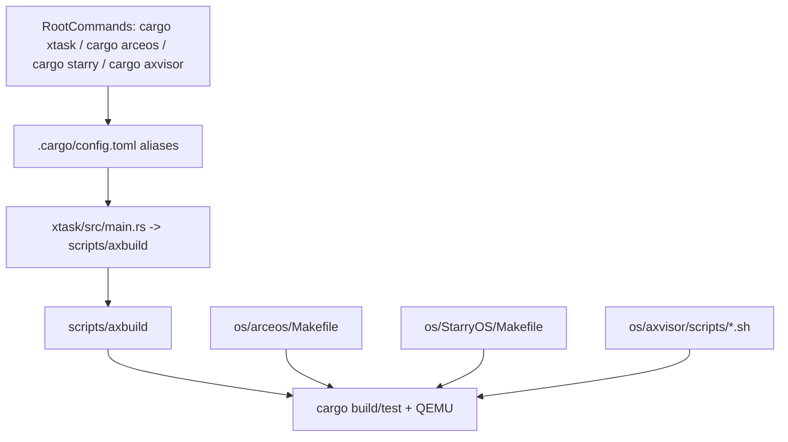

# 构建系统说明

本文档说明 TGOSKits 工作区当前的构建系统架构，重点回答三个问题：根目录 `cargo xtask` 到底负责什么、为什么 `os/arceos`、`os/StarryOS` 和 `os/axvisor` 还有各自的本地入口、以及修改一个组件后应该从哪个命令开始验证。

## 1. 入口关系概览



仓库里实际上有两套常用入口：

- 根目录集成入口：`cargo xtask`、`cargo arceos`、`cargo starry`、`cargo axvisor`
- 子项目本地入口：`os/arceos/Makefile`、`os/StarryOS/Makefile`、Axvisor 辅助脚本

`os/axvisor/xtask` 在这个 workspace 里当前只是占位实现，不应继续视为常规入口。

## 2. 根目录命令落点

根 `.cargo/config.toml` 定义的关键别名如下：

| 命令 | 实际落点 | 说明 |
| --- | --- | --- |
| `cargo xtask ...` | `run -p tg-xtask -- ...` | 根目录统一入口 |
| `cargo arceos ...` | `run -p tg-xtask -- arceos ...` | ArceOS 别名 |
| `cargo starry ...` | `run -p tg-xtask -- starry ...` | StarryOS 别名 |
| `cargo axvisor ...` | `run -p tg-xtask -- axvisor ...` | Axvisor 别名 |

根 `xtask` 当前实际转到 `scripts/axbuild`，暴露了四类子命令：

- `test`
- `arceos`
- `starry`
- `axvisor`

所以 `cargo xtask axvisor ...` 和 `cargo axvisor ...` 都是有效的。

## 3. Workspace 结构设计

根 `Cargo.toml` 同时做了三件事：

1. 把常用 crate 放进统一 workspace
2. 排除嵌套 workspace 目录
3. 用 `[patch.crates-io]` 把依赖重定向到仓库本地路径

这让仓库既能跨组件联调，又不破坏 ArceOS、StarryOS 及若干组件仓库原有的工作区结构。

## 4. 命令入口选择指南

| 你的目标 | 推荐入口 | 原因 |
| --- | --- | --- |
| 跑 ArceOS 示例或改 ArceOS 模块 | 根目录 `cargo arceos ...` | 最适合集成开发 |
| 只调 ArceOS Makefile 变量或兼容旧工作流 | `cd os/arceos && make ...` | 最贴近 ArceOS 原生入口 |
| 跑 StarryOS 或准备 rootfs | 根目录 `cargo starry ...` / `cargo xtask starry ...` | 统一管理 rootfs、构建和运行 |
| 调 StarryOS 自己的 Makefile 细节 | `cd os/StarryOS && make ...` | 最贴近 StarryOS 原生入口 |
| 配置、构建、启动 Axvisor | 根目录 `cargo axvisor ...` 或 `cargo xtask axvisor ...` | Axvisor 命令当前由根目录 `tg-xtask` 提供 |
| 准备 Axvisor Guest 镜像与 VM 配置 | `cd os/axvisor && ./scripts/*.sh` | 脚本负责镜像/rootfs/vmconfig 预处理 |
| 跑统一测试入口 | `cargo xtask test` 或 `cargo {os} test qemu ...` | std 测试走根入口，OS 测试走各自子命令，CI 与本地入口一致 |

### 4.1 常用命令示例

```bash
# ArceOS
cargo arceos build --package ax-helloworld --target riscv64gc-unknown-none-elf
cargo arceos qemu --package ax-helloworld --target riscv64gc-unknown-none-elf

# StarryOS
cargo starry build --arch riscv64
cargo starry qemu --arch riscv64
cargo xtask starry rootfs --arch riscv64

# Axvisor
cargo axvisor defconfig qemu-aarch64
(cd os/axvisor && ./scripts/setup_qemu.sh arceos)
cargo axvisor qemu \
  --config os/axvisor/.build.toml \
  --qemu-config .github/workflows/qemu-aarch64.toml \
  --vmconfigs os/axvisor/tmp/vmconfigs/arceos-aarch64-qemu-smp1.generated.toml

# 测试
cargo xtask test
cargo arceos test qemu --target riscv64gc-unknown-none-elf
cargo starry test qemu --target riscv64
cargo axvisor test qemu --target aarch64
```

## 5. 各系统的配置与构建

### 5.1 ArceOS

ArceOS 的根入口当前只直接暴露：

- `build`
- `qemu`
- `uboot`
- `--package`
- `--target`
- `--config`
- `--plat_dyn`

像 `NET`、`BLK`、平台、feature、SMP 这类高级配置，更适合走 `os/arceos/Makefile` 或应用目录下的 build info 文件。

### 5.2 StarryOS

根目录 `cargo xtask starry ...` 走的是 `scripts/axbuild/src/starry/*`。它和本地 `os/StarryOS/Makefile` 不是完全同一套路径。

根目录入口的特点：

- 子命令是 `build`、`qemu`、`rootfs`、`uboot`
- 默认包固定为 `starryos`
- `test` 使用 `starryos-test`
- `rootfs` 和 `qemu` 围绕 target 目录里的 `rootfs-<arch>.img` 工作

本地 Makefile 入口的特点：

- `make rootfs` 会把镜像复制到 `os/StarryOS/make/disk.img`
- `make ARCH=riscv64 run` 会走 StarryOS 自己的 `make/` 目录逻辑

### 5.3 Axvisor

Axvisor 的构建与运行当前由根目录 `tg-xtask` 统一管理。

当前最需要知道的文件是：

- `scripts/axbuild/src/axvisor/*.rs`: `defconfig` / `build` / `qemu` / `uboot` / `config` / `image` 等命令实现
- `os/axvisor/configs/board/*.toml`: 板级配置
- `os/axvisor/configs/vms/*.toml`: Guest VM 配置
- `os/axvisor/.build.toml`: `defconfig` 默认生成的 build info 文件
- `os/axvisor/scripts/*.sh`: Guest 镜像、rootfs 和 VM 配置准备脚本

`defconfig <board>` 的行为是：

1. 校验 `configs/board/<board>.toml` 是否存在
2. 备份已有 `.build.toml`
3. 把板级配置复制成新的 `.build.toml`

## 6. 测试入口和实际测试对象

### 6.1 标准库测试

`cargo xtask test` 会读取 `scripts/test/std_crates.csv`，逐个对列表里的 workspace package 执行 `cargo test -p <package>`。

### 6.2 ArceOS 测试

`cargo arceos test qemu` 会自动发现 `test-suit/arceos/` 下的测试包，并逐个在 QEMU 中运行。

常用命令：

```bash
cargo arceos test qemu --target riscv64gc-unknown-none-elf
```

### 6.3 StarryOS 测试

`cargo starry test qemu` 会构建并运行 `test-suit/starryos` 下的 `starryos-test` 包。

常用命令：

```bash
cargo starry test qemu --target riscv64
```

### 6.4 Axvisor 测试

```bash
cargo axvisor test qemu --target aarch64
```

这条命令是根工作区对 Axvisor 的统一测试入口。

## 7. CI 与本地如何对齐

当前最稳妥的本地验证方式就是复用这些命令：

- `cargo xtask test`
- `cargo arceos test qemu --target ...`
- `cargo starry test qemu --target ...`
- `cargo axvisor test qemu --target aarch64`

## 8. 最容易踩的坑

### 以为 `cargo xtask` 不能直接构建 Axvisor

其实可以。根 `cargo xtask` 现在已经有 `axvisor` 子命令。

### 以为 StarryOS 的 rootfs 永远在 `os/StarryOS/make/disk.img`

只有本地 Makefile 路径是这样。根目录 `cargo xtask starry rootfs` 和 `cargo starry qemu` 默认围绕 target 目录工作。

### 以为被 `exclude` 的目录就不会参与构建

不对。很多被 `exclude` 的目录仍会通过 `[patch.crates-io]` 被其他包引用到本地源码。

### 进入 `os/axvisor/` 后忘了本地 `cargo xtask` 还是占位实现

在仓库根目录，`cargo xtask` 是 `tg-xtask`。  
进入 `os/axvisor/` 后，当前更常用的是 `./scripts/setup_qemu.sh` 之类的辅助脚本，而不是本地 `cargo xtask`。

## 相关文档

- [quick-start.md](quick-start.md): 先把仓库跑起来
- [components.md](components.md): 从组件视角看三个系统的接线关系
- [arceos-guide.md](arceos-guide.md): ArceOS 模块、API 和示例
- [starryos-guide.md](starryos-guide.md): StarryOS 内核、rootfs 和 syscall 路径
- [axvisor-guide.md](axvisor-guide.md): Axvisor 板级配置、VM 配置和虚拟化组件
- [repo.md](repo.md): Subtree 管理与同步策略
