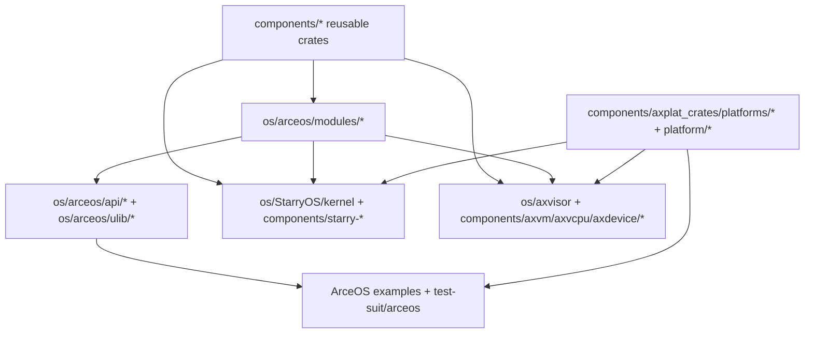

# 组件开发指南

TGOSKits 的核心价值不仅在于将各仓库整合到同一工作区，更在于使开发者能够从组件出发，追踪其在 ArceOS、StarryOS 和 Axvisor 中的实际使用方式。本文档介绍 TGOSKits 的多层组件架构、改动影响评估、验证路径选择，以及将新组件接入三套系统的标准流程。

若已知目标 crate 的名称，建议配合 [`docs/crates/README.md`](crates/README.md) 阅读本文档：本文档侧重说明"组件处于哪一层、通常影响哪些系统"，而 crate 索引负责回答"它依赖哪些包、文档入口在哪里"。

## 1. 组件层次结构

新开发者常见的误解是：只有 `components/` 下的目录才算组件。实际上，TGOSKits 包含六类组件化层次，每一层均有其职责定位和消费者群体。理解这些层次的划分，对于评估改动影响范围和选择验证路径至关重要。

下表总结了六类组件层次的路径、职责、典型内容与主要消费者：

| 路径 | 角色 | 典型内容 | 主要消费者 |
| --- | --- | --- | --- |
| `components/` | subtree 管理的独立可复用 crate | `ax-errno`、`ax-kspin`、`axvm`、`starry-process` | 三套系统都可能直接或间接使用 |
| `os/arceos/modules/` | ArceOS 内核模块 | `ax-hal`、`ax-task`、`ax-net`、`ax-fs` | ArceOS，且经常被 StarryOS 和 Axvisor 复用 |
| `os/arceos/api/` | feature 与对外 API 聚合 | `ax-feat`、`ax-api` | ArceOS 应用、StarryOS、Axvisor |
| `os/arceos/ulib/` | 用户侧库 | `ax-std`、`ax-libc` | ArceOS 示例与用户应用 |
| `os/StarryOS/kernel/` | StarryOS 内核逻辑 | syscall、进程、内存、文件系统 | `starryos` 包 |
| `os/axvisor/` | Hypervisor 运行时与配置 | `src/`、`configs/board/`、`configs/vms/` | Axvisor |

除上述六类核心组件层次外，以下两个目录在验证组件功能和系统集成时也需关注：

- `components/axplat_crates/platforms/*` 与 `platform/*`：平台实现
- `test-suit/*`：系统级测试入口

## 2. 组件依赖关系

理解组件的依赖流向对于评估改动影响范围至关重要。以下流程图展示了从可复用 crate 到最终系统的典型路径：



上述流程图表示常见的三种组件依赖路径：

1. 纯复用 crate 直接被系统包依赖  
   例如 `components/starry-process`、`components/axvm`

2. 先经过 ArceOS 模块层，再被上层系统消费  
   例如 `ax-hal`、`ax-task`、`ax-driver`、`ax-net`

3. 通过平台和配置接到最终系统  
   例如 `axplat-*`、`platform/x86-qemu-q35`、Axvisor 的 `configs/board/*.toml`

## 3. 改动定位

在开始修改前，需首先明确改动所属的层次及其影响的系统范围，以便选择合适的开发位置和验证策略。下表根据功能类型推荐了优先查看的位置和常见影响面：

| 你要改什么 | 优先看哪里 | 常见影响面 |
| --- | --- | --- |
| 通用基础能力：错误、锁、页表、Per-CPU、容器 | `components/axerrno`、`components/kspin`、`components/page_table_multiarch`、`components/percpu` | 三套系统都可能受影响 |
| ArceOS 内核服务：调度、HAL、驱动、网络、文件系统 | `os/arceos/modules/*`，以及相关 `axdriver_crates` / `axmm_crates` / `axplat_crates` | ArceOS，且可能波及 StarryOS / Axvisor |
| ArceOS 的 feature 或应用接口 | `os/arceos/api/axfeat`、`os/arceos/ulib/axstd`、`os/arceos/ulib/axlibc` | ArceOS 应用与上层系统 |
| StarryOS 的 Linux 兼容行为 | `components/starry-*`、`os/StarryOS/kernel/*` | StarryOS |
| Hypervisor、vCPU、虚拟设备、VM 管理 | `components/axvm`、`components/axvcpu`、`components/axdevice`、`components/axvisor_api`、`os/axvisor/src/*` | Axvisor |
| 平台、板级适配或 VM 启动配置 | `components/axplat_crates/platforms/*`、`platform/*`、`os/axvisor/configs/*` | 一到多个系统 |

若不确定某个 crate 的维护者或来源仓库，可查看 `scripts/repo/repos.csv`，该文件记录了所有 subtree 组件的来源信息。

## 4. 组件修改与验证

修改已有组件时，推荐采用渐进式验证策略：从最小的消费者开始，逐步扩大验证范围，最后补充统一测试。该方法既能快速发现问题，又能避免在无关测试上浪费时间。

### 4.1 定位最近的消费者

建议先明确以下信息：

- 该 crate 被哪些包直接依赖
- 影响范围是单个系统还是多个系统
- 是否存在比"启动整套系统"更轻量的验证入口

通常可先查看相关 `Cargo.toml`，再选择最小运行路径。

### 4.2 最小验证路径

根据改动位置的不同，推荐的验证路径也有所差异：

| 改动位置 | 第一步验证 | 第二步验证 |
| --- | --- | --- |
| `components/axerrno`、`components/kspin`、`components/ax-lazyinit` 这类基础 crate | `cargo test -p <crate>` | `cargo xtask arceos run --package ax-helloworld --arch riscv64` |
| `os/arceos/modules/*` | `cargo xtask arceos run --package ax-helloworld --arch riscv64` | 需要功能时换成 `ax-httpserver --net` 或 `ax-shell --blk` |
| `components/starry-*`、`os/StarryOS/kernel/*` | `cargo xtask starry run --arch riscv64 --package starryos` | `cargo starry test qemu --target riscv64` |
| `components/axvm`、`components/axvcpu`、`components/axdevice`、`os/axvisor/src/*` | `cd os/axvisor && cargo xtask build` | 准备好 Guest 后运行 `./scripts/setup_qemu.sh arceos`，再执行 `cargo xtask qemu --build-config ... --qemu-config ... --vmconfigs ...` |

### 4.3 补充统一测试

完成最小路径验证后，若改动涉及跨系统基础组件，还需运行统一测试以确保不会破坏其他系统：

```bash
cargo xtask test
cargo arceos test qemu --target riscv64gc-unknown-none-elf
cargo starry test qemu --target riscv64
cargo axvisor test qemu --target aarch64
```

若修改的是跨系统基础组件，至少应执行以下测试：

- 一条宿主机/`std` 路径
- 一条 ArceOS 路径
- 一条该组件实际影响到的系统路径

## 5. 新增组件

新增组件时，首先应确定其所属层次，然后按照标准模板创建目录和配置文件。正确的初始结构设计能够显著降低后续维护和集成的成本。

### 5.1 确定所属层次

首先需明确新 crate 应属于哪一层：

- 真正可复用的独立 crate：放 `components/`
- 仅属于 ArceOS 的 OS 模块：放 `os/arceos/modules/`
- 仅属于 ArceOS 的 API 或用户库：放 `os/arceos/api/` 或 `os/arceos/ulib/`
- 仅属于 StarryOS / Axvisor 的系统内部逻辑：优先放对应系统目录

### 5.2 标准目录结构

确定层次后，按以下标准结构创建组件目录。以下为 `components/` 下独立 subtree crate 的推荐模板：

```
my_component/
├── Cargo.toml                  # Crate 元数据和依赖配置
├── rust-toolchain.toml         # Rust 工具链配置
├── LICENSE                     # 许可证文件
├── CHANGELOG.md                # 版本变更日志（可选）
├── README.md                   # 项目简介（英文）
├── README_CN.md                # README 中文版（可选）
├── .cargo/
│   └── config.toml             # Cargo 配置（默认 target、编译选项等）
├── .github/
│   ├── workflows/
│   │  ├── check.yml            # 代码检查工作流
│   │  ├── test.yml             # 测试工作流
│   │  ├── deploy.yml           # 文档部署工作流
│   │  ├── push.yml             # 同步到父仓库
│   │  └── release.yml          # 发布工作流
│   └── config.json             # 项目配置文件
├── scripts/                    # 实用脚本
│   ├── check.sh                # 代码检查（调用 axci/check.sh）
│   └── test.sh                 # 测试（调用 axci/tests.sh）
├── tests/                      # 集成测试文件
└── src/                        # 组件源码目录
    └── lib.rs                  # 库入口，导出公共 API
```

> **注意**：如果组件仅作为 TGOSKits 内部原型，不需要立即添加 `.github/`、`scripts/`、`tests/` 等 subtree CI 相关文件。只有在组件准备作为独立 subtree 仓库长期维护时才需要补齐。

### 5.3 配置文件模板

#### Cargo.toml

```toml
[package]
name = "my_component"
version = "0.1.0"
edition = "2024"
authors = ["作者"]
description = "组件描述"
license = "Apache-2.0"
repository = "https://github.com/org/repo"
keywords = ["os", "component"]
categories = ["embedded", "no-std"]

[dependencies]
```

在 TGOSKits 工作区内，更推荐直接复用根工作区的配置：

```toml
[package]
name = "my_component"
version = "0.1.0"
edition.workspace = true

[dependencies]
```

#### .github/config.json

CI/CD 流程读取的组件配置文件：

```json
{
  "targets": [
    "aarch64-unknown-none-softfloat"
  ],
  "rust_components": [
    "rust-src",
    "clippy",
    "rustfmt"
  ]
}
```

| 字段 | 说明 |
|------|------|
| `targets` | 编译目标平台列表 |
| `rust_components` | 需要安装的 Rust 组件 |

#### .cargo/config.toml

```toml
[target.aarch64-unknown-linux-gnu]
linker = "aarch64-linux-gnu-gcc"
runner = ["qemu-aarch64", "-L", "/usr/aarch64-linux-gnu"]
```

#### rust-toolchain.toml

```toml
[toolchain]
profile = "minimal"
channel = "nightly-2025-05-20"
components = ["rust-src", "llvm-tools", "rustfmt", "clippy"]
targets = ["aarch64-unknown-none-softfloat"]
```

### 5.4 把组件接到根 workspace

普通 leaf crate 常见需要两步：在根 `Cargo.toml` 的 `[workspace.members]` 里加入路径，以及在 `[patch.crates-io]` 里加入同名 patch，让其他包解析到本地源码：

```toml
[workspace]
members = [
    "components/my_component",
]

[patch.crates-io]
my_component = { path = "components/my_component" }
```

### 5.5 遇到嵌套 workspace 时不要照抄

`components/axplat_crates`、`components/axdriver_crates`、`components/axmm_crates` 这类目录本身是独立 workspace。给这类目录加新 crate 时，需要特别注意处理方式：

- 先在它自己的 workspace 里接好
- 再在根 `Cargo.toml` 里为具体 leaf crate 增加 patch 或 member
- 不要把整个父目录直接重新塞回根 workspace

### 5.6 什么时候需要改 `repos.csv`

只有当这个新组件本身要作为独立 subtree 仓库管理时，才需要把它加入 `scripts/repo/repos.csv`。如果你只是先在 TGOSKits 内部做原型，不一定要立刻动 subtree 配置。Subtree 的详细操作请参阅 [repo.md](repo.md)。

## 6. ArceOS 集成

在 ArceOS 中集成组件的典型链路为：在 `components/` 或 `os/arceos/modules/` 实现复用逻辑，若需作为可选能力暴露则接入 `os/arceos/api/axfeat`，若需直接供应用使用则接入 `os/arceos/ulib/axstd` 或 `ax-libc`，最后通过 `os/arceos/examples/*` 或 `test-suit/arceos/*` 进行验证。

最常用的三个验证入口：

```bash
cargo xtask arceos run --package ax-helloworld --arch riscv64
cargo xtask arceos run --package ax-httpserver --arch riscv64 --net
cargo xtask arceos run --package ax-shell --arch riscv64 --blk
```

各层适用场景：

- 仅修改内部实现：通常只需修改 `components/` 或 `modules/`
- 新增 feature 开关：修改 `os/arceos/api/axfeat`
- 新增应用侧 API：修改 `os/arceos/ulib/axstd` 或 `ax-libc`
- 新增示例：添加至 `os/arceos/examples/`

## 7. StarryOS 集成

StarryOS 既复用了大量 ArceOS 模块，也维护了自身的 `starry-*` 组件和 `os/StarryOS/kernel/` 内核逻辑。因此，在 StarryOS 中集成组件时，需明确改动属于通用基础能力、Linux 兼容行为还是启动包和平台入口。

常见路径如下：

- 通用基础能力：先改 `components/*` 或 `os/arceos/modules/*`
- Linux 兼容行为：改 `components/starry-*` 或 `os/StarryOS/kernel/*`
- 启动包、特性组合、平台入口：改 `os/StarryOS/starryos`

验证时建议优先使用根目录集成入口：

```bash
cargo xtask starry rootfs --arch riscv64
cargo xtask starry run --arch riscv64 --package starryos
```

若改动会影响用户态行为（如 syscall、文件系统或 rootfs 内程序），通常还需进行以下额外验证：

- 将测试程序放入 rootfs
- 或扩展 `test-suit/starryos`

## 8. Axvisor 集成

Axvisor 的组件化架构通常分为三层：复用 crate（如 `axvm`、`axvcpu`、`axdevice`、`axvisor_api`）、Hypervisor 运行时（`os/axvisor/src/*`）以及板级与 VM 配置（`os/axvisor/configs/board/*` 与 `os/axvisor/configs/vms/*`）。因此，进行 Axvisor 相关改动时需区分"代码"改动与"配置"改动，以及改动影响的是 Hypervisor 本身还是 Guest 启动参数。

最小验证路径通常为：

```bash
cd os/axvisor
cargo xtask build
```

仅在 Guest 镜像、`tmp/rootfs.img` 和 `vmconfigs` 均已就绪后，再继续执行：

```bash
cd os/axvisor
./scripts/setup_qemu.sh arceos
cargo xtask qemu \
  --build-config configs/board/qemu-aarch64.toml \
  --qemu-config .github/workflows/qemu-aarch64.toml \
  --vmconfigs tmp/vmconfigs/arceos-aarch64-qemu-smp1.generated.toml
```

若修改涉及板级能力，还需同时关注：

- `components/axplat_crates/platforms/*`
- `platform/x86-qemu-q35`
- `os/axvisor/configs/board/*.toml`

## 9. 测试与质量检查

组件通过 `scripts/` 下的脚本调用 [axci](https://github.com/arceos-hypervisor/axci) 统一测试框架。首次运行时自动下载 axci 到 `scripts/.axci/` 目录。

### 9.1 test.sh — 测试

```bash
# 运行全部测试（单元测试 + 集成测试）
./scripts/test.sh

# 仅运行单元测试
./scripts/test.sh unit

# 仅运行集成测试
./scripts/test.sh integration

# 列出所有可用的测试套件
./scripts/test.sh list

# 指定编译目标
./scripts/test.sh --targets aarch64-unknown-none-softfloat

# 指定测试套件（支持前缀匹配）
./scripts/test.sh integration --suite axvisor-qemu

# 仅显示将要执行的命令
./scripts/test.sh --dry-run -v

# 使用文件系统模式，不修改配置文件
./scripts/test.sh integration --suite axvisor-qemu-aarch64-arceos --fs

# 打印 U-Boot 和串口输出到终端
./scripts/test.sh integration --suite axvisor-qemu-aarch64-arceos --fs --print
```

**支持的测试类型**：

| 类型 | 说明 | 示例 |
|------|------|------|
| 单元测试 | `cargo test` 在宿主机运行 | `./scripts/test.sh unit` |
| QEMU 集成测试 | 在 QEMU 中启动 axvisor 运行客户机镜像 | `--suite axvisor-qemu-aarch64-arceos` |
| 开发板集成测试 | 通过 U-Boot 在物理开发板上运行 | `--suite axvisor-board-phytiumpi-arceos` |
| Starry 测试 | 构建并运行 StarryOS | `--suite starry-aarch64` |

### 9.2 check.sh — 代码检查

```bash
# 运行全部检查（格式 + clippy + 构建 + 文档）
./scripts/check.sh

# 仅运行指定阶段
./scripts/check.sh --only fmt
./scripts/check.sh --only clippy
./scripts/check.sh --only build

# 指定编译目标
./scripts/check.sh --targets aarch64-unknown-none-softfloat
```

## 10. 持续集成与部署

所有 CI 工作流通过调用 axci 的共享工作流实现（push.yml 除外）。

### check.yml — 代码检查

触发条件：推送到任意分支（tag 除外）、PR、手动触发

功能：格式检查 (rustfmt)、静态分析 (clippy)、编译检查、文档生成检查

```yaml
jobs:
  check:
    uses: arceos-hypervisor/axci/.github/workflows/check.yml@main
```

### test.yml — 集成测试

触发条件：push 到任意分支（tag 除外）、PR、手动触发

功能：运行单元测试、QEMU / 开发板集成测试

### release.yml — 发布

触发条件：push 版本 tag（`v*.*.*` 或 `v*.*.*-preview.*`）

流程：check + test 通过后执行 verify-tag → GitHub Release → crates.io publish

### deploy.yml — 文档部署

触发条件：push 稳定版 tag（`v*.*.*`，不含 `-preview.*`）

功能：生成 API 文档 (rustdoc) 并部署到 GitHub Pages

### push.yml — 同步到父仓库

触发条件：push 到 main 分支（此工作流为独立实现，直接复制自 axci，不使用 `uses:`）

功能：从父仓库 `scripts/repo/repos.csv` 定位组件 subtree 路径，执行 `git subtree pull`，创建或更新 PR

## 11. 什么时候需要看 `repo.md`

并不是所有的组件开发工作都需要深入了解 subtree 的细节。下面这些场景暂时不需要进入 subtree 细节：

- 修改已有组件源码
- 在 TGOSKits 里先做联调验证
- 只做根 workspace 内的依赖接线

但是，下面这些场景就应该去看 [repo.md](repo.md)：

- 新增一个要长期独立维护的 subtree 组件
- 需要同步组件仓库和主仓库
- 需要改 `scripts/repo/repos.csv`

## 12. 推荐阅读顺序

为了帮助开发者系统地掌握 TGOSKits 的组件开发和集成，建议按照以下顺序阅读相关文档：

- [quick-start.md](quick-start.md): 先把三套系统入口跑通
- [build-system.md](build-system.md): 再理解 workspace、xtask 和测试矩阵
- [arceos-guide.md](arceos-guide.md): 继续看 ArceOS 的模块与 API 关系
- [starryos-guide.md](starryos-guide.md): 继续看 StarryOS 的 rootfs、syscall 和内核入口
- [axvisor-guide.md](axvisor-guide.md): 继续看 Axvisor 的板级配置、VM 配置和 Guest 启动
