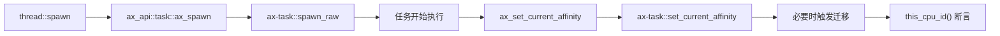
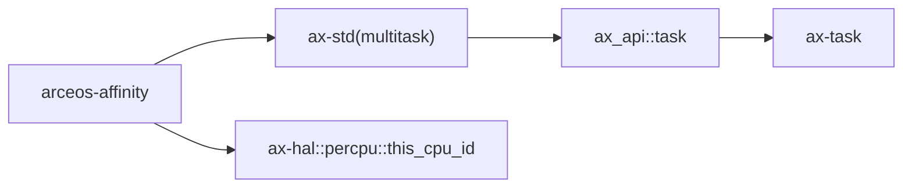

# `arceos-affinity` 技术文档

> 路径：`test-suit/arceos/task/affinity`
> 类型：测试入口 crate
> 分层：测试层 / ArceOS 任务调度回归
> 版本：`0.1.0`
> 文档依据：`Cargo.toml`、`src/main.rs`、`qemu-riscv64.toml`、`docs/arceos-guide.md`

`arceos-affinity` 是一个专门验证“当前任务 CPU 亲和性设置与迁移是否正确”的系统级回归入口。它通过批量创建任务、设置单核亲和掩码、循环 `yield_now()` 并检查当前 CPU ID，来确认 `ax-task` 的亲和性语义没有回退。

它的核心边界非常明确：**这不是 CPU 亲和性管理库，也不是通用并发框架；它只是拿 `ax_set_current_affinity()` 这条真实调用链做回归验证。**

## 1. 架构设计分析
### 1.1 测试场景结构
源码只有一个 `main()`，但内部场景分成两段：

1. 为每个任务设置“只允许运行在某一个 CPU 上”的单点亲和性。
2. 如果系统可见 CPU 数大于 1，再把该 CPU 从可运行集合中移除，验证任务能迁移到别的 CPU。

其中三个关键常量是：

- `NUM_TASKS = 10`
- `NUM_TIMES = 100`
- `FINISHED_TASKS`：主线程等待所有任务结束的原子计数器

### 1.2 真实调用关系
这条链路不是伪造的测试桩，而是直接打到 ArceOS 真实任务栈：



关键点在于 `ax-task::set_current_affinity()` 并不只是记录一个掩码；在开启 SMP 时，如果当前 CPU 不再满足亲和性，它会立刻走迁移路径。

### 1.3 feature 与调度器关系
`Cargo.toml` 中的：

- `sched-rr`
- `sched-cfs`

会透传到 `ax-std` 对应的调度器 feature。这个 crate 本身并不强依赖某一种调度算法，但它确实依赖：

- `multitask`
- 可见 CPU 数
- 任务迁移语义

因此它验证的是“亲和性约束是否成立”，而不是“某个调度器策略是否更优”。

## 2. 核心功能说明
### 2.1 测试内容
每个任务执行的核心逻辑如下：

1. 根据任务编号选择一个目标 CPU。
2. 调用 `ax_set_current_affinity(AxCpuMask::one_shot(cpu_id))`。
3. 在 100 次循环中反复检查 `this_cpu_id() == cpu_id`，中间穿插 `thread::yield_now()`。
4. 若系统是多核，再构造“除原 CPU 外都可运行”的掩码，重新设置亲和性。
5. 再次循环验证“当前 CPU 不应再等于原 cpu_id”。

### 2.2 为什么使用 `yield_now()`
如果任务设置完亲和性后一直独占执行，无法充分暴露调度和迁移中的错误。加入 `yield_now()` 后：

- 当前任务会主动让出 CPU
- 调度器会重新选择可运行任务
- 更容易暴露“亲和性未生效”“迁移后仍落回原 CPU”等问题

### 2.3 边界澄清
这个 crate 不负责：

- 管理其他任务的亲和性
- 提供面向应用的高级负载均衡策略
- 评估跨核性能收益

它只验证“当前任务设置亲和性后，运行位置是否真的受约束”。

## 3. 依赖关系图谱


### 3.1 直接依赖
- `ax-std(multitask)`：提供线程创建、`yield_now()` 和 ArceOS 扩展任务 API 入口。

### 3.2 关键间接依赖
- `ax_api::task::ax_set_current_affinity`：对上层暴露亲和性设置接口。
- `ax-task::set_current_affinity`：实际执行亲和性更新与迁移。
- `ax-hal::percpu::this_cpu_id`：用来观察当前任务实际落在哪个 CPU 上。

### 3.3 主要消费者
- `cargo arceos test qemu` 自动发现的任务回归集合。
- 调整 `ax-task`、`ax-cpumask`、SMP 调度逻辑后的定向回归。

## 4. 开发指南
### 4.1 推荐运行方式
单独调试时可直接运行：

```bash
cargo xtask arceos run --package arceos-affinity --arch riscv64
```

做完整回归时则更推荐：

```bash
cargo arceos test qemu --target riscv64gc-unknown-none-elf
```

### 4.2 修改时的注意点
1. 任何新场景都应保持“失败时能明确 panic，成功时有稳定结束语”。
2. 若新增断言依赖多核，记得同步检查 QEMU 配置是否仍使用 `-smp 4`。
3. 不要把这个 crate 发展成调度器测试大杂烩；它应始终聚焦 affinity。

### 4.3 适合补充的方向
- 非法空掩码的失败路径
- 更复杂的 CPU 掩码组合
- 与特定调度器 feature 组合下的迁移稳定性

## 5. 测试策略
### 5.1 当前自动化形态
`qemu-riscv64.toml` 明确给出了：

- `-smp 4`
- `success_regex = ["Task affinity tests run OK!"]`
- panic 关键字失败匹配

因此它已经是适合自动回归的测试入口，而不是只供人工观察的样例。

### 5.2 成功标准
最关键的不是日志长短，而是：

- 设置单核亲和性后，任务不会跑到别的核
- 变更掩码后，任务能离开原来的核
- 所有任务都能结束并打印 `Task affinity tests run OK!`

### 5.3 风险点
- 如果平台 CPU 数检测不准，测试结果会失真。
- 如果迁移实现有竞态，通常会表现为间歇性断言失败。
- 若未来单核运行该测试，多核相关覆盖会明显下降。

## 6. 跨项目定位分析
### 6.1 ArceOS
它属于 ArceOS 的任务回归集，直接服务 `ax-task` 的 SMP 与 affinity 语义验证，是系统测试入口，不是系统功能的一部分。

### 6.2 StarryOS
StarryOS 可能间接受益于底层调度和 CPU 掩码实现的修复，但不会直接运行这个测试包。

### 6.3 Axvisor
Axvisor 同样不直接依赖它；它的价值只在于当共享底层任务/SMP 机制调整后，先用这条较短的回归路径验证基本语义。
