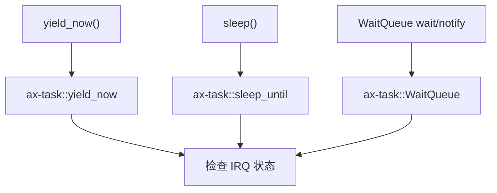
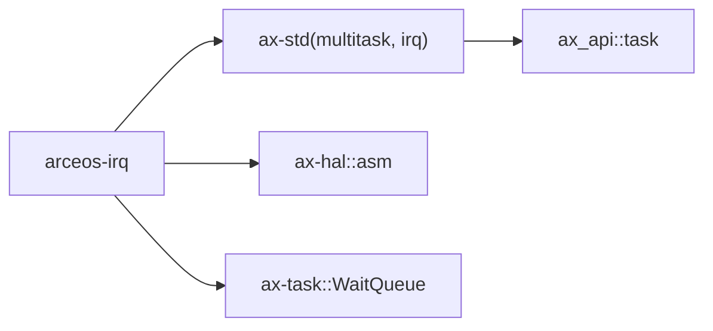

# `arceos-irq` 技术文档

> 路径：`test-suit/arceos/task/irq`
> 类型：测试入口 crate
> 分层：测试层 / ArceOS 任务上下文 IRQ 语义回归
> 版本：`0.1.0`
> 文档依据：`Cargo.toml`、`src/main.rs`、`src/irq.rs`、`qemu-riscv64.toml`

`arceos-irq` 并不是在测试某个外设中断处理器，而是在测试“任务切换、睡眠、等待队列阻塞前后，IRQ 开关语义是否保持正确”。它把 `yield`、`sleep` 和 `wait_queue` 三条任务路径串起来，在关键点检查中断是否处于预期状态。

需要强调的是：**这不是通用中断框架样例，也不是设备驱动模板；它专门验证任务上下文里的 IRQ 使能/关闭语义。**

## 1. 架构设计分析
### 1.1 子测试划分
`main()` 依次调用：

- `test_yielding()`
- `test_sleep()`
- `test_wait_queue()`

也就是说，它不是单点测试，而是把三条最常见的任务状态切换路径都过一遍。

### 1.2 `src/irq.rs` 的作用
辅助模块 `src/irq.rs` 没有注册外设 IRQ handler，而是提供了几个语义检查函数：

- `assert_irq_enabled()`
- `assert_irq_disabled()`
- `assert_irq_enabled_and_disabled()`
- `disable_irqs()`
- `enable_irqs()`

这些函数直接读写 `ax-hal::asm::{irqs_enabled, disable_irqs, enable_irqs}`，所以它们观察的是真实的 CPU IRQ 状态，而不是某个模拟标志位。

### 1.3 三条真实调用链
本 crate 实际上在验证下面三种任务路径：



重点不是中断有没有发生，而是“任务在这些切换后回来时，中断状态是否仍符合预期”。

## 2. 核心功能说明
### 2.1 `test_yielding()`
这个子测试会创建 16 个任务，每个任务反复：

1. 断言当前 IRQ 处于开启状态。
2. 调用 `thread::yield_now()`。
3. 再次检查“可开可关再恢复”这一基本语义。

它验证的是 cooperative 切换前后，中断状态没有被错误污染。

### 2.2 `test_sleep()`
这个子测试验证：

- 主线程睡眠后能恢复
- 后台 tick 线程在系统运行期间持续推进
- 多个子任务多次睡眠后仍能保持正确 IRQ 状态

这部分更接近“timer 驱动的任务阻塞/唤醒路径 IRQ 语义回归”。

### 2.3 `test_wait_queue()`
这里直接使用 `ax-task::WaitQueue`，而不是 `AxWaitQueueHandle`。它验证：

- `wait_timeout_until`
- `wait_until`
- `notify_one`
- `notify_all`

在这些阻塞和唤醒点前后，任务仍能安全地观察和切换 IRQ 状态。

### 2.4 边界澄清
这个 crate 不证明：

- 某个具体设备中断号配置正确
- trap handler 派发性能
- 外设驱动完整可用

它只证明任务相关路径没有把 IRQ 语义搞乱。

## 3. 依赖关系图谱


### 3.1 直接依赖
- `ax-std(multitask, irq)`：启用多任务与中断相关路径。

### 3.2 关键间接依赖
- `ax-task`：任务切换、睡眠和等待队列的真实实现。
- `ax-hal::asm`：读取和切换当前 CPU 的 IRQ 状态。

### 3.3 主要消费者
- `cargo arceos test qemu` 自动回归。
- `ax-task`、IRQ 相关上下文切换逻辑改动后的定向验证。

## 4. 开发指南
### 4.1 推荐运行方式
```bash
cargo xtask arceos run --package arceos-irq --arch riscv64
```

或者：

```bash
cargo arceos test qemu --target riscv64gc-unknown-none-elf
```

### 4.2 修改时的注意点
1. 新增场景必须明确说明是在验证哪条任务路径的 IRQ 语义。
2. 尽量复用 `src/irq.rs` 的检查函数，避免分散出多套判定逻辑。
3. 不要把设备驱动级测试塞进这里，那是另一类回归。

### 4.3 适合补充的场景
- 与 IPI 或抢占结合的 IRQ 状态回归
- 不同调度器 feature 下的上下文切换状态检查

## 5. 测试策略
### 5.1 当前自动化形态
`qemu-riscv64.toml` 中已配置：

- `-smp 4`
- `success_regex = ["Task irq state tests run OK!"]`
- panic 关键字失败匹配

说明它是标准自动回归包。

### 5.2 成功标准
- `yield` / `sleep` / `wait_queue` 三条子路径都能走通
- 中途不会因为 IRQ 状态异常触发断言
- 最终打印 `Task irq state tests run OK!`

### 5.3 风险点
- 若某条路径错误地在恢复任务时关闭了 IRQ，这个测试会直接 panic。
- 若 timer/等待队列路径有更深层 bug，可能首先表现为“卡住不结束”。

## 6. 跨项目定位分析
### 6.1 ArceOS
它是 ArceOS 任务上下文 IRQ 语义的直接回归入口，定位很窄但很关键。

### 6.2 StarryOS
StarryOS 不直接运行它，但共享任务和 IRQ 基础设施改动时，这类回归能帮助更早发现底层问题。

### 6.3 Axvisor
Axvisor 也不会直接依赖它；它的意义在于先把共享的任务/IRQ 语义验证清楚，再进入更复杂的虚拟化中断场景。
