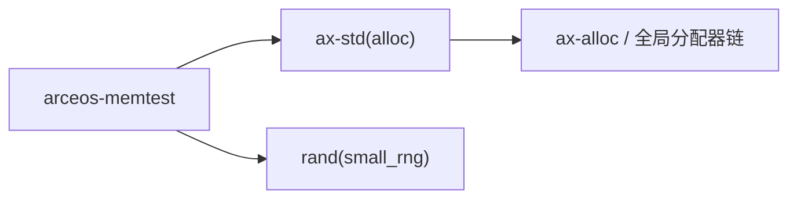

# `arceos-memtest` 技术文档

> 路径：`test-suit/arceos/memtest`
> 类型：测试入口 crate
> 分层：测试层 / ArceOS 堆分配与集合操作回归
> 版本：`0.1.0`
> 文档依据：`Cargo.toml`、`src/main.rs`、`qemu-riscv64.toml`、`docs/build-system.md`

`arceos-memtest` 通过两个简单但压力不小的工作负载，验证 ArceOS 在 `alloc` 打开后，堆分配与常用集合操作仍然可用：一个是大规模 `Vec<u32>` 分配、排序与有序性检查，另一个是 `BTreeMap<String, u32>` 插入与回读校验。

最重要的边界澄清是：**它不是物理内存测试器，也不是页分配器诊断工具；它验证的是“用户侧堆对象和集合在 ArceOS 上还能正常工作”。**

## 1. 架构设计分析
### 1.1 两个测试工作负载
源码里的测试非常集中：

- `test_vec()`：构造 300 万个 `u32`，排序后验证单调不减
- `test_btree_map()`：构造 5 万条 `key_<value>` 映射，再把 key 解析回整数做一致性检查

这两个测试分别覆盖了两类最典型的堆对象行为：

- 连续大块增长和重排
- 大量离散节点分配与字符串格式化

### 1.2 真实调用链
虽然源码表面看是普通 Rust 集合操作，但在 ArceOS 上会落到真实的堆分配路径：


因此，一旦这里失败，问题通常不在容器本身，而在：

- 全局分配器
- 堆初始化
- 内存回收/分配
- 较大对象或大量小对象分配路径

### 1.3 固定随机种子的意义
`SmallRng::seed_from_u64(0xdead_beef)` 不是装饰，而是为了让测试输入稳定可复现。这样在不同架构或不同回归轮次中，容器处理的是同一批数据，便于定位问题。

## 2. 核心功能说明
### 2.1 `test_vec()`
这个子测试重点覆盖：

- 大容量 `Vec::with_capacity`
- 海量 `push`
- 原地 `sort`
- 排序结果断言

它很适合暴露：

- 分配器在扩容或大对象场景下的问题
- 排序过程中潜在的内存破坏

### 2.2 `test_btree_map()`
这里的价值在于它不是单纯插入整数，而是同时引入了：

- `String` 分配
- `format!` 产生的新字符串
- `BTreeMap` 节点分配
- key/value 对应关系回读

所以它验证的是“分配器 + 字符串 + 关联容器”这一更接近真实应用的数据结构链。

### 2.3 边界澄清
它不负责：

- 检查整块物理内存是否损坏
- 覆盖页表映射正确性
- 测量分配器吞吐性能

它只是较大强度地验证“堆上常见容器还能正常工作”。

## 3. 依赖关系图谱


### 3.1 直接依赖
- `ax-std(alloc)`：说明本测试只关心分配相关能力，不涉及多任务或文件系统。
- `rand(small_rng)`：用固定种子生成可复现的数据集。

### 3.2 关键间接依赖
- `ax-alloc`：真正承接用户侧堆分配。
- `Vec`、`BTreeMap`、`String`：分别代表顺序容器、树形容器和字符串对象的典型分配形态。

### 3.3 主要消费者
- `cargo arceos test qemu` 自动发现的内存/分配基础回归。
- 调整 `ax-alloc` 或更底层内存管理实现后的 smoke test。

## 4. 开发指南
### 4.1 推荐运行方式
```bash
cargo xtask arceos run --package arceos-memtest --arch riscv64
```

或直接跑回归：

```bash
cargo arceos test qemu --target riscv64gc-unknown-none-elf
```

### 4.2 修改时的注意点
1. 保持输入确定性，尽量不要引入随机不稳定因素。
2. 数据规模要与测试环境内存预算匹配；当前 QEMU 配置是 128M。
3. 若新增容器场景，应明确它在验证哪类堆对象模式。

### 4.3 适合新增的场景
- `VecDeque`、`HashMap` 等更多堆容器
- 大量分配后释放再重分配的场景
- 更极端的小对象碎片化压力

## 5. 测试策略
### 5.1 当前自动化形态
各架构 `qemu-*.toml` 都设置了：

- `success_regex = ["Memory tests run OK!"]`
- panic 关键字失败匹配

这说明它是标准自动回归包，而不是手工样例。

### 5.2 成功标准
- `Vec` 排序后保持有序
- `BTreeMap` 中 `key_<value>` 与 value 一一对应
- 最终打印 `Memory tests run OK!`

### 5.3 风险点
- 如果分配器或底层页分配存在 bug，通常会表现为 panic、排序错误或映射关系校验失败。
- 若未来调整数据规模，要同步评估 QEMU 内存压力和执行时间。

## 6. 跨项目定位分析
### 6.1 ArceOS
它是 ArceOS 堆对象可用性的直接回归入口，用来快速判断“用户侧 alloc 基础设施有没有坏”。

### 6.2 StarryOS
StarryOS 不直接运行它，但共享分配基础设施改动后，这种简单工作负载往往比完整用户态场景更容易先暴露问题。

### 6.3 Axvisor
Axvisor 也不会直接依赖它；不过共享的分配和底层内存能力如果出现回退，这类短路径测试通常能更快给出信号。
