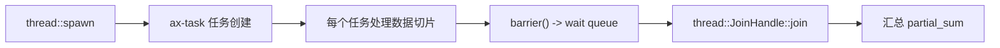
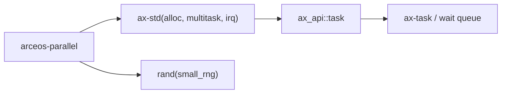

# `arceos-parallel` 技术文档

> 路径：`test-suit/arceos/task/parallel`
> 类型：测试入口 crate
> 分层：测试层 / ArceOS 并行执行与同步回归
> 版本：`0.1.0`
> 文档依据：`Cargo.toml`、`src/main.rs`、`qemu-riscv64.toml`

`arceos-parallel` 通过“把 200 万个数分片给 16 个任务并求和”的固定工作负载，验证 ArceOS 的多任务、`join`、等待队列屏障以及多核并行路径是否仍然正确。它不是在提供并行框架，而是在拿一条可复现的并发计算链做系统回归。

核心边界非常清楚：**它不是线程池、不是并行算法库，也不是性能 benchmark；它只是用一个固定工作负载证明并行任务、同步屏障和结果归并没有坏。**

## 1. 架构设计分析
### 1.1 工作负载结构
这个 crate 的主线分三步：

1. 用固定随机种子生成 `NUM_DATA = 2_000_000` 个 `u64` 数据。
2. 主线程串行计算一次期望结果 `expect`。
3. 16 个任务并行处理各自的切片，最后主线程 `join` 所有任务并汇总结果。

这让它同时具备：

- 正确性基线：串行 `expect`
- 并行路径：多任务分片求和
- 收敛点：所有子任务 `join`

### 1.2 自制 barrier 的作用
源码里的 `barrier()` 不是多余的，它明确让所有任务在完成自己的局部计算后，在同一个同步点汇合，然后再统一继续。对 `ax-std` 场景，它使用：

- `AxWaitQueueHandle`
- `ax_wait_queue_wait_until()`
- `ax_wait_queue_wake()`

这相当于顺手把等待队列同步路径也带进了测试。

### 1.3 真实调用链


此外，`main()` 一开始还故意调用了一次“永不满足条件、500ms 超时返回”的 `ax_wait_queue_wait_until()`，专门验证超时路径能返回 `true`。

## 2. 核心功能说明
### 2.1 工作负载本身在测什么
每个任务对自己负责的区间执行整数平方根近似 `sqrt()` 并求和。这个计算不复杂，但足够耗时，能让：

- 任务真正并行运行一段时间
- `join` 与屏障逻辑有机会暴露问题
- 结果可通过串行基线精确比对

### 2.2 为什么要保留串行 `expect`
如果只跑并行求和，没有独立的串行基线，就很难判断：

- 是同步错了
- 是任务丢了
- 还是局部计算本身错了

用同一份数据先算出 `expect`，可以把并行路径的错误直接归因到调度、同步或归并。

### 2.3 边界澄清
这个 crate 不应该被当成：

- 并行运行时抽象
- 高性能计算示例
- 自动负载均衡策略验证工具

它只是一个“结果可核对、同步点明确”的并发回归入口。

## 3. 依赖关系图谱


### 3.1 直接依赖
- `ax-std(alloc, multitask, irq)`：表明它同时依赖堆分配、多任务和超时等待。
- `rand(small_rng)`：生成固定输入数据集。

### 3.2 关键间接依赖
- `JoinHandle::join`：等待子任务结果收敛。
- `AxWaitQueueHandle`：构造 barrier 与超时 smoke test。
- `ax-task`：真实承载调度与同步。

### 3.3 主要消费者
- 并行任务与同步基础设施改动后的快速回归。
- `cargo arceos test qemu` 自动收集的任务并发回归集。

## 4. 开发指南
### 4.1 推荐运行方式
```bash
cargo xtask arceos run --package arceos-parallel --arch riscv64
```

或：

```bash
cargo arceos test qemu --target riscv64gc-unknown-none-elf
```

### 4.2 修改时的注意点
1. 保持输入数据与分片方式可复现，不要引入难以重现实验条件。
2. 如果修改 `NUM_TASKS`，要同步审视 `barrier()` 的等待条件。
3. 不要把性能比较结果写死为断言；这个 crate 更关注正确性与活性。

### 4.3 适合新增的方向
- 更多同步点
- 不同切片分布策略
- 更复杂但仍可精确校验结果的工作负载

## 5. 测试策略
### 5.1 当前自动化形态
`qemu-riscv64.toml` 明确配置了：

- `-smp 4`
- `success_regex = ["Parallel summation tests run OK!"]`
- panic 关键字失败匹配

说明它是自动回归入口，不依赖人工交互。

### 5.2 成功标准
- 500ms 等待队列超时 smoke test 返回正确
- 所有任务都完成并通过 barrier
- 所有 `partial_sum` 归并后的 `actual == expect`
- 最终打印 `Parallel summation tests run OK!`

### 5.3 风险点
- 若等待队列或 `join` 逻辑有问题，最常见现象是卡住不结束。
- 若任务分片或结果汇总出错，会直接表现为 `assert_eq!(expect, actual)` 失败。

## 6. 跨项目定位分析
### 6.1 ArceOS
它是 ArceOS 并发执行与同步语义的一条综合回归入口，但仍然只是测试入口，不是系统功能本身。

### 6.2 StarryOS
StarryOS 不直接运行它；不过共享调度、同步或等待队列改动后，这类回归依然能先一步暴露底层问题。

### 6.3 Axvisor
Axvisor 也不会直接消费它。它的价值在于把“并发 + 同步 + 可校验结果”这条短路径先验证好，再进入更复杂的虚拟化执行场景。
