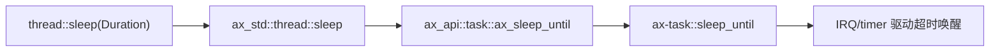
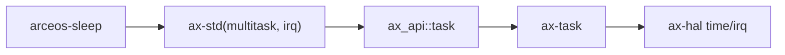

# `arceos-sleep` 技术文档

> 路径：`test-suit/arceos/task/sleep`
> 类型：测试入口 crate
> 分层：测试层 / ArceOS 定时休眠回归
> 版本：`0.1.0`
> 文档依据：`Cargo.toml`、`src/main.rs`、`qemu-riscv64.toml`、`docs/build-system.md`

`arceos-sleep` 用一组非常直观的工作负载，验证 ArceOS 中“线程睡眠到期后被唤醒”这条能力链是否正常。它既测试主线程的单次睡眠，也测试多个任务在不同休眠长度下的并发睡眠，还额外放了一个后台 tick 任务观察时间推进。

最重要的边界是：**它不是计时器精度 benchmark，也不是实时性测试套件；它只是用行为级断言和日志来验证 `thread::sleep()` 没有失效。**

## 1. 架构设计分析
### 1.1 测试场景划分
这个 crate 可以拆成三段：

1. 主线程先睡 1 秒，并打印实际耗时。
2. 一个后台任务每 500ms 打一次 `tick`，持续 30 次。
3. 5 个子任务分别按 `1s..5s` 的粒度，每个重复休眠 3 次。

最终主线程通过 `FINISHED_TASKS` 原子计数器等待所有子任务结束。

### 1.2 真实调用关系
这里用的是用户侧最普通的 `thread::sleep()`，但实际会落到任务与时钟子系统：



如果 `multitask` 或 `irq` 不成立，这条链会退化；而本 crate 明确在 `Cargo.toml` 打开了：

- `multitask`
- `irq`

说明它测试的是“真正的定时阻塞与唤醒”，不是 busy wait 退化路径。

### 1.3 为什么要有后台 tick 线程
后台线程不是为了功能展示，而是为了额外确认：

- 睡眠期间系统时间仍在推进
- 调度器和定时器中断没有卡死
- 一个线程睡眠时，不会阻塞其他线程继续运行

这让 `arceos-sleep` 同时具备“单线程休眠验证”和“多任务定时推进 smoke test”两层含义。

## 2. 核心功能说明
### 2.1 具体验证内容
当前实现主要覆盖：

- 主线程 `sleep(1s)` 的最小正确性
- 多个任务不同休眠长度下的唤醒行为
- 后台线程在系统运行期间持续获得调度
- 所有任务都能最终收敛并打印 `Sleep tests run OK!`

### 2.2 日志为什么只做观察，不做严格时序断言
源码只打印 `elapsed`，但没有把它与精确阈值严格比较。这是刻意设计，因为：

- QEMU 中断与串口输出本身会引入抖动
- 多核调度下线程恢复时间不可能完全恒定
- 这个测试关心的是“睡眠和唤醒是否工作”，不是“纳秒级精度是否达标”

### 2.3 边界澄清
因此它不适合被解读为：

- 实时调度性能测试
- 时钟源精度对比工具
- 高精度延迟测量基准

它只是“休眠 API 仍然可用”的回归入口。

## 3. 依赖关系图谱


### 3.1 直接依赖
- `ax-std(multitask, irq)`：说明测试直接依赖多任务和中断驱动的睡眠路径。

### 3.2 关键间接依赖
- `ax-task::sleep_until`：真正把当前任务挂入等待队列。
- `ax-hal` 的时间和中断能力：提供超时唤醒所需的时钟推进。

### 3.3 主要消费者
- `cargo arceos test qemu` 自动发现的任务时间语义回归。
- 调整 timer、IRQ 或 `ax-task` 睡眠路径后的快速验证。

## 4. 开发指南
### 4.1 推荐运行方式
```bash
cargo xtask arceos run --package arceos-sleep --arch riscv64
```

或者统一跑：

```bash
cargo arceos test qemu --target riscv64gc-unknown-none-elf
```

### 4.2 修改时的注意点
1. 保持总耗时在 CI 可接受范围内；当前场景已经接近十几秒。
2. 若增加更长睡眠，先评估测试脚本的超时限制。
3. 不要引入过于苛刻的时间精度断言，否则很容易造成虚假失败。

### 4.3 适合新增的场景
- `sleep_until()` 绝对时间路径
- 极短超时与长超时混合压力
- 单核和多核配置下的唤醒可达性

## 5. 测试策略
### 5.1 当前自动化形态
`qemu-riscv64.toml` 中已经提供：

- `-smp 4`
- `success_regex = ["Sleep tests run OK!"]`
- panic 关键字失败匹配

说明它是典型的自动回归包。

### 5.2 成功标准
- 主线程能从休眠中返回
- 所有子线程都能完成 3 轮休眠
- 后台 tick 能持续打印
- 最终出现 `Sleep tests run OK!`

### 5.3 风险点
- 若 timer/IRQ 路径失效，通常会表现为任务永久不醒。
- 若调度器有活性问题，后台 tick 或等待循环可能先暴露异常。

## 6. 跨项目定位分析
### 6.1 ArceOS
它是 ArceOS 时间与调度基本语义的一条行为回归入口，直接服务 `ax-task` 和 timer 相关实现。

### 6.2 StarryOS
StarryOS 不直接运行它，但底层时间推进和任务睡眠问题往往会先在这种简单回归里被发现。

### 6.3 Axvisor
Axvisor 也不直接依赖它；它的跨项目价值在于给共享底层定时与调度改动提供一条比虚拟机场景更容易定位的回归路径。
