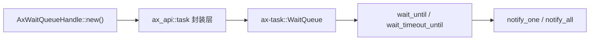
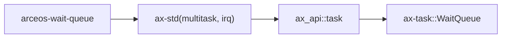

# `arceos-wait-queue` 技术文档

> 路径：`test-suit/arceos/task/wait_queue`
> 类型：测试入口 crate
> 分层：测试层 / ArceOS 阻塞唤醒语义回归
> 版本：`0.1.0`
> 文档依据：`Cargo.toml`、`src/main.rs`、`qemu-riscv64.toml`、`docs/build-system.md`

`arceos-wait-queue` 是专门验证 ArceOS 等待队列语义的系统级测试入口。它通过 `AxWaitQueueHandle` 和 `ax_wait_queue_wait_until()` / `ax_wait_queue_wake()` 组合出三类场景：条件满足唤醒、超时唤醒、以及“通知与超时都可能发生”的竞态场景。

这份 crate 的边界必须说清：**它不是生产级同步抽象，也不是通用条件变量库；它只是用最直接的 API 调用去证明 wait queue 语义没有回退。**

## 1. 架构设计分析
### 1.1 测试场景划分
`main()` 实际上只负责顺序执行两个子测试：

- `test_wait()`
- `test_wait_timeout_until()`

前者验证基本阻塞/唤醒流程，后者验证带超时的等待语义。

### 1.2 真实调用关系
这个 crate 并没有绕过公开接口直接碰 `ax-task::WaitQueue`，而是刻意使用 ArceOS 对外暴露的 API 句柄层：



具体来看：

- `AxWaitQueueHandle` 在 `ax_api::task` 中包装了 `ax-task::WaitQueue`
- `ax_wait_queue_wait_until()` 会在有 `irq` 时走 `wait_timeout_until` 路径
- `ax_wait_queue_wake()` 最终映射到 `notify_one(true)` 或 `notify_all(true)`

这说明它验证的是“公开任务 API 到内核等待队列”的整条链，而不是某个私有 helper。

### 1.3 三类超时场景为什么都需要
`test_wait_timeout_until()` 故意覆盖三种情况：

1. 设置了很长超时，但实际由通知提前唤醒
2. 条件恒为假，由超时自然唤醒
3. 条件和通知都可能在截止时间附近生效

只有把这三类都覆盖到，才能较全面地验证 `wait_timeout_until()` 的返回值语义和边界行为。

## 2. 核心功能说明
### 2.1 `test_wait()` 覆盖的能力链
`test_wait()` 使用 `WQ1` / `WQ2`、`COUNTER` 和 `GO` 组织了一套典型的“主线程等子线程全部到位，再统一放行”的阻塞模型。它验证：

- 子任务可以通知主线程
- 主线程可以等待特定条件成立
- 主线程可以唤醒一批等待中的任务
- 所有任务都能最终退出等待队列

### 2.2 `test_wait_timeout_until()` 的关键点
这部分最容易误读。源码里有一处看似奇怪的写法：

- 在“由通知提前唤醒”的子场景里，条件闭包写成 `|| true`

这不是 bug，而是刻意让 `wait_until` 语义在被通知后可以立刻满足条件，从而证明“返回 `false` 表示不是超时唤醒”这一路径成立。

### 2.3 边界澄清
这个 crate 不试图证明：

- wait queue 的公平性
- 高并发场景下的吞吐性能
- 任意复杂同步协议都正确

它只聚焦在“等待、通知、超时返回值”这三个公开语义点上。

## 3. 依赖关系图谱


### 3.1 直接依赖
- `ax-std(multitask, irq)`：说明本测试依赖多任务与基于中断的超时等待。

### 3.2 关键间接依赖
- `ax_api::task::AxWaitQueueHandle`
- `ax_api::task::ax_wait_queue_wait_until`
- `ax_api::task::ax_wait_queue_wake`
- `ax-task::WaitQueue`

### 3.3 主要消费者
- `cargo arceos test qemu` 自动发现的任务同步回归。
- 修改 `ax-task::wait_queue` 或 `ax_api::task` 封装后的首批验证对象。

## 4. 开发指南
### 4.1 推荐运行方式
```bash
cargo xtask arceos run --package arceos-wait-queue --arch riscv64
```

或直接跑全集：

```bash
cargo arceos test qemu --target riscv64gc-unknown-none-elf
```

### 4.2 维护时的注意点
1. 不要把复杂业务同步逻辑塞进来，保持每个子场景的语义单一。
2. 若修改 `success_regex`，要与最终结束语 `All tests passed!` 保持一致。
3. 超时长度要兼顾“足够区分场景”和“不会拖慢 CI 太多”。

### 4.3 推荐补充方向
- 更短超时下的边界竞争
- 多次重复通知/空通知的行为
- 单核与多核环境下的一致性回归

## 5. 测试策略
### 5.1 当前自动化形态
`qemu-riscv64.toml` 已明确配置：

- `-smp 4`
- `success_regex = ["All tests passed!"]`
- panic 关键字作为失败条件

因此这不是人工观察样例，而是标准回归包。

### 5.2 成功标准
- 基本等待/通知路径全部通过
- 提前通知与超时唤醒的返回值语义正确
- 混合竞争场景不会卡死
- 最终输出 `All tests passed!`

### 5.3 风险点
- 若 timer/IRQ 路径失效，超时测试最先挂住。
- 若 `notify_all(true)` 或条件闭包语义变化，混合场景最容易暴露回归。

## 6. 跨项目定位分析
### 6.1 ArceOS
它是 ArceOS 任务同步公开 API 的直接回归入口，重点验证 `ax-api` 到 `ax-task` 的等待队列桥接。

### 6.2 StarryOS
StarryOS 不直接运行它，但共享底层任务同步实现时，这类回归对发现基础语义回退依然有价值。

### 6.3 Axvisor
Axvisor 也不会直接消费它；不过仓库中其他组件也会使用等待队列思想，因此先用这条短路径验证基础语义通常更容易定位问题。
