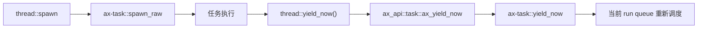
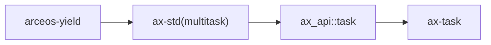

# `arceos-yield` 技术文档

> 路径：`test-suit/arceos/task/yield`
> 类型：测试入口 crate
> 分层：测试层 / ArceOS 调度让出语义回归
> 版本：`0.1.0`
> 文档依据：`Cargo.toml`、`src/main.rs`、`qemu-riscv64.toml`、`docs/build-system.md`

`arceos-yield` 是一条非常短、但很有代表性的调度测试：它批量创建任务，在任务体和主线程里调用 `thread::yield_now()`，并在特定 feature 组合下检查任务完成顺序是否符合预期。

它的边界需要说得很明确：**这个 crate 不是调度器框架，也不是性能 benchmark；它只是拿“主动让出 CPU”这条最基础的调度语义做回归检查。**

## 1. 架构设计分析
### 1.1 测试结构
整个场景只依赖两个共享状态：

- `NUM_TASKS = 10`
- `FINISHED_TASKS`

主线程一次性生成 10 个任务，每个任务打印自己的 ID，然后根据 feature 条件决定是否显式 `yield_now()`，最后把完成顺序记录到原子计数器中。

### 1.2 真实调用链
看起来它只调用了一个简单 API，但实际链路会穿透到调度器内部：



因此这个测试真正观察的是“任务主动让出 CPU 后，调度器是否做了正确的切换”。

### 1.3 feature 条件为什么重要
源码里有两个很关键的条件：

- `#[cfg(all(not(feature = "sched-rr"), not(feature = "sched-cfs")))]`
- `if cfg!(not(feature = "sched-cfs")) && available_parallelism() == 1`

这意味着：

- 在默认非 RR、非 CFS 场景下，它明确测试 cooperative `yield_now()`
- 只有在非 CFS 且单核时，才要求完成顺序与创建顺序一致，以验证 FIFO 风格语义

所以这个 crate 不是“无条件断言所有调度器都应同序执行”，而是有边界地验证默认/特定调度语义。

## 2. 核心功能说明
### 2.1 实际验证内容
它主要检查三件事：

1. `yield_now()` 调用本身不会导致任务丢失或死锁。
2. 主线程在等待子任务完成时，可以通过反复 `yield_now()` 推进系统前进。
3. 在非 CFS、单核的窄场景下，任务完成顺序仍符合预期的 FIFO 语义。

### 2.2 为什么顺序断言被严格门控
当前仓库的 `qemu-riscv64.toml` 使用 `-smp 4`，在多核环境下任务完成顺序天然会受并行性影响。因此源码只在单核时做顺序断言，这是合理而且必要的。

这也意味着当前默认自动测试更偏向：

- `yield_now()` 不崩
- 调度器能推进
- 所有任务都能收敛结束

而不是强行验证全局顺序。

### 2.3 边界澄清
它不负责：

- 比较不同调度器的性能
- 证明 RR 或 CFS 的公平性
- 提供高级任务同步原语

它只是“主动让出 CPU 这一下是否还正常”的快速探针。

## 3. 依赖关系图谱


### 3.1 直接依赖
- `ax-std(multitask)`：提供 `thread::spawn`、`thread::yield_now` 与 `available_parallelism()`。

### 3.2 关键间接依赖
- `ax_api::task::ax_yield_now`：连接用户侧线程 API 与内核任务 API。
- `ax-task::yield_now`：真正对当前 run queue 触发让出和重新调度。

### 3.3 主要消费者
- `cargo arceos test qemu` 自动收集的任务基础回归。
- 修改 `ax-task`、调度器 feature 或 cooperative 调度路径后的最小验证。

## 4. 开发指南
### 4.1 推荐运行方式
```bash
cargo xtask arceos run --package arceos-yield --arch riscv64
```

或直接跑整套测试：

```bash
cargo arceos test qemu --target riscv64gc-unknown-none-elf
```

### 4.2 修改时的注意点
1. 不要把这个 crate 扩展成通用调度测试集合；它应持续聚焦 `yield`。
2. 如果新增顺序断言，必须明确它依赖单核还是特定调度器。
3. 若改变成功输出，要同步更新对应 `success_regex`。

### 4.3 适合补充的场景
- 单核专用配置下的更强顺序断言
- RR/CFS 下“让出后系统仍能前进”的更明确 smoke check

## 5. 测试策略
### 5.1 当前自动化形态
`qemu-riscv64.toml` 使用：

- `-smp 4`
- `success_regex = ["Task yielding tests run OK!"]`
- panic 关键字作为失败条件

说明它已进入自动回归矩阵，但默认配置更偏向“活性验证”而非“严格顺序验证”。

### 5.2 成功标准
- 所有任务都能完成
- 主线程等待逻辑能收敛
- 最终输出 `Task yielding tests run OK!`
- 过程中没有 panic

### 5.3 测试风险
- 多核下不要误读日志顺序为调度错误。
- 若未来调度器默认 feature 变化，需要重新审视条件编译分支是否仍合理。

## 6. 跨项目定位分析
### 6.1 ArceOS
它是 ArceOS 最基础的任务调度回归之一，用来盯住 cooperative `yield` 这条最短语义链。

### 6.2 StarryOS
StarryOS 不直接消费这个测试包，但会间接受到底层调度实现改动影响，因此这类回归对共享任务栈仍有参考意义。

### 6.3 Axvisor
Axvisor 也不会直接运行它；它的意义在于先用比虚拟化场景简单得多的工作负载验证共享调度基础没有被破坏。
