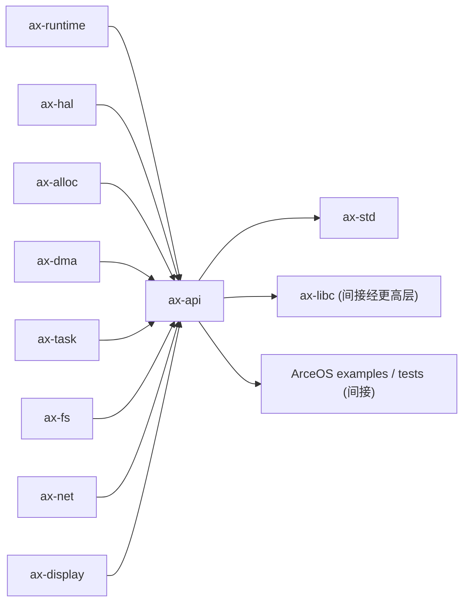

# `ax-api` 技术文档

> 路径：`os/arceos/api/arceos_api`
> 类型：库 crate
> 分层：ArceOS 层 / ArceOS 公共 API/feature 聚合层
> 版本：`0.3.0-preview.3`
> 文档依据：`Cargo.toml`、`src/lib.rs`、`src/macros.rs`、`src/imp/mod.rs`、`src/imp/mem.rs`、`src/imp/task.rs`、`src/imp/fs.rs`、`src/imp/net.rs`、`src/imp/display.rs`

`ax-api` 是 ArceOS 官方的公共 API 门面层。它把底层 `ax*` 模块能力按领域重新组织成稳定的 `ax_*` 接口，使上层用户库、应用接口层和部分系统软件可以在不直接耦合大量内部模块的前提下访问内核能力。

## 1. 架构设计分析
### 1.1 设计定位
`ax-api` 的设计非常明确：

- 它不是运行时本体，不负责初始化系统，也不直接实现调度、内存、网络或文件系统算法。
- 它是一层 **薄门面**：对外给出稳定、按域划分的 `ax_*` API，对内把实现集中到 `imp/`。
- 它与 `ax-feat` 配合，通过 feature 控制哪些 API 域进入最终镜像。
- 它既是 `ax-std` 的重要下层依赖，也是 ArceOS 模块能力暴露给更上层时最推荐的接入边界。

因此，理解 `ax-api` 的关键不在复杂数据结构，而在“API 定义如何生成”“API 可见性如何由 feature 控制”“API 最终映射到哪些模块”。

### 1.2 内部模块划分
- `src/lib.rs`：顶层 API 定义文件。用 `define_api!` / `define_api_type!` 分域导出 `sys`、`time`、`mem`、`stdio`、`task`、`fs`、`net`、`display` 等接口。
- `src/macros.rs`：核心宏定义。负责把 API 声明转换为真正的 `pub fn`、`pub use` 或可选占位类型。
- `src/imp/mod.rs`：实现聚合层，按 feature 组织 `mem`、`task`、`stdio`、`sys`、`time`、`fs`、`net`、`display` 等子模块。
- `src/imp/mem.rs`：内存与 DMA API 的具体实现。
- `src/imp/task.rs`：睡眠、yield、退出、任务句柄、等待队列和亲和性相关实现。
- `src/imp/fs.rs`：文件/目录句柄、路径操作和 `OpenOptions` 等文件系统门面实现。
- `src/imp/net.rs`：TCP/UDP 句柄、DNS、接口轮询等网络 API 实现。
- `src/imp/display.rs`：显示信息和 flush 相关实现。

### 1.3 宏驱动的 API 生成机制
`ax-api` 最值得单独说明的是 `macros.rs` 中的两个宏：

- `define_api!`：生成函数 API。
  - 无条件条目：总是生成 `pub fn`，内部直接调用 `imp::<name>`。
  - 带 `@cfg "feature"` 条目：只有对应 feature 打开时才生成真实 API。
- `define_api_type!`：生成公开类型或句柄。
  - 本质是把 `imp::Type` 再导出到稳定 API 名称下。

这套设计把“API 声明”与“API 实现”解耦开了：

- `lib.rs` 决定对外暴露什么。
- `imp/*` 决定每个 API 实际调用哪个底层模块。

### 1.4 `dummy-if-not-enabled` 的特殊语义
这是 `ax-api` 非常重要的一个 feature：

- 正常情况下，未打开某能力 feature 时，对应 API 根本不会被编译进 crate。
- 如果同时打开 `dummy-if-not-enabled`，则未启用能力的 API 也会生成，但函数体会走 `unimplemented!()`，类型则可能退化为空占位 struct。

这意味着 `dummy-if-not-enabled` 不是“开启某种退化实现”，而是“强行保留符号表形状，运行时再失败”。文档和调用方都必须清楚这一点，否则很容易把“编译通过”误判成“功能可用”。

### 1.5 关键公开类型与句柄
- `AxError` / `AxResult`：统一错误类型与返回值约定。
- `AxTimeValue`：时间 API 的核心类型。
- `AxPollState`：`io` 域导出的 poll 状态类型。
- `DMAInfo`：在 `dma` feature 下导出的 DMA 元信息。
- `AxTaskHandle`、`AxWaitQueueHandle`、`AxCpuMask`、`AxRawMutex`：在 `multitask` feature 下导出的任务和同步相关句柄。
- `AxFileHandle`、`AxDirHandle`、`AxOpenOptions`、`AxFileAttr` 等：在 `fs` feature 下导出的文件系统句柄与属性类型。
- `AxTcpSocketHandle`、`AxUdpSocketHandle`：在 `net` feature 下导出的网络句柄。
- `AxDisplayInfo`：在 `display` feature 下导出的显示信息。

### 1.6 API 到下层模块的映射关系
各 API 域与下层模块的对应关系非常稳定：

- `sys` -> `ax-hal::cpu_num`、`ax-hal::power::system_off`
- `time` -> `ax-hal::time`
- `stdio` -> `ax-hal::console` 与 `ax-log`
- `mem::alloc` -> `ax-alloc`
- `mem::dma` -> `ax-dma`
- `task` -> `ax-task`、`ax-sync`、`ax-hal::time`
- `fs` -> `ax-fs`
- `net` -> `ax-net`
- `display` -> `ax-display`

因此，`ax-api` 本身是薄的，但它承担了“把一组分散模块整理成统一上层接口”的体系化职责。

## 2. 核心功能说明
### 2.1 主要功能
- 向上层暴露按领域划分的稳定 API。
- 用 feature 决定 API 域是否进入最终镜像。
- 提供统一句柄和类型别名，降低上层对底层实现细节的感知。
- 通过 `modules` 子模块提供“必要时直连底层模块”的逃生舱。

### 2.2 关键 API 与使用场景
- `ax_get_cpu_num()`、`ax_terminate()`：系统级基础控制。
- `ax_monotonic_time()`、`ax_wall_time()`：时间查询。
- `ax_alloc()`、`ax_dealloc()`、`ax_alloc_coherent()`：内存与 DMA 申请。
- `ax_sleep_until()`、`ax_yield_now()`、`ax_exit()`：任务控制。
- `ax_open_file()`、`ax_open_dir()`、路径和目录操作：文件系统接口。
- `ax_tcp_connect()`、`ax_udp_bind()`、`ax_dns_query()`：网络接口。
- `modules::*`：当稳定 API 不够用时，显式下钻到底层模块。

### 2.3 典型使用方式
对上层库或应用接口层来说，推荐优先依赖 `ax-api` 而不是直接依赖多个底层模块：

```rust
use ax_api::time::ax_monotonic_time;
use ax_api::sys::ax_get_cpu_num;

let now = ax_monotonic_time();
let cpus = ax_get_cpu_num();
let _ = (now, cpus);
```

如果稳定 API 不足，再显式使用 `ax_api::modules` 中再导出的底层 crate。

## 3. 依赖关系图谱


### 3.1 关键直接依赖
- 核心基础：`axconfig`、`ax-errno`、`ax-feat`、`ax-hal`、`axio`、`ax-log`、`ax-runtime`、`ax-sync`。
- 可选能力：`ax-alloc`、`ax-dma`、`ax-task`、`ax-fs`、`ax-net`、`ax-display`、`ax-driver`、`ax-ipi`、`ax-mm`。

### 3.2 关键直接消费者
- `ax-std`：最重要的直接消费者，会把 `ax-api` 作为用户库的重要下层能力来源。
- 其他需要稳定 API 边界的上层 Rust 代码。

### 3.3 间接消费者
- ArceOS 示例与测试程序，经 `ax-std` 或更高层封装间接使用。
- Axvisor，经 `ax-std` 间接共享这套 API 栈。
- StarryOS 若通过 `ax-std` 走统一上层库路径时，也会间接使用，但内核本体通常直接依赖底层模块而不是本 crate。

## 4. 开发指南
### 4.1 依赖配置
```toml
[dependencies]
ax-api = { workspace = true, features = ["alloc", "multitask", "fs", "net"] }
```

### 4.2 使用与扩展原则
1. 上层应优先使用 `ax-api` 暴露的稳定接口，不要一开始就直接依赖多个 `ax*` 内核模块。
2. 新增 API 时，先在 `lib.rs` 中定义门面，再把具体实现落到 `imp/`，不要反过来让 `imp` 直接成为公开边界。
3. 若某能力必须受 feature 控制，应同时更新 `Cargo.toml`、`lib.rs` 中的宏调用，以及 `imp/` 子模块实现。
4. `dummy-if-not-enabled` 仅适用于需要保留符号形状的场景，不能把它当成真正的降级实现。

### 4.3 关键开发建议
- 把 `modules` 视为最后兜底手段，而不是常规入口。
- 新增 API 时要明确它属于稳定门面还是“只应在更底层模块里使用”的内部能力。
- 若某 API 本质上只是底层模块的简单透传，也要评估它是否真的值得进入稳定公共边界。

## 5. 测试策略
### 5.1 当前测试形态
`ax-api` 本身几乎没有独立的 crate 内测试，其正确性更多依赖 feature 组合编译与上层集成 smoke test。

### 5.2 单元测试重点
- `define_api!` / `define_api_type!` 在不同 feature 组合下的符号生成行为。
- `dummy-if-not-enabled` 路径是否按预期生成占位函数/类型。
- 任务、DMA、文件系统和网络句柄等薄包装是否保持稳定语义。

### 5.3 集成测试重点
- 通过 `ax-std` 或最小 ArceOS 应用验证时间、I/O、任务、文件系统、网络等门面 API 的实际可用性。
- 覆盖不同 feature 组合下的编译与运行路径，尤其是 `multitask`、`fs`、`net`、`dma`。
- 对 `dummy-if-not-enabled`，至少要验证调用方不会误把占位 API 当成可运行实现。

### 5.4 覆盖率要求
- 对 `ax-api`，比运行时覆盖率更重要的是“门面完整性覆盖率”。
- 至少应覆盖 API 生成、feature 门控、占位语义和关键句柄类型这四类风险点。
- 所有新增公共 API 都应配一条最小消费者路径验证其真实行为。

## 6. 跨项目定位分析
### 6.1 ArceOS
`ax-api` 是 ArceOS 官方的公共 API 门面层。它与 `ax-feat` 协作，把一组离散的底层模块整理成稳定接口，是 `ax-std` 等上层库最重要的下层边界之一。

### 6.2 StarryOS
StarryOS 内核本体通常直接依赖更底层模块，而不是依赖 `ax-api`。因此在 StarryOS 中，它更像“可选的统一上层库接口层”，而不是内核核心依赖。

### 6.3 Axvisor
Axvisor 主要经 `ax-std` 间接复用 `ax-api`。因此它在 Axvisor 中扮演的是“共享上层 API 栈的一部分”，而不是 hypervisor 专用接口层。
