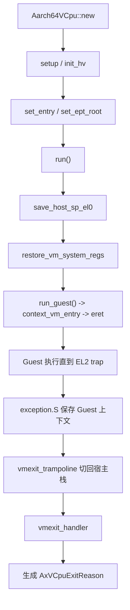
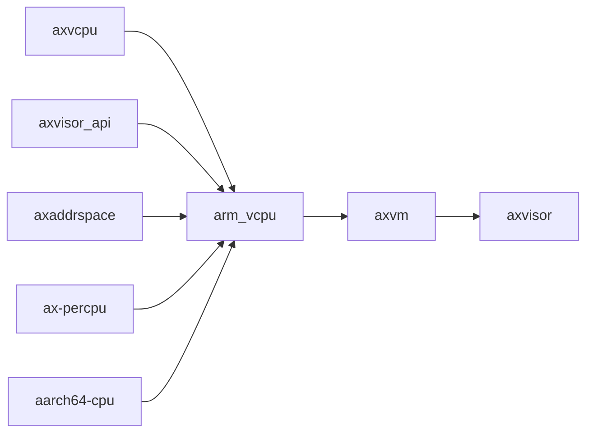
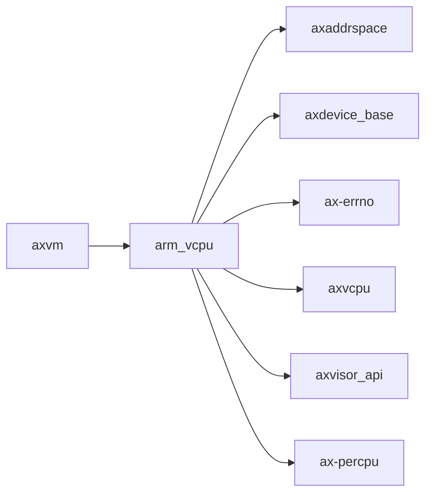

# `arm_vcpu` 技术文档

> 路径：`components/arm_vcpu`
> 类型：库 crate
> 分层：组件层 / 可复用基础组件
> 版本：`0.2.2`
> 文档依据：`Cargo.toml`、`src/lib.rs`、`src/vcpu.rs`、`src/pcpu.rs`、`src/exception.rs`、`src/exception.S`、`src/exception_utils.rs`、`src/context_frame.rs`、`src/smc.rs`

`arm_vcpu` 是 Axvisor/`axvm` 体系在 AArch64 EL2 上的 vCPU 实现。它负责 guest 与 host 上下文切换、EL2 异常向量接管、常见 VM exit 的解析与上报，以及与宿主侧中断注入接口的对接，是 ARM 虚拟化主线中最接近硬件执行边界的组件之一。

## 1. 架构设计分析
### 1.1 设计定位
`arm_vcpu` 的职责边界十分清晰：

- 它实现的是 **AArch64 架构相关的 vCPU 运行时**，不是通用虚拟机资源管理层。
- 它向上实现 `axvcpu::AxArchVCpu` / `AxArchPerCpu`，由 `axvm` 统一调度和管理。
- 它向下直接操作 EL2 寄存器、异常向量、`VTTBR_EL2`、`VTCR_EL2`、`HCR_EL2` 等硬件虚拟化设施。
- 它不负责完整的 vGIC 设备模型，也不负责 VM 生命周期编排；这些分别由 `arm_vgic`、`axvm` 和更上层 hypervisor 逻辑承担。

因此，`arm_vcpu` 的核心价值是“把 ARM EL2 虚拟化原语整理成一个可被上层 hypervisor 驱动的 vCPU 对象”。

### 1.2 内部模块划分
- `src/lib.rs`：crate 入口与对外导出。导出 `Aarch64VCpu`、`Aarch64PerCpu`、配置类型和 `TrapFrame` 别名。
- `src/vcpu.rs`：vCPU 主体实现，包含 `Aarch64VCpu`、`AxArchVCpu` 实现、`run()` 主线、VM 寄存器恢复与 VM exit 分析。
- `src/pcpu.rs`：per-CPU 虚拟化状态入口，负责 EL2 向量基址、HCR 与 IRQ 处理回调等本地状态。
- `src/exception.rs`：异常入口 glue，定义 `vmexit_trampoline`、同步异常处理和 VM exit 归类。
- `src/exception.S`：真正的 EL2 异常向量与保存/恢复汇编路径。
- `src/exception_utils.rs`：ESR/FAR/HPFAR 等寄存器解析、GPA 合成与若干汇编辅助宏。
- `src/context_frame.rs`：`TrapFrame` / `Aarch64ContextFrame` 与 `GuestSystemRegisters` 的存取实现。
- `src/smc.rs`：SMC 指令封装，用于必要的 SMC 转发路径。

### 1.3 关键数据结构与对象
- `Aarch64VCpu<H>`：核心 vCPU 对象，内部最关键的字段顺序是：
  - `ctx: TrapFrame`
  - `host_stack_top: u64`
  - `guest_system_regs: GuestSystemRegisters`

  这一布局和 `exception.S` 的汇编路径强绑定，不能随意调整。

- `TrapFrame` / `Aarch64ContextFrame`：保存 guest 的 GPR、`sp_el0`、`elr`、`spsr`。
- `GuestSystemRegisters`：保存 guest 视角的 EL1/EL0 系统寄存器，以及 `hcr_el2`、`vttbr_el2`、`vtcr_el2`、`vmpidr_el2` 等虚拟化关键状态。
- `Aarch64PerCpu<H>`：每 CPU 的 EL2 本地状态对象。
- `VmCpuRegisters`：面向更高层打包的寄存器聚合类型，适合描述“可迁移/可保存的一组 vCPU 状态”。

### 1.4 vCPU 创建、运行与退出主线
`arm_vcpu` 的主线非常明确：



可以进一步拆解为：

1. `new()` 只构造基本上下文，并把 DTB 地址写到约定参数寄存器。
2. `setup()` / `init_hv()` 配置 `SPSR_EL2`、`VTCR_EL2`、`HCR_EL2`、`VMPIDR_EL2` 等虚拟化状态。
3. `set_entry()` 设置 guest 入口 PC；`set_ept_root()` 设置 `VTTBR_EL2`。
4. `run()` 先保存宿主 `SP_EL0`，再恢复 guest 系统寄存器，最后通过裸函数 `run_guest()` 跳到 `context_vm_entry` 并 `eret` 进入 guest。
5. guest 一旦因同步异常、IRQ 或系统寄存器 trap 回到 EL2，`exception.S` 会把 guest 上下文写回 `Aarch64VCpu`，再通过 `vmexit_trampoline` 切回宿主栈。
6. `vmexit_handler()` 把硬件 trap 归类为 `AxVCpuExitReason`，再交给上层 hypervisor 处理。

### 1.5 VM exit 与内建处理逻辑
`arm_vcpu` 的 VM exit 路径不是简单“返回异常号”，而是做了明确分类：

- `Synchronous`：走数据 abort、系统寄存器访问、HVC、SMC/PSCI 等细分解析。
- `Irq`：上报为 `ExternalInterrupt`，由 HAL 侧决定 vector 语义。
- 对 `SysRegRead` / `SysRegWrite`，还会额外执行内建的系统寄存器处理逻辑，例如 `ICC_SGI1R_EL1` 生成 `SendIPI` 类型退出。

这说明 `arm_vcpu` 不只是“上下文切换器”，它同时承担了第一层 trap 解码器的角色。

### 1.6 与 GIC、中断与 Stage-2 页表的关系
- `set_ept_root()` 实际写的是 `VTTBR_EL2`，即 Stage-2 根页表基址。
- `VTCR_EL2` 会根据 `ID_AA64MMFR0_EL1` 探测宿主支持的物理地址位宽和页表层级。
- `HCR_EL2` 会根据配置选择虚拟中断或物理直通中断行为。
- 真正的“虚拟中断注入”并不在本 crate 内建模，而是调用 `axvisor_api::arch::hardware_inject_virtual_interrupt()`，与 `arm_vgic` 形成分工。

## 2. 核心功能说明
### 2.1 主要功能
- 创建和维护 AArch64 guest 上下文。
- 在 EL2 和 guest EL1/EL0 之间切换执行。
- 解析常见 VM exit 并生成 `AxVCpuExitReason`。
- 提供 per-CPU EL2 本地状态管理。
- 与宿主 HAL / 中断注入接口协作完成 IRQ 路径。

### 2.2 关键 API 与使用场景
- `Aarch64VCpu::new()` / `setup()`：构造 vCPU 并初始化 EL2 虚拟化寄存器。
- `set_entry()`：设置 guest 起始执行地址。
- `set_ept_root()`：安装 Stage-2 根页表。
- `run()`：进入 guest 并等待下一次 VM exit。
- `inject_interrupt()`：调用宿主侧架构 API 注入虚拟中断。

### 2.3 典型使用方式
`arm_vcpu` 并不直接作为最终业务 API 暴露给用户，典型用法是由 `axvm` 绑定为当前架构的 `AxArchVCpuImpl`：

```rust
let mut vcpu = Aarch64VCpu::<MyHal>::new(vcpu_id, dtb_addr)?;
vcpu.setup(config)?;
vcpu.set_entry(entry_gpa);
vcpu.set_ept_root(stage2_root);
let exit = vcpu.run()?;
```

## 3. 依赖关系图谱


### 3.1 关键直接依赖
- `axvcpu`：提供架构无关 vCPU trait 契约。
- `axvisor_api`：提供宿主中断注入和架构辅助接口。
- `axaddrspace`：服务 guest 地址空间 / Stage-2 相关协作。
- `ax-percpu`：保存 EL2 本地状态。
- `aarch64-cpu`、`numeric-enum-macro`：寄存器访问和异常编码辅助。

### 3.2 关键直接消费者
- `axvm`：在 aarch64 路径下把 `Aarch64VCpu` 绑定为实际架构实现。

### 3.3 间接消费者
- `axvisor`：通过 `axvm` 复用这套 ARM vCPU 栈。
- 宿主侧 IRQ 处理路径：经 `axvisor_api` 与 `ax-hal::irq` 协作。

## 4. 开发指南
### 4.1 依赖配置
```toml
[dependencies]
arm_vcpu = { workspace = true }
```

但更常见的接入方式是通过 `axvm` 间接使用，而不是直接把它作为最终上层接口。

### 4.2 开发与修改约束
1. `Aarch64VCpu` 的字段顺序和 `exception.S` 强绑定，任何布局修改都必须同步修改汇编偏移。
2. `run_guest()`、`context_vm_entry`、`vmexit_trampoline` 构成一个完整的汇编- Rust 协议，不能单边修改。
3. 修改 `HCR_EL2`、`VTCR_EL2`、`VTTBR_EL2` 路径时，要同步验证 passthrough interrupt/timer 等配置位语义。
4. 系统寄存器 trap 的新增处理应先区分：这是 vCPU 内建逻辑，还是应属于 `arm_vgic` / 上层 VMM。

### 4.3 关键开发建议
- 对纯寄存器编码和位域解析，优先写成 Rust 辅助函数，减少把语义埋进汇编。
- 对 VM exit 类型的新增分支，最好显式在文档里标明对应 ESR/ISS 语义。
- 对可迁移状态，若未来要做真正快照，应明确 `VmCpuRegisters` 与“运行期寄存器同步”的边界。

## 5. 测试策略
### 5.1 当前测试形态
该 crate 主要依赖交叉编译和集成运行验证，几乎没有独立单元测试。

### 5.2 单元测试重点
- `VTCR_EL2` 参数计算与寄存器位域解析。
- ESR/ISS/FAR/HPFAR 到 GPA 的合成逻辑。
- `AxVCpuExitReason` 映射中那些可纯 Rust 验证的分支。

### 5.3 集成测试重点
- Axvisor + aarch64 场景下的 guest 启动、HVC、SMC、MMIO、IPI 与定时器路径。
- `passthrough_interrupt` / `passthrough_timer` 打开和关闭时的差异行为。
- vCPU 布局与汇编保存/恢复路径的一致性。

### 5.4 覆盖率要求
- 对 `arm_vcpu`，重点不是普通函数覆盖率，而是“Guest 进入与退出主线覆盖率”。
- 至少要覆盖 guest run、同步异常退出、IRQ 退出和系统寄存器 trap 四条路径。
- 涉及字段布局、异常向量或宿主栈切换的改动，应视为最高风险改动。

## 6. 跨项目定位分析
### 6.1 ArceOS
`arm_vcpu` 并不是普通 ArceOS 内核模块，而是基于 ArceOS 宿主能力构建 hypervisor 栈时的架构级组件。它通过 `axvisor_api` 与宿主侧 HAL 相连，但不直接承担一般内核功能。

### 6.2 StarryOS
当前仓库中 StarryOS 并未直接依赖 `arm_vcpu`。因此它在 StarryOS 中更多是潜在可复用的虚拟化组件，而不是现有主线依赖。

### 6.3 Axvisor
`arm_vcpu` 是 Axvisor 在 AArch64 路径上的关键执行引擎之一。`axvm` 负责统一 VM 资源模型，而真正把 guest 扔进 EL1 执行、再把 VM exit 带回宿主的，就是 `arm_vcpu`。
# `arm_vcpu` 技术文档

> 路径：`components/arm_vcpu`
> 类型：库 crate
> 分层：组件层 / 可复用基础组件
> 版本：`0.2.2`
> 文档依据：当前仓库源码、`Cargo.toml` 与 `components/arm_vcpu/README.md`

`arm_vcpu` 的核心定位是：Aarch64 VCPU implementation for Arceos Hypervisor

## 1. 架构设计分析
- 目录角色：可复用基础组件
- crate 形态：库 crate
- 工作区位置：根工作区
- feature 视角：该 crate 没有显式声明额外 Cargo feature，功能边界主要由模块本身决定。
- 关键数据结构：可直接观察到的关键数据结构/对象包括 `Aarch64ContextFrame`、`GuestSystemRegisters`、`Aarch64PerCpu`、`VmCpuRegisters`、`Aarch64VCpu`、`Aarch64VCpuCreateConfig`、`TrapKind`、`TrapSource`、`TrapFrame`、`CreateConfig` 等（另有 5 个关键类型/对象）。
- 设计重心：该 crate 多数是寄存器级或设备级薄封装，复杂度集中在 MMIO 语义、安全假设和被上层平台/驱动整合的方式。

### 1.1 内部模块划分
- `context_frame`：内部子模块
- `exception_utils`：内部子模块
- `exception`：内部子模块
- `pcpu`：内部子模块
- `smc`：内部子模块
- `vcpu`：vCPU 状态机与虚拟 CPU 调度逻辑

### 1.2 核心算法/机制
- vCPU 状态机、VM exit 处理与宿主调度桥接
- 二级页表或 EPT/NPT 映射维护

## 2. 核心功能说明
- 功能定位：Aarch64 VCPU implementation for Arceos Hypervisor
- 对外接口：从源码可见的主要公开入口包括 `has_hardware_support`、`exception_pc`、`set_exception_pc`、`set_argument`、`set_gpr`、`gpr`、`reset`、`store`、`Aarch64ContextFrame`、`GuestSystemRegisters` 等（另有 6 个公开入口）。
- 典型使用场景：提供寄存器定义、MMIO 访问或设备级操作原语，通常被平台 crate、驱动聚合层或更高层子系统进一步封装。
- 关键调用链示例：按当前源码布局，常见入口/初始化链可概括为 `handle_system_register()` -> `new()`。

## 3. 依赖关系图谱


### 3.1 直接与间接依赖
- `axaddrspace`
- `axdevice_base`
- `ax-errno`
- `axvcpu`
- `axvisor_api`
- `ax-percpu`

### 3.2 间接本地依赖
- `axvisor_api_proc`
- `axvmconfig`
- `crate_interface`
- `kernel_guard`
- `ax-lazyinit`
- `memory_addr`
- `ax-memory-set`
- `ax-page-table-entry`
- `ax-page-table-multiarch`
- `percpu_macros`

### 3.3 被依赖情况
- `axvm`

### 3.4 间接被依赖情况
- `axvisor`

### 3.5 关键外部依赖
- `aarch64-cpu`
- `log`
- `numeric-enum-macro`
- `spin`

## 4. 开发指南
### 4.1 依赖配置
```toml
[dependencies]
arm_vcpu = { workspace = true }

# 如果在仓库外独立验证，也可以显式绑定本地路径：
# arm_vcpu = { path = "components/arm_vcpu" }
```

### 4.2 初始化流程
1. 先明确该设备/寄存器组件的调用上下文，是被平台 crate 直接使用还是被驱动聚合层再次封装。
2. 修改寄存器位域、初始化顺序或中断相关逻辑时，应同步检查 `unsafe` 访问、访问宽度和副作用语义。
3. 尽量通过最小平台集成路径验证真实设备行为，而不要只依赖静态接口检查。

### 4.3 关键 API 使用提示
- 优先关注函数入口：`has_hardware_support`、`exception_pc`、`set_exception_pc`、`set_argument`、`set_gpr`、`gpr`、`reset`、`store` 等（另有 20 项）。
- 上下文/对象类型通常从 `Aarch64ContextFrame`、`GuestSystemRegisters`、`Aarch64PerCpu`、`VmCpuRegisters`、`Aarch64VCpu`、`Aarch64VCpuCreateConfig` 等（另有 1 项） 等结构开始。

## 5. 测试策略
### 5.1 当前仓库内的测试形态
- 当前 crate 目录中未发现显式 `tests/`/`benches/`/`fuzz/` 入口，更可能依赖上层系统集成测试或跨 crate 回归。

### 5.2 单元测试重点
- 建议覆盖寄存器位域、设备状态转换、边界参数和 `unsafe` 访问前提。

### 5.3 集成测试重点
- 建议结合最小平台或驱动集成路径验证真实设备行为，重点检查初始化、中断和收发等主线。

### 5.4 覆盖率要求
- 覆盖率建议：寄存器访问辅助函数和关键状态机保持高覆盖；真实硬件语义以集成验证补齐。

## 6. 跨项目定位分析
### 6.1 ArceOS
当前未检测到 ArceOS 工程本体对 `arm_vcpu` 的显式本地依赖，若参与该系统，通常经外部工具链、配置或更底层生态间接体现。

### 6.2 StarryOS
当前未检测到 StarryOS 工程本体对 `arm_vcpu` 的显式本地依赖，若参与该系统，通常经外部工具链、配置或更底层生态间接体现。

### 6.3 Axvisor
`arm_vcpu` 主要通过 `axvisor` 等上层 crate 被 Axvisor 间接复用，通常处于更底层的公共依赖层。
