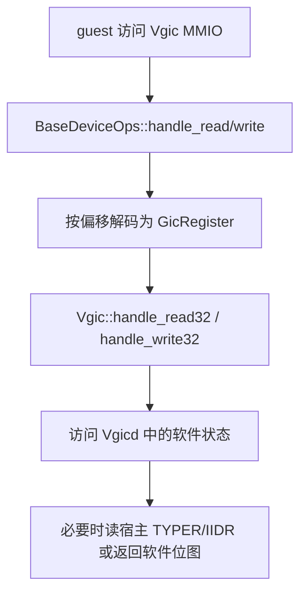
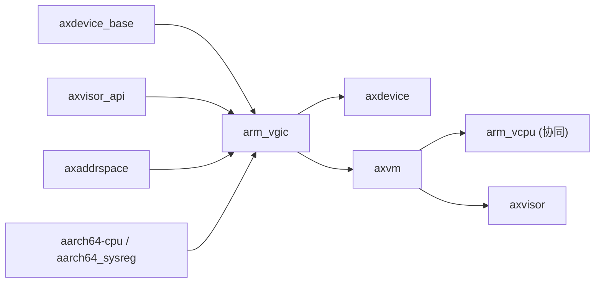
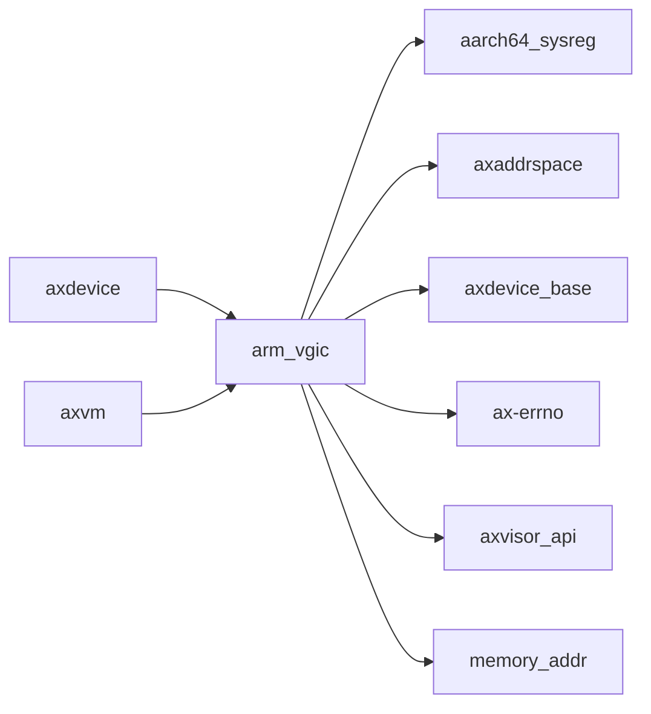

# `arm_vgic` 技术文档

> 路径：`components/arm_vgic`
> 类型：库 crate
> 分层：组件层 / 可复用基础组件
> 版本：`0.2.1`
> 文档依据：`Cargo.toml`、`README.md`、`src/lib.rs`、`src/vgic.rs`、`src/vgicd.rs`、`src/interrupt.rs`、`src/devops_impl.rs`、`src/consts.rs`、`src/registers.rs`、`src/vtimer/*`、`src/v3/*`

`arm_vgic` 是 ARM 虚拟中断控制器相关组件集合。它既包含面向 guest 的 GIC MMIO 设备实现，也包含虚拟定时器系统寄存器设备，以及可选的 GICv3 透传/窗口模型。它不是完整的“所有中断虚拟化逻辑都在这里”的单体，而是与 `arm_vcpu`、`axvm`、`axdevice`、`axvisor_api` 明确分工的组件。

## 1. 架构设计分析
### 1.1 设计定位
`arm_vgic` 的职责可以概括为“两类虚拟设备 + 一层状态建模”：

- 一类是 guest 可见的 GIC MMIO 设备窗口，如 `Vgic`、`VGicD`、`VGicR`、`Gits`。
- 一类是 guest 可见的系统寄存器设备，如虚拟物理定时器 `CNTP_*` 设备。
- 中间层则是软件维护的中断元数据、寄存器解码和若干宿主 GIC 访问/屏蔽逻辑。

但它 **不** 完整负责：

- vCPU 进入/退出生命周期，这属于 `arm_vcpu`。
- 虚拟中断最终注入执行，这一动作已由 `arm_vcpu` / `axvisor_api` 承担。
- 全量 GIC 寄存器行为建模，当前实现范围明显小于 README 中较强的宣传语。

### 1.2 内部模块划分
- `src/lib.rs`：crate 入口与按 feature 导出，统一 `api_reexp` 的宿主 GIC / 注入接口。
- `src/vgic.rs`：精简 GICv2 风格 MMIO 设备主对象 `Vgic`。
- `src/vgicd.rs`：GIC distributor 软件状态，维护 `Vgicd`、`VgicInt` 与若干寄存器读写行为。
- `src/interrupt.rs`：中断元数据定义，包括中断类型、状态与 enable/trigger 属性。
- `src/registers.rs`：大量 GICD 偏移到 `GicRegister` 的地址解码表。
- `src/devops_impl.rs`：为 `Vgic` 实现 `BaseDeviceOps`，把 guest MMIO 访问映射到读写方法。
- `src/consts.rs`：VGIC 相关常量、向量边界和寄存器偏移。
- `src/vtimer/*`：虚拟定时器系统寄存器设备，包括 `CNTP_CTL_EL0`、`CNTPCT_EL0`、`CNTP_TVAL_EL0`。
- `src/v3/*`：GICv3 路径，实现 `VGicD`、`VGicR`、`Gits` 及其 MMIO 辅助逻辑。

### 1.3 关键数据结构与对象
- `Vgic`：对外最直接的 GIC MMIO 设备对象，内部持有 `Mutex<Vgicd>`。
- `Vgicd`：保存 distributor 核心状态，如 `ctrlr`、`typer`、`iidr` 和一组 `VgicInt`。
- `VgicInt` / `Interrupt`：每个虚拟中断的元数据，包括 enable、status、priority、trigger、vcpu 等。
- `GicRegister`：寄存器地址解码结果，用于把 guest MMIO 地址映射到软件处理逻辑。
- `VGicD` / `VGicR` / `Gits`：`vgicv3` feature 下的 GICv3 设备实现。
- `SysCntpCtlEl0`、`SysCntpctEl0`、`SysCntpTvalEl0`：虚拟定时器系统寄存器设备。

### 1.4 设备建模与访问主线
#### GICv2 风格 `Vgic`
`Vgic` 的读写主线大致如下：



当前实现里：

- `GicdCtlr`、`GicdTyper`、`GicdIidr`、`Isenabler` 等少量寄存器有明确行为。
- 大量寄存器枚举虽然已经定义，但尚未完全落到真实行为分支里。

#### GICv3 路径
启用 `vgicv3` 后，`VGicD` / `VGicR` / `Gits` 提供的是一种“带掩码的宿主窗口”模型：

- `VGicD` 会维护 `assigned_irqs` 位图，只允许 guest 访问被分配的 SPI。
- `VGicR` 面向每个 vCPU 暴露 GICR 窗口。
- `Gits` 负责 ITS/LPI 相关窗口，但当前实现仍带有明显的场景限制和 TODO。

### 1.5 虚拟中断注入与 vCPU 的分工
这是阅读 `arm_vgic` 时最容易误解的地方：

- `arm_vgic` 负责 **设备建模** 和 **寄存器/状态管理**。
- 真正的“把某个虚拟中断注入到正在运行的 guest vCPU”动作，当前已经迁到 `arm_vcpu`，通过 `axvisor_api::arch::hardware_inject_virtual_interrupt()` 执行。
- `vtimer` 是一个例外中的例外：它在定时器到期回调里会直接请求注入 PPI 30，这是一条系统寄存器设备主动触发注入的路径。

因此，这个 crate 更像“虚拟 GIC 设备层”，而不是“完整的虚拟中断执行层”。

### 1.6 已知范围与实现边界
和 README 的表述相比，源码里能明确看到几处边界：

- GICv2 路径并未实现所有寄存器行为。
- GICv3 路径仍存在多处 `todo!()` 或有限覆盖。
- `fetch_irq()` 等接口当前更多偏遗留或预留，仓库内并无显著主线调用。

这意味着文档应准确描述“当前实现已覆盖的路径”，而不是泛称“完整 VGIC 实现”。

## 2. 核心功能说明
### 2.1 主要功能
- 提供 guest 可见的 GIC MMIO 设备对象。
- 提供虚拟定时器系统寄存器设备。
- 提供 GICv3 路径下的 distributor / redistributor / ITS 窗口模型。
- 维护软件中断元数据与寄存器访问约束。

### 2.2 关键 API 与使用场景
- `Vgic::new()`：构造最基础的虚拟 GIC MMIO 设备。
- `VGicD::new()`、`VGicR::new()`、`Gits::new()`：GICv3 路径设备构造。
- `VGicD::assign_irq()`：把 SPI 分配给 guest 并同步设置宿主路由。
- `vtimer::get_sysreg_device()`：返回可注册给 VM 的虚拟定时器系统寄存器设备列表。

### 2.3 典型使用方式
它通常不会被 VMM 直接手写寄存器访问，而是由 `axdevice` / `axvm` 挂进 VM：

```rust
let gic = arm_vgic::Vgic::new();
let sysregs = arm_vgic::vtimer::get_sysreg_device();
```

更常见的真实调用方是 `axdevice` 的设备装配和 `axvm` 的系统寄存器设备注册逻辑。

## 3. 依赖关系图谱


### 3.1 关键直接依赖
- `axdevice_base`：提供设备对象基础 trait。
- `axvisor_api`：提供宿主 GIC 基址读取、寄存器读取和虚拟中断注入接口。
- `axaddrspace`、`memory_addr`：服务 GPA / 地址区间相关逻辑。
- `aarch64-cpu`、`aarch64_sysreg`、`tock-registers`：服务寄存器访问与位域语义。

### 3.2 关键直接消费者
- `axdevice`：负责把 `Vgic`、`VGicD`、`VGicR`、`Gits` 挂成 guest 可见设备。
- `axvm`：负责把 vtimer 系统寄存器设备挂进 VM，并在 GICv3 路径中处理 passthrough SPI 分配。

### 3.3 间接消费者
- `arm_vcpu`：并不直接依赖本 crate 的类型，但和它共同组成 ARM 虚拟中断主线。
- `axvisor`：通过 `axvm` / `axdevice` 间接复用这套 ARM 虚拟 GIC 设备栈。

## 4. 开发指南
### 4.1 依赖配置
```toml
[dependencies]
arm_vgic = { workspace = true, features = ["vgicv3"] }
```

是否需要 `vgicv3` 取决于 guest 设备模型与宿主 GIC 形态，不是默认必选。

### 4.2 开发与修改约束
1. 修改 `Vgic` / `Vgicd` 前，要明确这是“软件状态模拟”还是“宿主寄存器透传”。
2. 修改 vtimer 路径时，要同步评估它与 `arm_vcpu` 注入逻辑之间的边界。
3. 修改 GICv3 路径时，要同步检查 `assigned_irqs` 位图与 guest 可访问寄存器范围是否一致。
4. 文档和代码都应显式标出 `todo!()` 尚未覆盖的寄存器路径，避免上层误把“可编译”当成“完整可用”。

### 4.3 关键开发建议
- 对 GICv2 路径，优先补清 guest 实际会访问的最小寄存器集合，而不是盲目扩大全部枚举。
- 对 GICv3 路径，优先验证 passthrough 场景是否真的只需要“分配位图 + 宿主窗口掩码”这套模型。
- 对注入路径，保持“设备建模在 `arm_vgic`、执行注入在 `arm_vcpu`”这一边界，不要重新耦合回单体设计。

## 5. 测试策略
### 5.1 当前测试形态
该 crate 几乎没有完善的 crate 内单元测试，且部分路径仍含 `todo!()`。

### 5.2 单元测试重点
- `GicRegister::from_addr()` 的地址解码正确性。
- `Vgicd` 中 enable 位与中断元数据更新逻辑。
- `VGicD::irq_masked_read/write()` 与 `assigned_irqs` 位图语义。
- vtimer 对 `CNTP_*` 访问的读写行为。

### 5.3 集成测试重点
- Axvisor + aarch64 场景下的 guest GIC 访问。
- vtimer 到期后对虚拟中断注入链路的验证。
- GICv3 passthrough SPI 分配和 guest 可见寄存器访问验证。
- 触发那些当前有 `todo!()` 的偏移前，应先有明确的实现覆盖计划。

### 5.4 覆盖率要求
- 对 `arm_vgic`，重点是“guest 可见寄存器行为覆盖率”。
- 至少应覆盖 distributor 基本读写、vtimer 路径和一条 GICv3 窗口主线。
- 任何新增寄存器支持都应增加对应访问测试，不应只靠编译通过。

## 6. 跨项目定位分析
### 6.1 ArceOS
`arm_vgic` 不属于普通 ArceOS 内核路径，而是基于 ArceOS 宿主能力构建 hypervisor 时的虚拟设备组件。它更多站在“宿主上的虚拟设备层”而不是“一般内核子系统层”。

### 6.2 StarryOS
当前仓库里 StarryOS 并没有直接依赖 `arm_vgic`。因此它在 StarryOS 中更像潜在可复用组件，而不是现有主线路径的一部分。

### 6.3 Axvisor
`arm_vgic` 是 Axvisor ARM 虚拟化栈中的关键设备组件之一。`axdevice` 负责把它挂进 VM，`axvm` 负责更高层装配，`arm_vcpu` 负责执行态注入，三者共同构成 ARM guest 中断虚拟化主线。
# `arm_vgic` 技术文档

> 路径：`components/arm_vgic`
> 类型：库 crate
> 分层：组件层 / 可复用基础组件
> 版本：`0.2.1`
> 文档依据：当前仓库源码、`Cargo.toml` 与 `components/arm_vgic/README.md`

`arm_vgic` 的核心定位是：ARM Virtual Generic Interrupt Controller (VGIC) implementation.

## 1. 架构设计分析
- 目录角色：可复用基础组件
- crate 形态：库 crate
- 工作区位置：根工作区
- feature 视角：主要通过 `vgicv3` 控制编译期能力装配。
- 关键数据结构：可直接观察到的关键数据结构/对象包括 `Vgic`、`Interrupt`、`VgicInt`、`Vgicd`、`TriggerMode`、`InterruptType`、`InterruptStatus`、`GicRegister`。
- 设计重心：该 crate 多数是寄存器级或设备级薄封装，复杂度集中在 MMIO 语义、安全假设和被上层平台/驱动整合的方式。

### 1.1 内部模块划分
- `devops_impl`：内部子模块
- `vgic`：内部子模块
- `consts`：内部子模块
- `interrupt`：中断分发与处理器注册逻辑
- `registers`：内部子模块
- `vgicd`：内部子模块
- `vtimer`：内部子模块
- `v3`：GICv3 ITS (Interrupt Translation Service) implementation（按 feature: vgicv3 条件启用）

### 1.2 核心算法/机制
- 中断控制器状态编排与虚拟中断注入
- 中断注册、派发和屏蔽控制
- 定时器触发、截止时间维护和延迟队列

## 2. 核心功能说明
- 功能定位：ARM Virtual Generic Interrupt Controller (VGIC) implementation.
- 对外接口：从源码可见的主要公开入口包括 `read_vgicd_iidr`、`read_vgicd_typer`、`get_host_gicd_base`、`get_host_gicr_base`、`hardware_inject_virtual_interrupt`、`new`、`handle_read32`、`handle_write8`、`Vgic`、`Interrupt` 等（另有 6 个公开入口）。
- 典型使用场景：提供寄存器定义、MMIO 访问或设备级操作原语，通常被平台 crate、驱动聚合层或更高层子系统进一步封装。
- 关键调用链示例：按当前源码布局，常见入口/初始化链可概括为 `new()`。

## 3. 依赖关系图谱


### 3.1 直接与间接依赖
- `aarch64_sysreg`
- `axaddrspace`
- `axdevice_base`
- `ax-errno`
- `axvisor_api`
- `memory_addr`

### 3.2 间接本地依赖
- `axvisor_api_proc`
- `axvmconfig`
- `crate_interface`
- `ax-lazyinit`
- `ax-memory-set`
- `ax-page-table-entry`
- `ax-page-table-multiarch`

### 3.3 被依赖情况
- `axdevice`
- `axvm`

### 3.4 间接被依赖情况
- `axvisor`

### 3.5 关键外部依赖
- `aarch64-cpu`
- `bitmaps`
- `log`
- `spin`
- `tock-registers`

## 4. 开发指南
### 4.1 依赖配置
```toml
[dependencies]
arm_vgic = { workspace = true }

# 如果在仓库外独立验证，也可以显式绑定本地路径：
# arm_vgic = { path = "components/arm_vgic" }
```

### 4.2 初始化流程
1. 先明确该设备/寄存器组件的调用上下文，是被平台 crate 直接使用还是被驱动聚合层再次封装。
2. 修改寄存器位域、初始化顺序或中断相关逻辑时，应同步检查 `unsafe` 访问、访问宽度和副作用语义。
3. 尽量通过最小平台集成路径验证真实设备行为，而不要只依赖静态接口检查。

### 4.3 关键 API 使用提示
- 优先关注函数入口：`read_vgicd_iidr`、`read_vgicd_typer`、`get_host_gicd_base`、`get_host_gicr_base`、`hardware_inject_virtual_interrupt`、`new`、`handle_read32`、`handle_write8` 等（另有 9 项）。
- 上下文/对象类型通常从 `Vgic`、`Interrupt`、`VgicInt`、`Vgicd` 等结构开始。

## 5. 测试策略
### 5.1 当前仓库内的测试形态
- 当前 crate 目录中未发现显式 `tests/`/`benches/`/`fuzz/` 入口，更可能依赖上层系统集成测试或跨 crate 回归。

### 5.2 单元测试重点
- 建议覆盖寄存器位域、设备状态转换、边界参数和 `unsafe` 访问前提。

### 5.3 集成测试重点
- 建议结合最小平台或驱动集成路径验证真实设备行为，重点检查初始化、中断和收发等主线。

### 5.4 覆盖率要求
- 覆盖率建议：寄存器访问辅助函数和关键状态机保持高覆盖；真实硬件语义以集成验证补齐。

## 6. 跨项目定位分析
### 6.1 ArceOS
当前未检测到 ArceOS 工程本体对 `arm_vgic` 的显式本地依赖，若参与该系统，通常经外部工具链、配置或更底层生态间接体现。

### 6.2 StarryOS
当前未检测到 StarryOS 工程本体对 `arm_vgic` 的显式本地依赖，若参与该系统，通常经外部工具链、配置或更底层生态间接体现。

### 6.3 Axvisor
`arm_vgic` 主要通过 `axvisor` 等上层 crate 被 Axvisor 间接复用，通常处于更底层的公共依赖层。
