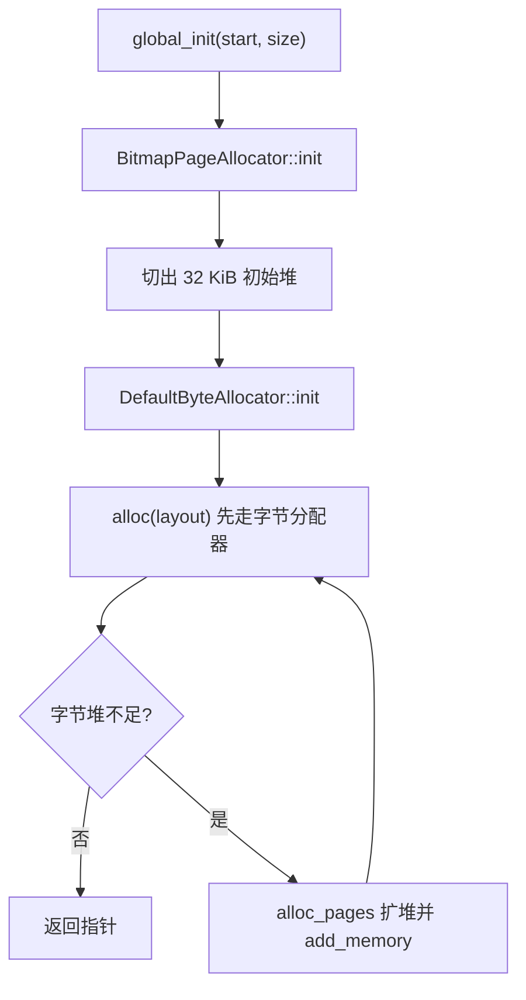
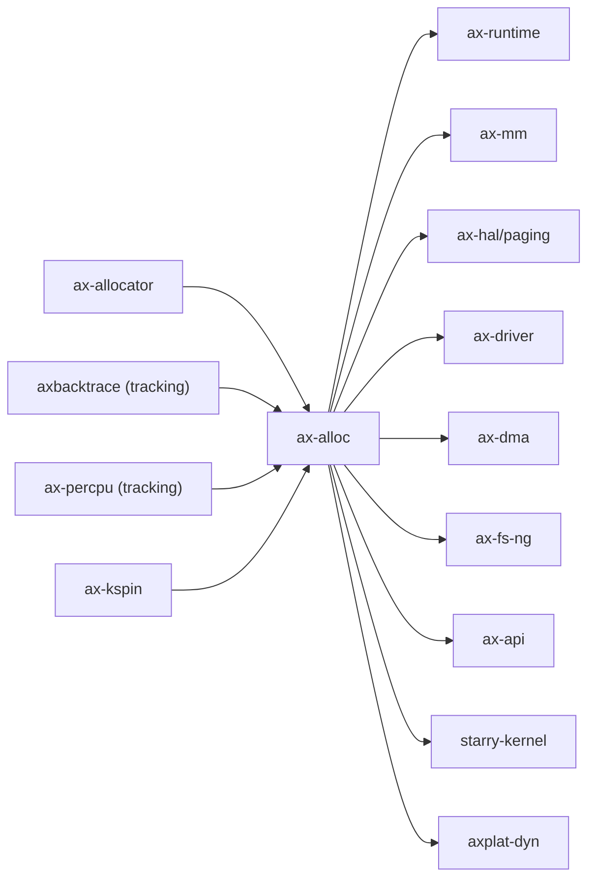

# `ax-alloc` 技术文档

> 路径：`os/arceos/modules/axalloc`
> 类型：库 crate
> 分层：ArceOS 层 / 内存分配运行时基础件
> 版本：`0.3.0-preview.3`
> 文档依据：`Cargo.toml`、`README.md`、`src/lib.rs`、`src/default_impl.rs`、`src/axvisor_impl.rs`、`src/page.rs`、`src/tracking.rs`

`ax-alloc` 是 ArceOS 的全局分配入口。它把 `ax-allocator` 提供的字节分配器和页分配器包装成可直接挂到 `#[global_allocator]` 的 `GlobalAllocator`，并额外提供页级接口、使用量统计和可选的分配跟踪能力。它属于运行时叶子基础件：负责“分配”，但不负责页表建立、地址空间管理或物理内存发现，这些职责分别由 `ax-mm`、`ax-hal` 和 `ax-runtime` 承担。

## 1. 架构设计分析
### 1.1 设计定位
`ax-alloc` 在启动链和运行期之间扮演的是“统一分配服务”角色：

- 向下，它复用 `ax-allocator` 或 `buddy-slab-allocator`，而不是自行实现完整分配算法。
- 向上，它向 `ax-runtime`、`ax-mm`、`ax-hal::paging`、`ax-driver`、`ax-dma`、`ax-api` 等模块暴露统一的堆/页分配接口。
- 横向，它通过 `UsageKind`/`Usages` 给页表、DMA、页缓存等不同用途打标签，方便上层做统计与诊断。

因此，`ax-alloc` 不是“内存管理本体”，而是“内存分配入口”。把它写成虚拟内存系统、页表系统或用户地址空间管理器，都会高估它的职责。

### 1.2 内部模块划分
- `src/lib.rs`：顶层 feature 分流与公共类型定义。声明 `UsageKind`、`Usages`，并在默认实现与 `hv` 实现之间切换。
- `src/default_impl.rs`：默认 ArceOS 路径。把字节分配器与位图页分配器组合成全局分配器。
- `src/axvisor_impl.rs`：虚拟化路径。改用 `buddy-slab-allocator`，并支持地址翻译器与 DMA32 页分配。
- `src/page.rs`：`GlobalPage` RAII 封装，负责简单的连续页所有权管理。
- `src/tracking.rs`：可选分配跟踪状态，记录 `Layout`、`Backtrace` 和分配代次。

### 1.3 关键对象
- `GlobalAllocator`：真正实现 `core::alloc::GlobalAlloc` 的核心对象。
- `DefaultByteAllocator`：由 `tlsf` / `slab` / `buddy` feature 选择的字节分配器别名。
- `BitmapPageAllocator<PAGE_SIZE>`：默认路径的页级后端。
- `UsageKind`：把内存使用划分为 `RustHeap`、`VirtMem`、`PageCache`、`PageTable`、`Dma`、`Global`。
- `Usages`：各类用途的累计统计。
- `GlobalPage`：页块 RAII 包装，只负责申请/释放连续页，不负责映射属性。
- `AllocationInfo`：只在 `tracking` 下存在的诊断元数据。

### 1.4 默认实现主线
默认路径采用“字节分配器 + 页分配器”的两级设计：



实现里的关键约束有：

- `global_init()` 只负责建立第一段可分配区域；后续热插入或额外区域接入走 `global_add_memory()`。
- 默认两级模式下，`alloc()` 会根据当前堆大小和申请大小动态决定扩堆块大小，再从页分配器取页补给字节分配器。
- `level-1` feature 会退化为单级字节分配器，此时 `alloc_pages_at()` 明确 `unimplemented!()`。
- 对 `UsageKind::RustHeap` 的统计有特判，避免“扩堆用页”和“堆内字节分配”重复记账。

### 1.5 `hv` 与 `tracking` 分支
- `hv`：忽略 `ax-allocator` 的算法 feature，转而使用 `buddy-slab-allocator`。`global_init()` 需要额外注入 `AddrTranslator`，并暴露 `alloc_dma32_pages()`。当前这一路径的 `used_bytes()`、`available_bytes()`、`used_pages()`、`available_pages()` 都返回 `0`，因为底层库没有提供对应统计。
- `tracking`：在 `GlobalAlloc::alloc/dealloc` 外围维护一个全局分配表，并记录 `axbacktrace::Backtrace`。`tracking::with_state()` 用每 CPU 的 `IN_GLOBAL_ALLOCATOR` 标记避免跟踪逻辑再次触发分配而递归爆栈。

## 2. 核心功能说明
### 2.1 主要功能
- 为系统提供可挂到 `#[global_allocator]` 的全局堆分配器。
- 提供页级接口 `alloc_pages()` / `alloc_pages_at()` / `dealloc_pages()`。
- 提供 `GlobalPage` 这一轻量页所有权对象。
- 提供按用途分类的使用量统计，以及可选的 backtrace 跟踪。

### 2.2 关键 API 与真实使用位置
- `global_init()` / `global_add_memory()`：由 `ax-runtime/src/lib.rs` 的 `init_allocator()` 调用，是 ArceOS 启动期接入堆的入口。
- `global_allocator().alloc_pages()`：被 `ax-mm/src/backend/alloc.rs`、`ax-hal/src/paging.rs` 等页级消费者直接使用。
- `global_allocator().alloc()` / `dealloc()`：被 `ax-api/src/imp/mem.rs` 直接转发给更上层 API。
- `GlobalPage::alloc*()`：适合需要“拿到一段连续页并在 drop 时自动归还”的简单路径。

### 2.3 使用边界
- `ax-alloc` 不负责扫描物理内存，也不决定哪些区域可以加到堆里；这些输入由 `ax-runtime` 和 `ax-hal` 提供。
- `ax-alloc` 不负责地址映射策略；页表和地址空间对象依然在 `ax-mm` 层。
- `Usages` 是统计视图，不是安全边界或配额系统。

## 3. 依赖关系图谱


### 3.1 关键直接依赖
- `ax-allocator`：默认路径的算法库来源。
- `ax-kspin`：保护全局分配器内部状态。
- `ax-errno`：把页对象和分配失败映射到 ArceOS 错误码。
- `axbacktrace`、`ax-percpu`：只在 `tracking` 下参与分配跟踪。
- `buddy-slab-allocator`：只在 `hv` 下启用。

### 3.2 关键直接消费者
- `ax-runtime`：启动期初始化全局分配器。
- `ax-mm`、`ax-hal`：页级分配的主要消费者。
- `ax-driver`、`ax-dma`、`ax-fs-ng`：驱动、DMA、文件缓存等运行期场景。
- `ax-api` / `ax-posix-api`：向上层 API 暴露堆能力。
- `starry-kernel`：可复用其 tracking 和页/堆分配能力。

## 4. 开发指南
### 4.1 依赖配置
```toml
[dependencies]
ax-alloc = { workspace = true }
```

对大多数上层模块来说，更常见的接入方式是通过 `ax-runtime`、`ax-api` 或其他运行时聚合层间接使用，而不是直接把 `ax-alloc` 当业务库调用。

### 4.2 修改时的关键约束
1. 修改 `global_init()` 或扩堆逻辑时，要同时检查默认路径与 `hv` 路径是否保持语义一致。
2. 修改 `UsageKind` 或统计规则时，要避免默认两级分配里的双重记账。
3. 若调整 `GlobalPage`，必须坚持它只是“分配到的连续页块”所有权对象，不能把映射、cache 属性或 IOMMU 语义塞进来。
4. 若新增 feature，需要同步检查 `ax-feat` 与 `ax-runtime` 的 feature 传播是否正确。

### 4.3 开发建议
- “算法选择”优先放在 `ax-allocator` 层，`ax-alloc` 更适合做全局装配。
- “地址空间策略”应放在 `ax-mm` 或更上层，而不是让 `ax-alloc` 变成第二个内存管理器。
- 需要定位泄漏或大户时优先用 `tracking`，不要在分配快路径堆太多日志。

## 5. 测试策略
### 5.1 当前测试形态
`ax-alloc` 本体没有独立的 crate 内测试，当前验证主要依赖：

- `ax-allocator` 自身的算法测试与压力测试。
- `ax-runtime` 启动链对 `global_init()` 的真实调用。
- `StarryOS/kernel/src/pseudofs/dev/memtrack.rs` 对 tracking 路径的系统级消费。

### 5.2 单元测试重点
- `level-1` 与默认两级模式的差异分支。
- `alloc_pages_at()`、`GlobalPage` 的边界行为。
- `tracking::with_state()` 的递归保护。
- `hv` 路径下地址翻译器和 DMA32 页分配。

### 5.3 集成测试重点
- ArceOS 正常启动并完成 `ax-runtime` 堆初始化。
- `ax-mm` / `ax-hal` 的页级消费者能稳定拿到页块。
- tracking 打开后 memtrack 结果与实际分配行为一致。
- Axvisor 的 `hv` 组合下分配器初始化与地址翻译可用。

### 5.4 覆盖率要求
- 对 `ax-alloc`，比单纯行覆盖率更重要的是 feature 组合覆盖。
- 至少应覆盖当前实际启用的字节分配算法，以及 `tracking`、`hv`、`level-1` 这些高风险分支。

## 6. 跨项目定位分析
### 6.1 ArceOS
`ax-alloc` 是 ArceOS 运行时里的标准全局分配模块。它直接服务 `ax-runtime`、`ax-mm`、`ax-hal`、驱动和 API 层，是系统从“知道有哪些内存区域”走到“可以分配内存”的关键一环。

### 6.2 StarryOS
StarryOS 复用 `ax-alloc` 作为共享堆/页分配基础，并在 `memtrack` 场景中消费其 tracking 能力。因此它在 StarryOS 中仍是叶子基础件，而不是 Linux 兼容内存子系统本体。

### 6.3 Axvisor
Axvisor 通过 `hv` 路径复用 `ax-alloc`，重点是地址翻译友好的宿主侧分配。它承担的是 Hypervisor 运行时分配服务，不是 guest 物理内存管理器或二级页表策略层。
