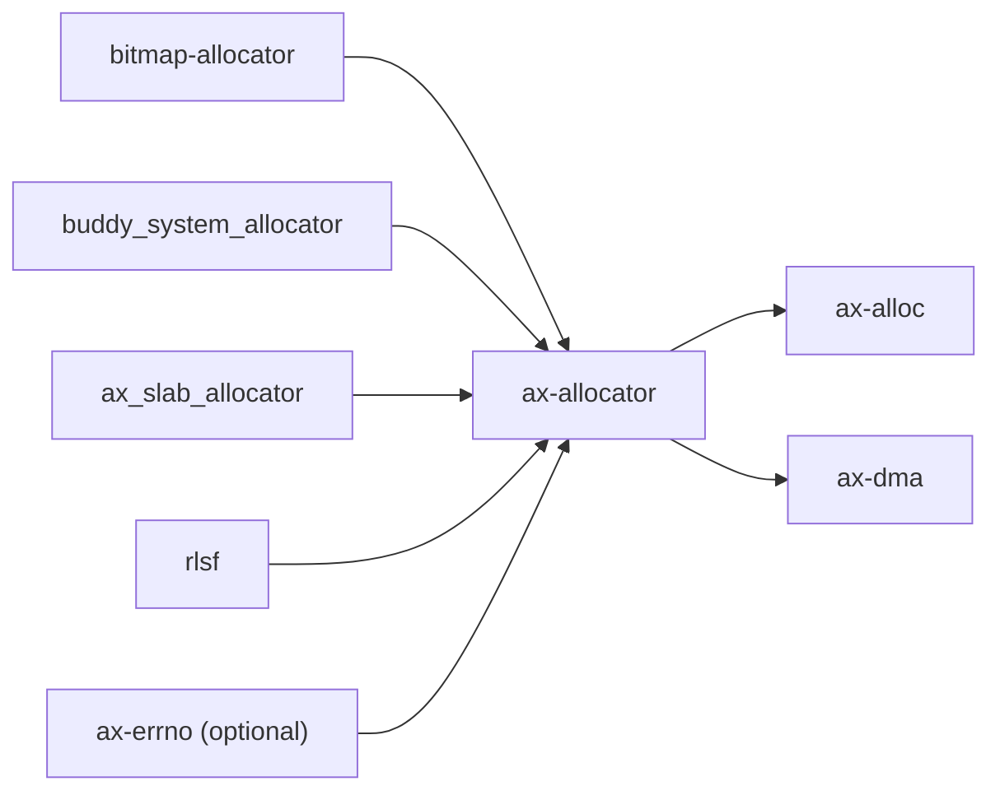

# `ax-allocator` 技术文档

> 路径：`components/axallocator`
> 类型：库 crate
> 分层：组件层 / 分配算法基础件
> 版本：`0.2.0`
> 文档依据：`Cargo.toml`、`README.md`、`src/lib.rs`、`src/bitmap.rs`、`src/buddy.rs`、`src/slab.rs`、`src/tlsf.rs`、`tests/allocator.rs`

`ax-allocator` 是一个“统一接口下的多种分配算法库”。它提供页级、字节级和 ID 分配的 trait 与若干实现，供 `ax-alloc`、`ax-dma` 等上层模块挑选和组合。它属于叶子基础件：负责算法和接口，不负责全局分配器注册、锁保护、内存发现或地址空间策略。

## 1. 架构设计分析
### 1.1 设计定位
`ax-allocator` 解决的是“如何把不同分配算法放到同一套接口下复用”：

- 通过 `BaseAllocator`、`ByteAllocator`、`PageAllocator`、`IdAllocator` 定义统一抽象。
- 通过 feature 选择具体算法实现，而不是在运行时做动态分派。
- 通过可选 `allocator_api` 适配 nightly `Allocator` trait，便于在主机侧做压力测试。

因此，这个 crate 不是全局分配器，也不是内存管理器；它更像“可插拔分配算法工具箱”。

### 1.2 模块划分
- `src/lib.rs`：公共 trait、错误类型、feature 导出，以及 `AllocatorRc` 适配器。
- `src/bitmap.rs`：基于 `bitmap-allocator` 的页级分配实现。
- `src/buddy.rs`：对 `buddy_system_allocator` 的薄包装。
- `src/slab.rs`：对 `ax_slab_allocator` 的薄包装。
- `src/tlsf.rs`：对 `rlsf` 的 TLSF 实现包装。

### 1.3 关键接口与实现
- `BaseAllocator`：定义 `init()` 与 `add_memory()` 两个基础入口。
- `ByteAllocator`：字节级申请/释放与统计接口。
- `PageAllocator`：页级申请/释放、定点页分配和页统计接口。
- `IdAllocator`：唯一 ID 分配接口；当前仓库里接口已定义，但本 crate 里没有现成实现。
- `AllocError` / `AllocResult`：统一错误模型；启用 `ax-errno` 后可转换成 `AxError`。

### 1.4 具体算法特征
- `BitmapPageAllocator<const PAGE_SIZE: usize>`：
  - 适合页级位图管理。
  - 支持 `alloc_pages()` 与 `alloc_pages_at()`。
  - 容量由 `page-alloc-256m` / `4g` / `64g` / `1t` feature 决定。
  - `add_memory()` 当前明确不支持，直接返回 `AllocError::NoMemory`。
- `BuddyByteAllocator`：
  - 基于 `buddy_system_allocator::Heap<32>`。
  - 优点是简单直接，能给出总量/已用统计。
- `SlabByteAllocator`：
  - 适合固定对象尺寸较多的场景。
  - 通过 `Option<Heap>` 保存底层实例，必须先 `init()`。
- `TlsfByteAllocator`：
  - 使用 `rlsf::Tlsf<'static, u32, u32, 28, 32>`。
  - 通过 `multilevel segregated fit` 追求稳定分配复杂度。
  - 手工维护 `total_bytes` 与 `used_bytes` 统计。

## 2. 核心功能说明
### 2.1 主要功能
- 提供统一的分配 trait，隔离上层代码和具体算法实现。
- 提供位图页分配、buddy、slab、TLSF 四类现成实现。
- 提供 `AllocatorRc<A>`，方便用标准容器在主机环境直接压测字节分配器。

### 2.2 关键 API
- `BaseAllocator::init()` / `add_memory()`：初始化或扩展内存池。
- `ByteAllocator::alloc()` / `dealloc()`：字节级分配。
- `PageAllocator::alloc_pages()` / `alloc_pages_at()` / `dealloc_pages()`：页级分配。
- `AllocatorRc::new()`：把某个 `ByteAllocator` 包装成实现 `core::alloc::Allocator` 的对象，仅在 `allocator_api` 下存在。

### 2.3 使用边界
- 这个 crate 不提供锁；多核/多任务并发访问时，调用者必须自己加锁。
- 这个 crate 不负责全局单例；`#[global_allocator]` 的装配在 `ax-alloc` 层。
- 这个 crate 不负责验证内存池来源是否合法；`init()` / `add_memory()` 默认信任调用者提供的地址区间。

## 3. 依赖关系图谱


### 3.1 关键直接依赖
- `bitmap-allocator`：页级位图分配核心。
- `buddy_system_allocator`：buddy 字节分配核心。
- `ax_slab_allocator`：slab 分配核心。
- `rlsf`：TLSF 分配核心。
- `ax-errno`：可选错误桥接层。

### 3.2 关键直接消费者
- `ax-alloc`：默认全局分配器装配层。
- `ax-dma`：DMA 内存场景中直接使用字节分配 trait 和错误类型。

## 4. 开发指南
### 4.1 依赖配置
```toml
[dependencies]
ax-allocator = { workspace = true, features = ["bitmap", "tlsf"] }
```

是否启用 `bitmap`、`buddy`、`slab`、`tlsf`，应由具体上层模块的使用场景决定。

### 4.2 修改时的关键约束
1. 如果扩展某个 trait，必须同步检查 `ax-alloc`、`ax-dma` 等现有消费者是否需要适配。
2. `BitmapPageAllocator` 的地址/对齐规则比较严格，修改初始化逻辑时要同时保住容量上界和 `MAX_ALIGN_1GB` 约束。
3. `AllocatorRc` 只是一层测试/适配包装，不应把正式内核路径的策略塞进去。
4. 若新增算法实现，应先判断它属于字节级、页级还是 ID 级，再决定实现哪个 trait，而不是硬往现有 trait 里塞特例。

### 4.3 开发建议
- 需要“全局装配”时去改 `ax-alloc`，不要把 `ax-allocator` 写成第二个运行时模块。
- 需要“并发保护”时去用 `ax-kspin`/`ax-sync`，不要在算法实现里偷偷引入全局锁。
- 需要“错误码落到 OS 语义”时用 `ax-errno` feature；纯算法测试可直接用 `AllocError`。

## 5. 测试策略
### 5.1 当前测试形态
`ax-allocator` 的测试覆盖在这批基础件里算比较完整：

- `src/bitmap.rs`：页级位图分配的单元测试。
- `tests/allocator.rs`：用 `Vec`、`BTreeMap`、对齐随机申请等场景同时压测 buddy/slab/TLSF。
- `benches/collections.rs`：基准测试不同算法在容器场景下的表现。

### 5.2 单元测试重点
- 页级对齐、定点页分配、容量边界。
- 各字节分配器的统计值与回收语义。
- `AllocError` 到 `AxError` 的桥接行为。

### 5.3 集成测试重点
- 通过 `ax-alloc` 验证算法在真实 `#[global_allocator]` 场景下仍成立。
- 通过 `ax-dma` 验证对 `AllocResult`、`ByteAllocator` trait 的直接复用不回归。

### 5.4 覆盖率要求
- 不同算法至少各有一条“初始化 -> 申请 -> 回收 -> 统计”的完整覆盖。
- 任何改动 `bitmap` 容量 feature 或 `allocator_api` 适配层的变更，都应补对应测试。

## 6. 跨项目定位分析
### 6.1 ArceOS
在 ArceOS 中，`ax-allocator` 是 `ax-alloc` 和 `ax-dma` 的算法底座。它不直接参与系统 bring-up，而是为运行时分配层提供可选实现。

### 6.2 StarryOS
StarryOS 主要通过共享的 ArceOS 基础栈间接受用 `ax-allocator`。它在 StarryOS 里仍然是算法叶子件，而不是内核内存管理模块。

### 6.3 Axvisor
Axvisor 当前的 `ax-alloc/hv` 主路径会切换到 `buddy-slab-allocator`，因此 `ax-allocator` 并不是 Axvisor 全局分配的主后端。它更多通过共享基础模块或 DMA 相关路径间接参与。
