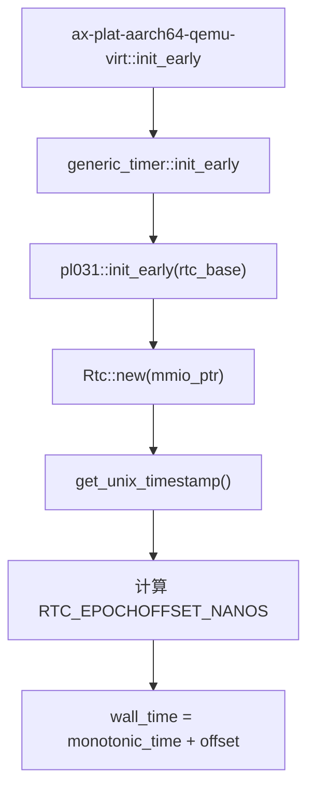

# `ax-arm-pl031` 技术文档

> 路径：`components/arm_pl031`
> 类型：库 crate
> 分层：组件层 / 可复用基础组件
> 版本：`0.2.1`
> 文档依据：`Cargo.toml`、`README.md`、`src/lib.rs`、`src/chrono.rs`

`ax-arm-pl031` 是 ARM PrimeCell PL031 RTC 的薄封装驱动。它不负责设备树、页表映射、GIC 接线或平台时间策略，而是把一组固定布局的 MMIO 寄存器包装成 `Rtc` 句柄和少量 Unix 时间戳读写接口，供更高层平台代码接入墙钟语义。

## 1. 架构设计分析
### 1.1 设计定位
这个 crate 的目标非常克制：

- 它只负责 PL031 寄存器级访问。
- 它对外暴露的是“秒级 Unix 时间戳”“匹配寄存器”“中断状态”这些最基础能力。
- 它并不试图实现完整 RTC 子系统，更不会自己决定 wall clock 与 monotonic clock 的组合策略。

因此，`ax-arm-pl031` 更适合被视为“平台时间源的寄存器级基础组件”，而不是“通用时钟框架”。

### 1.2 内部模块划分
- `src/lib.rs`：核心实现。定义寄存器布局 `Registers`、设备句柄 `Rtc` 以及所有 MMIO 读写方法。
- `src/chrono.rs`：在 `chrono` feature 下提供 `DateTime<Utc>` 风格的便捷封装。

### 1.3 关键数据结构与寄存器语义
- `Registers`：按 `#[repr(C, align(4))]` 定义的 PL031 MMIO 寄存器块。
- `Rtc`：对外唯一核心对象，内部只持有一个 `NonNull<Registers>` 指针。

`Rtc` 实际操作的主要寄存器包括：

- `DR`：当前 RTC 值。
- `MR`：匹配寄存器。
- `LR`：加载寄存器。
- `IMSC`：中断屏蔽/使能寄存器。
- `RIS`：原始中断状态。
- `MIS`：屏蔽后的中断状态。
- `ICR`：中断清除寄存器。

需要特别注意的是：结构体中虽然保留了 `CR` 字段，但当前公开 API 并未直接暴露对 `CR` 的操作。这意味着该 crate 假设硬件或更早的初始化阶段已经把设备置于可工作的状态。

### 1.4 在仓库中的实际使用主线
在本仓库里，`ax-arm-pl031` 最重要的真实接入路径不在它自己内部，而在 `ax-plat-aarch64-peripherals`：



也就是说，`ax-arm-pl031` 在平台栈中的主要角色不是“持续提供复杂时钟服务”，而是**在极早期读一次硬件墙钟，建立单调时间到真实墙钟的偏移量**。

### 1.5 安全与平台假设
`Rtc::new(base)` 的 `unsafe` 前提非常明确：

- 传入地址必须真的是 PL031 寄存器块。
- 该地址必须已经映射为正确的设备内存属性。
- 访问者需要自己保证没有错误别名和未定义并发访问。

此外，还存在几个隐含假设：

- 时间 API 以 `u32` 秒为单位，因此天然带有 32 位时间戳范围限制。
- `chrono` 路径里使用 `Utc.timestamp_opt(...).unwrap()`，在极端异常值下可能 panic。
- 若平台没有调用 `pl031::init_early()`，那么更高层墙钟偏移可能保持为 0。

## 2. 核心功能说明
### 2.1 主要功能
- 读取当前 Unix 时间戳。
- 设置当前 Unix 时间戳。
- 设置匹配时间戳。
- 查询匹配状态和中断状态。
- 使能、关闭和清除 RTC 中断。
- 在 `chrono` feature 下提供 `DateTime<Utc>` 风格接口。

### 2.2 关键 API 与使用场景
- `Rtc::new(base)`：构造 MMIO 句柄。
- `get_unix_timestamp()` / `set_unix_timestamp()`：最核心的时间读写 API。
- `set_match_timestamp()`：设置匹配中断阈值。
- `matched()` / `interrupt_pending()`：查询状态。
- `enable_interrupt()` / `clear_interrupt()`：中断控制。
- `get_time()` / `set_time()` / `set_match()`：`chrono` 风格便捷包装。

### 2.3 典型使用方式
最常见的使用方式是平台代码在知道 MMIO 基址后构造 `Rtc`：

```rust
let rtc = unsafe { ax_arm_pl031::Rtc::new(mmio_ptr) };
let secs = rtc.get_unix_timestamp();
let _ = secs;
```

在本仓库中，更高层通常不会长期持有 `Rtc` 做复杂操作，而是读取一次时间戳，再转成墙钟偏移。

## 3. 依赖关系图谱


### 3.1 关键直接依赖
- 默认情况下几乎只依赖 `core`。
- `chrono` 是可选依赖，用于提供更方便的时间表示层。

### 3.2 关键直接消费者
- `ax-plat-aarch64-peripherals`：这是本仓库中最重要的直接消费者，会在平台初始化时用 `Rtc` 标定墙钟偏移。

### 3.3 间接消费者
- `ax-plat-aarch64-qemu-virt` 在启用 `rtc` 时会间接使用。
- 通过 `axplat` / `ax-hal` 共享这条平台路径的 ArceOS 栈。
- StarryOS、Axvisor 的依赖图中可能间接出现该 crate，但是否实际启用取决于具体平台包与 feature 组合。

## 4. 开发指南
### 4.1 依赖配置
```toml
[dependencies]
ax-arm-pl031 = { workspace = true }
```

若需要 `chrono` 风格接口，可显式保留默认 feature 或手动启用 `chrono`。

### 4.2 使用与修改约束
1. `Rtc::new()` 只应在平台已经完成 MMIO 映射之后调用。
2. 若要新增对 `CR` 或更多寄存器的控制，需要先确认这是否属于该 crate 的职责，而不是应留在平台层。
3. 若修改时间单位或返回类型，必须同步评估 `ax-plat-aarch64-peripherals` 中墙钟偏移计算的影响。
4. 对 `chrono` 路径的修改要注意 `u32` 秒到 `DateTime<Utc>` 的转换边界。

### 4.3 关键开发建议
- 保持 `ax-arm-pl031` 继续作为薄封装，不要把平台策略下沉到这里。
- 平台层若需要高精度或组合时钟语义，应在更上层完成，而不是让 PL031 驱动本身承担。
- 若未来加入中断驱动路径，建议先补齐 `matched` / `pending` / `IMSC` / `ICR` 相关测试。

## 5. 测试策略
### 5.1 当前测试形态
`src/lib.rs` 已有基于模拟寄存器块的单元测试，用于验证 `DR` 读取与 `LR` 写入等基本行为。

### 5.2 单元测试重点
- `get_unix_timestamp()` / `set_unix_timestamp()` 对 `DR` / `LR` 的访问。
- `set_match_timestamp()`、`matched()`、`interrupt_pending()` 的寄存器位语义。
- `enable_interrupt()` 与 `clear_interrupt()` 对 `IMSC` / `ICR` 的更新。
- `chrono` 路径的边界转换行为。

### 5.3 集成测试重点
- 在 aarch64 QEMU virt + `rtc` feature 下验证墙钟偏移是否正确建立。
- 验证未调用 `pl031::init_early()` 的平台是否会维持 `epochoffset_nanos == 0`。

### 5.4 覆盖率要求
- 对 `ax-arm-pl031`，重点是寄存器行为覆盖率而不是复杂业务覆盖率。
- 至少要覆盖读、写、匹配、中断和 `chrono` 适配这五类路径。
- 若新增更多寄存器控制，应同步增加对应的模拟寄存器测试。

## 6. 跨项目定位分析
### 6.1 ArceOS
在 ArceOS 的 aarch64 平台路径中，`ax-arm-pl031` 主要承担“读取硬件墙钟、为平台建立 epoch 偏移”的角色，而不是完整的时钟子系统。

### 6.2 StarryOS
当前仓库中未看到 StarryOS 直接操作 `ax-arm-pl031` 的主线代码，因此它在 StarryOS 中更多是通过共享 `axplat` 平台栈间接参与，而不是显式核心依赖。

### 6.3 Axvisor
Axvisor 的依赖图可能会间接包含 `ax-arm-pl031`，但它更多体现为宿主平台栈的组成部分；如果 guest 设备树里也描述了 PL031，那是“客户机可见设备模型”的话题，不能与本 crate 在宿主 Rust 代码中的职责混为一谈。
# `ax-arm-pl031` 技术文档

> 路径：`components/arm_pl031`
> 类型：库 crate
> 分层：组件层 / 可复用基础组件
> 版本：`0.2.1`
> 文档依据：当前仓库源码、`Cargo.toml` 与 `components/arm_pl031/README.md`

`ax-arm-pl031` 的核心定位是：System Real Time Clock (RTC) Drivers for aarch64 based on PL031.

## 1. 架构设计分析
- 目录角色：可复用基础组件
- crate 形态：库 crate
- 工作区位置：根工作区
- feature 视角：主要通过 `chrono` 控制编译期能力装配。
- 关键数据结构：可直接观察到的关键数据结构/对象包括 `Registers`、`Rtc`。
- 设计重心：该 crate 多数是寄存器级或设备级薄封装，复杂度集中在 MMIO 语义、安全假设和被上层平台/驱动整合的方式。

### 1.1 内部模块划分
- `chrono`：内部子模块（按 feature: chrono 条件启用）

### 1.2 核心算法/机制
- 该 crate 的实现主要围绕顶层模块分工展开，重点在子系统边界、trait/类型约束以及初始化流程。

## 2. 核心功能说明
- 功能定位：System Real Time Clock (RTC) Drivers for aarch64 based on PL031.
- 对外接口：从源码可见的主要公开入口包括 `new`、`get_unix_timestamp`、`set_unix_timestamp`、`set_match_timestamp`、`matched`、`interrupt_pending`、`enable_interrupt`、`clear_interrupt`、`Registers`、`Rtc`。
- 典型使用场景：提供寄存器定义、MMIO 访问或设备级操作原语，通常被平台 crate、驱动聚合层或更高层子系统进一步封装。
- 关键调用链示例：按当前源码布局，常见入口/初始化链可概括为 `new()`。

## 3. 依赖关系图谱


### 3.1 直接与间接依赖
- 未检测到本仓库内的直接本地依赖；该 crate 可能主要依赖外部生态或承担叶子节点角色。

### 3.2 间接本地依赖
- 未检测到额外的间接本地依赖，或依赖深度主要停留在第一层。

### 3.3 被依赖情况
- `ax-plat-aarch64-peripherals`

### 3.4 间接被依赖情况
- `arceos-affinity`
- `ax-helloworld`
- `ax-helloworld-myplat`
- `ax-httpclient`
- `ax-httpserver`
- `arceos-irq`
- `arceos-memtest`
- `arceos-parallel`
- `arceos-priority`
- `ax-shell`
- `arceos-sleep`
- `arceos-wait-queue`
- 另外还有 `31` 个同类项未在此展开

### 3.5 关键外部依赖
- `chrono`

## 4. 开发指南
### 4.1 依赖配置
```toml
[dependencies]
ax-arm-pl031 = { workspace = true }

# 如果在仓库外独立验证，也可以显式绑定本地路径：
# ax-arm-pl031 = { path = "components/arm_pl031" }
```

### 4.2 初始化流程
1. 先明确该设备/寄存器组件的调用上下文，是被平台 crate 直接使用还是被驱动聚合层再次封装。
2. 修改寄存器位域、初始化顺序或中断相关逻辑时，应同步检查 `unsafe` 访问、访问宽度和副作用语义。
3. 尽量通过最小平台集成路径验证真实设备行为，而不要只依赖静态接口检查。

### 4.3 关键 API 使用提示
- 优先关注函数入口：`new`、`get_unix_timestamp`、`set_unix_timestamp`、`set_match_timestamp`、`matched`、`interrupt_pending`、`enable_interrupt`、`clear_interrupt` 等（另有 3 项）。
- 上下文/对象类型通常从 `Registers`、`Rtc` 等结构开始。

## 5. 测试策略
### 5.1 当前仓库内的测试形态
- 存在单元测试/`#[cfg(test)]` 场景：`src/lib.rs`。

### 5.2 单元测试重点
- 建议覆盖寄存器位域、设备状态转换、边界参数和 `unsafe` 访问前提。

### 5.3 集成测试重点
- 建议结合最小平台或驱动集成路径验证真实设备行为，重点检查初始化、中断和收发等主线。

### 5.4 覆盖率要求
- 覆盖率建议：寄存器访问辅助函数和关键状态机保持高覆盖；真实硬件语义以集成验证补齐。

## 6. 跨项目定位分析
### 6.1 ArceOS
`ax-arm-pl031` 主要通过 `arceos-affinity`、`ax-helloworld`、`ax-helloworld-myplat`、`ax-httpclient`、`ax-httpserver`、`arceos-irq` 等（另有 26 项） 等上层 crate 被 ArceOS 间接复用，通常处于更底层的公共依赖层。

### 6.2 StarryOS
`ax-arm-pl031` 主要通过 `starry-kernel`、`starryos`、`starryos-test` 等上层 crate 被 StarryOS 间接复用，通常处于更底层的公共依赖层。

### 6.3 Axvisor
`ax-arm-pl031` 主要通过 `axvisor` 等上层 crate 被 Axvisor 间接复用，通常处于更底层的公共依赖层。
