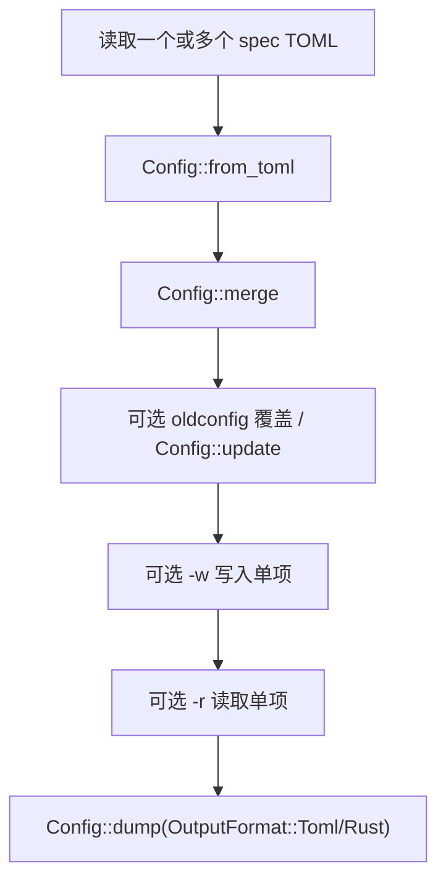
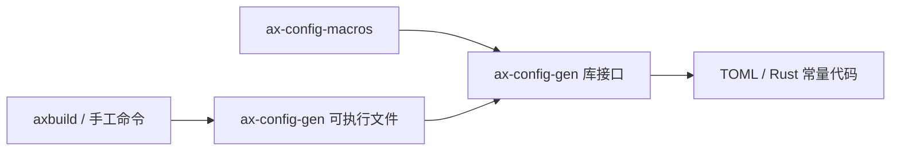

# `ax-config-gen` 技术文档

> 路径：`components/axconfig-gen/axconfig-gen`
> 类型：库 + 二进制混合 crate
> 分层：组件层 / 宿主侧配置生成工具
> 版本：`0.2.1`
> 文档依据：`Cargo.toml`、`src/lib.rs`、`src/main.rs`、`src/config.rs`、`src/output.rs`、`src/ty.rs`、`src/value.rs`、`src/tests.rs`、`README.md`

`ax-config-gen` 是 ArceOS 配置链路里的“配置编译器”。它运行在宿主机上，负责把一组带类型注释的 TOML 规格文件解析成统一配置，再输出成新的 TOML 文件或 Rust 常量代码；`ax-config-macros` 直接复用它的库接口，而 `axbuild` 则直接调用其可执行文件生成 `.axconfig.toml`。

## 1. 架构设计分析
### 1.1 设计定位
`ax-config-gen` 同时提供库接口和命令行入口，但两者都围绕同一个核心模型工作：

- `Config`：整个配置集合，包含全局表和多个具名表。
- `ConfigItem`：单个配置项，保留表名、键名、值和注释。
- `ConfigType`：类型系统，只支持 `bool`、`int`、`uint`、`str`、元组、数组以及推导中的 `Unknown`。
- `ConfigValue`：配置值与类型校验/推导逻辑。
- `Output`：把 `Config` 重新输出为 TOML 或 Rust 常量代码。

这说明它不是一般意义上的“键值编辑器”，而是带类型和注释语义的配置转换器。

### 1.2 库侧分层
源码中的模块职责比较清晰：

- `config.rs`：负责 TOML 到 `Config`/`ConfigItem` 的解析、合并和更新。
- `value.rs`：负责值的合法性检查、类型匹配、类型推导，以及 TOML/Rust 文本化。
- `ty.rs`：定义配置类型语法与 Rust 类型映射。
- `output.rs`：把配置对象写回 TOML 或 Rust 代码，并保留注释。
- `main.rs`：命令行壳层，负责把多份规格文件、旧配置、读写指令串起来。

### 1.3 真实执行链路
无论通过库还是通过 CLI，核心流程都相同：



`main.rs` 里还包含两个容易忽略但很关键的行为：

1. 如果指定了 `-o` 输出路径，且目标文件已有旧内容，会自动备份成 `.old.*` 文件。
2. 如果是读取模式（存在 `-r`），则只打印目标项值，不会再输出整个配置文件。

### 1.4 类型系统的真实边界
`ax-config-gen` 的类型系统很轻量，但设计得足够满足平台配置场景：

- 允许注释形式的显式类型标注，例如 `# uint`、`# [uint]`、`# (uint, str)`。
- 若未显式标注，会从值自动推导类型。
- 字符串里若形如数值字面量，例如 `"0xffff_ffff"`，会被当作数值候选处理。
- 只支持布尔、整数、字符串、数组和元组；不支持浮点、表数组等更复杂的 TOML 结构。

这也解释了为什么 `Config::from_toml` 会拒绝 `[[table]]` 这样的对象数组：它的目标不是通用 TOML 引擎，而是为内核/平台常量生成服务。

## 2. 核心功能说明
### 2.1 主要功能
- 解析带类型注释的 TOML 配置规格。
- 合并多份规格文件，并拒绝重复键。
- 用旧配置或命令行写入项覆盖默认值。
- 输出新的 TOML 配置文件。
- 输出 Rust 常量定义，供宏或代码生成链路使用。

### 2.2 CLI 能力
根据 `src/main.rs`，当前 CLI 支持：

- `spec...`：输入一个或多个规格文件
- `-c, --oldconfig`：读取旧配置并做“按键更新”
- `-o, --output`：输出到文件
- `-f, --fmt`：选择 `toml` 或 `rust`
- `-r, --read`：读取单个配置项
- `-w, --write`：覆写单个配置项
- `-v, --verbose`：打印调试信息

这套接口正是 `axbuild` 生成 `.axconfig.toml` 时调用的基础。

### 2.3 与 `ax-config-macros` 的关系
`ax-config-macros` 并没有自己重新实现 TOML 解析器，而是直接调用：

- `Config::from_toml`
- `Config::dump(OutputFormat::Rust)`

因此，`ax-config-gen` 是宏层和命令行层共享的核心实现，而不是一个只给终端使用的独立工具。

## 3. 依赖关系图谱


### 3.1 关键直接依赖
- `toml_edit`：负责 TOML 解析和装饰信息保留。
- `clap`：提供 CLI 参数解析。

### 3.2 关键直接消费者
- `ax-config-macros`：直接复用库接口，把 TOML 转成 Rust 代码。
- `axbuild`：通过执行 `ax-config-gen` 命令生成最终 `.axconfig.toml`。
- 人工构建流程：开发者也可以直接用命令行查看、修改、生成配置。

### 3.3 间接消费者
- `axconfig`：通过 `ax-config-macros` 或构建链间接使用它的输出。
- 依赖 `axconfig` 的所有内核模块：间接受益于它生成的常量。

## 4. 开发指南
### 4.1 适合在这里做的改动
- 扩展配置项类型系统。
- 调整 TOML 到 Rust 常量的输出格式。
- 改进多规格合并、旧配置覆盖或 CLI 交互体验。

### 4.2 修改时的关键约束
1. 新增类型时，必须同时修改 `ty.rs`、`value.rs` 和 `output.rs`。
2. 任何改变输出格式的改动，都要考虑 `ax-config-macros` 和 `axconfig` 的兼容性。
3. `merge()` 与 `update()` 语义不同：前者拒绝重复键，后者只更新已知键并返回未触达/多余项。
4. 不要把运行时平台逻辑放进这里，它应该保持为纯宿主侧工具。

### 4.3 典型调用示例
```bash
ax-config-gen configs/defconfig.toml configs/board/qemu-aarch64.toml \
  -w arch=\"aarch64\" \
  -w plat.max-cpu-num=4 \
  -o .axconfig.toml
```

这个示例正对应当前仓库里 `axbuild` 的典型工作方式：先合并规格，再覆写少量构建参数。

## 5. 测试策略
### 5.1 当前测试形态
`ax-config-gen` 是这条链路里测试相对完整的一环，`src/tests.rs` 已覆盖：

- 类型推导
- 类型匹配与错误分支
- TOML 值到 Rust 代码的转换
- 以示例配置为基础的集成回归

### 5.2 建议继续加强的点
- CLI 级别 smoke test，例如 `-r`、`-w`、`-c` 组合行为。
- 对备份文件命名和“输出未变化时不重写”行为的回归测试。
- 多规格文件冲突时的诊断信息测试。

### 5.3 高风险改动的验证重点
- `ConfigValue::update()` 的类型保持语义。
- `to_rust()` 对嵌套数组/元组的输出。
- `Config::from_toml()` 对注释中类型标注的解析。

### 5.4 覆盖率重点
对 `ax-config-gen` 来说，最重要的是“类型系统覆盖”和“输出稳定性覆盖”；一旦这些行为变动，整个 `axconfig*` 链都会受影响。

## 6. 跨项目定位分析
### 6.1 ArceOS
`ax-config-gen` 是 ArceOS 配置链路的生成核心。无论是 `axbuild` 生成 `.axconfig.toml`，还是 `ax-config-macros` 生成 Rust 常量，底层都依赖它的解析与输出逻辑。

### 6.2 StarryOS
StarryOS 不直接把 `ax-config-gen` 当运行时依赖使用，但只要沿用同一套 ArceOS 平台配置和构建装配链，就会间接受到它的输出格式和类型系统影响。

### 6.3 Axvisor
Axvisor 在当前工作区里通过共享的构建基础设施间接受益于 `ax-config-gen`，尤其在动态平台或统一构建工具链场景中更明显。但它依然是宿主侧工具依赖，而不是 hypervisor 镜像中的运行时组件。
