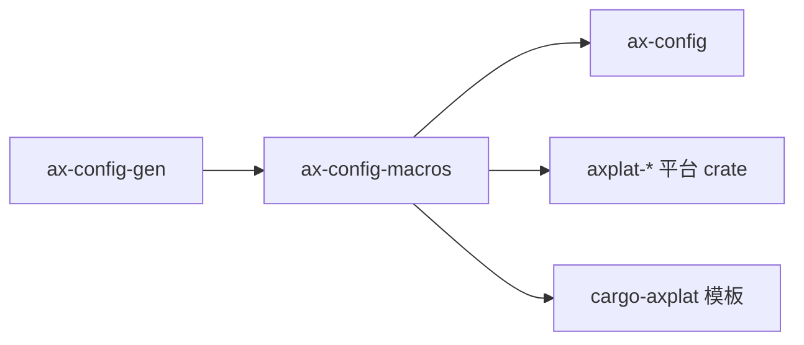

# `ax-config-macros` 技术文档

> 路径：`components/axconfig-gen/axconfig-macros`
> 类型：过程宏库
> 分层：组件层 / 编译期配置展开层
> 版本：`0.2.1`
> 文档依据：`Cargo.toml`、`src/lib.rs`、`tests/example_config.rs`、`README.md`、`os/arceos/modules/axconfig/src/lib.rs`、`components/axplat_crates/platforms/axplat-aarch64-qemu-virt/src/lib.rs`

`ax-config-macros` 把 TOML 配置文本直接变成 Rust 常量定义，是 `axconfig*` 链路中的“编译期翻译器”。它不生成配置文件，也不保存任何运行时状态；它的职责是在宏展开阶段读取配置文本，调用 `ax-config-gen` 解析后输出等价的 Rust 代码。

## 1. 架构设计分析
### 1.1 设计定位
从源码可见，`ax-config-macros` 只暴露两个过程宏：

- `parse_configs!`：把一段 TOML 文本直接展开成 Rust 常量代码。
- `include_configs!`：按路径或环境变量读取 TOML 文件，再把文件内容交给 `parse_configs!`。

这两个宏组成了一条非常清晰的编译期链路：

### 1.2 宏内部工作流程
`src/lib.rs` 中的真实流程如下：

1. `parse_configs!`
   - 解析输入 token 为字符串字面量。
   - 在 `nightly` feature 下先执行 `expand_expr()`，从而支持 `include_str!(...)` 这类表达式先展开再解析。
   - 调用 `ax_config_gen::Config::from_toml()` 解析 TOML。
   - 再调用 `dump(OutputFormat::Rust)` 生成 Rust 常量代码。
   - 若任何一步失败，则通过 `syn::Error` 生成编译错误。

2. `include_configs!`
   - 解析三种入参形式：
     - `include_configs!("path/to/config.toml")`
     - `include_configs!(path_env = "AX_CONFIG_PATH")`
     - `include_configs!(path_env = "AX_CONFIG_PATH", fallback = "defconfig.toml")`
   - 以 `CARGO_MANIFEST_DIR` 为根目录拼接路径。
   - 读取文件内容后，重新生成一段 `::ax_config_macros::parse_configs!(...)` 调用。

这个设计使得 `include_configs!` 本质上只是文件读取包装层，而真正的 TOML 解析与代码生成统一落到 `parse_configs!`。

### 1.3 参数语法与错误模型
`IncludeConfigsArgs` 的解析逻辑也值得注意：

- 允许纯路径字面量。
- 允许 `path_env` 与 `fallback` 命名参数。
- 对重复参数、未知参数和缺失 `path_env` 都会给出编译期报错。

因此它不是“宽松的配置宏”，而是严格约束输入语法的编译期接口。

### 1.4 真实使用场景
在当前仓库里有两类典型消费者：

- `axconfig`
  - 使用 `include_configs!(path_env = "AX_CONFIG_PATH", fallback = "dummy.toml")`
  - 作用是把最终配置文件展开成系统常量。
- 各平台 crate，例如 `ax-plat-aarch64-qemu-virt`
  - 使用 `include_configs!(path_env = "AX_CONFIG_PATH", fallback = "axconfig.toml")`
  - 作用是把板级默认配置或外部覆盖配置编进平台 crate。

这说明 `ax-config-macros` 既服务“最终常量模块”，也服务“平台自身配置模块”。

## 2. 核心功能说明
### 2.1 主要功能
- 将 TOML 配置文本直接转换为 Rust 常量定义。
- 支持通过环境变量或回退路径选择配置文件。
- 将读取失败、解析失败和代码生成失败转化为清晰的编译期错误。
- 复用 `ax-config-gen`，避免宏层和命令行工具层重复实现解析逻辑。

### 2.2 生成代码的真实形态
生成结果通常包括：

- 顶层 `pub const` 定义
- 按 TOML table 生成的 `pub mod`
- 注释转译后的文档注释

这也是为什么 `axconfig` 可以在不手写常量的前提下，直接导出 `ARCH`、`TASK_STACK_SIZE`、`devices::*`、`plat::*`。

### 2.3 构建期与运行期边界
`ax-config-macros` 完全运行在编译期：

- 它读取的是构建机文件系统，不是目标镜像文件系统。
- 它输出的是编译进最终产物的 Rust 代码，不是运行时可重新加载的配置。
- 它不会参与启动时序，也不会暴露“重新加载配置”之类的 API。

换句话说，它解决的是“怎么把配置编进程序”，不是“程序运行时怎么读配置”。

## 3. 依赖关系图谱

### 3.1 关键直接依赖
- `ax-config-gen`：宏层真正复用的 TOML 解析与 Rust 输出实现。
- `syn`、`quote`、`proc-macro2`：标准过程宏栈。

### 3.2 关键直接消费者
- `axconfig`：最终系统常量入口。
- 多个 `axplat-*` 平台 crate：板级默认配置入口。
- `cargo-axplat` 模板：新平台生成模板的默认实现。

### 3.3 特性 `nightly`
`nightly` 仅用于启用 `proc_macro_expand`，让 `parse_configs!` 能处理先展开表达式再解析的场景。它改变的是宏输入能力，不影响最终生成代码的语义模型。

## 4. 开发指南
### 4.1 适合在这里修改的内容
- 宏参数语法
- 编译期错误信息
- 配置文件定位策略
- 与 `ax-config-gen` 的对接方式

### 4.2 修改时的关键约束
1. `parse_configs!` 和 `include_configs!` 必须保持相同的生成语义，否则同一配置文本在两种入口下会得到不同常量。
2. 任何对路径解析规则的改动，都要考虑 `CARGO_MANIFEST_DIR` 相对路径行为。
3. 若调整 `IncludeConfigsArgs` 语法，需要同步更新 README、测试和所有现有调用点。
4. 不要把具体平台策略硬编码到宏里，宏只应负责“如何读取并展开”，不应负责“该读哪个平台”。

### 4.3 推荐验证路径
- 先跑本 crate 的测试，确认生成常量值与预期一致。
- 再编译 `axconfig` 和至少一个 `axplat-*` 平台 crate。
- 若动了 `nightly` 分支，还应验证 `parse_configs!(include_str!(...))` 路径。

## 5. 测试策略
### 5.1 当前测试形态
当前已有 `tests/example_config.rs` 作为正向集成测试，分别验证：

- `include_configs!` 读取文件后的生成结果
- `parse_configs!` 直接解析文本后的生成结果
- 生成常量与预期示例代码是否一致

### 5.2 建议补充的测试
- compile-fail 测试：未知参数、重复参数、缺失 `path_env` 等诊断。
- 文件不存在时的报错信息测试。
- 含复杂数组/元组类型的快照测试。

### 5.3 高风险改动重点
- 路径解析规则
- `nightly` 分支的表达式展开
- 与 `ax-config-gen` 输出格式的耦合点

### 5.4 覆盖率重点
对过程宏来说，最重要的不是行覆盖率，而是“生成代码与错误诊断是否稳定”；这两点一旦变化，会直接影响所有下游 crate 的编译体验。

## 6. 跨项目定位分析
### 6.1 ArceOS
`ax-config-macros` 是 ArceOS 配置常量链的编译期核心之一。`axconfig` 和平台 crate 都依赖它把 TOML 变成最终的 Rust 常量模块。

### 6.2 StarryOS
StarryOS 复用 ArceOS 平台和配置链时，会间接受到 `ax-config-macros` 的影响，但它并不把这个 crate 当成运行时模块使用。

### 6.3 Axvisor
Axvisor 在动态平台或共享平台 crate 的构建链中，也会间接受益于 `ax-config-macros` 的展开能力；不过这仍然是编译期复用，不是运行时依赖。
