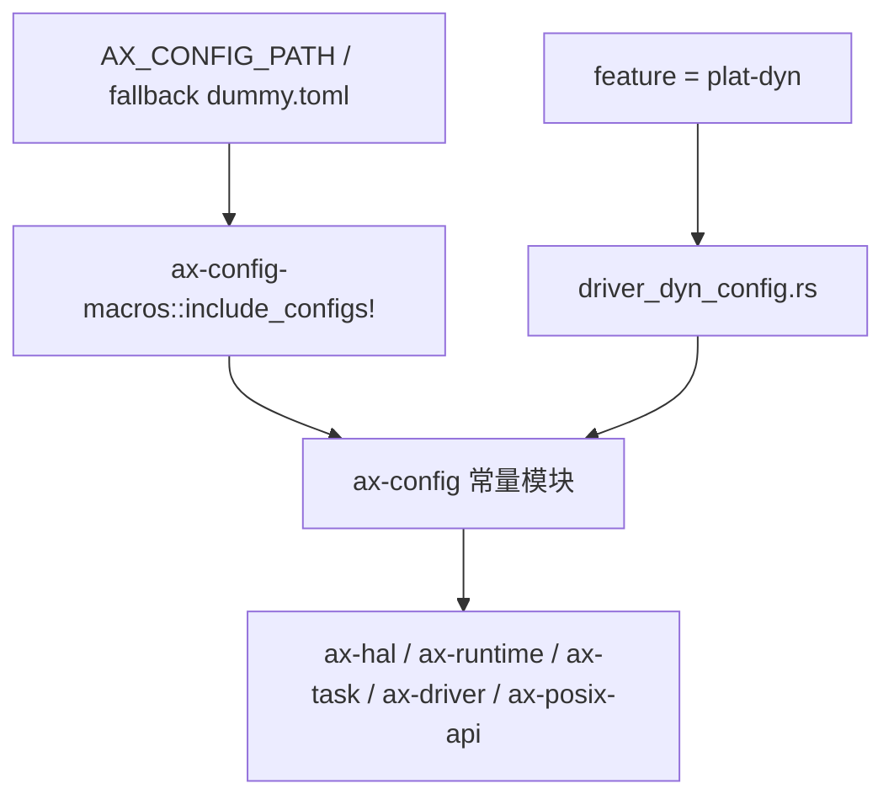
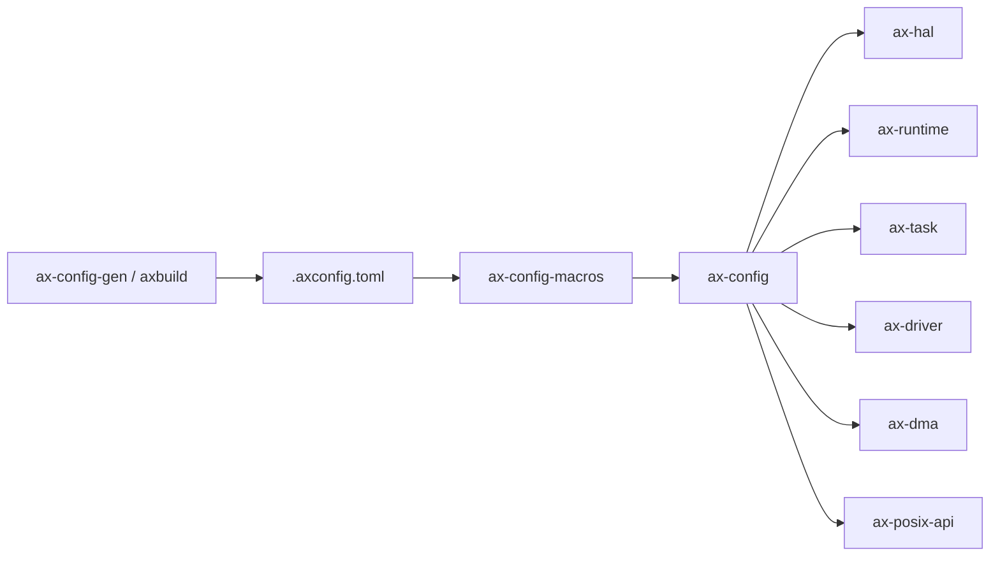

# `ax-config` 技术文档

> 路径：`os/arceos/modules/axconfig`
> 类型：库 crate
> 分层：ArceOS 层 / 编译期平台常量层
> 版本：`0.3.0-preview.3`
> 文档依据：`Cargo.toml`、`build.rs`、`src/lib.rs`、`src/driver_dyn_config.rs`、`README.md`

`ax-config` 是 ArceOS 的平台常量入口。它不负责解析命令行、不负责运行时热更新，也不负责系统初始化；它做的事情只有一件：把构建阶段确定下来的平台参数导出成 Rust 常量，供 `ax-hal`、`ax-runtime`、`ax-task`、`ax-driver`、`ax-posix-api` 等模块在编译期和运行期直接读取。

## 1. 架构设计分析
### 1.1 设计定位
从源码看，`ax-config` 的结构非常薄：

- `build.rs` 只做 Cargo 级依赖追踪，监听 `AX_CONFIG_PATH` 及其指向文件的变化。
- `src/lib.rs` 根据是否开启 `plat-dyn` 选择两条实现路径。
- 默认路径通过 `ax_config_macros::include_configs!` 把 TOML 配置直接展开为常量。
- `plat-dyn` 路径则改为导出手写的 `driver_dyn_config.rs` 常量集合。

这意味着 `ax-config` 本质上是“编译期常量视图”，而不是“配置生成器”或“配置服务”。

### 1.2 两条真实实现路径
`ax-config` 当前存在两条明确的装配分支：

具体行为如下：

1. 默认模式  
   `src/lib.rs` 通过  
   `ax_config_macros::include_configs!(path_env = "AX_CONFIG_PATH", fallback = "dummy.toml")`  
   在编译期读取 TOML，并生成 `ARCH`、`PLATFORM`、`TASK_STACK_SIZE`、`devices::*`、`plat::*` 等常量。

2. `plat-dyn` 模式  
   `src/lib.rs` 不再包含外部 TOML，而是导出 `driver_dyn_config.rs` 中的静态常量。  
   其中 `plat::MAX_CPU_NUM` 会优先读取 `option_env!("SMP")`，再由 `const_str::parse!` 解析为 `usize`，否则回退到默认值 `16`。

这个分支设计直接体现了一个重要边界：`ax-config` 只负责“对外呈现常量”，至于常量是由 TOML 展开还是由动态平台兼容层提供，对使用方来说是透明的。

### 1.3 常量布局与真实消费者
当前导出的常量大致分三层：

- 顶层标识：`ARCH`、`PACKAGE`、`PLATFORM`
- 顶层调优参数：`TASK_STACK_SIZE`、`TICKS_PER_SEC`
- 命名空间常量：
  - `devices::*`：如 `MMIO_REGIONS`、`PCI_ECAM_BASE`、`PCI_BUS_END`、`TIMER_IRQ`、`IPI_IRQ`
  - `plat::*`：如 `MAX_CPU_NUM`、`KERNEL_BASE_VADDR`、`PHYS_BUS_OFFSET`

这些常量在仓库里的真实消费方式非常明确：

- `ax-task` 用 `TASK_STACK_SIZE` 和 `plat::MAX_CPU_NUM` 决定任务栈和 CPU 相关静态对象大小。
- `ax-runtime` 用 `ARCH`、`PLATFORM`、`TICKS_PER_SEC` 输出平台信息并配置定时节拍。
- `ax-hal/build.rs` 用 `PLATFORM`、`plat::KERNEL_BASE_VADDR`、`plat::MAX_CPU_NUM` 生成链接脚本参数。
- `ax-driver` 用 `devices::*` 完成 MMIO、PCI、SDMMC 等设备探测参数绑定。
- `ax-dma` 用 `plat::PHYS_BUS_OFFSET` 计算总线地址映射。
- `ax-posix-api` 用 `TASK_STACK_SIZE`、`plat::MAX_CPU_NUM` 实现 `getrlimit` 和 `sysconf`。

## 2. 核心功能说明
### 2.1 主要功能
- 在编译期把平台配置转成 Rust 常量。
- 为内核模块提供统一的只读平台参数入口。
- 为静态平台和动态平台提供同名常量表面，降低上层模块分支复杂度。
- 通过 `build.rs` 确保配置文件变化能触发重新编译。

### 2.2 典型调用链
在当前工作区里，最典型的调用链是：

1. `axbuild` 或人工流程生成/指定 `.axconfig.toml`
2. Cargo 通过 `AX_CONFIG_PATH` 把配置文件路径传给 `ax-config`
3. `ax-config-macros` 在编译期把 TOML 展开成 Rust 常量
4. `ax-hal`、`ax-runtime`、`ax-task`、`ax-driver` 等模块直接读取这些常量

这也解释了为什么 `ax-config` 自身没有初始化函数：它的“初始化”已经在编译阶段完成了。

### 2.3 与 `ax-config-gen` / `ax-config-macros` 的边界
- `ax-config-gen` 负责解析、合并、重写配置文件，是宿主机构建工具。
- `ax-config-macros` 负责把配置文本展开成 Rust 代码，是编译期宏层。
- `ax-config` 负责对外暴露最终常量，是目标镜像中的只读常量入口。

三者是串联关系，不是替代关系。

## 3. 依赖关系图谱

### 3.1 关键直接依赖
- `ax-config-macros`：默认路径下的核心依赖，负责把 TOML 展开成常量。
- `const-str`：仅在 `plat-dyn` 路径下启用，用来在常量上下文解析 `SMP` 环境变量。

### 3.2 关键直接消费者
- `ax-hal`：链接脚本和平台内存布局的关键消费者。
- `ax-runtime`：启动日志、定时器节拍与 SMP 初始化路径的关键消费者。
- `ax-task`、`ax-ipi`：CPU 数量、默认栈大小等调度相关消费者。
- `ax-driver`、`ax-dma`：设备和 DMA 地址布局消费者。
- `ax-api`、`ax-posix-api`：向上层重新导出或转译这些常量。

### 3.3 `plat-dyn` 的特殊性
`plat-dyn` 不是简单的“再开一个 feature”，而是让 `ax-config` 切换到另一套常量来源。这也是它和普通功能 feature 最大的区别。

## 4. 开发指南
### 4.1 修改常量时要先判断来源
1. 如果常量属于普通平台配置，优先修改配置规范文件和生成链，而不是在 `ax-config` 里手写。
2. 如果常量只在动态平台兼容路径中成立，再考虑修改 `driver_dyn_config.rs`。
3. 如果新增常量需要被下游模块普遍访问，应保持它在默认路径和 `plat-dyn` 路径里都可用。

### 4.2 修改时的关键约束
- 常量名一旦被 `ax-hal`、`ax-runtime`、`ax-task` 等广泛使用，改名成本极高。
- `plat::MAX_CPU_NUM` 这类参与数组长度、类型参数和链接脚本展开的常量，属于高风险接口。
- `devices::*` 中的物理地址和 IRQ 号必须与真实平台配置保持一致，不能仅按 README 直觉修改。
- `build.rs` 只负责追踪变化，不应把配置生成逻辑塞进这里。

### 4.3 推荐验证路径
- 先做一次纯编译验证，确认 `AX_CONFIG_PATH` 变化能触发重编译。
- 再验证至少一条使用 `TASK_STACK_SIZE`、`MAX_CPU_NUM`、`devices::*` 的系统路径。
- 改动 `plat-dyn` 时，必须同时验证动态平台和非动态平台两套分支。

## 5. 测试策略
### 5.1 当前测试形态
`ax-config` 本身没有 crate 内单元测试；当前质量主要依赖消费者能否正确编译和启动。

### 5.2 建议重点验证
- 默认路径：`AX_CONFIG_PATH` 指向自定义配置时能否生成正确常量。
- 回退路径：未设置 `AX_CONFIG_PATH` 时是否能使用 `dummy.toml` 完成最小构建。
- `plat-dyn` 路径：`driver_dyn_config.rs` 导出的常量是否满足 `ax-hal`、`ax-runtime`、`ax-driver` 需求。
- 关键消费者：`ax-task`、`ax-runtime`、`ax-driver`、`ax-posix-api` 是否继续通过。

### 5.3 集成测试建议
- ArceOS 最小样例启动，确认 `ARCH`、`PLATFORM`、`TICKS_PER_SEC` 被正确消费。
- 启用 SMP 的构建，确认 `plat::MAX_CPU_NUM` 与运行参数一致。
- 启用设备或文件系统能力的样例，确认 `devices::*` 相关常量没有失配。

### 5.4 覆盖率重点
对 `ax-config` 来说，比行覆盖率更重要的是“配置来源覆盖率”：默认 TOML 路径、动态平台路径、以及被关键消费者读取的路径都要覆盖到。

## 6. 跨项目定位分析
### 6.1 ArceOS
`ax-config` 是 ArceOS 内核模块共享的平台常量入口。它让 `ax-hal`、`ax-runtime`、`ax-task`、`ax-driver` 在不关心配置来源的前提下使用统一常量接口。

### 6.2 StarryOS
StarryOS 在复用 ArceOS 模块时，也会继承这套常量接口。因此在 StarryOS 侧，`ax-config` 不是 Linux 兼容层的一部分，而是底层平台参数基座。

### 6.3 Axvisor
Axvisor 在当前仓库里会直接依赖 `ax-config`，尤其在动态平台场景下使用 `plat-dyn` 分支。因此对 Axvisor 来说，`ax-config` 提供的是构建后固化的目标平台常量，而不是 hypervisor 运行时可变配置。
