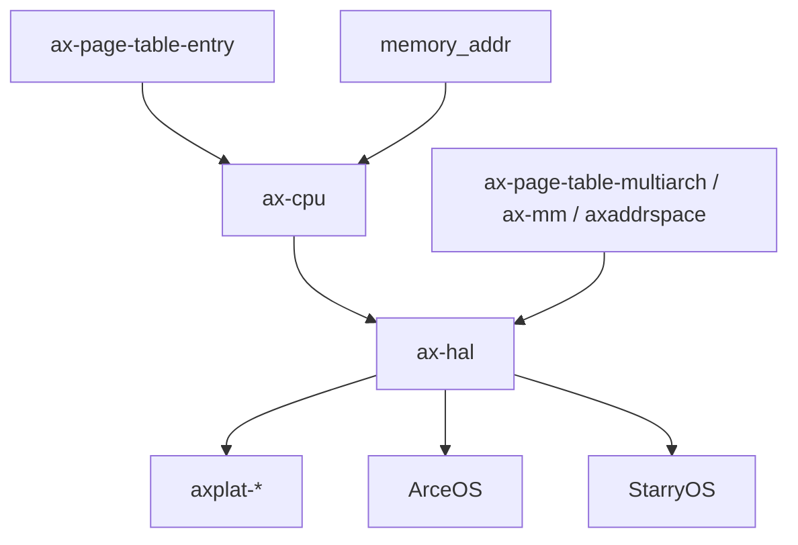

# `ax-cpu` 技术文档

> 路径：`components/axcpu`
> 类型：库 crate
> 分层：组件层 / ISA 与特权级抽象层
> 版本：`0.3.0-preview.8`
> 文档依据：当前仓库源码、`Cargo.toml`、`README.md`、`src/lib.rs`、各架构 `mod.rs`/`asm.rs`/`context.rs`/`init.rs`/`trap.rs`

`ax-cpu` 是 ArceOS 系栈中位于 `ax-hal` 之下、位于原始 CPU 指令之上的一层 ISA 抽象库。它负责把不同架构下的特权寄存器、异常现场、任务上下文切换、页表根寄存器、TLB 刷新和部分早期 CPU 初始化统一成可供内核/HAL 调用的接口。它不是页表库，也不是板级支持包，而是“面向 CPU 本身”的底层抽象层。

## 1. 架构设计分析

### 1.1 设计定位

`ax-cpu` 处理的是“CPU 相关但又不能散落在平台代码里”的部分，包括：

- 特权寄存器读写
- trap/exception 入口与现场表达
- 任务上下文切换
- 页表根寄存器切换与 TLB 刷新
- AArch64/LoongArch 等架构上的 MMU 初始化辅助

它与相邻层的边界应明确区分：

- `axplat`：负责“在什么时机调用这些 CPU 原语”
- `ax-page-table-entry` / `ax-page-table-multiarch`：负责“页表内容是什么”
- `ax-cpu`：负责“CPU 如何装载页表根、如何刷 TLB、如何响应 trap”

### 1.2 顶层模块结构

`src/lib.rs` 的结构非常清楚：

- 根层提供 `trap` 公共入口
- `uspace_common` 在开启 `uspace` 时提供共享用户态辅助
- 通过 `cfg_if!` 在编译期只选择一个目标架构实现

当前支持：

- `x86_64`
- `riscv32` / `riscv64`
- `aarch64`
- `loongarch64`

### 1.3 各架构模块共性

虽然各架构目录不同，但整体模式很统一：

| 模块 | 作用 |
| --- | --- |
| `asm.rs` | 中断开关、页表根寄存器读写、TLB 操作、线程指针等汇编原语 |
| `context.rs` | `TrapFrame`、`TaskContext`、可选 TLS/FP 状态 |
| `init.rs` | 早期 CPU 初始化，如 trap 基址、MMU、EL 切换 |
| `trap.rs` / `trap.S` | 异常/中断入口与 Rust 分发 |
| `uspace.rs` | 用户态相关 trap 语义和返回原因 |

这种设计让“架构差异”被限制在每个子目录内部，而上层调用面尽量一致。

### 1.4 trap 与异常分发模型

`ax-cpu` 在根层提供了 trap 注册与分发基础设施。关键特征有两个：

- 使用 `linkme` 风格的分布式切片注册 handler
- 对 `IRQ` 与 `PAGE_FAULT` 两类关键入口做统一分发

这说明它不只是“汇编入口集合”，而是已经定义了 CPU 级异常分发协议。

### 1.5 关键数据结构

#### `TrapFrame`

表示异常/中断进入内核后的现场。不同架构字段不同，但共同承担：

- 保存通用寄存器
- 保存返回 PC / 状态寄存器
- 提供调试和回溯基础

#### `TaskContext`

用于协作式上下文切换。它保存的是任务切换最关键的一组状态，而不是完整 trap 现场。启用不同 feature 时，还会携带：

- TLS 相关寄存器
- 浮点/SIMD 状态
- 用户页表根

#### `PageFaultFlags`

这类页错误语义最终来自 `ax_page_table_entry::MappingFlags`，说明 `ax-cpu` 并不自己重新定义一套访问权限语言，而是复用整个页表栈的公共位语义。

### 1.6 典型架构差异

#### x86_64

- 建 GDT/IDT
- 读写 `CR3`
- 初始化 per-CPU 辅助状态
- 用户态路径涉及 syscall MSR 等

#### RISC-V

- 使用 `satp`
- `stvec` 负责 trap 入口
- 在 `uspace` 场景中设置 SUM 等权限位

#### AArch64

- `switch_to_el1` 负责早期 EL 切换
- `init_mmu` 配置 `MAIR`、`TCR`、`TTBR`
- `arm-el2` 会显著影响 trap、TLB 和页表根寄存器语义

#### LoongArch64

- 负责页表根与 TLB refill 入口等专用初始化
- 与 `ax-page-table-multiarch` 的 LoongArch 元数据路径直接耦合

### 1.7 一个必须写清的边界

`ax-cpu` 管的是：

- 页表根寄存器
- TLB
- trap
- CPU 上下文

它不管：

- 多级页表遍历
- 页表项格式定义
- 物理页分配
- 地址空间区间组织

因此它不是 `ax-mm` 或 `axaddrspace` 的替代物，而是这两者运行时必须依赖的 CPU 接口面。

## 2. 核心功能说明

### 2.1 主要能力

- 统一不同架构的 trap/context/asm 接口
- 提供任务上下文切换基础能力
- 读写用户/内核页表根寄存器
- 刷新 TLB 与部分 cache
- 承担 AArch64/LoongArch 等架构的早期 MMU 初始化辅助

### 2.2 典型调用场景

| 场景 | `ax-cpu` 的作用 |
| --- | --- |
| 平台启动 | 初始化 trap 入口、切换异常级别、打开 MMU |
| 任务切换 | 切换 `TaskContext`、可选切换 TLS/FP/用户页表根 |
| 页错误 | 提供 fault 地址和访问类型，交给上层地址空间处理 |
| 用户态 | 处理 syscall/返回原因与异常修复辅助 |
| Hypervisor 宿主 | 在 AArch64 EL2 场景下提供宿主 trap/MMU/TLB 原语 |

### 2.3 与页表栈的配合

最常见的一条主线是：

1. `ax-page-table-entry` 定义页权限语义
2. `ax-page-table-multiarch` 维护页表内容
3. `ax-mm` / `axaddrspace` 组织地址空间
4. `ax-cpu::asm` 把页表根装载进 CPU，并执行 TLB 刷新

这正好体现了它在内存子系统中的位置：不是页表内容层，而是页表生效层。

## 3. 依赖关系图谱

### 3.1 直接依赖

| 依赖 | 作用 |
| --- | --- |
| `memory_addr` | 地址类型基础 |
| `ax-page-table-entry` | 页错误与页属性公共语义 |
| `axbacktrace` | 回溯支持 |
| `linkme` | trap handler 分布式注册 |
| 各架构专用依赖 | `x86`、`x86_64`、`aarch64-cpu`、`riscv`、`loongArch64` 等 |

### 3.2 主要消费者

- `ax-hal`
- 各类 `axplat-*` 平台包
- `platform/*` 下的平台实现
- `starry-signal`

`axvm` 并不直接依赖它；两者关系更多体现在 hypervisor 宿主 CPU 模式与 trap 行为的间接配合上。

### 3.3 关系示意

## 4. 开发指南

### 4.1 新增架构支持时的步骤

1. 在 `src/` 下增加新架构目录
2. 实现 `asm.rs`
3. 实现 `context.rs`
4. 实现 `init.rs`
5. 实现 trap 入口与 Rust 分发
6. 在 `lib.rs` 的 `cfg_if!` 中挂接

### 4.2 修改现有架构实现时的注意点

- 页表根寄存器读写与 TLB 刷新必须保持成对语义
- `TrapFrame` 布局变化会影响异常入口汇编和上层调试逻辑
- `TaskContext` 的改动会影响切换汇编与调度器
- `arm-el2`、`uspace`、`tls`、`fp-simd` 这些 feature 的组合要单独回归

### 4.3 与其他 crate 的协作边界

- 新 trap 类型若需要上传给内核逻辑，应优先考虑 `ax-hal` 暴露的接口面
- 页错误处理不要塞进 `ax-cpu`，应交给地址空间层
- 板级初始化时序不要写进 `ax-cpu`，应留给 `axplat`

## 5. 测试策略

### 5.1 当前已有验证方式

从仓库元数据看，`ax-cpu` 主要依赖：

- 多目标构建
- `clippy`
- x86_64 主机侧测试

这符合它的定位：很多逻辑只能靠交叉构建保证接口完整，真正的 trap/MMU/TLB 语义往往需要目标环境验证。

### 5.2 推荐重点测试

- 各架构 `TaskContext` 切换正确性
- trap handler 注册与分发
- `uspace` 路径下用户页表根切换
- AArch64 `arm-el2` 与普通 EL1 路径差异
- 页错误 flags 与 fault 地址提取是否与上层地址空间匹配

### 5.3 风险点

- 它是 `ax-hal` 的 ISA 基础层，改动很容易波及全部平台
- 页表根/TLB 语义错误通常不是立即崩溃，而是表现为隐蔽的地址空间异常
- trap 和 context 路径任何小改动都可能导致难调试的问题

## 6. 跨项目定位分析

| 项目 | 位置 | 角色 | 核心作用 |
| --- | --- | --- | --- |
| ArceOS | `ax-hal` 下方的 ISA 层 | CPU 特权抽象基础件 | 为平台启动、trap、上下文切换和页表根切换提供统一底层能力 |
| StarryOS | 通过 `ax-hal` 使用 | 用户态和异常路径底层支撑 | 为页错误处理、用户态上下文和任务切换提供 CPU 原语 |
| Axvisor | 宿主 CPU 侧能力的间接来源 | Hypervisor 宿主 CPU 抽象层 | 尤其在 AArch64 `arm-el2` 路径下，为宿主 EL2 trap/MMU/TLB 行为提供基础语义 |

## 7. 总结

`ax-cpu` 的核心价值在于把“必须懂 CPU 才能写”的那一层能力系统化了。它不去管理页表内容，也不去管理板级设备，而是把 trap、上下文、页表根和特权寄存器这些真正属于 CPU 的责任集中起来，为 `ax-hal`、平台包和上层 OS/Hypervisor 代码提供了稳定的 ISA 接口面。
