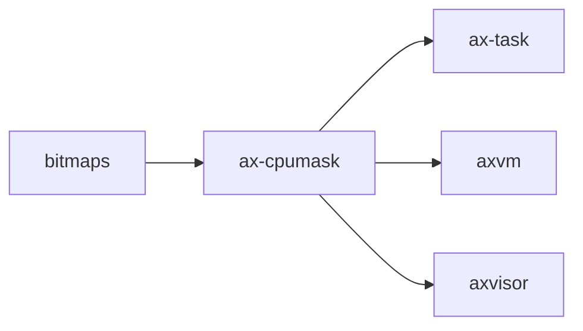

# `ax-cpumask` 技术文档

> 路径：`components/cpumask`
> 类型：库 crate
> 分层：组件层 / CPU 位图基础件
> 版本：`0.3.0`
> 文档依据：`Cargo.toml`、`README.md`、`src/lib.rs`

`ax-cpumask` 是一个面向 CPU 集合表达的 const-generic 位图类型。它对齐 Linux `cpumask_t` 的基本思想：一位对应一个 CPU 编号，并提供位运算、搜索和迭代接口。它属于叶子基础件：只是“CPU 集合值类型”，不是 CPU 拓扑模型、负载均衡器，也不是调度策略本体。

## 1. 架构设计分析
### 1.1 设计定位
`ax-cpumask` 的价值在于把“CPU 集合”收敛成一个小而稳定的类型：

- `ax-task` 用它表示任务 CPU affinity。
- `axvm` / `axvisor` 用它表示 vCPU 目标集合。
- 平台或上层策略代码可以在不引入复杂调度逻辑的情况下操作 CPU 集合。

这意味着 `ax-cpumask` 只负责位集语义，不负责回答“该把任务迁到哪个 CPU”“哪些 CPU 在线”这类策略问题。

### 1.2 核心类型
- `CpuMask<const SIZE: usize>`：主体类型，内部包装 `bitmaps::Bitmap<SIZE>`。
- `Iter<'a, SIZE>`：遍历置位 CPU 编号的双端迭代器。

### 1.3 表示方式与容量边界
`CpuMask` 的底层存储会根据 `SIZE` 自动选最小合适的无符号类型：

- `SIZE == 1` 时可退化成 `bool` 语义。
- `SIZE <= 128` 时用单个整数存储。
- `SIZE > 128` 时按 `[u128; N]` 形式存储，当前最大支持 `1024` 位。

源码还额外为 `256` 到 `1024` 位的若干常见尺寸提供了 `[u128; N]` 之间的显式 `From` 转换，方便虚拟化或多核位图序列化。

### 1.4 能力主线
它提供的能力主要分为四类：

- 构造：`new()`、`full()`、`mask(bits)`、`one_shot(index)`、`from_value()`、`from_raw_bits()`。
- 查询：`len()`、`is_empty()`、`is_full()`、`get()`、`first_index()`、`last_index()`、`first_false_index()` 等。
- 变换：`set()`、`invert()`，以及 `BitAnd` / `BitOr` / `BitXor` / `Not`。
- 遍历：`IntoIterator for &CpuMask`，支持双端迭代。

## 2. 核心功能说明
### 2.1 主要功能
- 用紧凑位图表达 CPU 集合。
- 提供 CPU 集合的位运算、搜索和迭代能力。
- 为上层 affinity、目标 CPU 选择等场景提供一个可复制、可比较、可哈希的值对象。

### 2.2 关键 API 与真实使用位置
- `CpuMask::new()` / `set()`：`ax-task/src/api.rs` 用来构造 `AxCpuMask`。
- `get()` / `is_empty()`：`ax-task/src/run_queue.rs` 用于根据 affinity 选择运行队列。
- `CpuMask`：`components/axvm/src/vm.rs` 和 `os/axvisor/src/vmm/vcpus.rs` 直接使用，用来描述 vCPU 目标集合。

### 2.3 使用边界
- `ax-cpumask` 不负责验证 CPU 是否在线；它只存位。
- `ax-cpumask` 不负责 hotplug 或 NUMA 信息。
- `ax-cpumask` 也不做迁移决策；上层只把它当约束条件或目标集合。

## 3. 依赖关系图谱


### 3.1 关键直接依赖
- `bitmaps`：底层位图实现来源。

### 3.2 关键直接消费者
- `ax-task`：任务 affinity 的核心值类型。
- `axvm` / `axvisor`：虚拟机或 vCPU 目标集合表达。

## 4. 开发指南
### 4.1 依赖配置
```toml
[dependencies]
ax-cpumask = { workspace = true }
```

### 4.2 修改时的关键约束
1. `SIZE` 是类型级常量，任何涉及存储布局的改动都要考虑不同尺寸实例的兼容性。
2. `from_raw_bits()` 只接受能塞进 `usize` 的原始位值，它不是通用序列化入口。
3. 修改迭代器语义时，要同时检查正向和反向遍历是否仍正确。
4. 不要把 online/offline、优先级、负载等动态策略字段塞进 `CpuMask`；这层应该继续保持纯值对象。

### 4.3 开发建议
- 需要表达“仅允许在哪些 CPU 上运行”时用 `CpuMask` 很合适。
- 需要表达更复杂拓扑关系时，单独建结构体，不要滥扩 `CpuMask`。
- 若要新增更大尺寸支持，先确认 `bitmaps` 后端和显式数组转换实现是否都能跟上。

## 5. 测试策略
### 5.1 当前测试形态
`ax-cpumask` 本体没有独立测试文件，当前验证主要依赖真实消费者：

- `test-suit/arceos/task/affinity` 对任务 affinity 的系统测试。
- `axvm` / `axvisor` 对 vCPU 目标集合的使用。

### 5.2 单元测试重点
- 构造函数的边界输入。
- `first_index()` / `next_index()` / `first_false_index()` 等搜索函数。
- 位运算与双端迭代的一致性。

### 5.3 集成测试重点
- `ax-task` 在 SMP 下的 affinity 设置和迁移逻辑。
- `axvm` / `axvisor` 对较大尺寸 mask 的处理。

### 5.4 覆盖率要求
- 对 `ax-cpumask`，位级边界覆盖比单纯行覆盖更重要。
- 任何改动迭代器、数组转换或存储布局的提交，都应补至少一组尺寸边界测试。

## 6. 跨项目定位分析
### 6.1 ArceOS
在 ArceOS 中，`ax-cpumask` 主要通过 `ax-task` 承担任务 affinity 的值类型角色。它是调度约束的表达层，不是调度器本体。

### 6.2 StarryOS
当前仓库里 StarryOS 没有直接把 `ax-cpumask` 作为独立子系统扩展；若经共享任务栈间接使用，它也仍只是 CPU 集合值类型。

### 6.3 Axvisor
Axvisor 和 `axvm` 直接使用 `ax-cpumask` 表达 vCPU 目标集合。这里的 `ax-cpumask` 依旧只是位图容器，不是 vCPU 调度或拓扑管理层。
