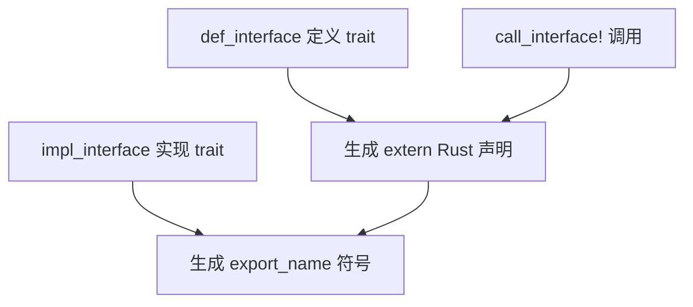
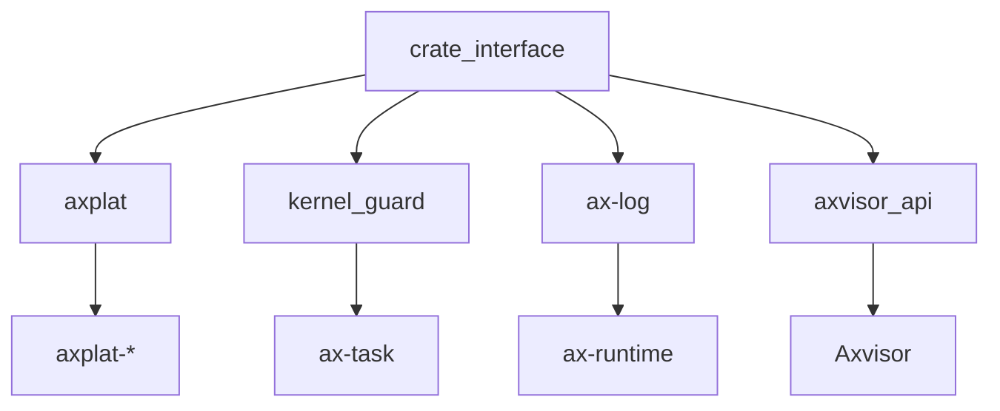

# `ax-crate-interface` 技术文档

> 路径：`components/crate_interface`
> 类型：过程宏 crate
> 分层：组件层 / 跨 crate 接口绑定层
> 版本：`0.5.0`
> 文档依据：当前仓库源码、`Cargo.toml`、`README.md`、`src/lib.rs`、`src/def_interface.rs`、`src/impl_interface.rs`、`src/args.rs`、`src/naming.rs`

`ax-crate-interface` 是 ArceOS 生态里非常关键、也非常“非典型”的基础设施。它通过过程宏把 trait 定义、实现和调用拆到不同 crate 中，再用链接期符号把它们重新拼起来，从而避免传统泛型注入或显式依赖带来的循环依赖问题。`axplat`、`kernel_guard`、`ax-log`、`axvisor_api` 等公共契约层都建立在这套机制之上。

## 1. 架构设计分析

### 1.1 设计定位

这个 crate 解决的问题不是“如何定义 trait”，而是：

- A crate 需要定义接口
- B crate 需要实现接口
- C crate 需要调用接口
- 但三者之间不希望形成强耦合或循环依赖

为此，`ax-crate-interface` 采用的不是 trait object，也不是把实现类型作为泛型一路向上传递，而是：

- 用 trait 表达接口语义
- 用过程宏生成 `extern "Rust"` 符号声明和定义
- 用链接期符号把调用点与实现点绑定起来

### 1.2 对外三大入口

对外 API 很集中，只有三个核心宏：

- `#[def_interface]`
- `#[impl_interface]`
- `call_interface!`

这三者分别对应：

- 定义接口
- 导出实现
- 发起调用

### 1.3 内部模块划分

| 模块 | 作用 |
| --- | --- |
| `args` | 解析属性参数和调用参数 |
| `def_interface` | 展开接口定义侧代码 |
| `impl_interface` | 展开实现侧导出符号 |
| `naming` | 统一内部模块名与符号名 |
| `validator` | 校验接口定义限制 |
| `errors` | 统一编译期错误信息 |

### 1.4 `def_interface` 的展开逻辑

`#[def_interface]` 作用于一个 trait 时，核心会做几件事：

1. 保留 trait 作为语义接口
2. 为每个方法生成隐藏的 `extern "Rust"` 声明
3. 把这些声明放进形如 `__Trait_mod` 的内部模块
4. 根据配置可生成更易用的 caller 包装函数

因此定义侧并不是“只保留一个 trait”，而是同时生成了链接期协议。

### 1.5 `impl_interface` 的展开逻辑

实现侧宏会为每个 trait 方法生成带固定 `export_name` 的 Rust ABI 函数。调用方最终调用到的并不是某个实现类型的方法名本身，而是这些导出的统一符号。

换句话说：

- trait 是接口语义
- `export_name` 符号才是运行时真正连起来的调用点

### 1.6 `call_interface!` 的角色

`call_interface!` 会把一次 `Trait::func(...)` 风格调用展开成：

- 对隐藏 `extern "Rust"` 符号的 `unsafe` 调用

因此它并不是语法糖，而是“接口调用协议的显式入口”。

### 1.7 约束与限制

为了让符号绑定稳定，`crate_interface` 对接口模型有明确限制：

- 不支持 `self` 方法
- 不支持泛型方法
- 参数模式必须足够简单，便于提取调用参数

这说明它追求的是“链接协议稳定”，而不是任意 Rust trait 形态都能支持。

### 1.8 `weak_default`

`weak_default` feature 提供了另一层更高级的行为：

- trait 默认实现可以被生成为弱符号
- 若没有更强实现，默认实现可直接生效

这是一个很强但也很危险的能力，因为它依赖 nightly 和 `linkage` 特性，本质上把默认实现引入了链接层语义。

## 2. 核心功能说明

### 2.1 主要能力

- 在一个 crate 中定义接口
- 在另一个 crate 中实现接口
- 在第三个 crate 中调用接口
- 用命名空间和统一符号名避免冲突
- 可选生成弱符号默认实现

### 2.2 典型调用路径

### 2.3 `gen_caller` 与 `namespace`

除了三大核心宏之外，定义侧还支持一些重要扩展语义：

- `gen_caller`：为接口生成更自然的包装函数
- `namespace`：在符号名层面隔离不同接口集合

这些能力在 `axplat` 和 `axvisor_api` 的二次封装里非常常见。

### 2.4 与传统做法的差异

相比常见的 trait object、泛型传参或回调注册，`crate_interface` 的特点是：

- 零运行时对象层
- 接口面更稳定
- 编译期和链接期分工更明确
- 问题更偏向“链接契约是否正确”，而不是“类型系统是否足够灵活”

## 3. 依赖关系图谱

### 3.1 直接依赖

| 依赖 | 作用 |
| --- | --- |
| `proc-macro2` | 过程宏 Token 操作 |
| `quote` | 代码生成 |
| `syn` | 语法树解析与重写 |

### 3.2 主要消费者

仓库中直接或间接依赖它的关键模块包括：

- `axplat`
- `ax-plat-macros`
- `ax-log`
- `ax-runtime`
- `ax-task`
- `kernel_guard`
- `axvisor_api`
- `os/axvisor`

### 3.3 关系示意

## 4. 开发指南

### 4.1 定义一个新接口

标准做法是：

1. 在接口 crate 中写 trait
2. 用 `#[def_interface]` 标注
3. 在实现 crate 中对某个实现类型写对应 impl
4. 用 `#[impl_interface]` 导出
5. 在调用侧用 `call_interface!` 或二次封装函数调用

### 4.2 何时适合使用

适合：

- OS/HAL 边界
- 平台能力绑定
- 日志、调度、guard 这类横切接口
- Hypervisor API 窄腰层

不适合：

- 需要丰富泛型表达的接口
- 需要对象安全和动态替换的组件
- 普通业务逻辑内部调用

### 4.3 维护时的关键注意事项

- 符号名生成规则必须稳定
- `namespace` 前后要严格对齐
- `weak_default` 只应在确实需要链接层默认实现时使用
- 若出现“找不到实现”或“重复实现”，问题往往出在链接契约而不是 trait 定义本身

### 4.4 仓库内典型封装模式

#### `axplat`

`axplat` 会在 `crate_interface` 之上再包一层平台接口宏，使调用侧最终看到的是普通函数，而不是显式 `call_interface!`。这使平台契约更适合作为公共 API 暴露。

#### `axvisor_api`

`axvisor_api` 用 `api_mod` / `api_mod_impl` 把 Hypervisor API 分成模块，再借 `crate_interface` 把它们绑定到具体实现。这相当于在 `crate_interface` 之上再叠一层更贴近 hypervisor 场景的 DSL。

## 5. 测试策略

### 5.1 当前已有测试面

源码仓库已经包含：

- 同 crate 集成测试
- `weak_default` 相关测试
- `test_crates/` 下的跨 crate 组合测试

这说明作者已经把重点放在“链接契约是否真能成立”这一层，而不仅仅是宏是否能展开。

### 5.2 推荐继续关注的测试

- `namespace` 不一致时的错误行为
- 缺失实现时的链接失败验证
- 重复实现导致的符号冲突验证
- `weak_default` 在跨 crate 边界上的真实解析行为

### 5.3 风险点

- 错误通常会表现为链接失败，而非普通编译报错
- 对不熟悉这套机制的开发者来说，排查路径比普通 trait 调用更难
- 版本混用时要特别注意 `ax-crate-interface` 语义差异，尤其是 `weak_default`

## 6. 跨项目定位分析

| 项目 | 位置 | 角色 | 核心作用 |
| --- | --- | --- | --- |
| ArceOS | 横跨 HAL、平台、日志、调度等公共层 | 跨 crate 契约绑定底座 | 让平台、日志、guard、任务等横切接口能在不引入循环依赖的前提下被定义、实现和调用 |
| StarryOS | 多数经由 ArceOS 公共层间接使用 | 间接接口绑定基础件 | StarryOS 通过复用 ArceOS 公共栈，间接获得这套接口绑定机制 |
| Axvisor | Hypervisor API 与宿主策略窄腰层底座 | Hypervisor 契约绑定核心件 | `axvisor_api` 等组件依赖它把 VMM API 定义和实现解耦 |

## 7. 总结

`ax-crate-interface` 的意义，在于它为整个仓库提供了一种“比 trait 更靠近链接层、又比裸符号更有语义”的接口绑定方式。它不是普通过程宏工具，而是 ArceOS、StarryOS 和 Axvisor 公共基础设施中的一个关键连接件：把定义方、实现方和调用方从依赖图上解开，再在最终二进制里重新绑定。
