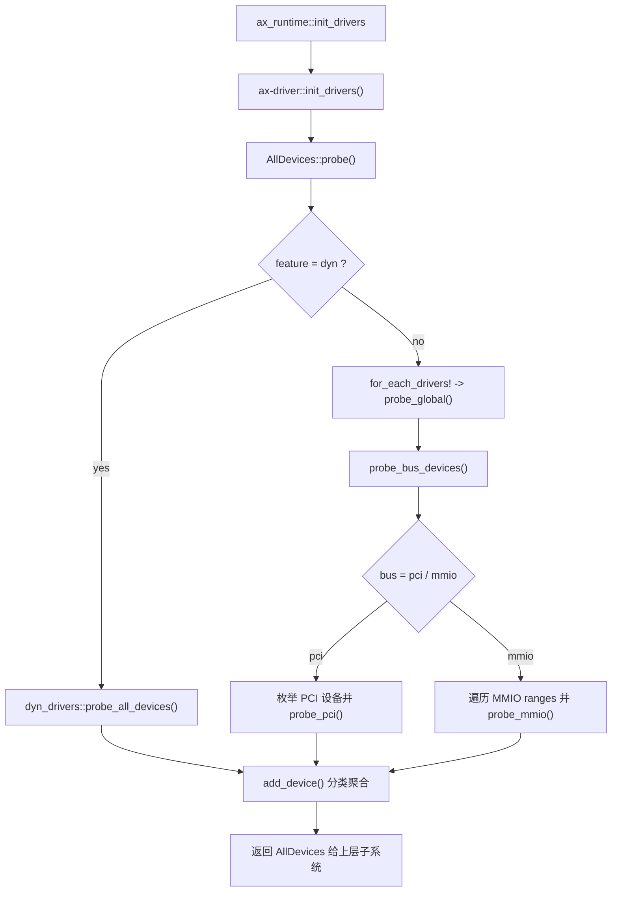
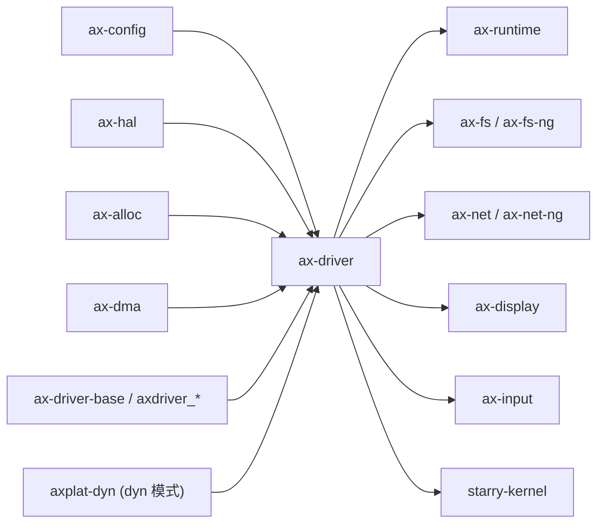

# `ax-driver` 技术文档

> 路径：`os/arceos/modules/axdriver`
> 类型：库 crate
> 分层：ArceOS 层 / ArceOS 内核模块
> 版本：`0.3.0-preview.3`
> 文档依据：`Cargo.toml`、`build.rs`、`src/lib.rs`、`src/macros.rs`、`src/drivers.rs`、`src/bus/pci.rs`、`src/bus/mmio.rs`、`src/virtio.rs`、`src/structs/*`、`src/dyn_drivers/mod.rs`

`ax-driver` 是 ArceOS 的设备驱动聚合与探测入口。它并不试图把所有设备协议都做成统一对象模型，而是先按设备类别完成“探测 -> 分类 -> 聚合”，再把结果交给文件系统、网络栈、显示和输入等上层子系统消费。

## 1. 架构设计分析
### 1.1 设计定位
`ax-driver` 的核心设计目标是把“底层设备驱动”整理成“上层子系统可消费的设备容器”：

- 向下，它负责根据总线类型、feature 组合和平台能力探测可用设备。
- 向上，它通过 `AllDevices` 把设备按 `block`、`net`、`display`、`input`、`vsock` 分类聚合。
- 在实现策略上，它同时支持 **静态设备模型** 和 **动态设备模型**：
  - 静态模型：每个类别在编译期选中一个具体设备类型，避免动态分发，性能更好。
  - 动态模型：每个类别使用 trait object，可支持多实例，但需要额外的动态分发和 `axplat-dyn` 路径。

因此，`ax-driver` 的中心价值不是单个驱动协议实现，而是“驱动装配层”和“总线探测层”的边界设计。

### 1.2 内部模块划分
- `src/lib.rs`：crate 入口。定义 `AllDevices`、`init_drivers()`、`AllDevices::probe()` 和 `add_device()`。
- `src/macros.rs`：生成静态模型下的设备类型别名和 `for_each_drivers!` 宏展开逻辑。
- `src/drivers.rs`：定义 `DriverProbe` trait，并按 feature 注册 VirtIO、ramdisk、sdmmc、bcm2835、ixgbe、fxmac 等驱动探测入口。
- `src/bus/pci.rs`：静态模型下的 PCI 总线枚举、BAR 配置和按驱动逐个 probe。
- `src/bus/mmio.rs`：静态模型下的 MMIO 设备扫描，主要服务 VirtIO MMIO 路径。
- `src/virtio.rs`：VirtIO 通用探测与 `VirtIoHalImpl`，连接 `ax-alloc`、`ax-hal` 和 `ax-driver-virtio`。
- `src/ixgbe.rs`：ixgbe 的平台 HAL glue，连接 `ax-dma` 和网卡驱动。
- `src/structs/mod.rs`、`src/structs/static.rs`、`src/structs/dyn.rs`：定义 `AxDeviceEnum`、`AxDeviceContainer` 以及静态/动态两种 `Ax*Device` 类型模型。
- `src/dummy.rs`：在某一设备类别启用但未选中具体驱动时，提供 `dummy` 占位类型。
- `src/dyn_drivers/mod.rs`：`dyn` 路径的设备探测入口，当前主要从 `axplat-dyn` 接入块设备。
- `build.rs`：根据 feature 生成 `cfg(bus = "...")` 和 `cfg(net_dev = "...")` 等条件编译开关。

### 1.3 关键数据结构与对象
- `AllDevices`：按设备类别聚合所有已探测设备，是 `ax-driver` 的核心输出对象。
- `AxDeviceContainer<D>`：内部使用 `SmallVec<[D; 1]>` 保存同类设备，兼顾“通常只有一个设备”和“支持少量多实例”的场景。
- `AxDeviceEnum`：设备探测阶段的统一枚举，负责在加入 `AllDevices` 时按类别分发。
- `DriverProbe`：所有驱动探测逻辑的统一 trait，定义 `probe_global()`、`probe_mmio()` 和 `probe_pci()`。
- `VirtIoDriver<D>` / `VirtIoHalImpl`：VirtIO 探测与 DMA/MMIO glue 的关键对象。

### 1.4 设备探测与初始化主线
`ax-driver` 的主入口是 `init_drivers()`，其核心调用链如下：



静态模型下的主线分两步：

1. 先对每个已编译进来的驱动调用 `probe_global()`，处理平台固定地址或全局一次性设备。
2. 再根据 `build.rs` 生成的 `cfg(bus = "pci" | "mmio")` 选择 PCI 或 MMIO 总线扫描。

动态模型下的主线则明显不同：

- 不再编译 `bus` 子模块。
- 改由 `dyn_drivers::probe_all_devices()` 调用 `axplat-dyn` 提供的平台级探测。
- 当前实现主要把块设备收集进来，说明 `dyn` 路径仍然偏向特定类别而不是完整覆盖所有设备类型。

### 1.5 静态模型与动态模型差异
静态模型：

- `AxNetDevice`、`AxBlockDevice` 等在编译期就绑定为具体类型。
- `for_each_drivers!` 宏会针对选中的驱动类型展开。
- 性能最好，但每类通常只支持一个被选中的具体设备模型。

动态模型：

- `Ax*Device` 变为 trait object 包装。
- 探测路径改走 `axplat-dyn`。
- 更灵活，但引入动态分发，且当前实现覆盖面并不完全对称。

### 1.6 Feature 矩阵的决定性作用
- `bus-pci` / `bus-mmio`：决定总线探测分支，默认是 `bus-pci`。
- `block` / `net` / `display` / `input` / `vsock`：决定是否编译对应类别的设备容器与上游依赖。
- `virtio-*`：打开对应 VirtIO 设备类型。
- `ixgbe`、`fxmac`、`ramdisk`、`sdmmc`、`bcm2835-sdhci` 等：决定每类设备可能选择的具体驱动。
- `dyn`：决定是否进入动态设备模型。

需要特别注意两点：

1. 在静态模型下，`build.rs` 会对每类设备按 feature 列表顺序选择第一个命中的具体驱动，因此“同时打开多个同类驱动 feature”并不意味着都会生效。
2. 当前 `Cargo.toml` 声明了 `ahci` feature，但 `build.rs` 和驱动注册宏体系并未完整接入该 feature，这属于现有实现与配置之间的未完全对齐点。

## 2. 核心功能说明
### 2.1 主要功能
- 探测系统中可用的块设备、网卡、显示设备、输入设备和 vsock 设备。
- 按类别聚合所有设备为 `AllDevices`。
- 为上层子系统提供统一的设备容器类型和 trait 边界。
- 封装 VirtIO、PCI、MMIO 等总线路径的探测 glue。

### 2.2 关键 API 与使用场景
- `init_drivers()`：由 `ax-runtime` 调用，是系统驱动 bring-up 的总入口。
- `AllDevices`：上层子系统从中取出自己关心的设备。
- `AxDeviceContainer::take_one()`：很多上层模块以“只取第一台设备”的方式消费设备。
- `DriverProbe`：新增驱动或扩展总线匹配逻辑时的统一入口。

### 2.3 典型使用方式
对上层模块来说，典型用法不是自己枚举总线，而是消费 `ax-driver` 已经聚合好的设备：

```rust
let mut all = ax-driver::init_drivers();
let blk = all.block.take_one();
let net = all.net.take_one();
```

这条模式在 `ax-runtime` 初始化文件系统、网络栈、显示与输入子系统时非常关键。

## 3. 依赖关系图谱


### 3.1 关键直接依赖
- `ax-driver-base` 与各 `axdriver_*` crate：提供设备 trait 与具体驱动实现。
- `axconfig`：提供 PCI ECAM、MMIO ranges、SDMMC 基址等平台配置。
- `ax-hal`：提供地址转换、总线相关底层能力。
- `ax-alloc`、`ax-dma`：服务 VirtIO 和网卡 DMA 路径。
- `axplat-dyn`：动态模型下的平台设备探测入口。

### 3.2 关键直接消费者
- `ax-runtime`：初始化阶段调用 `init_drivers()`，并把设备分发到文件系统、网络、显示、输入等子系统。
- `ax-fs` / `ax-fs-ng`：消费块设备。
- `ax-net` / `ax-net-ng`：消费网络设备和可选 vsock。
- `ax-display`、`ax-input`：消费显示和输入设备。
- `starry-kernel`：复用驱动接口层和若干设备抽象。

### 3.3 间接消费者
- ArceOS 示例、测试与基于 `ax-std` 的应用。
- Axvisor 中与块设备兼容层相关的 glue 路径。
- 依赖 `axplat-dyn` 的动态平台运行环境。

## 4. 开发指南
### 4.1 依赖配置
```toml
[dependencies]
ax-driver = { workspace = true, features = ["block", "net", "virtio-blk", "virtio-net"] }
```

### 4.2 新驱动接入原则
1. 若新增的是静态模型驱动，需要同时修改 `Cargo.toml`、`build.rs`、`drivers.rs` 和 `macros.rs`，确保 feature、`cfg(*_dev = "...")` 和探测宏三者一致。
2. 若新增的是动态模型路径，需要确认 `dyn_drivers` 或 `axplat-dyn` 是否真的支持该类别，而不只是编译通过。
3. 若新增的是 PCI 驱动，应同时考虑 `probe_pci()`、BAR 配置和设备匹配规则。
4. 若新增的是 MMIO 驱动，应明确它依赖的平台地址范围来自哪里，以及是否复用 `VIRTIO_MMIO_RANGES`。

### 4.3 开发建议与常见坑
- 静态模型下不要期望同一类别的多个驱动 feature 同时生效；`build.rs` 只会选中一个。
- `AllDevices` 的消费方很多都只 `take_one()`，因此“多实例驱动”是否真的被上层利用，需要从消费者角度一起评估。
- `ahci` 当前属于 feature 声明与探测宏体系未完全对齐的状态，修改该路径时应先补齐接线，再谈集成测试。
- 动态模型与静态模型的行为并不完全对称，提交变更时最好分别验证。

## 5. 测试策略
### 5.1 当前测试形态
`ax-driver` 自身的验证重点主要是系统级集成测试，而不是 crate 内单元测试。

### 5.2 单元测试重点
- `build.rs` 生成的 `cfg(bus = "...")` 与 `cfg(*_dev = "...")` 是否符合预期。
- `AxDeviceContainer` 的分类聚合与 `take_one()` 行为。
- 设备匹配逻辑，例如 VirtIO PCI 设备类型识别。

### 5.3 集成测试重点
- `bus-pci` 与 `bus-mmio` 两条路径都至少需要一条真实 QEMU 启动用例。
- 静态模型与动态模型都应验证设备是否真的被探测并注入上层子系统。
- 至少覆盖块设备、网卡和一条显示/输入或 vsock 路径，避免只验证单一类别。

### 5.4 覆盖率要求
- 对 `ax-driver`，比“函数覆盖率”更关键的是“设备矩阵覆盖率”。
- 至少要覆盖总线选择、驱动选择、设备分类和上层消费四个层面。
- 涉及 `build.rs`、探测宏、BAR/MMIO 配置或 DMA glue 的改动，都应视为高风险改动。

## 6. 跨项目定位分析
### 6.1 ArceOS
`ax-driver` 是 ArceOS 运行时中的驱动装配中心。它本身不实现完整文件系统或网络语义，但负责把设备探测结果注入这些子系统，因此是 ArceOS bring-up 中非常关键的一层。

### 6.2 StarryOS
StarryOS 并不完全沿用 ArceOS 的“`AllDevices` 初始化后直接交给上层”模型，但仍然复用 `ax-driver` 提供的驱动 trait 和设备抽象。因此它在 StarryOS 中更偏“共享驱动接口层”和“基础设备 glue 层”。

### 6.3 Axvisor
Axvisor 并不把 `ax-driver` 当作虚拟化控制核心，但会在宿主侧块设备等兼容路径中借用 ArceOS 生态的设备 trait 与对象模型。因此 `ax-driver` 在 Axvisor 中扮演的是“宿主设备兼容层的基础设施”，而不是“VMM 策略层”。
