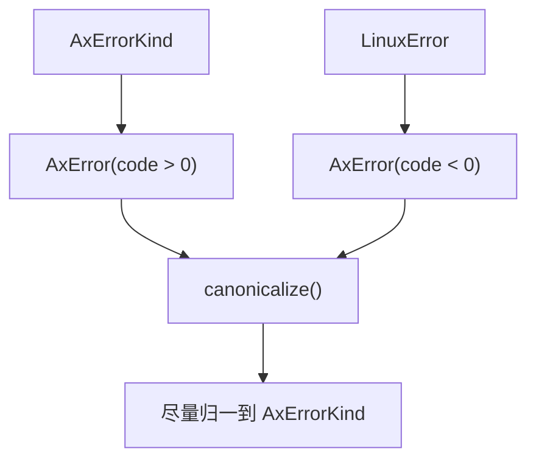
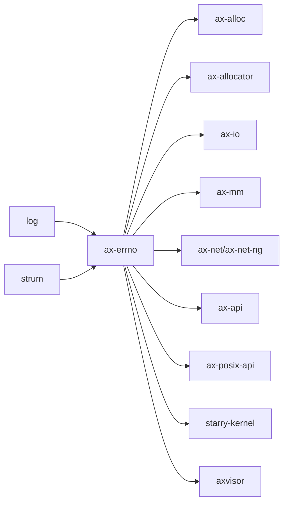

# `ax-errno` 技术文档

> 路径：`components/axerrno`
> 类型：库 crate
> 分层：组件层 / 错误码契约层
> 版本：`0.2.2`
> 文档依据：`Cargo.toml`、`README.md`、`build.rs`、`src/lib.rs`、`src/errno.h`

`ax-errno` 是 ArceOS 体系的统一错误码契约层。它同时维护一套面向内核模块的 `AxErrorKind`，以及一套面向 Linux/POSIX 兼容层的 `LinuxError`，并用 `AxError` 把两者压缩到单个 `i32` 表示中。它是叶子基础件：负责错误值的表示和转换，不负责错误传播策略、日志策略或 syscall 分派策略。

## 1. 架构设计分析
### 1.1 设计定位
这个 crate 解决的核心问题是“不同层次的错误语义如何共存”：

- 内核内部希望用较稳定、较抽象的 `AxErrorKind`。
- POSIX/Linux 兼容路径又必须能落到具体 `errno`。
- 与 C、syscall、FFI 打交道时，最终还得压成 `i32`。

`ax-errno` 的做法不是让所有地方都直接用 `errno`，而是先提供抽象层，再在需要时桥接到 Linux 错误码。

### 1.2 模块与生成流程
- `build.rs`：从 `src/errno.h` 生成 `linux_errno.rs`。
- `linux_errno` 模块：由构建脚本生成，提供 `LinuxError` 枚举。
- `src/lib.rs`：定义 `AxErrorKind`、`AxError`、转换逻辑以及一组便捷宏。

### 1.3 关键类型
- `AxErrorKind`：ArceOS 侧的规范化错误类别，正值编码，`#[non_exhaustive]`。
- `LinuxError`：从 Linux `errno.h` 派生的错误码枚举。
- `AxError`：透明包装的 `i32`，正数表示 `AxErrorKind`，负数表示 `LinuxError`。
- `AxResult<T>` / `LinuxResult<T>`：对应的结果别名。

### 1.4 表示与转换语义
`AxError` 的编码规则是整个 crate 最关键的设计：



几个源码级细节值得明确：

- `AxErrorKind::try_from(i32)` 只接受正值规范化错误码。
- `AxError::try_from(i32)` 同时接受正的 `AxErrorKind` 和负的 `LinuxError`。
- `AxError::canonicalize()` 会尽量把 `LinuxError` 转成对应 `AxErrorKind`，方便内核内部统一处理。
- `Display` 和 `Debug` 会根据内部到底装的是 `AxErrorKind` 还是 `LinuxError` 输出不同信息。

### 1.5 宏层接口
这个 crate 不只提供类型，还提供一组高频宏：

- `ax_err_type!`：构造 `AxError` 并顺带 `warn!`。
- `ax_err!`：构造 `Err(AxError)`。
- `ax_bail!`：直接 `return Err(...)`。
- `ensure!`：条件不满足时早返回。

这说明 `ax-errno` 不只是“枚举定义”，而是同时承担一套轻量错误书写 DSL。

## 2. 核心功能说明
### 2.1 主要功能
- 统一 ArceOS 错误类别表示。
- 提供 Linux errno 桥接。
- 提供 `i32` 编码与解码规则。
- 提供便捷宏，降低错误返回样板代码。

### 2.2 关键 API 与真实使用位置
- `AxErrorKind` / `AxError`：在 `ax-alloc`、`ax-mm`、`ax-net`、`ax-fs`、`ax-task` 等模块里高频使用。
- `LinuxError`：在 `ax-libc`、`ax-posix-api`、`ax-net-ng` 的 POSIX 兼容路径中直接使用。
- `ax_err!` / `ax_err_type!`：在 `axvisor`、`ax-net`、`ax-std`、`ax-task` 等代码里广泛出现。
- `canonicalize()`：适合把兼容层传回来的 Linux 错误重新折叠到内核内部语义。

### 2.3 使用边界
- `ax-errno` 不负责“何时打印日志”；宏里的 `warn!` 只是便捷副作用，不等于统一错误审计策略。
- `ax-errno` 不负责“错误恢复”；它只描述错误值，不描述恢复流程。
- `LinuxError` 和 `AxErrorKind` 不是简单同义词；`AxError` 能同时承载两套编码语义。

## 3. 依赖关系图谱


### 3.1 关键直接依赖
- `strum`：为 `AxErrorKind` 提供计数等派生能力。
- `log`：支撑 `ax_err_type!` 等宏里的 `warn!` 输出。

### 3.2 关键直接消费者
- ArceOS 几乎所有核心模块：`ax-alloc`、`ax-mm`、`ax-fs`、`ax-net`、`ax-task`、`ax-std`、`ax-libc`。
- StarryOS 内核与相关虚拟化组件。
- Axvisor 和其设备/虚拟机管理路径。

## 4. 开发指南
### 4.1 依赖配置
```toml
[dependencies]
ax-errno = { workspace = true }
```

### 4.2 修改时的关键约束
1. 新增 `AxErrorKind` 时，必须同步更新 `as_str()`、到 `LinuxError` 的转换、从 `LinuxError` 的逆转换以及常量导出宏。
2. `AxError` 的正负号编码语义不能随意改；这会直接影响 syscall/FFI 边界。
3. 修改 `errno.h` 或 `build.rs` 时，要确认生成出的 `LinuxError` 与兼容层使用的常量值一致。
4. 不要把“模块语义错误”直接塞成 Linux errno；内核内部优先表达为 `AxErrorKind` 更稳定。

### 4.3 开发建议
- 需要写内核通用代码时优先返回 `AxResult<T>`。
- 只在 POSIX/Linux 兼容边界附近落到 `LinuxError` 或负 errno。
- 宏很方便，但对热点路径或精细日志控制的代码，仍要明确评估其 `warn!` 副作用是否合适。

## 5. 测试策略
### 5.1 当前测试形态
`src/lib.rs` 已有两类关键测试：

- `test_try_from()`：验证编码范围与 `i32` 解码规则。
- `test_conversion()`：验证 `LinuxError` 与 `AxError` 的双向转换。

### 5.2 单元测试重点
- 新增错误种类后的转换表完整性。
- `canonicalize()` 在 Ax/Linux 两套错误语义间的归一行为。
- 宏在有无日志环境下的返回值稳定性。

### 5.3 集成测试重点
- POSIX 路径返回的错误码能否被 `ax-libc`、`ax-posix-api` 正确消费。
- 内核内部模块使用 `AxResult` 时，错误语义是否仍保持一致。

### 5.4 覆盖率要求
- 对 `ax-errno`，转换表覆盖率是核心指标。
- 任何新增或调整错误码映射的改动，都必须补齐正向和逆向测试。

## 6. 跨项目定位分析
### 6.1 ArceOS
`ax-errno` 是 ArceOS 基础栈里最广泛共享的契约层之一。它把驱动、文件系统、网络、内存、任务等模块的错误语义统一到同一套类型上。

### 6.2 StarryOS
StarryOS 复用 `ax-errno` 作为内核内部与 Linux 兼容边界之间的错误桥。它在这里仍是契约层，而不是“系统调用错误处理框架”本身。

### 6.3 Axvisor
Axvisor 同样直接使用 `ax-errno`。在 hypervisor 场景里，它承担的是跨模块统一错误值的角色，而不是 VMM 策略层。
