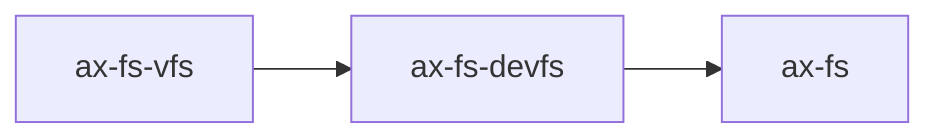

# `axfs_devfs` 技术文档

> 路径：`components/axfs_crates/axfs_devfs`
> 类型：库 crate
> 分层：组件层 / 可复用基础组件
> 版本：`0.1.2`
> 文档依据：`Cargo.toml`、`README.md`、`src/lib.rs`、`src/dir.rs`、`src/null.rs`、`src/zero.rs`、`src/urandom.rs`、`src/tests.rs`

`axfs_devfs` 是旧文件系统栈中的设备文件系统实现。它建立在 `axfs_vfs` 之上，提供一棵由代码显式构造的目录树，并内置 `/dev/null`、`/dev/zero`、`/dev/urandom` 这类典型字符设备节点所需的最小行为模型。

## 1. 架构设计分析
### 1.1 设计定位
`axfs_devfs` 的定位非常明确：

- 它是一个具体文件系统实现，而不是 VFS 抽象层。
- 它服务于旧 `ax-fs` 栈，用于把设备节点挂入统一根目录。
- 它更像“程序构造出的静态设备树”，而不是能处理热插拔、权限、设备号和复杂 ioctl 语义的完整 devfs。

### 1.2 内部模块划分
- `src/lib.rs`：定义 `DeviceFileSystem`，负责根目录对象、`mkdir()`、`add()` 与挂载时父目录回填。
- `src/dir.rs`：目录节点实现。内部用 `BTreeMap<&'static str, VfsNodeRef>` 保存子节点，并负责 `lookup`、`read_dir`、路径递归。
- `src/null.rs`：`/dev/null` 语义。
- `src/zero.rs`：`/dev/zero` 语义。
- `src/urandom.rs`：`/dev/urandom` 语义。
- `src/tests.rs`：覆盖目录树构造、路径遍历、父目录关系与设备读写行为。

### 1.3 关键设计点
#### 根目录由代码构造
`DeviceFileSystem` 不从磁盘加载任何内容。调用者通过：

- `mkdir(name)` 创建目录
- `add(name, node)` 插入节点

来构造整棵设备树。

#### 挂载时只修正父关系
`mount()` 的核心动作不是加载设备，而是把根目录的 `parent` 设置为挂载点父目录，使 `..` 语义在挂载后仍然成立。

#### 目录树默认不可动态修改
`DirNode::create()` 与 `DirNode::remove()` 最终都会返回 `PermissionDenied`。这说明当前 devfs 更像“只读目录结构 + 可读写设备节点”，而不是运行时可增删节点的管理器。

### 1.4 与相邻 crate 的边界
- `axfs_devfs` 位于 `axfs_vfs` 之上，是旧栈的具体叶子文件系统。
- 它和 `axfs_ramfs` 同级，但用途不同：`ramfs` 存普通文件内容，`devfs` 存设备节点。
- StarryOS 当前的 `/dev` 并不复用它，而是在 `axfs-ng-vfs` 之上自建了新一套 pseudofs 设备树。

## 2. 核心功能说明
### 2.1 主要功能
- 维护一棵静态设备目录树。
- 提供空设备、零设备、伪随机设备的最小实现。
- 通过 `lookup`/`read_dir`/`parent` 支持路径遍历。
- 在挂载到旧 `ax-fs` 根目录后提供兼容性的 `/dev/*` 节点。

### 2.2 内置设备节点行为
#### `NullDev`
- `read_at()` 始终返回 `0`，表示 EOF。
- `write_at()` 直接丢弃输入并返回写入字节数。
- 属性类型为 `CharDevice`。

#### `ZeroDev`
- `read_at()` 会把缓冲区填零。
- `write_at()` 丢弃数据。
- 适合表示经典 `/dev/zero`。

#### `UrandomDev`
- `read_at()` 基于简单 LCG 伪随机数生成器填充字节流。
- 默认种子固定为 `0xa2ce_a2ce`。
- 它不是密码学安全随机源，更接近“方便测试与占位”的 `/dev/urandom` 近似实现。

### 2.3 目录语义
- 目录节点使用 `BTreeMap`，因此遍历顺序稳定。
- `read_dir()` 会显式合成 `.` 和 `..`。
- `lookup()` 支持 `.`、`..` 以及多层递归路径。
- 动态创建/删除路径默认被拒绝，避免 devfs 在运行期被当普通目录使用。

## 3. 依赖关系图谱


### 3.1 关键直接依赖
- `axfs_vfs`：旧栈节点 trait 与目录项/属性结构。
- `spin`：目录树内部锁。
- `log`：目录创建/删除等调试输出辅助。

### 3.2 关键直接消费者
- `ax-fs`：把它作为旧栈根目录中的设备文件系统挂载来源。

### 3.3 与相邻 crate 的关系
- `axfs_devfs` 和 `axfs_ramfs` 一样，都是 `ax-fs` 可以挂入根目录的具体叶子文件系统。
- 它不提供磁盘格式适配，也不参与块设备扫描。

## 4. 开发指南
### 4.1 接入方式
```toml
[dependencies]
ax-fs-devfs = { workspace = true }
```

### 4.2 使用与改动约束
1. 目录结构应通过 `mkdir()`/`add()` 在代码里显式构造，不要假设用户可以通过普通 `create()` 动态添加节点。
2. 如果新增设备节点，请实现 `VfsNodeOps` 并准确返回 `CharDevice` 或其他设备类型。
3. 如果设备需要复杂阻塞/轮询/ioctl 语义，旧 `axfs_vfs` 表达能力有限，可能更适合放到新栈 pseudofs 中实现。
4. 修改 `mount()` 时要确保 `..` 仍能正确回到外层目录。

### 4.3 扩展建议
- 若需要新的静态设备节点，可以直接复用 `add()`。
- 若需要可动态创建的设备树，需要先重构 `DirNode::create()`/`remove()` 的权限策略。
- 若需要真实随机源、设备号和元数据更新，应优先评估迁移到 `axfs-ng-vfs`/StarryOS pseudofs 风格实现。

## 5. 测试策略
### 5.1 当前测试形态
`src/tests.rs` 已经覆盖：

- 路径归一化与多级查找
- 目录与父目录关系
- `NullDev` / `ZeroDev` 的读写语义

### 5.2 建议的单元测试
- `UrandomDev` 的种子推进与重复读取行为。
- 动态创建/删除路径被拒绝的错误码。
- 挂载前后 `parent()` 变化。

### 5.3 建议的集成测试
- 在 `ax-fs` 根目录下挂载后，通过统一 API 访问 `/dev/null`、`/dev/zero`。
- 验证挂载后 `..` 能正确返回外层目录。

### 5.4 高风险回归点
- 修改 `DirNode` 的 `parent` 逻辑后，挂载目录中的 `..` 失效。
- 把 `UrandomDev` 误当作安全随机源使用。
- 动态创建/删除权限被放宽后破坏“静态设备树”假设。

## 6. 跨项目定位分析
### 6.1 ArceOS
`axfs_devfs` 是 ArceOS 旧文件系统栈中的设备文件系统叶子实现，主要供 `ax-fs` 聚合后作为 `/dev` 一类设备节点来源。

### 6.2 StarryOS
当前仓库中的 StarryOS 没有直接使用 `axfs_devfs`，而是基于 `axfs-ng-vfs` 自建 devfs。因此它在 StarryOS 里不是现行主线组件。

### 6.3 Axvisor
当前仓库里的 `os/axvisor` 没有直接依赖 `axfs_devfs`。它的跨项目价值主要体现在旧栈组件复用，而不是当前 Axvisor 代码路径中的公共设备文件系统层。
