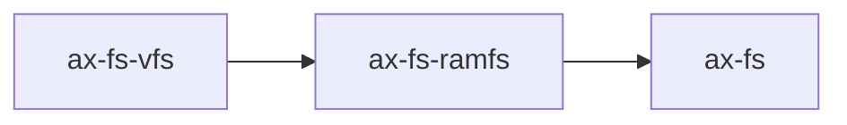

# `axfs_ramfs` 技术文档

> 路径：`components/axfs_crates/axfs_ramfs`
> 类型：库 crate
> 分层：组件层 / 可复用基础组件
> 版本：`0.1.2`
> 文档依据：`Cargo.toml`、`README.md`、`src/lib.rs`、`src/dir.rs`、`src/file.rs`、`src/tests.rs`、`os/arceos/modules/axfs/src/root.rs`、`os/arceos/modules/axfs/src/mounts.rs`

`axfs_ramfs` 是旧文件系统栈中的纯内存文件系统实现。它以最小成本提供目录树和普通文件内容存储，既可以作为 `ax-fs` 在没有可识别磁盘文件系统时的回退根文件系统，也可以作为旧 `/proc`、`/sys` 兼容目录树的底层存储容器。

## 1. 架构设计分析
### 1.1 设计定位
`axfs_ramfs` 的目标非常聚焦：

- 提供一个不依赖块设备的旧栈叶子文件系统。
- 用于承载普通文件和目录，而不是设备节点、socket、复杂元数据或持久化语义。
- 以最简单的数据结构达成可用性：目录用 `BTreeMap`，文件内容用 `Vec<u8>`。

因此，它更像“最小可用的内存目录树”，而不是现代 tmpfs 的完整实现。

### 1.2 内部模块划分
- `src/lib.rs`：定义 `RamFileSystem`，提供根目录对象和挂载时的父目录修正逻辑。
- `src/dir.rs`：目录节点实现，负责 `lookup`、`read_dir`、`create`、`remove` 与目录树维护。
- `src/file.rs`：文件节点实现，负责内存缓冲区读写与截断。
- `src/tests.rs`：覆盖目录树创建、读写、空洞填零、删除和父目录关系。

### 1.3 关键数据结构
#### 目录节点
`DirNode` 维护：

- `parent: Weak<dyn VfsNodeOps>`
- `children: BTreeMap<String, VfsNodeRef>`

目录节点支持递归路径拆分，因此旧 `ax-fs` 调它时不必自己逐层拆目录。

#### 文件节点
`FileNode` 内部只有一个 `RwLock<Vec<u8>>`。这说明：

- 没有页缓存层。
- 没有磁盘回写。
- 没有稀疏文件专用结构。
- 所有数据都直接保存在内存中的连续字节向量里。

### 1.4 与相邻 crate 的边界
- `axfs_ramfs` 是旧 `axfs_vfs` 体系下的具体文件系统实现。
- 它和 `axfs_devfs` 同级，但只支持普通文件/目录，不支持字符设备语义。
- StarryOS 当前的 `tmpfs` 并不复用它，而是在 `axfs-ng-vfs` 上实现了新的 `MemoryFs`；新实现拥有更完整的元数据模型，也能与新栈页缓存协作。

## 2. 核心功能说明
### 2.1 主要功能
- 在内存中创建、查找和删除文件/目录。
- 为普通文件提供 `read_at`、`write_at`、`truncate`。
- 通过 `root_dir_node()` 暴露强类型根目录节点，便于直接枚举条目。
- 在旧 `ax-fs` 中承担回退根文件系统和伪文件树承载层。

### 2.2 文件语义
#### 空洞写入
如果对一个超出当前长度的 offset 执行 `write_at()`，`Vec<u8>` 会先 `resize()`，中间空洞用 `0` 补齐。这使它具备了最基础的“写出文件空洞时读回零值”的行为。

#### 截断与扩容
`truncate(size)`：

- 如果 `size` 更小，则直接截断。
- 如果 `size` 更大，则扩容并用 `0` 填充新增部分。

#### 读取
`read_at()` 只从当前已有内容中拷贝可用范围，不存在的区域不会隐式增长文件。

### 2.3 目录语义
- `create()` 支持递归路径拆分，但只允许 `File` 和 `Dir` 两种节点类型。
- `remove()` 会拒绝删除非空目录。
- `read_dir()` 会显式合成 `.` 和 `..`。
- `parent()` 的正确性依赖挂载时 `set_parent()` 的修正。

### 2.4 在旧 `ax-fs` 中的真实角色
当前仓库里的旧 `ax-fs` 直接依赖 `axfs_ramfs` 做两件事：

1. 没有识别到可用 FAT/ext4 根盘时，把 `ramfs` 作为回退根文件系统。
2. 构建 `/proc` 与 `/sys` 这类兼容性伪文件树时，把它们的节点内容放进 `ramfs`。

因此，`axfs_ramfs` 不只是一个通用内存文件系统组件，也是旧栈启动兜底路径的一部分。

## 3. 依赖关系图谱


### 3.1 关键直接依赖
- `axfs_vfs`：旧栈文件系统 trait 契约。
- `spin`：目录和文件内容锁。
- `log`：创建/删除路径调试输出。

### 3.2 关键直接消费者
- `ax-fs`：用它做回退根文件系统与伪文件树存储层。

### 3.3 与相邻 crate 的关系
- `axfs_ramfs` 与 `axfs_devfs` 一起构成旧栈中的两个重要伪文件系统叶子实现。
- 与 `rsext4`、FAT 适配层不同，它完全不接触块设备与磁盘格式。

## 4. 开发指南
### 4.1 接入方式
```toml
[dependencies]
ax-fs-ramfs = { workspace = true }
```

### 4.2 使用与改动约束
1. 当前仅支持 `File` 和 `Dir` 两种节点类型；如果传入其他 `VfsNodeType`，会返回 `Unsupported`。
2. 修改 `write_at()` 或 `truncate()` 时，要特别注意“空洞读零”和“扩容补零”语义。
3. 修改目录删除逻辑时，必须保留非空目录报错语义，否则会破坏旧 `ax-fs` 的目录安全假设。
4. 修改挂载逻辑时，要验证 `..` 是否还能回到挂载点父目录。

### 4.3 扩展建议
- 如果只是给旧栈增加少量启动期临时文件，`axfs_ramfs` 已足够。
- 如果需要 `uid/gid`、时间戳、socket、设备号、节点扩展数据或更复杂缓存语义，继续扩展它的收益很低，应优先转向 `axfs-ng-vfs` 栈。

## 5. 测试策略
### 5.1 当前测试形态
`src/tests.rs` 已覆盖：

- 文件创建与目录创建
- 目录遍历
- 空洞写入后读零
- 非空目录删除失败
- 父目录与路径归一化

### 5.2 建议的单元测试
- 更大 offset 空洞写入。
- 多次 truncate 的收缩/扩容交替。
- 多层目录递归删除的错误路径。

### 5.3 建议的集成测试
- 在旧 `ax-fs` 中作为回退根文件系统启动。
- `/proc`、`/sys` 伪文件树依赖的 `ramfs` 节点创建与读取。
- 挂载到根目录后 `.`/`..` 与绝对/相对路径访问的一致性。

### 5.4 高风险回归点
- `write_at()` 改坏空洞补零语义。
- `remove()` 放宽后误删非空目录。
- `set_parent()` 逻辑变化导致挂载后的 `..` 失效。

## 6. 跨项目定位分析
### 6.1 ArceOS
在 ArceOS 旧文件系统栈里，`axfs_ramfs` 是最重要的内存文件系统叶子实现之一，既承担回退根盘，也承担旧伪文件树的底层存储。

### 6.2 StarryOS
当前仓库里的 StarryOS 已经不直接使用 `axfs_ramfs`。它在 `axfs-ng-vfs` 之上自建了新的 `MemoryFs`/tmpfs，因此 `axfs_ramfs` 在 StarryOS 中不属于主线组件。

### 6.3 Axvisor
当前仓库里的 `os/axvisor` 没有直接依赖 `axfs_ramfs`。它在这棵代码树中的主要价值是旧栈内存文件系统组件复用，而不是 Axvisor 当前文件系统路径中的公共层。
