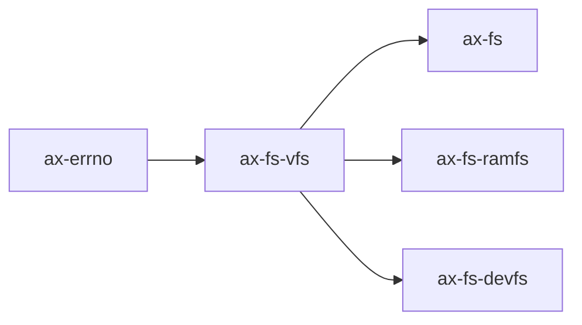

# `axfs_vfs` 技术文档

> 路径：`components/axfs_crates/axfs_vfs`
> 类型：库 crate
> 分层：组件层 / 可复用基础组件
> 版本：`0.1.2`
> 文档依据：`Cargo.toml`、`README.md`、`src/lib.rs`、`src/structs.rs`、`src/path.rs`

`axfs_vfs` 是旧文件系统栈使用的 VFS trait 契约。它提供的不是完整的挂载与名字空间对象模型，而是一组足够让 `ax-fs`、`axfs_ramfs`、`axfs_devfs` 和格式适配层对接起来的最小接口集合。

## 1. 架构设计分析
### 1.1 设计定位
`axfs_vfs` 的设计非常克制：

- 它只定义文件系统与节点的基础操作接口。
- 它把“当前目录”“挂载点选择”“跨文件系统路径路由”等更高层逻辑留给 `ax-fs` 去做。
- 它更像一个稳定的旧栈 ABI，而不是一个带运行时对象图的 VFS 内核框架。

因此，理解 `axfs_vfs` 的最好方式不是把它看成 Linux VFS 的缩影，而是把它看成“旧栈统一节点能力的 trait 合同”。

### 1.2 核心模块
- `src/lib.rs`：定义 `VfsOps`、`VfsNodeOps`、`VfsNodeRef` 以及默认错误语义。
- `src/structs.rs`：定义 `VfsNodeAttr`、`VfsNodePerm`、`VfsNodeType`、`VfsDirEntry`、`FileSystemInfo`。
- `src/path.rs`：提供字符串级路径规范化工具 `canonicalize()`。
- `src/macros.rs`：提供 `impl_vfs_dir_default!`、`impl_vfs_non_dir_default!` 两个宏，用于快速补齐“不适用操作返回错误”的默认实现。

### 1.3 核心对象与限制
#### `VfsOps`
用于表达“一个文件系统实例”，核心接口只有：

- `mount()`
- `umount()`
- `format()`
- `statfs()`
- `root_dir()`

其中 `mount()`/`umount()` 只是回调钩子，并不负责全局挂载图管理。

#### `VfsNodeOps`
用于表达文件与目录节点。它既承担文件读写接口，也承担目录遍历和创建删除接口，因此实现者通常会结合 `impl_vfs_dir_default!` 或 `impl_vfs_non_dir_default!` 来屏蔽不适用的方法。

#### 属性模型
`VfsNodeAttr` 只记录：

- 权限位
- 节点类型
- 字节大小
- 512B block 数

它没有 `uid/gid`、时间戳、设备号、链接数等更完整的 Unix 元数据。

#### 名字长度限制
`VfsDirEntry` 内部使用固定的 63 字节缓冲区存名字，超长名字只会报警告。这是旧栈接口级别的硬限制之一。

### 1.4 与 `axfs-ng-vfs` 的差异澄清
- `axfs_vfs` 没有 `Mountpoint`、`Location`、`MetadataUpdate`、`NodeFlags`、`Pollable`、`user_data`。
- `axfs_vfs` 的 `FileSystemInfo` 目前几乎是空壳结构；新栈的 `StatFs` 才是真正可用的统计结构。
- `axfs_vfs` 不负责跨设备重命名/硬链接规则；旧 `ax-fs` 只能在自己那层做有限约束。

## 2. 核心功能说明
### 2.1 主要功能
- 为旧栈文件系统定义统一 trait。
- 为目录项、节点属性和权限位定义统一结构。
- 提供路径规范化工具。
- 提供用于区分目录/非目录节点的默认实现宏。

### 2.2 真实实现语义
- `lookup(self: Arc<Self>, path: &str)` 把 `Arc<Self>` 直接暴露给实现者，这意味着目录实现通常自行维护 `Arc`/`Weak` 父子关系。
- `create()`/`remove()`/`rename()` 都是字符串路径风格接口，路径拆分和递归路由由具体文件系统自己决定。
- `path::canonicalize()` 只做纯字符串归一化，不查询文件系统，也不会强制转成绝对路径。

### 2.3 典型使用方式
在当前仓库里，它的直接消费者主要有三类：

- `ax-fs`：系统级聚合层。
- `axfs_ramfs`：内存文件系统。
- `axfs_devfs`：设备文件系统。

也就是说，它服务的是一整套旧栈组件，而不是面向最终业务逻辑直接暴露。

## 3. 依赖关系图谱


### 3.1 关键直接依赖
- `ax-errno`：错误码来源。
- `bitflags`：权限位实现。
- `log`：长目录项名警告等辅助日志。

### 3.2 关键直接消费者
- `ax-fs`：通过它抽象 FAT/ext4/ramfs/devfs 节点。
- `axfs_ramfs`：用它定义纯内存文件与目录。
- `axfs_devfs`：用它定义设备目录树与字符设备节点。

### 3.3 与相邻 crate 的关系
- `axfs_vfs` 在旧栈里处于“接口层”。
- `axfs_ramfs`、`axfs_devfs` 是它之上的具体实现层。
- `ax-fs` 则是再上一层的系统装配层。

## 4. 开发指南
### 4.1 接入方式
```toml
[dependencies]
ax-fs-vfs = { workspace = true }
```

### 4.2 实现约束
1. 目录实现通常需要自己维护 `parent()` 的 `Arc/Weak` 关系，因为 trait 本身不替你管理节点图。
2. `get_attr()` 必须准确返回节点类型与权限位，高层很多行为都靠它判定。
3. 如果你实现的是目录节点，请优先使用 `impl_vfs_dir_default!` 补齐无意义的文件操作。
4. 如果你实现的是文件节点，请优先使用 `impl_vfs_non_dir_default!` 补齐无意义的目录操作。

### 4.3 扩展建议
- 如果你的目标是完整 Unix 语义、挂载图、轮询和节点级扩展点，继续扩展 `axfs_vfs` 的收益不高，优先考虑 `axfs-ng-vfs`。
- 如果只是给旧 `ax-fs` 增加一种简单叶子文件系统，实现 `VfsOps`/`VfsNodeOps` 仍然是最低成本路径。
- 写 `rename()` 时要明确是否支持跨目录或跨挂载点；旧 trait 不会替你兜底。

## 5. 测试策略
### 5.1 当前测试形态
当前 crate 自带测试主要集中在 `src/path.rs`，验证路径规范化行为。

### 5.2 建议的单元测试
- `canonicalize()` 的边界条件。
- `VfsNodePerm` 与 `VfsNodeType` 的辅助方法。
- 目录项名超过 63 字节时的行为。
- 默认宏返回错误类型是否符合预期。

### 5.3 建议的集成测试
- 用一个最小 dummy fs 同时验证 `lookup`、`create`、`remove`、`read_dir`、`rename`。
- 在 `ax-fs` 中验证 `VfsNodeAttr` 对权限与类型判断的影响。
- 在 `axfs_ramfs`/`axfs_devfs` 中验证 `parent()` 与路径递归。

### 5.4 高风险回归点
- 目录和文件默认操作错误码变化。
- 固定长度目录项名缓冲带来的兼容性问题。
- `lookup(self: Arc<Self>)` 所要求的所有权语义被破坏。

## 6. 跨项目定位分析
### 6.1 ArceOS
`axfs_vfs` 是 ArceOS 旧文件系统栈的接口基石。`ax-fs`、`axfs_ramfs`、`axfs_devfs` 都围绕这套 trait 工作。

### 6.2 StarryOS
当前仓库里的 StarryOS 已转向 `ax-fs-ng`/`axfs-ng-vfs` 栈，没有直接复用 `axfs_vfs`。因此它对 StarryOS 更像历史接口层，而不是主线基础设施。

### 6.3 Axvisor
当前仓库里的 `os/axvisor` 没有直接依赖 `axfs_vfs`。它在这棵代码树中的主要意义是旧文件系统组件间的共享接口，而不是跨所有项目通用的 VFS 核心。
