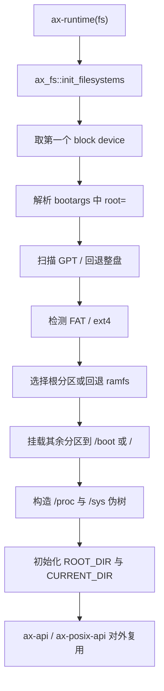
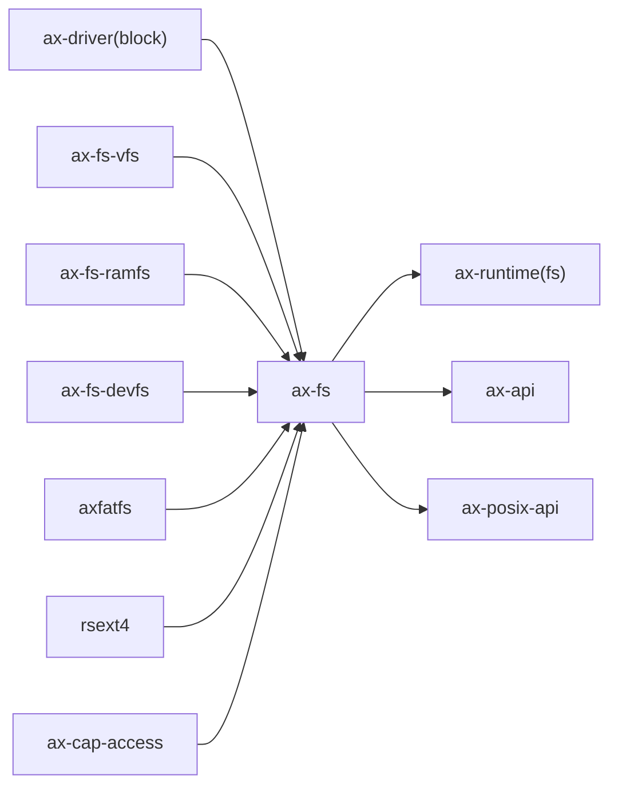

# `ax-fs` 技术文档

> 路径：`os/arceos/modules/axfs`
> 类型：库 crate
> 分层：ArceOS 层 / ArceOS 内核模块
> 版本：`0.3.0-preview.3`
> 文档依据：`Cargo.toml`、`src/lib.rs`、`src/root.rs`、`src/partition.rs`、`src/dev.rs`、`src/fops.rs`、`src/fs/fatfs.rs`、`src/fs/ext4fs.rs`、`src/mounts.rs`、`os/arceos/modules/axruntime/src/lib.rs`、`os/arceos/api/ax-api/src/imp/fs.rs`、`os/arceos/api/arceos_posix_api/src/imp/fs.rs`

`ax-fs` 是当前仓库中“旧文件系统栈”的系统装配器。它本身并不是一个具体文件系统实现，而是把块设备访问、分区扫描、FAT/ext4 适配、`ramfs`/`devfs` 以及根目录挂载树组合在一起，再向 ArceOS 运行时、`ax-api` 和 `ax-posix-api` 暴露一套统一的文件接口。

## 1. 架构设计分析
### 1.1 设计定位
`ax-fs` 位于 `ax-runtime` 与旧版 `axfs_vfs` trait 生态之间，承担的是“启动期装配 + 运行期路径路由”双重职责：

- 启动期，它从 `ax-driver` 提供的块设备中取出第一个块设备，解析 `bootargs` 中的 `root=` 参数，扫描 GPT 或直接把整盘视为单分区，再决定根文件系统应该落在哪个分区上。
- 运行期，它通过 `RootDirectory` 把根文件系统、额外挂载分区以及 `/proc`、`/sys` 这类伪文件树拼成一个统一视图。
- API 层，它提供两套接口：`api` 模块更接近 `std::fs` 风格，`fops` 模块则更像内核内部使用的打开文件/目录对象。

这意味着 `ax-fs` 的重心不是“实现某种文件系统格式”，而是“把多种旧栈组件按当前系统启动方式拼起来”。

### 1.2 内部模块划分
- `src/lib.rs`：初始化主入口。负责选择块设备、解析 `root=`、触发 GPT 扫描与根文件系统初始化。
- `src/dev.rs`：把 `AxBlockDevice` 包装成带游标的 `Disk`，再切出 `Partition` 视图。整个旧栈默认以 512B block 为基本访问粒度。
- `src/partition.rs`：解析 GPT 分区表，检测 FAT/ext4 魔数，提取 `UUID`/`PARTUUID`，并根据检测结果创建具体文件系统实例。
- `src/root.rs`：定义 `RootDirectory`、挂载点表、全局当前目录，以及 `lookup`/`create`/`remove`/`rename` 等根级路径路由逻辑。
- `src/fs/fatfs.rs`：把 `axfatfs` 适配为 `ax_fs_vfs::VfsOps`/`VfsNodeOps`。
- `src/fs/ext4fs.rs`：把 `rsext4` 适配为 `ax_fs_vfs::VfsOps`/`VfsNodeOps`。
- `src/fs/mod.rs`：暴露旧栈下的具体文件系统实现，并直接复用 `axfs_devfs`、`axfs_ramfs`。
- `src/mounts.rs`：创建基于 `ramfs` 的 `/proc`、`/sys` 伪目录树。
- `src/fops.rs`：定义 `File`、`Directory`、`OpenOptions`，并使用 `ax_cap_access::WithCap` 在打开后绑定读写执行能力。
- `src/api/*`：向上提供更接近用户态或通用库风格的辅助函数。

### 1.3 启动与挂载主线
`ax-runtime` 在启用 `fs` feature 后会调用 `ax_fs::init_filesystems()`，实际主线如下：



几个实现细节尤其重要：

1. `root=` 支持 `/dev/sdaX`、`/dev/mmcblkXpY`、`PARTUUID=`、`UUID=`、`PARTLABEL=` 五类选择方式。
2. 如果 GPT 解析失败或没有识别到支持的文件系统，`ax-fs` 会记录告警；最终如果没有可用根文件系统，则回退到 `ramfs`。
3. 非根分区会被自动挂到 `/boot` 或 `/<partition.name>`；其中名字包含 `boot` 的分区优先挂到 `/boot`。
4. `/proc` 与 `/sys` 不是独立的动态内核文件系统，而是启动时填充好的 `ramfs` 树。

### 1.4 与相邻 crate 的边界
- `ax-fs` 是聚合层，不是叶子文件系统。真正的叶子实现是 `axfs_ramfs`、`axfs_devfs`、`axfatfs` 适配层以及 `rsext4` 适配层。
- `ax-fs` 自己维护挂载点表和根目录拼接逻辑；`axfs_vfs` 并不提供挂载图管理能力。
- `ax-fs` 的当前工作目录是 `ROOT_DIR`/`CURRENT_DIR` 这组全局静态对象，而不是任务局部对象。这一点与 `ax-fs-ng` 的 `FS_CONTEXT` 有本质差异。
- `root.rs` 顶部已经明确写出 TODO：当挂载点存在包含关系时，这套路由逻辑并不“工作得很好”。因此它更适合简单的根目录拼装，而不是复杂命名空间系统。

## 2. 核心功能说明
### 2.1 主要功能
- 启动时自动选择根文件系统，并在 FAT 与 ext4 间做格式检测。
- 提供 GPT 分区扫描与 `UUID`/`PARTUUID` 识别。
- 把主根文件系统、额外挂载分区和伪文件系统合并成统一根目录。
- 通过 `fops` 提供打开文件、打开目录、读写、截断、遍历、重命名等低层接口。
- 通过 `api` 提供 `read`、`write`、`create_dir`、`current_dir` 等高层辅助函数。

### 2.2 关键实现细节
#### 根目录拼接
`RootDirectory` 持有一个 `main_fs` 和一组 `mounts`。对 `lookup`、`create`、`remove` 这类路径操作，它会先选取“最长前缀命中的挂载点”，再把剩余路径转发给具体文件系统；对 `read_dir`，它会把挂载点名和主根目录条目合并后去重输出。

#### 权限模型
`fops::File`/`Directory` 打开时会根据 `OpenOptions` 生成 `Cap`，并与 `VfsNodeAttr::perm()` 进行比对。也就是说，旧栈里的权限控制更接近“打开时绑定能力”，而不是完整的 Unix `uid/gid/mode` 模型。

#### ext4/FAT 接入方式
- FAT 路径通过 `PartitionWrapper` 把分区包装成 `axfatfs` 所需的 `Read`/`Write`/`Seek` 设备，再适配到 `VfsNodeOps`。
- ext4 路径通过 `Jbd2Dev<Disk|Partition>` 挂载 `rsext4`，由 `Ext4FileSystem{,Partition}` 包装成旧 `VfsOps`。

#### 伪文件系统内容
`mounts.rs` 当前仅创建了少量兼容性节点，例如：

- `/proc/sys/net/core/somaxconn`
- `/proc/sys/vm/overcommit_memory`
- `/proc/self/stat`
- `/sys/kernel/mm/transparent_hugepage/enabled`
- `/sys/devices/system/clocksource/clocksource0/current_clocksource`

这些节点本质上是预填充值文件，不具备真正的动态内核视图能力。

### 2.3 真实限制与注意事项
- 只取第一个块设备，不做多块设备选择策略。
- `Directory::rename()` 注释已明确说明：仅在源和目标位于同一已挂载文件系统时才可靠。
- `remove_dir()` 会显式阻止删除挂载点目录。
- `/proc`、`/sys` 目前不是真正的 procfs/sysfs，而是兼容性占位实现。

## 3. 依赖关系图谱


### 3.1 关键直接依赖
- `ax-driver`：提供块设备来源。
- `axfs_vfs`：旧栈统一 trait 契约。
- `axfs_ramfs`、`axfs_devfs`：旧栈中的内存文件系统与设备文件系统。
- `axfatfs`、`rsext4`：分别承担 FAT 与 ext4 的实际格式实现。
- `ax-cap-access`：为 `fops` 提供打开后能力控制。

### 3.2 关键直接消费者
- `ax-runtime`：在 `fs` feature 下初始化整个旧文件系统子系统。
- `ax-api`：把 `ax_fs::fops` 和 `ax_fs::api` 包装为更稳定的系统 API。
- `ax-posix-api`：当前仓库里的 POSIX 文件接口主要仍落在 `ax-fs` 上。

### 3.3 与相邻 crate 的关系
- `axfs_ramfs`/`axfs_devfs` 位于 `ax-fs` 之下，是旧栈的具体文件系统实现。
- `rsext4` 比 `ax-fs` 更靠下，只负责 ext4 语义，不负责根目录、当前目录或挂载树。
- `ax-fs-ng` 与 `ax-fs` 不是简单的“新旧版本号关系”，而是两套边界不同的文件系统栈。

## 4. 开发指南
### 4.1 接入方式
```toml
[dependencies]
ax-fs = { workspace = true }
```

对大多数 ArceOS 使用者来说，更常见的接入点其实是 `ax-feat`、`ax-runtime`、`ax-api` 或 `ax-posix-api`，而不是直接把 `ax-fs` 当独立库调用。

### 4.2 改动约束
1. 任何对 `init_filesystems()`、`parse_root_spec()`、`find_root_partition()` 的修改，都应被视为启动路径变更。
2. 任何对 `RootDirectory` 路由逻辑的修改，都必须同时验证 `lookup`、`read_dir`、`remove_dir` 与 `rename` 的挂载边界行为。
3. 任何对 `ext4fs.rs`/`fatfs.rs` 的修改，都要同步考虑旧 `axfs_vfs` trait 语义，而不是只看底层库自身接口。
4. 如果要增加新的伪文件系统节点，请明确它是“静态兼容性文件”还是“真正会动态更新的接口”，不要混淆两者。

### 4.3 扩展建议
- 若要继续扩展旧栈的块设备根盘识别，优先在 `partition.rs` 完成，而不是把格式探测散到 `root.rs`。
- 若要增强目录/文件权限模型，需要同时修改 `VfsNodeAttr` 提供者与 `fops` 中的 `perm_to_cap()` 路径。
- 若要支持更复杂的挂载命名空间或任务级 cwd，继续堆在 `root.rs` 上的收益已经不高，应优先考虑迁移到 `ax-fs-ng`/`axfs-ng-vfs` 风格。

## 5. 测试策略
### 5.1 当前测试形态
`ax-fs` 自身目录下没有独立的 `#[test]` 用例。当前验证主要依赖系统启动与上层 API 集成路径。

### 5.2 建议的单元测试
- `root=` 解析：覆盖 `/dev/sdaX`、`/dev/mmcblkXpY`、`PARTUUID=`、`UUID=`、`PARTLABEL=`。
- 分区扫描：覆盖 GPT 正常路径、GPT 失败回退路径、整盘直挂路径。
- `RootDirectory`：覆盖最长前缀挂载匹配、`read_dir` 去重、挂载点删除保护。
- `OpenOptions`：覆盖 `append`/`truncate`/`create_new` 组合合法性。

### 5.3 建议的集成测试
- FAT 根盘启动。
- ext4 根盘启动。
- 没有可识别文件系统时回退到 `ramfs`。
- `/proc`、`/sys` 兼容节点能被上层正常读取。
- `ax-api` 与 `ax-posix-api` 中的打开、读写、`stat`、`rename` 仍保持兼容。

### 5.4 高风险回归点
- 根目录挂载点存在包含关系时的路径解析。
- 跨挂载点 `rename`/`remove_dir`。
- `UUID`/`PARTUUID` 匹配大小写与格式兼容性。
- ext4 适配层与 `rsext4` 的 block size 换算。

## 6. 跨项目定位分析
### 6.1 ArceOS
`ax-fs` 仍是 ArceOS 旧 `fs` 路径的核心文件系统模块，并且当前 `ax-api`、`ax-posix-api` 仍直接建立在它之上。因此它在 ArceOS 中的定位依旧是“对外可见的旧文件系统栈入口”。

### 6.2 StarryOS
当前仓库里的 StarryOS 已转向 `ax-fs-ng`，并在 `Cargo.toml` 中把 `ax-fs-ng` 重命名为 `ax-fs` 使用；其 pseudofs 也建立在 `axfs-ng-vfs` 上，而不是继续复用旧 `ax-fs`。因此 `ax-fs` 对 StarryOS 来说更多是历史并行栈，而不是主干路径。

### 6.3 Axvisor
虽然源码版权和注释中能看到明显的 Axvisor 痕迹，但当前仓库里的 `os/axvisor` 并没有直接依赖 `ax-fs`。因此在这棵代码树里，`ax-fs` 更应理解为“被 Axvisor 团队扩展过的 ArceOS 旧文件系统模块”，而不是 Axvisor 当前运行时的直接文件系统入口。
