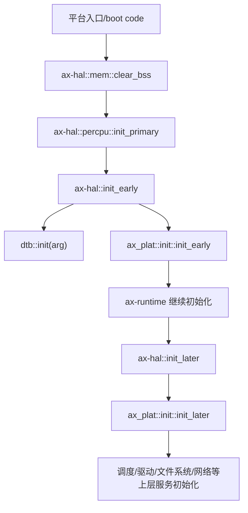
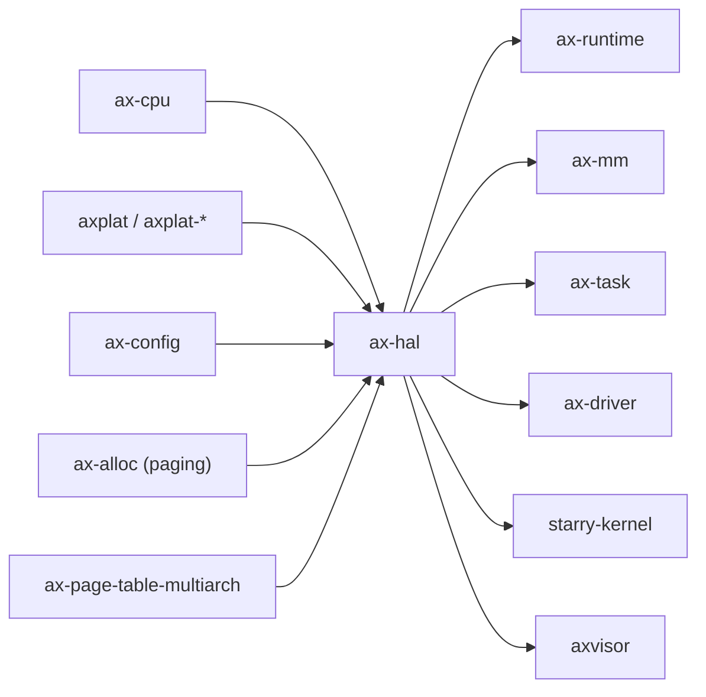

# `ax-hal` 技术文档

> 路径：`os/arceos/modules/axhal`
> 类型：库 crate
> 分层：ArceOS 层 / ArceOS 内核模块
> 版本：`0.3.0-preview.3`
> 文档依据：`Cargo.toml`、`src/lib.rs`、`src/dtb.rs`、`src/mem.rs`、`src/percpu.rs`、`src/irq.rs`、`src/paging.rs`、`src/tls.rs`、`build.rs`、`linker.lds.S`

`ax-hal` 是 ArceOS 家族中最关键的“硬件抽象粘合层”。它并不试图独立实现所有架构/平台逻辑，而是把 `ax-cpu` 的 ISA 语义、`axplat` 的平台实现和上层运行时需要的统一接口收束成一套稳定的 HAL 边界，因此它既是 `ax-runtime` 的启动基座，也是 `ax-mm`、`ax-task`、StarryOS 与 Axvisor 共同复用的低层能力入口。

## 1. 架构设计分析
### 1.1 设计定位
`ax-hal` 处在三层之间：

- 向下连接 `ax-cpu` 与 `axplat-*`，分别承接 ISA 级抽象和板级/平台级实现。
- 向上为 `ax-runtime`、`ax-mm`、`ax-task`、`ax-driver` 等模块提供统一 API。
- 在 `plat-dyn`、`defplat`、`myplat` 等 feature 作用下，决定最终链接到哪一类平台实现。

这意味着 `ax-hal` 的核心价值不是“算法复杂”，而是“边界清晰”与“初始化顺序正确”。它本质上是 ArceOS 运行时的硬件语义总入口。

### 1.2 内部模块划分
- `src/lib.rs`：顶层聚合与 feature 门控。决定是链接真实平台 crate，还是链接 `dummy` 平台以支持 `cargo test`。
- `src/dummy.rs`：无真实平台时的占位实现。通过 `axplat` 接口提供 no-op 或 `unimplemented!()` 行为，主要用于宿主侧测试构建。
- `src/dtb.rs`：管理 boot argument、FDT 解析与 `chosen.bootargs` 读取，负责把启动参数从引导阶段传给后续模块。
- `src/mem.rs`：整合链接符号、平台物理内存范围和 MMIO 区域，生成统一的 `memory_regions()` 视图，并负责 `.bss` 清零。
- `src/percpu.rs`：每 CPU 局部状态入口，维护当前任务指针并复用 `ax_plat::percpu` 提供的 CPU 本地能力。
- `src/time.rs`：时间相关能力的再导出层，把时钟源、计时器和时间转换统一暴露给上层。
- `src/irq.rs`：IRQ 处理桥接层，负责 trap handler 注册、IRQ hook、与 `ax_plat::irq` 的派发对接。
- `src/paging.rs`：页表处理桥接层，向 `ax-page-table-multiarch` 提供 `PagingHandlerImpl`，并在不同 ISA 下导出统一的页表类型。
- `src/tls.rs`：内核态 TLS 布局与 `TlsArea` 管理，仅在 `tls` feature 启用时进入构建。
- `build.rs` + `linker.lds.S`：根据 `axconfig` 注入链接脚本参数，例如内核基址、CPU 数、段布局等。

### 1.3 关键数据结构与全局对象
- `BOOTARG`：保存引导阶段传入的参数，后续由 DTB/FDT 解析流程读取。
- `ALL_MEM_REGIONS`：统一后的物理内存区域视图，是 `ax-alloc`、`ax-runtime` 等模块做内存初始化的基础。
- `CURRENT_TASK_PTR`：每 CPU 当前任务指针，供调度与上下文切换路径读取。
- `IRQ_HOOK`：可注册的 IRQ 钩子，用于平台 IRQ 分发前后的附加处理。
- `CPU_NUM`：在 `smp` 场景下，取平台声明 CPU 数与 `ax_config::plat::MAX_CPU_NUM` 的较小值。
- `PagingHandlerImpl`：把页表帧申请/释放与地址翻译能力接到上层页表实现中。
- `TlsArea`：内核态线程局部存储块管理对象，仅在 TLS 打开时参与主线。

### 1.4 启动与初始化主线
`ax-hal` 的关键不是单个函数，而是一条被 `ax-runtime` 调用的固定主线：



对应到源码，最重要的调用链是：

1. `ax_runtime::rust_main()` 先调用 `ax-hal::mem::clear_bss()`。
2. 调用 `ax-hal::percpu::init_primary(cpu_id)` 建立 BSP 的每核状态。
3. 调用 `ax-hal::init_early(cpu_id, arg)`，内部先做 `dtb::init(arg)`，再转入 `ax_plat::init::init_early()`。
4. 上层完成日志、分配器、页表等初始化后，调用 `ax-hal::init_later(cpu_id, arg)` 进入平台后期初始化。
5. 若为 SMP，还会走 `init_early_secondary()` 与 `init_later_secondary()` 的从核路径。

### 1.5 架构与平台分层
`ax-hal` 的架构设计遵循“ISA 与板级分离”的原则：

- `ax-cpu` 负责 ISA 级能力，如 `asm`、`TaskContext`、`TrapFrame`、trap 编号与可选 `uspace` 支持。
- `axplat` 负责平台/机器级能力，如控制台、物理内存布局、时钟、中断控制器、电源管理与 CPU 启动。
- `ax-hal` 把二者统一包装成上层可依赖的稳定接口，例如 `console`、`power`、`trap`、`context`、`mem`、`time`、`irq`、`paging`。

因此，修改 `ax-hal` 时要始终区分：

- 这是 ISA 级语义问题，还是平台级实现问题。
- 这是 `ax-hal` 的接口问题，还是 `axplat`/`ax-cpu` 的具体实现问题。

## 2. 核心功能说明
### 2.1 主要功能
- 提供统一的启动初始化入口：`init_early()`、`init_later()` 及从核对应入口。
- 提供统一的内存视图：`memory_regions()`、`kernel_aspace()`、`.bss` 清零等。
- 提供统一的 trap/IRQ 桥接：`register_trap_handler`、IRQ 派发与 IRQ hook。
- 提供统一的时间与计时器接口：`monotonic_time()`、`wall_time()`、one-shot timer 等由 `time` 子模块统一导出。
- 提供统一的每 CPU 与上下文接口：`TaskContext`、`TrapFrame`、当前 CPU ID、当前任务指针等。
- 提供页表与 TLS 支撑：在打开 `paging` 或 `tls` 时，为 `ax-mm`、`ax-task`、用户态支持等提供底层能力。

### 2.2 关键 API 与使用场景
- `init_early()` / `init_later()`：仅供运行时和平台入口链调用，是系统 bring-up 的核心接口。
- `cpu_num()`：为调度器、SMP 初始化和 CPU 亲和逻辑提供最终生效的 CPU 数。
- `dtb::get_fdt()` / `dtb::get_chosen_bootargs()`：供驱动、文件系统和配置路径读取设备树与内核 bootargs。
- `mem::memory_regions()`：供分配器、页表和系统内存统计使用。
- `irq::register_irq_hook()` 与 `ax_plat::irq::register()`：供上层模块接入中断回调。
- `paging` 子模块导出的页表类型：供 `ax-mm` 和用户态地址空间管理复用。

### 2.3 典型使用方式
对于普通上层模块，`ax-hal` 更常见的接入方式不是“主动初始化”，而是“在内核已启动后查询硬件状态”：

```rust
use ax-hal::{mem, time};

let regions = mem::memory_regions();
let now = time::monotonic_time();

for region in regions {
    let _ = (region.paddr, region.size, region.flags);
}
```

如果需要读取平台引导参数，则通常走：

```rust
let bootargs = ax-hal::dtb::get_chosen_bootargs();
```

## 3. 依赖关系图谱


### 3.1 关键直接依赖
- `axplat` 与各 `axplat-*` 平台 crate：提供控制台、内存、时间、中断、电源、每 CPU 等真实平台实现。
- `ax-cpu`：提供 ISA 级 trap、上下文与汇编抽象。
- `axconfig`：提供 `MAX_CPU_NUM`、平台名、地址布局等静态配置。
- `ax-page-table-multiarch`：在 `paging` feature 下提供多架构页表核心实现。
- `ax-alloc`：在页表/虚拟化路径下承担帧或内存块来源。

### 3.2 关键间接依赖
- 各类驱动基础组件，如 `ax-driver-base`、`ax-driver-virtio` 等，会通过 `axplat` 与上层模块间接参与平台 bring-up。
- `ax-percpu`、`kernel_guard`、`memory_addr` 等基础组件通过 `ax-cpu`、`axplat` 或 `paging` 路径提供底层支持。

### 3.3 关键直接消费者
- `ax-runtime`：系统 bring-up 总控，是 `ax-hal` 的第一直接消费者。
- `ax-mm`：使用 `paging`、地址转换与内存区域信息。
- `ax-task`：使用 CPU 本地状态、时间、IRQ、TLS 与上下文相关能力。
- `ax-driver`、`ax-net`、`ax-fs*`：通过时间、中断、设备树和平台资源完成硬件接线。
- `starry-kernel`：复用 `UserContext`、分页、时间和控制台能力。
- `axvisor`：通过 `ax-hal` 为虚拟化路径提供中断、时间、CPU ID、地址翻译等宿主能力。

## 4. 开发指南
### 4.1 依赖配置
```toml
[dependencies]
ax-hal = { workspace = true }
```

常见 feature 组合：

- `defplat`：使用默认平台 crate。
- `plat-dyn`：运行期平台探测/动态平台选择。
- `irq`：中断与 timer tick 支持。
- `paging`：页表与虚拟内存支持。
- `tls`：内核态 TLS。
- `smp`：多核支持。
- `uspace`：用户态上下文支持。

### 4.2 初始化约束
`ax-hal` 不是普通工具库，初始化顺序必须严格遵循运行时主线：

1. 先由平台入口或 `ax-runtime` 调用 `mem::clear_bss()` 与 `percpu::init_primary()`。
2. 再调用 `init_early()` 完成 bootarg/DTB 与平台早期初始化。
3. 完成分配器、页表等基础设施后，再调用 `init_later()`。
4. IRQ、TLS、SMP 等能力必须与对应 feature 和后续运行时初始化步骤对齐。

### 4.3 开发建议
- 修改 `mem.rs` 时，要同步检查 `ax-alloc`、`ax-mm`、链接脚本与平台物理内存描述是否仍然一致。
- 修改 `irq.rs` 时，要同步验证 `ax_runtime::init_interrupt()`、时钟中断注册以及上层调度器 tick 路径。
- 修改 `paging.rs` 时，要同步检查 `ax-mm`、用户态地址空间和虚拟化场景是否仍然满足接口契约。
- 修改 `build.rs` 或 `linker.lds.S` 时，要把这类改动视为“系统启动级变更”，不能只靠单模块验证。

## 5. 测试策略
### 5.1 单元测试
`ax-hal` 本身并不以 crate 内单元测试为主。它更常通过 `dummy` 平台支持宿主侧 `cargo test` 构建，因此单元测试重点应放在：

- bootarg/DTB 解析边界。
- 内存区域合成逻辑。
- `cpu_num()` 与 `MAX_CPU_NUM` 裁剪逻辑。
- feature 组合下的编译正确性。

### 5.2 集成测试
更关键的是系统级验证：

- ArceOS 最小启动路径，例如 `ax-helloworld`。
- 依赖 `paging`、`irq`、`smp` 的场景，如 `ax-mm`、`ax-task` 相关测试。
- StarryOS 与 Axvisor 的最小 bring-up 路径，验证 HAL 改动没有破坏上层复用。

### 5.3 覆盖率要求
- `ax-hal` 不以行覆盖率为核心指标，而以“平台组合覆盖”和“启动链覆盖”为核心指标。
- 涉及 `irq`、`paging`、`tls`、`smp` 的改动，至少应覆盖一条启用 feature 的真实系统路径。
- 涉及链接脚本、内存布局、页表和 trap 的改动，应视为高风险改动，需要跨系统验证。

## 6. 跨项目定位分析
### 6.1 ArceOS
`ax-hal` 是 ArceOS 的硬件抽象中枢。`ax-runtime` 通过它完成 BSP/从核初始化，`ax-mm` 通过它操作页表与地址空间，`ax-task` 通过它获取 CPU 本地状态、时间和中断能力。没有 `ax-hal`，ArceOS 的模块化运行时就失去了与真实硬件之间的统一边界。

### 6.2 StarryOS
StarryOS 并不重新实现 HAL，而是直接复用 `ax-hal`。它通过 `ax-hal::uspace::UserContext`、`paging`、`time`、`console` 等能力实现 Linux 兼容内核路径，因此 `ax-hal` 在 StarryOS 中扮演的是“宿主内核底层抽象层”而不是外围工具库。

### 6.3 Axvisor
Axvisor 虽不直接把 `ax-hal` 当成顶层业务模块，但其 `hal` 实现会把 `ax-hal` 的地址翻译、CPU ID、时间与 IRQ 处理能力注入虚拟化栈。特别是在 `vcpu_run` 和 VM exit 处理中，`ax-hal` 是 Hypervisor 复用 ArceOS 宿主能力的关键桥梁。
