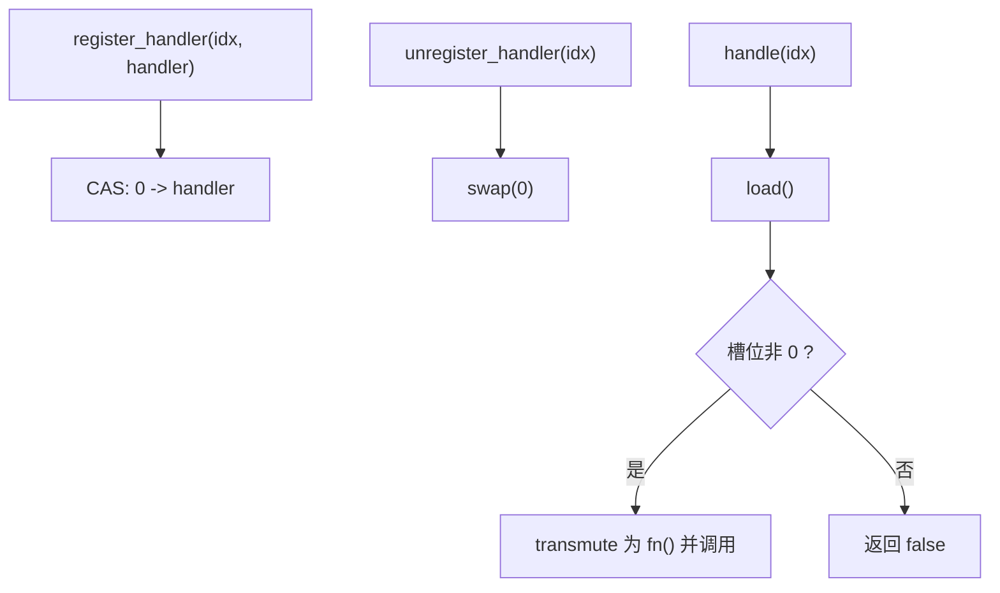
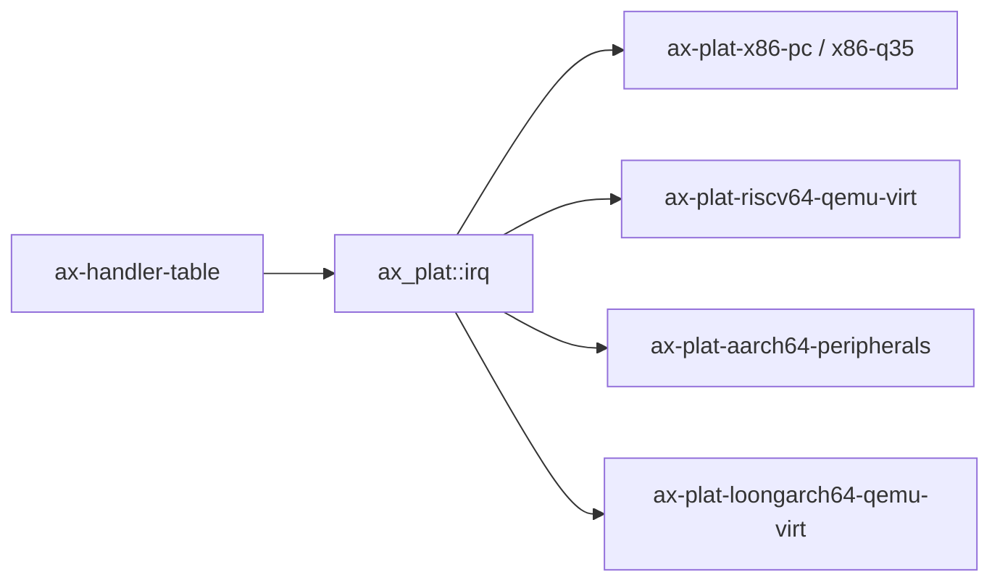

# `ax-handler-table` 技术文档

> 路径：`components/handler_table`
> 类型：库 crate
> 分层：组件层 / 处理器表基础件
> 版本：`0.3.2`
> 文档依据：`Cargo.toml`、`README.md`、`src/lib.rs`

`ax-handler-table` 是一个固定大小、无锁、仅存函数指针的处理器表。它用 `AtomicUsize` 数组保存 `fn()` 处理函数，支持按槽位注册、注销和调用。它是非常典型的叶子基础件：不是中断控制器、不是事件总线、也不是通用回调注册中心。

## 1. 架构设计分析
### 1.1 设计定位
这个 crate 解决的是“如何在极低开销下按编号存放一组处理函数”：

- 事件编号天然是整数索引。
- 处理器要求是极简的 `fn()`，没有捕获环境、没有参数、没有返回值。
- 注册/注销/查询要尽量避免引入锁。

在当前仓库里，它最真实的使用场景是 `ax_plat::irq` 及各平台的 `IRQ_HANDLER_TABLE`。

### 1.2 核心类型
- `Handler = fn()`：处理函数类型，刻意限制为普通函数指针。
- `HandlerTable<const N: usize>`：内部持有 `[AtomicUsize; N]` 的表结构。

### 1.3 实现主线
它的实现非常直接：



几个关键点需要文档里明确：

- 注册只允许空槽位写入，已存在处理器时返回 `false`。
- 注销返回原来的函数指针，便于调用方做恢复或复用。
- `handle()` 只做一次 load 并立即调用，没有额外同步。

### 1.4 能力边界
- 它不支持捕获闭包，因为底层存的就是裸 `fn()` 指针。
- 它不支持处理器链、优先级或共享状态。
- 它也不保证“注销后绝不会再跑一次处理器”：如果 `handle()` 已经 load 到指针，再 `unregister()`，那次调用仍可能继续发生。

## 2. 核心功能说明
### 2.1 主要功能
- 以 O(1) 索引方式注册或注销处理器。
- 以无锁 load 的方式调用对应槽位的函数。
- 为空槽位和越界索引返回显式失败结果。

### 2.2 关键 API 与真实使用位置
- `HandlerTable::new()`：各平台 IRQ 子系统用它声明静态处理器表。
- `register_handler()` / `unregister_handler()`：被 `components/axplat_crates/ax-plat/src/irq.rs` 的平台实现间接消费。
- `handle()`：由平台 IRQ 处理路径在拿到实际 IRQ 号后调用。

### 2.3 使用边界
- `ax-handler-table` 不负责从硬件拿 IRQ 号，也不负责 EOI/ACK。
- `ax-handler-table` 不区分设备中断、IPI 或软中断类型；它只管“编号 -> 函数”的映射。
- `ax-handler-table` 也不是通用事件系统，过于复杂的回调模型不适合塞进来。

## 3. 依赖关系图谱


### 3.1 关键直接依赖
这个 crate 本体没有本地 crate 依赖，保持了非常小的体量。

### 3.2 关键直接消费者
- `ax_plat::irq`：把 `HandlerTable` 作为平台 IRQ 管理接口的一部分导出。
- 各平台 IRQ 实现：如 `ax-plat-x86-pc`、`ax-plat-riscv64-qemu-virt` 等，都直接声明静态 `IRQ_HANDLER_TABLE`。

## 4. 开发指南
### 4.1 依赖配置
```toml
[dependencies]
ax-handler-table = { workspace = true }
```

### 4.2 修改时的关键约束
1. `Handler` 当前是 `fn()`，这不是偶然简化，而是设计边界；改成闭包会影响存储模型和无锁语义。
2. `AtomicUsize` 与函数指针互转是这个 crate 的基础假设，任何改动都要重新评估平台 ABI。
3. 若增加更多同步保证，要明确代价和语义变化，避免把它从“简表”做成“复杂注册中心”。
4. 索引越界目前统一返回失败而非 panic，这个 API 风格不应随意变动。

### 4.3 开发建议
- 需要复杂回调上下文时，外层应自己维护状态再注册一个静态跳板函数。
- 需要多处理器链或共享对象时，应新建专门结构，而不是强行扩展 `ax-handler-table`。
- 平台层如果想做 IRQ 抽象，应把 `ax-handler-table` 作为内部数据结构，而不是把所有控制逻辑下沉到这里。

## 5. 测试策略
### 5.1 当前测试形态
`ax-handler-table` 本体没有单独测试，当前验证主要依赖平台 IRQ 集成路径。

### 5.2 单元测试重点
- 空槽注册、重复注册、注销空槽、越界索引。
- `handle()` 在存在/不存在处理器时的返回值。
- 并发注册/注销与调用下的基本原子语义。

### 5.3 集成测试重点
- 平台 IRQ 注册、注销和分发能否与 `ax_plat::irq` 接口匹配。
- IPI 或设备中断路径是否能正确查表并调用处理器。

### 5.4 覆盖率要求
- 对 `ax-handler-table`，原子语义和边界条件覆盖最重要。
- 凡是改动存储表示或注册语义的提交，都应补并发测试和平台集成验证。

## 6. 跨项目定位分析
### 6.1 ArceOS
在 ArceOS 体系里，`ax-handler-table` 主要通过 `axplat` 平台层参与 IRQ 分发。它承担的是“处理器表”角色，不是中断子系统本体。

### 6.2 StarryOS
StarryOS 若复用相同平台栈，也会间接受用 `ax-handler-table`。但在分层上，它仍只是一个低层表结构。

### 6.3 Axvisor
Axvisor 若复用 `axplat` 平台 IRQ 路径，也会间接受用 `ax-handler-table`。它提供的是最底层的编号到函数映射，不是 VMM 事件分发层。
