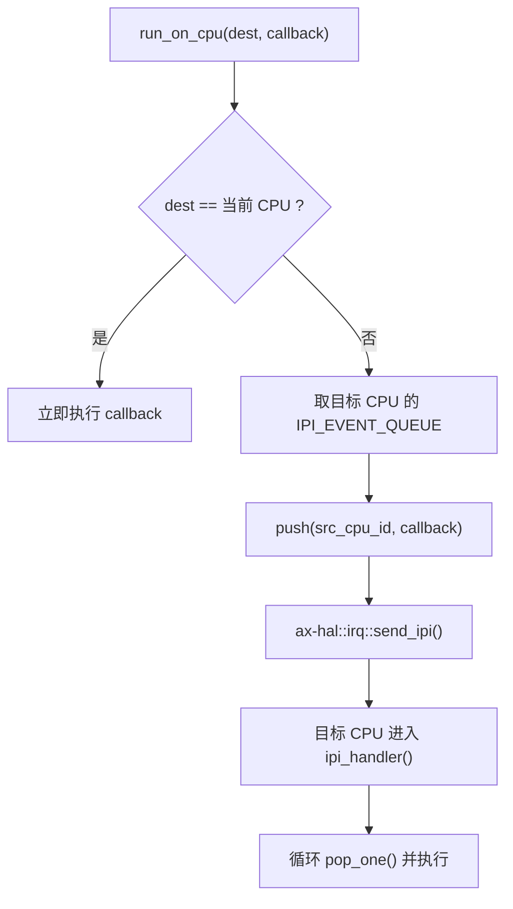
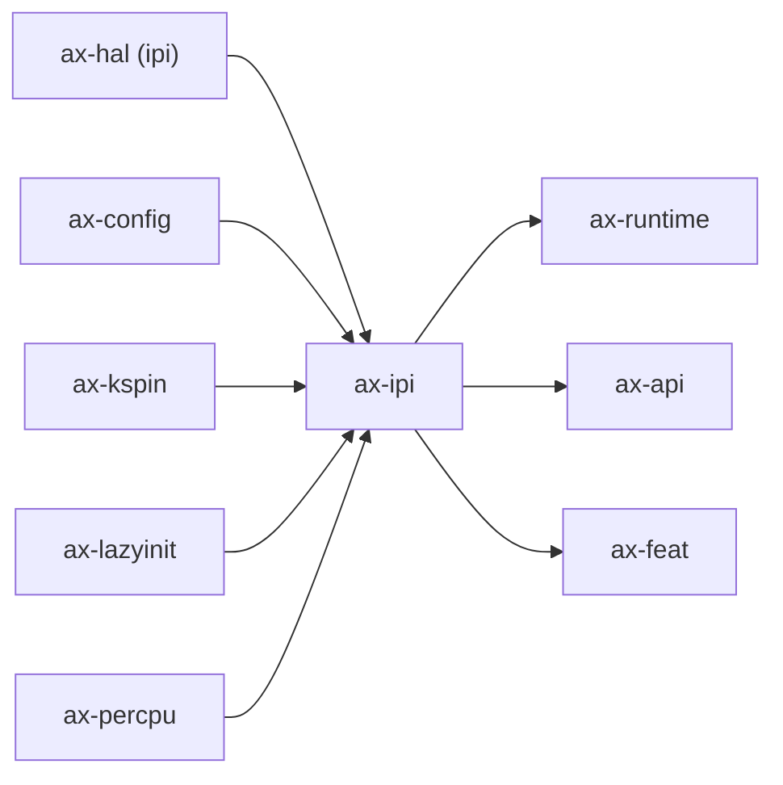

# `ax-ipi` 技术文档

> 路径：`os/arceos/modules/axipi`
> 类型：库 crate
> 分层：ArceOS 层 / IPI 运行时基础件
> 版本：`0.3.0-preview.3`
> 文档依据：`Cargo.toml`、`README.md`、`src/lib.rs`、`src/event.rs`、`src/queue.rs`

`ax-ipi` 是 ArceOS 的跨核回调分发模块。它基于 `ax-hal` 的 IPI 发送能力，为每个 CPU 维护一个本地事件队列，并向上暴露“在某个 CPU 上运行闭包”或“在所有其他 CPU 上广播闭包”的接口。它属于运行时叶子基础件：负责 IPI 事件排队和派发，不负责 SMP bring-up、调度策略或通用消息总线。

## 1. 架构设计分析
### 1.1 设计定位
`ax-ipi` 的核心目标不是实现一个复杂的多核通信框架，而是提供一条很短的工作链：

1. 把闭包包装成可发送的 IPI 事件。
2. 放入目标 CPU 的本地队列。
3. 通过 `ax-hal::irq::send_ipi()` 触发对方 CPU 进入 IPI 中断。
4. 在 IPI handler 中把队列里的事件逐个取出执行。

因此，`ax-ipi` 更像“IPI 回调投递器”，而不是调度器、work queue 或通用 RPC 层。

### 1.2 模块划分
- `src/lib.rs`：初始化、单播/广播发送和 IPI handler 主线。
- `src/event.rs`：回调封装，区分单次消费的 `Callback` 与可克隆广播的 `MulticastCallback`。
- `src/queue.rs`：基于 `VecDeque` 的 `IpiEventQueue`，以 FIFO 顺序存放待处理事件。

### 1.3 关键对象
- `Callback`：`Box<dyn FnOnce()>` 封装的单播回调。
- `MulticastCallback`：`Arc<dyn Fn()>` 封装的广播回调，可拆成多个单播回调。
- `IpiEvent`：记录源 CPU ID 与具体回调。
- `IpiEventQueue`：每 CPU 一个的待处理事件队列。
- `IPI_EVENT_QUEUE`：通过 `#[ax_percpu::def_percpu]` 声明的每 CPU 静态 `LazyInit<SpinNoIrq<IpiEventQueue>>`。

### 1.4 发送与处理主线
发送到单个 CPU 的流程如下：



实现里的重要细节：

- `run_on_cpu()` 遇到目标就是当前 CPU 时不会排队，而是同步立即执行。
- `run_on_each_cpu()` 会先在当前 CPU 上立刻执行一份，再把 clone 后的回调投给其他 CPU。
- `ipi_handler()` 会循环 drain 当前 CPU 队列，而不是只处理一个事件。

### 1.5 能力边界
- `ax-ipi` 队列是 FIFO，但不提供优先级、取消、重试或返回值汇总。
- 回调运行在 IPI 处理上下文里，默认应保持短小且不可阻塞。
- 这个 crate 没有自己的 feature 门控，但它依赖 `ax-hal` 已开启 `ipi` 能力。

## 2. 核心功能说明
### 2.1 主要功能
- 初始化每 CPU 的 IPI 队列。
- 向指定 CPU 投递单次回调。
- 向所有其他 CPU 广播回调。
- 在 IPI 中断处理函数里取出并执行待处理事件。

### 2.2 关键 API 与真实使用位置
- `init()`：由 `ax-runtime/src/mp.rs` 在次核 bring-up 路径中调用，为当前 CPU 建立 IPI 队列。
- `ipi_handler()`：由 `ax-runtime/src/lib.rs` 的 IRQ 处理路径调用。
- `run_on_cpu()` / `run_on_each_cpu()`：是这个 crate 的核心公开 API，也是 `ax-api` / `ax-feat` 暴露 IPI 能力的底层基础。

### 2.3 使用边界
- 它不是 SMP 启动器；启动 CPU 的逻辑在 `ax_runtime::start_secondary_cpus()`。
- 它不是通用异步执行框架；没有 future、返回值或 work stealing。
- 它也不是调度器；闭包何时运行只受 IPI 到达和 handler 执行控制。

## 3. 依赖关系图谱


### 3.1 关键直接依赖
- `ax-hal`：真正的 IPI 发送原语来自这里。
- `axconfig`：广播时需要 `MAX_CPU_NUM`。
- `ax-kspin`：保护每 CPU 队列。
- `ax-lazyinit`：按 CPU 惰性初始化队列。
- `ax-percpu`：声明每 CPU 静态存储。

### 3.2 关键直接消费者
- `ax-runtime`：负责在启动链中初始化队列，并在 IRQ 处理里调用 `ipi_handler()`。
- `ax-api` / `ax-feat`：把 IPI 能力向上层 feature 与 API 暴露。

## 4. 开发指南
### 4.1 依赖配置
```toml
[dependencies]
ax-ipi = { workspace = true }
```

通常只有在上层 feature 打开 `ipi` 时，最终镜像才会真正把它编进去。

### 4.2 修改时的关键约束
1. `init()` 是每 CPU 初始化，不是全局初始化；修改时必须同时考虑 BSP 和 AP 路径。
2. `run_on_each_cpu()` 当前包含“立即执行当前 CPU”这一步，修改时不能无意改变这个语义。
3. `Callback` / `MulticastCallback` 的封装关系要保持清晰，避免把广播路径退化成共享可变闭包。
4. 不要把复杂的等待、应答、重传协议塞进 `ax-ipi`；这层应该继续保持单纯。

### 4.3 开发建议
- IPI 回调应尽量短小，只做必要的跨核通知或状态翻转。
- 若需要可取消定时或异步 work queue，应该另建专门机制，而不是滥用 IPI 队列。
- 若引入更复杂的 IPI 事件类型，优先扩展事件内容，而不是让 `ax-ipi` 直接理解高层业务语义。

## 5. 测试策略
### 5.1 当前测试形态
`ax-ipi` 没有独立的 crate 内测试，当前验证主要依赖真实 SMP 路径：

- `ax-runtime` 在启用 `ipi`/`smp`/`irq` 组合下的启动与中断处理；
- API 层对 IPI 能力的集成；
- 多核环境下回调能否确实落到目标 CPU。

### 5.2 单元测试重点
- `IpiEventQueue` 的 FIFO 行为。
- `MulticastCallback::into_unicast()` 的语义是否保持“一份广播拆成多份单播”。
- 当前 CPU 快路径是否绕过排队。

### 5.3 集成测试重点
- QEMU/真实多核环境下的单播与广播是否都能触发。
- `ipi_handler()` 是否能正确 drain 多个连续事件。
- 与 `ax-runtime` 的 IRQ 注册/处理中断链是否匹配。

### 5.4 覆盖率要求
- 对 `ax-ipi`，SMP 集成覆盖比局部行覆盖率更关键。
- 涉及队列结构或广播语义的改动，都应覆盖“当前 CPU”“远端 CPU”“广播”三条路径。

## 6. 跨项目定位分析
### 6.1 ArceOS
`ax-ipi` 是 ArceOS 在打开 IPI feature 后的跨核通知基础件。它为运行时和 API 层提供最小可用的 IPI 回调能力。

### 6.2 StarryOS
StarryOS 当前没有直接把 `ax-ipi` 作为独立系统层来扩展，更多是通过共享的 ArceOS 运行时栈间接受用。因此它在 StarryOS 中仍是叶子基础件，而不是并发主控层。

### 6.3 Axvisor
当前仓库里的 Axvisor 没有直接依赖 `ax-ipi` 形成自己的 IPI 子系统；如果未来复用这套能力，也更可能把它当成宿主侧的跨核通知底座，而不是 hypervisor 调度层。
