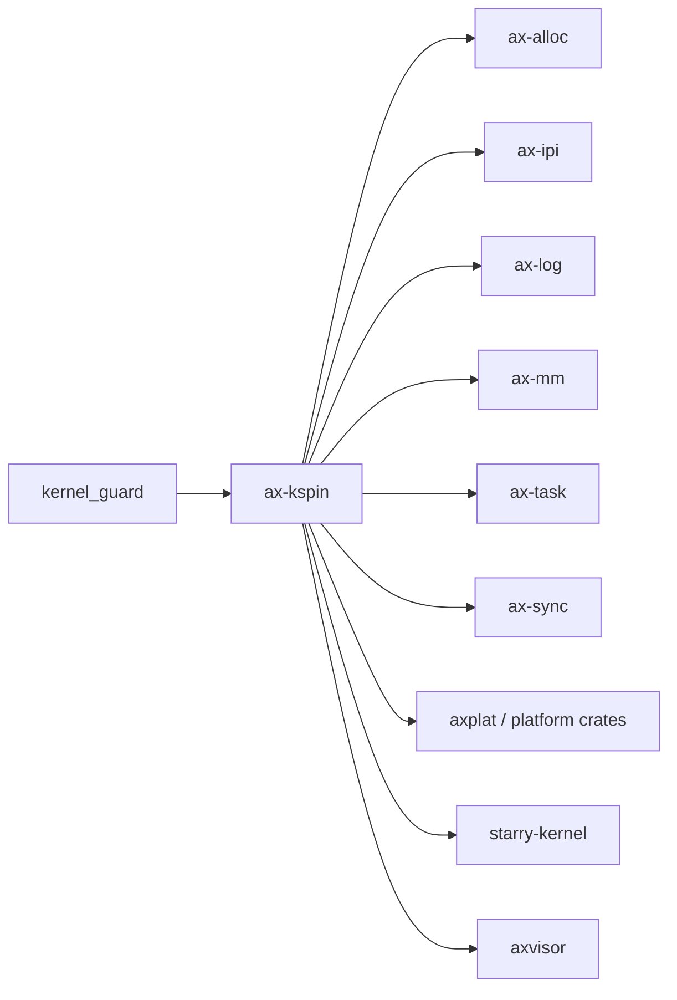

# `ax-kspin` 技术文档

> 路径：`components/kspin`
> 类型：库 crate
> 分层：组件层 / 自旋锁基础件
> 版本：`0.1.1`
> 文档依据：`Cargo.toml`、`README.md`、`src/lib.rs`、`src/base.rs`

`ax-kspin` 是内核态自旋锁实现。它把“锁状态”和“进入临界区前要不要关抢占/关 IRQ”两件事拆开：锁本体由 `BaseSpinLock` 负责，临界区语义则由 `kernel_guard` 的 guard 类型决定。它是同步叶子基础件：不是阻塞式 mutex、不是调度器，也不是完整同步库。

## 1. 架构设计分析
### 1.1 设计定位
`ax-kspin` 的设计核心在于“锁”和“临界区策略”解耦：

- `BaseSpinLock<G, T>`：负责原子测试并设置锁状态。
- `G: BaseGuard`：负责进入和退出临界区时的副作用，比如关抢占或关本地中断。

这样同一套锁实现可以派生出三种常用锁：

- `SpinRaw<T>`：不额外做任何保护，要求调用方已经在安全上下文中。
- `SpinNoPreempt<T>`：加锁时关抢占，但不关 IRQ。
- `SpinNoIrq<T>`：加锁时同时关抢占和本地 IRQ。

这也决定了它的边界：`ax-kspin` 实现的是“自旋锁家族”，不是“内核同步总控”。

### 1.2 模块划分
- `src/lib.rs`：公开类型别名，把 `kernel_guard` 的 guard 组合成 `SpinRaw` / `SpinNoPreempt` / `SpinNoIrq`。
- `src/base.rs`：`BaseSpinLock` 与 `BaseSpinLockGuard` 的具体实现，以及测试。

### 1.3 关键实现点
- `BaseSpinLock`：内部保存 `UnsafeCell<T>`，在 `smp` 下再额外保存 `AtomicBool` 锁位。
- `BaseSpinLockGuard`：保存 guard 状态与数据指针，drop 时先释放锁位，再恢复 guard 状态。
- `try_lock()`：获取临界区 guard 后尝试一次 CAS，失败时会立刻恢复 guard 状态。
- `force_unlock()`：仅用于极端 FFI 等场景，要求调用者自行保证安全。

### 1.4 `smp` feature 的关键影响
这是 `ax-kspin` 最容易被误读的一点：

- 开启 `smp`：锁位真实存在，通过 `AtomicBool` 做自旋。
- 关闭 `smp`：锁位被编译期去掉，`is_locked()` 恒为 `false`，排他性完全依赖 guard 语义和单核前提。

因此，`ax-kspin` 在单核下并不是“性能优化的普通 mutex”，而是“把锁状态优化掉的单核专用自旋锁”。

## 2. 核心功能说明
### 2.1 主要功能
- 提供可参数化临界区策略的内核自旋锁。
- 提供面向常见场景的三类类型别名。
- 在 `smp` 下提供真实多核互斥，在非 `smp` 下保留最小语义成本。

### 2.2 关键 API 与真实使用位置
- `SpinNoIrq`：被 `ax-alloc`、`ax-ipi`、`ax-log`、`ax-mm`、Axvisor 计时器等路径广泛使用。
- `SpinNoPreempt`：在 `ax-fs-ng` 等需要关抢占但不一定关 IRQ 的路径使用。
- `SpinRaw`：被 `ax-task::run_queue` 用来保护已由外层 guard 保证过的就绪队列状态。

### 2.3 使用边界
- `ax-kspin` 不会睡眠等待，所以它不是阻塞式锁。
- `ax-kspin` 不维护条件变量、等待队列或唤醒机制，这些属于 `ax-sync` / `ax-task`。
- `ax-kspin` 也不决定 guard 的具体语义；那部分在 `kernel_guard`。

## 3. 依赖关系图谱


### 3.1 关键直接依赖
- `kernel_guard`：提供 `NoOp`、`NoPreempt`、`NoPreemptIrqSave` 这些 guard 语义。

### 3.2 关键直接消费者
- `ax-alloc`、`ax-ipi`、`ax-log`、`ax-mm`：系统运行时基础模块。
- `ax-task`：任务与 run queue 路径。
- `ax-sync`：在非 `multitask` 路径下直接把 `SpinNoIrq` 当 `Mutex`。
- 各类平台 crate、StarryOS、Axvisor：用于平台状态和驱动共享状态保护。

## 4. 开发指南
### 4.1 依赖配置
```toml
[dependencies]
ax-kspin = { workspace = true }
```

若运行在多核环境，通常还要打开：

```toml
[dependencies]
ax-kspin = { workspace = true, features = ["smp"] }
```

### 4.2 修改时的关键约束
1. `BaseSpinLockGuard::drop()` 的顺序不能随意改，必须先释放锁位，再恢复 guard 状态。
2. `try_lock()` 失败时一定要恢复 guard，否则会导致“没拿到锁却把中断/抢占关住”。
3. `SpinRaw` 的前提是调用方已经处在足够安全的上下文里，不能把它当普通默认锁到处替换。
4. 单核下没有真实锁位，任何改动都要同时检查 `smp` 与非 `smp` 两条语义。

### 4.3 开发建议
- 早期启动、IRQ 相关或显式需要本地中断保护的路径，优先选 `SpinNoIrq`。
- 已有外层 guard 保证的极短临界区才考虑 `SpinRaw`。
- 需要可睡眠互斥语义时不要硬用 `ax-kspin`，应该去用 `ax-sync` 的阻塞 mutex。

## 5. 测试策略
### 5.1 当前测试形态
`src/base.rs` 已覆盖多类关键测试：

- `smoke()`、`try_lock()`：基本互斥行为。
- `lots_and_lots()`：`smp` 下的并发压力测试。
- `test_irq_lock_restored()`、`test_irq_try_lock_failed()`：guard 恢复语义。
- `test_mutex_arc_nested()`、`test_mutex_unsized()`、`test_mutex_force_lock()`：复杂类型与极端用法。

### 5.2 单元测试重点
- `smp` 与非 `smp` 的双路径语义。
- `try_lock()` 失败后的 guard 恢复。
- `force_unlock()` 与 RAII drop 的相互关系。

### 5.3 集成测试重点
- `ax-task` run queue 在高频调度下是否仍稳定。
- `ax-log`、`ax-alloc` 这类高频使用者在并发环境下是否出现死锁或输出/统计错乱。

### 5.4 覆盖率要求
- 对 `ax-kspin`，并发行为覆盖比普通代码覆盖更重要。
- 任何改动 CAS、自旋或 drop 顺序的提交，都应补对应并发和 guard 语义测试。

## 6. 跨项目定位分析
### 6.1 ArceOS
`ax-kspin` 是 ArceOS 基础栈里最常见的低层锁之一，广泛分布在内存、日志、IPI、平台状态和任务运行队列周围。

### 6.2 StarryOS
StarryOS 直接复用 `ax-kspin`。在这里它仍然只是自旋锁基础件，而不是线程同步框架本身。

### 6.3 Axvisor
Axvisor 同样把 `ax-kspin` 用在计时器、平台状态和 VMM 内部共享对象上。它提供的是宿主侧临界区保护，不是 Hypervisor 调度器。
