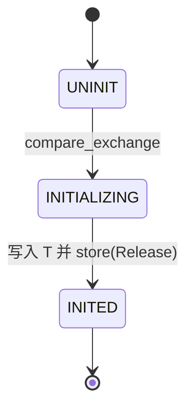
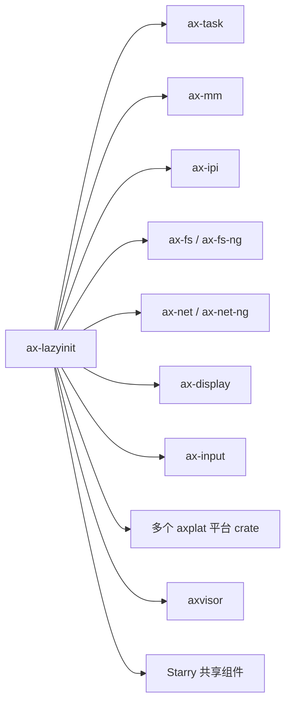

# `ax-lazyinit` 技术文档

> 路径：`components/ax-lazyinit`
> 类型：库 crate
> 分层：组件层 / 一次性初始化基础件
> 版本：`0.4.2`
> 文档依据：`Cargo.toml`、`README.md`、`src/lib.rs`

`ax-lazyinit` 提供一个面向静态对象的一次性初始化容器 `LazyInit<T>`。它以 `AtomicU8 + UnsafeCell<MaybeUninit<T>>` 实现无分配、可并发争用的“只初始化一次”语义。它属于运行时叶子基础件：不是资源生命周期框架、不是依赖注入容器，也不是带阻塞唤醒机制的完整 `OnceCell` 替代品。

## 1. 架构设计分析
### 1.1 设计定位
ArceOS/StarryOS/Axvisor 的很多全局对象都不能在编译期直接构造：

- 平台设备要等 MMIO 基址探测完才能创建。
- 运行时队列、地址空间、网络状态要等初始化流程走到相应阶段才能建立。
- 又因为很多路径处于 `no_std` 和早期启动阶段，不能依赖重型同步原语。

`ax-lazyinit` 正是在这个背景下提供一个极小的“一次建好，之后只读/少量可变访问”的容器。

### 1.2 核心类型与状态机
- `LazyInit<T>`：主体类型，内部持有初始化状态和未初始化存储。
- `UNINIT` / `INITIALIZING` / `INITED`：三态状态机。

其状态流转很简单：



### 1.3 并发初始化主线
`call_once()` 的执行路径是整个 crate 的核心：

1. 先走一次 `is_inited()` 快路径。
2. 用 `compare_exchange_weak` 尝试把状态从 `UNINIT` 改成 `INITIALIZING`。
3. 抢到初始化权的线程执行闭包、写入 `MaybeUninit<T>`，最后 `store(INITED, Release)`。
4. 其他线程若看到 `INITIALIZING`，就通过 `spin_loop()` 忙等到初始化完成。

这说明 `ax-lazyinit` 的并发模型是“原子争抢 + 自旋等待”，不是睡眠阻塞或任务挂起。

### 1.4 访问模型
- `init_once(data)`：以直接值初始化，若已初始化则 panic。
- `call_once(f)`：以闭包初始化，成功初始化返回 `Some(&T)`，否则返回 `None`。
- `get()` / `get_mut()`：显式检查是否已初始化。
- `Deref` / `DerefMut`：若未初始化会 panic。
- `get_unchecked()` / `get_mut_unchecked()`：供调用方在已知状态下绕过检查。

此外，`Drop` 会在对象已初始化时主动销毁内部值，因此它并不是“永不释放”的泄漏型 once cell。

## 2. 核心功能说明
### 2.1 主要功能
- 为静态或长期存活对象提供一次性初始化容器。
- 在多核竞争下保证只有一个初始化者成功写入值。
- 在初始化后提供低开销的引用访问。

### 2.2 关键 API 与真实使用位置
- `LazyInit::new()`：大量平台和模块静态对象都以它声明，如 `ax-task` 的运行队列、`ax-mm` 的内核地址空间、`ax-ipi` 的 IPI 队列。
- `init_once()`：平台 UART、IO APIC、GIC、显示/输入设备等对象初始化时广泛使用。
- `call_once()`：用于“按需首次构造”的场景，如 `axplat-dyn` 内存区域表、`ax-std` 标准 IO 包装器、`axbacktrace` 的地址范围缓存。
- `get()` / `Deref`：初始化完成后作为普通全局对象读取。

### 2.3 使用边界
- `ax-lazyinit` 不支持 reset，也不支持重新初始化。
- 初始化失败不会记录 poisoning 状态；若闭包 panic，外层需要自己承担恢复语义。
- 它只解决“把值放进去一次”，不解决更高层的生命周期管理、回收编排或依赖排序。

## 3. 依赖关系图谱


### 3.1 关键直接依赖
`ax-lazyinit` 没有本地 crate 依赖，目的是保持在启动期也能轻量使用。

### 3.2 关键直接消费者
- ArceOS 模块：`ax-task`、`ax-mm`、`ax-ipi`、`ax-fs`、`ax-net`、`ax-display`、`ax-input` 等。
- 平台层：`ax-plat-x86-pc`、`ax-plat-aarch64-peripherals`、`ax-plat-riscv64-qemu-virt`、`ax-plat-loongarch64-qemu-virt`。
- Axvisor：如 `vmm/timer.rs` 的 `TimerList`、DTB 缓存等。

## 4. 开发指南
### 4.1 依赖配置
```toml
[dependencies]
ax-lazyinit = { workspace = true }
```

### 4.2 修改时的关键约束
1. 内存序不能随意放松。当前 `Acquire/Release` 配对保证初始化完成后读取值可见。
2. `INITIALIZING` 分支采用忙等，这要求初始化闭包尽量短小；不要把耗时很长或会再次依赖同一对象的逻辑塞进去。
3. `Deref` 在未初始化时 panic 是刻意设计，用来暴露初始化顺序错误；不应默默返回默认值。
4. `unsafe impl Send/Sync` 依赖 `T` 的 trait 约束，改动这里会直接影响全局对象线程安全边界。

### 4.3 开发建议
- 若只需要“一次初始化后全局共享”，优先用 `LazyInit<T>`。
- 若还需要运行期多次更新，应该在 `LazyInit<Mutex<T>>` 或 `LazyInit<SpinNoIrq<T>>` 外层组合，而不是给 `LazyInit` 自己加可变协议。
- 若初始化闭包可能递归触发同一个 `LazyInit`，要先重构调用图，否则可能自旋卡住。

## 5. 测试策略
### 5.1 当前测试形态
`ax-lazyinit` 的测试都在 `src/lib.rs` 内：

- 基本初始化与读取。
- 未初始化解引用 panic。
- 重复初始化 panic。
- 多线程并发 `call_once()`。
- `get_unchecked()` / `get_mut_unchecked()`。

### 5.2 单元测试重点
- 状态机从 `UNINIT` 到 `INITED` 的正确流转。
- 并发下只有一个初始化者成功。
- `Deref` / `Drop` / unsafe 访问接口的边界行为。

### 5.3 集成测试重点
- 平台设备初始化顺序。
- `ax-task`、`ax-mm`、`ax-net` 等全局对象的首次构造与后续访问。
- Axvisor 中 `LazyInit<SpinNoIrq<TimerList<_>>>` 这类组合结构的初始化时序。

### 5.4 覆盖率要求
- 对 `ax-lazyinit`，并发初始化与 panic 路径必须覆盖。
- 若修改内存序、自旋逻辑或 `Drop` 行为，应补多线程回归测试。

## 6. 跨项目定位分析
### 6.1 ArceOS
在 ArceOS 中，`ax-lazyinit` 是非常常见的运行时基础件，用来托管“启动后建立一次”的全局对象。它属于基础容器层，不是模块初始化框架本体。

### 6.2 StarryOS
StarryOS 通过共享组件和平台栈间接复用 `ax-lazyinit`。它的角色依旧是一种轻量 once-init 容器。

### 6.3 Axvisor
Axvisor 直接用 `ax-lazyinit` 初始化 VMM 定时器队列、缓存和设备对象。即便在虚拟化场景里，它也只是初始化原语，而不是 VMM 生命周期管理器。
