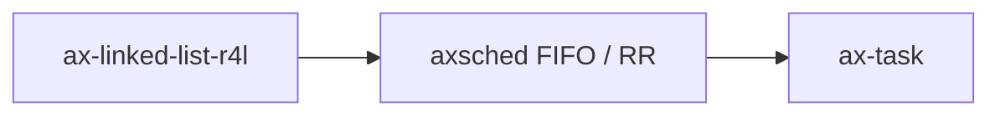

# `ax-linked-list-r4l` 技术文档

> 路径：`components/linked_list_r4l`
> 类型：库 crate
> 分层：组件层 / intrusive 链表基础件
> 版本：`0.3.0`
> 文档依据：`Cargo.toml`、`README.md`、`src/lib.rs`、`src/raw_list.rs`、`src/linked_list.rs`、`tests/cursor.rs`

`ax-linked-list-r4l` 提供一套来自 Rust-for-Linux 思路的 intrusive 双向链表实现，重点能力是“任意节点 O(1) 删除”。它属于容器叶子基础件：不是调度器、不是任务队列框架，也不是通用对象生命周期系统。

## 1. 架构设计分析
### 1.1 设计定位
普通 `LinkedList` 很难在持有节点句柄时做到 O(1) 任意删除，而内核调度队列、等待队列常常需要“节点自己带着链表指针”。`ax-linked-list-r4l` 就是为这种场景准备的：

- 节点把 `Links<Self>` 内嵌到对象里。
- 链表只串接这些 links，不额外分配节点壳。
- 节点一旦在链上，就能在 O(1) 时间被删除。

在当前仓库里，`axsched` 的 FIFO 和 RR 调度器直接用它维护 ready queue，这正是 intrusive 链表最典型的用法。

### 1.2 模块分层
- `raw_list`：底层 intrusive 链表，直接操作裸指针和 `Links<T>`。
- `linked_list`：在 `RawList` 之上增加 `Box` / `Arc` / `&T` 等包装器语义。
- `def_node!`：帮助用户快速定义内嵌 `Links` 的节点类型。

### 1.3 核心对象
- `Links<T>`：嵌入到元素内部，保存前驱/后继和 `inserted` 状态。
- `GetLinks`：告诉链表如何从元素上拿到对应的 `Links`。
- `RawList<G>`：最底层的 intrusive 循环双向链表。
- `Wrapper<T>`：把 `Box<T>`、`Arc<T>`、`&T` 统一成可入链对象。
- `List<G>`：对外更友好的拥有型封装。

### 1.4 关键机制
#### 1.4.1 单元素单链表约束
`Links<T>` 里的 `AtomicBool inserted` 用来防止同一组 links 被重复插入。也就是说：

- 一个元素如果只提供一组 `Links`，同一时刻只能在一条链上。
- 如果想同时加入多条链，元素必须自己定义多组 links，并分别通过不同 `GetLinks` 暴露。

#### 1.4.2 intrusive + 包装器双层设计
`RawList` 只关心裸指针是否有效；`List` 再通过 `Wrapper` trait 把所有权拿回来。因此：

- `RawList` 更底层，适合需要自己管理对象生命周期的场景。
- `List` 更适合直接存 `Box<Node>`、`Arc<Node>` 等对象。

#### 1.4.3 Cursor 访问模型
`List` 和 `RawList` 都提供 cursor。可变 cursor 在 `Arc` 场景下被标成 `unsafe`，因为如果强引用数不为 1，就无法保证独占可变访问。这一点直接体现了该 crate 的设计原则：它只负责链表结构，不替用户掩盖别名与所有权风险。

## 2. 核心功能说明
### 2.1 主要功能
- intrusive 双向链表插入、删除、前后遍历。
- O(1) 任意节点删除。
- `Box` / `Arc` / `&T` 等包装对象入链。
- 游标式遍历、插入和删除。
- `def_node!` 快速定义节点类型。

### 2.2 关键 API 与真实使用位置
- `List::push_back()` / `push_front()`：`ax_sched::fifo` 与 `ax_sched::round_robin` 用来维护就绪队列。
- `List::pop_front()`：调度器取下一个 runnable 实体时使用。
- `List::remove()` / `CursorMut::remove_current()`：适合等待队列或 ready queue 的 O(1) 删除场景。
- `def_node!`：为简单节点类型提供低样板定义方式。

### 2.3 使用边界
- `ax-linked-list-r4l` 只提供容器语义，不提供调度、公平性或优先级逻辑。
- 它也不是通用“安全集合”；`RawList` 暴露了大量 `unsafe`，使用者必须自己保证节点生命周期。
- 若元素需要同时挂多条链，必须由调用方自己建多组 `Links`，这不是链表内部自动完成的事。

## 3. 依赖关系图谱


### 3.1 关键直接依赖
该 crate 没有本地 crate 依赖，设计上尽量自包含。

### 3.2 关键直接消费者
- `ax_sched::fifo`：`List<Arc<FifoTask<T>>>` 形式的 FIFO ready queue。
- `ax_sched::round_robin`：`List<Arc<RRTask<...>>>` 形式的 RR ready queue。

## 4. 开发指南
### 4.1 依赖配置
```toml
[dependencies]
ax-linked-list-r4l = { workspace = true }
```

### 4.2 修改时的关键约束
1. `Links<T>` 的 `inserted` 位与前后指针必须保持一致，否则会直接破坏 intrusive 不变量。
2. `RawList` 的 `unsafe` 接口依赖调用者保证节点活性和归属，文档与实现必须同步维护这些前提。
3. `CursorMut::current_mut()` / `peek_next()` / `peek_prev()` 在 `Arc` 场景下是 `unsafe`，不要为了“更方便”轻易改成安全接口。
4. `List` 在插入失败时会把包装对象从指针恢复后丢弃，这一行为影响引用计数和释放时机，改动时要小心。

### 4.3 开发建议
- 想要简单拥有型链表时优先用 `List<Box<Node>>`。
- 想要在调度器里复用任务对象时常用 `List<Arc<Node>>`，但必须尊重其别名限制。
- 需要同时进入多个链表时，不要复用同一个 `Links` 字段。

## 5. 测试策略
### 5.1 当前测试形态
`ax-linked-list-r4l` 具备比较完整的本地测试：

- `src/raw_list.rs`：覆盖底层链表插入、移除、游标与遍历。
- `src/linked_list.rs`：覆盖拥有型封装与正反向迭代。
- `tests/cursor.rs`：覆盖 cursor、`insert_after()`、`remove_current()` 以及 `Box` / `Arc` 场景。

### 5.2 单元测试重点
- 头节点、尾节点、单元素链表的边界行为。
- 重复插入、移除未入链节点、游标越界后重新回到头部的行为。
- `Box` 与 `Arc` 包装下的所有权恢复。

### 5.3 集成测试重点
- `axsched` ready queue 的入队、出队与 O(1) 删除。
- 在调度器或等待队列场景下的遍历顺序稳定性。

### 5.4 覆盖率要求
- 对 intrusive 容器，结构不变量比表面 API 覆盖更重要。
- 凡是改动前后指针、cursor 或包装器恢复逻辑，都应补回归测试。

## 6. 跨项目定位分析
### 6.1 ArceOS
在 ArceOS 中，`ax-linked-list-r4l` 主要通过 `axsched` 服务于 FIFO 和 RR ready queue。它是调度器底层容器，不是调度器本体。

### 6.2 StarryOS
StarryOS 若复用同一任务/调度栈，也会间接受益于该链表。但其分层角色仍然只是 intrusive 容器。

### 6.3 Axvisor
当前仓库里 Axvisor 没有把 `ax-linked-list-r4l` 作为核心容器直接使用；即便未来复用，它也仍应保持为低层数据结构，而不是虚拟化事件框架。
