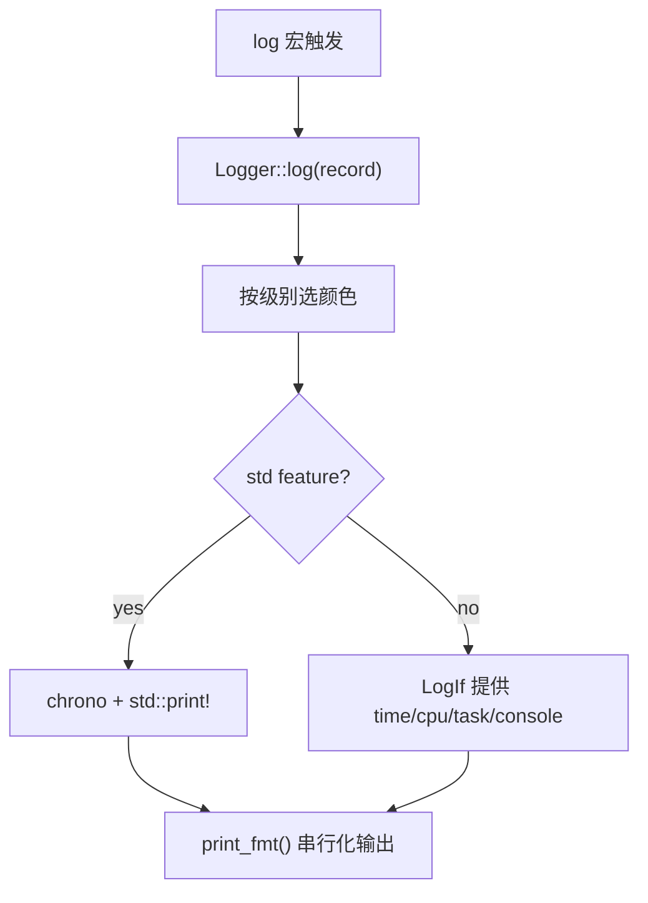
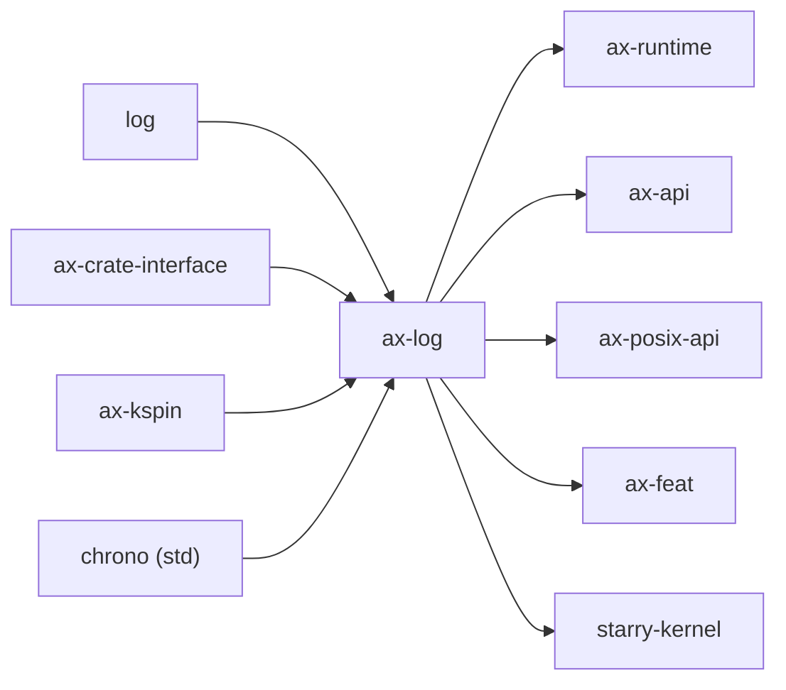

# `ax-log` 技术文档

> 路径：`os/arceos/modules/axlog`
> 类型：库 crate
> 分层：ArceOS 层 / 日志运行时基础件
> 版本：`0.3.0-preview.3`
> 文档依据：`Cargo.toml`、`src/lib.rs`

`ax-log` 是 ArceOS 的日志前端和格式化层。它建立在 `log` crate 之上，为 `no_std` 运行时提供统一的打印宏、日志格式和后端接口，并在 `std` feature 下退化成可直接在主机环境运行的 logger。它属于运行时叶子基础件：不是串口驱动、不是 tracing 框架，也不是完整的观测平台。

## 1. 架构设计分析
### 1.1 设计定位
`ax-log` 的核心设计思路很克制：

- 复用 `log` crate 作为上层日志语义，不自造一套新的日志 facade。
- 用 `ax-crate-interface` 定义 `LogIf`，把“时间、CPU ID、任务 ID、字符输出”这些平台相关能力交给外部实现。
- 在打印时自行做串行化，避免多 CPU/多任务日志交叉。

因此，`ax-log` 解决的是“日志长什么样、如何输出”，不是“设备如何发字符”或“日志如何持久化”。

### 1.2 核心模块与对象
这个 crate 基本都在 `src/lib.rs` 中完成：

- `LogIf`：`no_std` 路径下必须由外部实现的接口。
- `Logger`：同时实现 `fmt::Write` 与 `log::Log`。
- `ColorCode`：不同日志级别对应的 ANSI 颜色。
- `ax_print!` / `ax_println!`：不经过 `log` 级别过滤的直接输出宏。
- `print_fmt()`：真正执行串行化输出的低层入口。

### 1.3 `std` 与 `no_std` 双路径
- `std` feature 打开时：
  - `Logger.write_str()` 直接走 `std::print!`。
  - 时间戳使用 `chrono::Local::now()`。
- `std` feature 关闭时：
  - 所有输出与环境信息都通过 `call_interface!(LogIf::...)` 获取。
  - 是否显示 CPU ID / task ID 由 `LogIf::current_cpu_id()` 和 `current_task_id()` 返回值决定。

这意味着 `ax-log` 不是“只能在裸机里用”的模块，它的 host 验证路径也是正式设计的一部分。

### 1.4 日志输出主线
`Logger::log()` 的关键流程如下：



源码里的几个细节值得单独强调：

- `init()` 会调用 `log::set_logger(&Logger)`，并把默认最大级别设成 `Warn`。
- `set_max_level()` 只做运行时调节；如果上游用了编译期 `log-level-*` feature，这个函数不会改变结果。
- `print_fmt()` 内部用 `ax_kspin::SpinNoIrq<()>` 做串行化，所以它解决的是输出交叉，不是后端缓冲问题。

## 2. 核心功能说明
### 2.1 主要功能
- 提供 `error!`、`warn!`、`info!`、`debug!`、`trace!` 宏的 ArceOS 运行时接入。
- 提供 `ax_print!` / `ax_println!` 这类不经日志级别过滤的直接输出接口。
- 提供颜色化、带时间戳和可选 CPU/task 元信息的统一日志格式。

### 2.2 关键 API 与真实使用位置
- `init()` / `set_max_level()`：由 `ax-runtime/src/lib.rs` 在系统 bring-up 早期调用。
- `LogIf`：由 `ax_runtime::LogIfImpl` 实现，背后再转发到 `ax-hal::console`、`ax-hal::time`、`ax-task` 等模块。
- `print_fmt()`：被 `ax-api/src/imp/mod.rs` 直接使用，作为 API 层输出通道。
- `warn!` 等宏：被 `ax-posix-api`、`ax-task` 等模块直接调用。

### 2.3 使用边界
- `ax-log` 不管理串口、显示器或控制台设备；它只定义如何把字符串交给后端。
- `ax-log` 不是 tracing/span 系统，没有结构化事件树。
- `ax-log` 也不负责日志落盘、远端传输或 ring buffer。

## 3. 依赖关系图谱


### 3.1 关键直接依赖
- `log`：标准日志 facade。
- `ax-crate-interface`：`no_std` 路径下的后端接口桥。
- `ax-kspin`：输出串行化。
- `chrono`：只在 `std` 下使用。

### 3.2 关键直接消费者
- `ax-runtime`：初始化 logger 并提供运行时后端实现。
- `ax-api` / `ax-posix-api`：向上层 API 暴露输出与警告能力。
- `starry-kernel`：直接复用同一套日志前端。

## 4. 开发指南
### 4.1 依赖配置
```toml
[dependencies]
ax-log = { workspace = true }
```

如果是主机环境验证，可显式开启 `std`：

```toml
[dependencies]
ax-log = { workspace = true, features = ["std"] }
```

### 4.2 修改时的关键约束
1. 修改日志格式时，要同时检查 `std` 与 `no_std` 两条路径。
2. 修改 `LogIf` 契约时，必须同步更新 `ax_runtime::LogIfImpl` 这类实现方。
3. 修改 `print_fmt()` 锁策略时，要重新评估输出交叉与中断上下文行为。
4. 不要把控制台驱动逻辑塞进 `ax-log`；这层应该继续保持“前端 + glue”的小体量。

### 4.3 开发建议
- 需要输出普通信息时优先使用 `log` 宏；只有在确实需要绕过级别过滤时再用 `ax_print!`。
- 对格式扩展保持保守，避免让日志前端承担太多系统状态采集逻辑。
- 对性能敏感路径，记得区分“编译期过滤”与“运行时过滤”的开销差异。

## 5. 测试策略
### 5.1 当前测试形态
`ax-log` 没有独立的 crate 内测试；当前验证主要依赖：

- `std` feature 下的 host 构建与示例使用；
- `ax-runtime` 启动期对 logger 的真实初始化；
- 多模块并发输出时是否仍能保持完整日志行。

### 5.2 单元测试重点
- `set_max_level()` 的字符串解析与降级行为。
- `std` / `no_std` 两条输出路径的格式一致性。
- `current_cpu_id()` / `current_task_id()` 为 `None` 时的日志格式退化分支。

### 5.3 集成测试重点
- ArceOS 启动日志能否正常打印平台、时间、CPU 和任务信息。
- StarryOS 共享该前端时日志格式是否仍一致。
- 多核/多任务并发输出是否发生严重 interleave。

### 5.4 覆盖率要求
- 对 `ax-log`，格式分支覆盖和运行环境覆盖比行覆盖率更重要。
- 任何改动 `LogIf`、输出锁或格式模板的变更，都应补至少一条系统级验证路径。

## 6. 跨项目定位分析
### 6.1 ArceOS
`ax-log` 是 ArceOS bring-up 初期最早建立的公共服务之一。它负责把启动、调度、驱动和 API 层的日志汇总到统一格式下。

### 6.2 StarryOS
StarryOS 直接复用 `ax-log`，因此它在 StarryOS 中也仍是日志前端层，而不是 Linux 兼容调试框架本体。

### 6.3 Axvisor
Axvisor 当前主要通过共享的 ArceOS 运行时栈间接受用 `ax-log`。它提供的是宿主侧统一日志格式，不是 hypervisor 专用观测系统。
