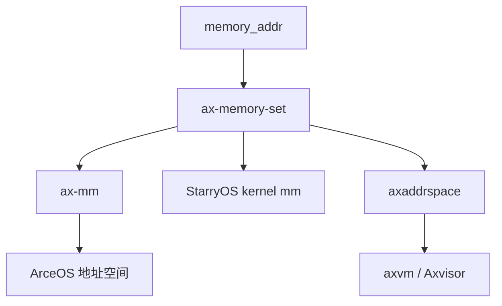

# `ax-memory-set` 技术文档

> 路径：`components/axmm_crates/memory_set`
> 类型：库 crate
> 分层：组件层 / 地址区间集合与映射元数据层
> 版本：`0.4.1`
> 文档依据：当前仓库源码、`Cargo.toml`、`README.md`、`src/lib.rs`、`src/area.rs`、`src/backend.rs`、`src/set.rs`

`ax-memory-set` 是 ArceOS/StarryOS/Axvisor 这条内存管理链上的“区间集合与操作骨架”。它不直接实现页表，也不直接决定物理页如何分配，而是围绕“若干不重叠地址区间”和“这些区间应如何映射”提供统一的数据结构与操作流程。可以把它理解为一层抽象的 `mmap`/`munmap`/`mprotect` 元数据引擎：上层负责地址空间语义，下层 `Backend` 负责真正操作页表。

## 1. 架构设计分析

### 1.1 设计定位

该 crate 解决的是一个非常具体的问题：

- 如何维护一组不重叠的虚拟地址区间
- 如何对这些区间执行 map/unmap/protect
- 如何把“区间操作”与“页表实现”解耦

因此它属于“内存区间元数据层”，而不是“完整虚拟内存子系统”。

### 1.2 模块划分

| 模块 | 作用 | 关键内容 |
| --- | --- | --- |
| `lib.rs` | 顶层导出和错误定义 | `MappingError`、`MappingResult` |
| `backend.rs` | 后端抽象 | `MappingBackend` |
| `area.rs` | 单个区间对象 | `MemoryArea<B>` |
| `set.rs` | 多区间集合管理 | `MemorySet<B>` |
| `tests.rs` | 回归测试 | `MockBackend` 与典型操作路径 |

### 1.3 `MappingBackend`：与具体页表解耦的关键

`MappingBackend` 是整个 crate 的设计中心。它把真正的页表操作下沉到实现方，只保留三个核心动作：

- `map`
- `unmap`
- `protect`

并通过关联类型把三类关键信息延后绑定：

- `Addr`
- `Flags`
- `PageTable`

这意味着 `ax-memory-set` 完全不需要知道：

- 地址究竟是 `VirtAddr` 还是 `GuestPhysAddr`
- flags 究竟是普通页权限还是嵌套页表权限
- 页表究竟是宿主页表、进程页表还是 EPT/NPT 封装

### 1.4 `MemoryArea<B>`：单段连续映射描述

`MemoryArea<B>` 由三部分组成：

- `va_range`
- `flags`
- `backend`

它描述“一段连续地址区间以某种权限和某种后端方式被管理”。这里最关键的设计是：一个区间不仅有范围和权限，还有自己的 `backend` 实例。这使同一地址空间中的不同区域可以在逻辑上挂接不同后端策略。

`MemoryArea` 提供的高阶能力包括：

- `map_area`
- `unmap_area`
- `protect_area`
- `split`
- `shrink_left`
- `shrink_right`

后面三个操作是 `munmap`/`mprotect` 这类区间切分逻辑的核心。

### 1.5 `MemorySet<B>`：以 `BTreeMap` 组织的不重叠区间集合

`MemorySet<B>` 的内部结构是：

- 以区间起始地址为 key 的 `BTreeMap`

选择 `BTreeMap` 的原因很直接：

- 需要有序管理区间
- 需要支持按地址查找最近的前驱区间
- 需要支持扫描空洞、寻找可用区域

它公开的核心操作是：

- `overlaps`
- `find`
- `find_free_area`
- `map`
- `unmap`
- `protect`
- `clear`

### 1.6 关键算法主线

#### `map`

`map` 的典型路径为：

1. 检查参数与区间合法性
2. 检查是否与已有区间重叠
3. 若允许覆盖，则先做区间级 `unmap`
4. 调用 `backend.map()` 真正建立映射
5. 将新区间插入 `BTreeMap`

#### `unmap`

`unmap` 的难点在于区间几何关系。已有区间可能：

- 完全落在待删除范围内
- 与左边界相交
- 与右边界相交
- 被待删除范围切成左右两段

源码通过 `split`、`shrink_left`、`shrink_right` 来处理这些情况。

#### `protect`

`protect` 与 `unmap` 的结构很像，只是它不是删除区间，而是可能将原区间拆成最多三段：

- 左侧保留原权限
- 中间替换成新权限
- 右侧保留原权限

这说明 `ax-memory-set` 并不是简单“存个区间表”，而是明确承担了区间切分与重组算法。

### 1.7 一个重要边界：不处理页错误

这点必须明确：

- `ax-memory-set` 不包含 `handle_page_fault`
- `MappingBackend` 也不要求实现页错误处理

页错误处理通常发生在更高层，例如：

- `ax-mm` 在自己的 `Backend` 中扩展出 fault 语义
- `axaddrspace` 在嵌套页表路径中处理缺页

`ax-memory-set` 本身只负责维护“区间元数据”和“区间级页表操作流程”。

## 2. 核心功能说明

### 2.1 主要能力

- 维护一组不重叠地址区间
- 对区间执行 map/unmap/protect
- 支持查找指定地址所在区间
- 支持查找满足对齐和大小要求的空闲区间
- 通过 `MappingBackend` 与不同页表实现解耦

### 2.2 典型使用场景

| 场景 | 角色 |
| --- | --- |
| ArceOS 进程/内核地址空间 | 区间元数据层 |
| StarryOS `mmap` / `munmap` | 区间切分与保护变更骨架 |
| Axvisor 访客物理地址空间 | GPA 区间组织与后端映射调度 |

### 2.3 错误模型

`MappingError` 只定义三类错误：

- `InvalidParam`
- `AlreadyExists`
- `BadState`

这体现了该 crate 的风格：它只暴露区间管理需要知道的最小失败原因，不把后端复杂状态直接泄露到接口层。

当启用 `ax-errno` feature 时，还可以桥接到更通用的错误体系。

## 3. 依赖关系图谱

### 3.1 直接依赖

| 依赖 | 作用 |
| --- | --- |
| `memory_addr` | 提供 `AddrRange` 与 `MemoryAddr` 抽象 |
| `ax-errno`（可选） | 把 `MappingError` 映射到统一错误类型 |

### 3.2 主要消费者

- `os/arceos/modules/axmm`
- `os/StarryOS/kernel`
- `components/axaddrspace`

### 3.3 关系示意

### 3.4 与页表库的边界

需要特别指出的是，`ax-memory-set` 不直接依赖 `ax-page-table-multiarch`。两者的联系发生在更上层：

- `ax-mm`：把 `MemorySet` 与 `ax-hal::paging::PageTable` 拼起来
- `axaddrspace`：把 `MemorySet` 与嵌套页表 `NestedPageTable` 拼起来

这也是它能同时服务普通内核地址空间和虚拟化地址空间的重要原因。

## 4. 开发指南

### 4.1 实现一个新的 `MappingBackend`

典型步骤如下：

1. 确定地址类型 `Addr`
2. 确定权限类型 `Flags`
3. 确定页表封装类型 `PageTable`
4. 实现 `map`、`unmap`、`protect`
5. 再将该后端嵌入 `MemoryArea` / `MemorySet`

### 4.2 使用建议

- 区间进入 `MemorySet` 前应保证上层语义已经明确，例如匿名映射、文件映射、设备映射等
- 权限更新优先走 `protect`，不要用“删掉再重建”替代
- 若需要懒分配或缺页建图，建议把逻辑实现在后端或更高层，而不是试图把 fault 逻辑塞进 `ax-memory-set`

### 4.3 维护时的关注点

- `split` 和 `shrink_*` 的行为必须保持一致性，否则区间几何关系会出错
- `BTreeMap` 的 key 和 `MemoryArea` 内部范围必须同步更新
- 涉及 `unmap_overlap` 的逻辑修改时，要确认不会破坏已有映射覆盖语义

## 5. 测试策略

### 5.1 当前测试覆盖

仓库内已有的测试使用 `MockBackend` 模拟页表操作，覆盖了：

- map 正常路径
- overlap 检查
- `unmap_overlap`
- `unmap` 造成的切分与收缩
- `protect` 造成的区间拆分
- `find_free_area` 的边界行为

这些测试基本覆盖了该 crate 最重要的区间几何语义。

### 5.2 推荐继续补充的测试

- `backend.map()` / `unmap()` / `protect()` 返回失败时的错误传播
- `protect_area()` 与 backend 返回值的契约一致性检查
- 多段连续 `protect` / `unmap` 后区间表的稳定性
- 极端边界值和地址溢出场景

### 5.3 风险点

- 区间切分错误会直接造成地址空间元数据损坏
- 区间元数据一旦与实际页表状态不一致，问题通常会在更晚阶段才暴露
- 因为它是高复用底层件，任何行为变化都要同时考虑 `ax-mm`、StarryOS 和 `axaddrspace`

## 6. 跨项目定位分析

| 项目 | 位置 | 角色 | 核心作用 |
| --- | --- | --- | --- |
| ArceOS | `ax-mm` 的底层公共件 | 地址区间元数据引擎 | 为内核/用户地址空间提供统一的区间集合、保护变更与查找逻辑 |
| StarryOS | 进程地址空间核心底件之一 | `mmap` 风格区间操作骨架 | 支撑进程地址空间的映射区间管理与权限调整 |
| Axvisor | `axaddrspace` 的基础容器层 | 访客地址区间集合管理器 | 让 GPA 区间也能用与普通 OS 地址空间类似的方式组织和变更 |

## 7. 总结

`ax-memory-set` 不是一个完整的虚拟内存子系统，但它把“区间集合管理”这件事抽象得非常干净。它一边通过 `MappingBackend` 与页表后端解耦，一边通过 `MemoryArea` 和 `MemorySet` 提供稳定的区间切分、保护和查找逻辑，因此能同时服务于 ArceOS、StarryOS 和 Axvisor 这三条不同但又相通的地址空间实现路径。
