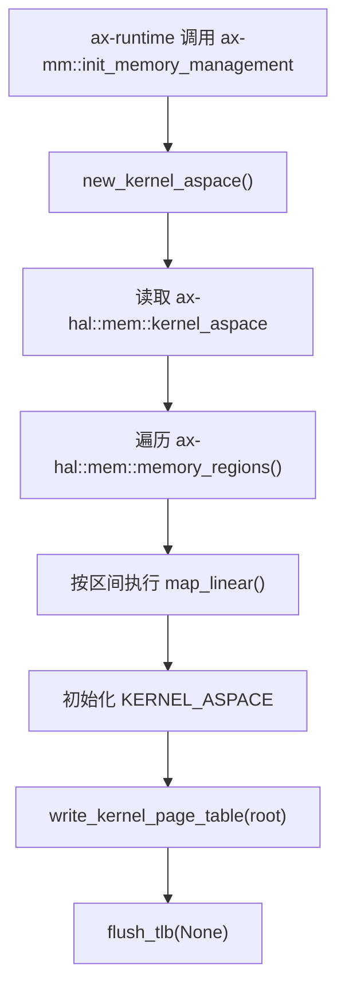
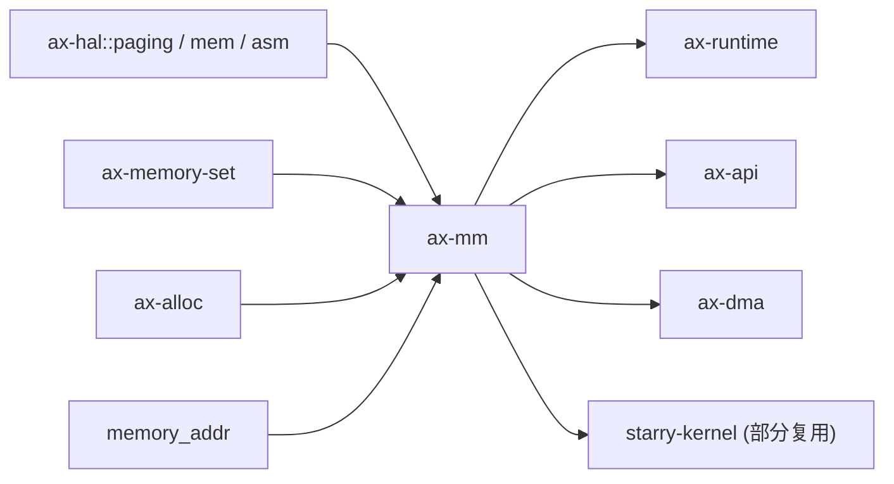

# `ax-mm` 技术文档

> 路径：`os/arceos/modules/axmm`
> 类型：库 crate
> 分层：ArceOS 层 / ArceOS 内核模块
> 版本：`0.3.0-preview.3`
> 文档依据：`Cargo.toml`、`src/lib.rs`、`src/aspace.rs`、`src/backend/mod.rs`、`src/backend/linear.rs`、`src/backend/alloc.rs`

`ax-mm` 是 ArceOS 的虚拟内存管理模块。它把 `ax-hal::paging::PageTable` 提供的页表能力、`ax-memory-set` 提供的区间元数据管理，以及 `ax-alloc` 提供的物理页框分配整合成统一的地址空间抽象 `AddrSpace`，负责建立和维护宿主内核自己的虚拟地址空间。

## 1. 架构设计分析
### 1.1 设计定位
`ax-mm` 的职责边界非常明确：

- 它管理的是 **宿主内核地址空间**，核心对象是 `AddrSpace` 和全局 `KERNEL_ASPACE`。
- 它不直接负责底层页表项格式、TLB 指令或地址翻译细节，这些由 `ax-hal` 提供。
- 它也不直接承担 StarryOS 进程级复杂地址空间策略，例如 COW、文件后端和用户态高级内存语义；这些通常在 StarryOS 自己的 `mm` 层扩展。

因此，`ax-mm` 更像是 ArceOS 宿主侧的“页表驱动型地址空间管理器”，而不是所有项目共享的一切内存策略中心。

### 1.2 内部模块划分
- `src/lib.rs`：对外 API 入口。负责全局 `KERNEL_ASPACE`、`init_memory_management()`、`iomap()`、`new_user_aspace()` 以及 `MemRegionFlags` 到 `MappingFlags` 的转换。
- `src/aspace.rs`：核心类型 `AddrSpace` 所在文件，封装映射、取消映射、权限更新、跨地址空间读写和缺页处理逻辑。
- `src/backend/mod.rs`：定义 `Backend` 枚举，并把 `Linear` 与 `Alloc` 两类映射后端统一到 `ax_memory_set::MappingBackend` 契约上。
- `src/backend/linear.rs`：线性映射实现，适用于虚拟地址与物理地址存在固定偏移的场景。
- `src/backend/alloc.rs`：分配式映射实现，支持 eager populate 和按需缺页分配两种模式。

### 1.3 关键数据结构与全局对象
- `AddrSpace`：`ax-mm` 的核心对象，内部持有虚拟地址范围、`MemorySet<Backend>` 和 `PageTable`。
- `Backend`：两类映射后端的统一抽象。
  - `Linear { pa_va_offset }`：基于固定偏移的线性映射。
  - `Alloc { populate }`：基于物理页框分配的映射，可按需填充。
- `KERNEL_ASPACE`：全局内核地址空间单例，通过 `LazyInit<SpinNoIrq<AddrSpace>>` 保存。
- `PageTable`：由 `ax-hal::paging` 暴露的多架构页表类型，是 `AddrSpace` 实际修改硬件映射的核心对象。

### 1.4 内核地址空间初始化主线
内核页表安装路径集中在 `init_memory_management()`：



其逻辑可概括为：

1. 根据 `ax-hal::mem::kernel_aspace()` 创建一个空的 `AddrSpace`。
2. 遍历 `ax-hal::mem::memory_regions()` 暴露的物理内存、MMIO 和其他区间。
3. 把 `MemRegionFlags` 转为 `MappingFlags` 后，用 `map_linear()` 把这些区间映射到内核虚拟地址。
4. 将构造好的地址空间安装到 `KERNEL_ASPACE`。
5. 最后用 `ax-hal::asm::write_kernel_page_table()` 和 `flush_tlb()` 把新根页表写入硬件。

从核路径 `init_memory_management_secondary()` 则明显更轻，只负责再次写入同一根页表并 flush TLB，而不会重建整套地址空间元数据。

### 1.5 映射模型与缺页主线
`ax-mm` 提供两种典型映射模式：

- **线性映射**：通过固定 `pa_va_offset` 计算物理地址，适合内核镜像区、直映区和大部分平台内存映射。
- **分配式映射**：通过 `ax-alloc::global_allocator()` 分配物理页框，可选择：
  - `populate = true`：映射创建时立即分配并建立页表项。
  - `populate = false`：先建立“占位”区域，等实际访问触发缺页后，再在 `handle_page_fault()` 中补页并 remap。

因此，`ax-mm` 的缺页处理并不是通用“用户态缺页异常框架”，而是主要服务于它自己 `Alloc` backend 的 lazy population 机制。

### 1.6 架构与 feature 差异
- `copy` feature：启用 `new_user_aspace()` 与 `copy_mappings_from()`，允许在用户地址空间中复制一段内核映射。
- 架构分支：在 aarch64 和 loongarch64 上，源码明确不复制内核映射到用户页表；在其他架构上才执行复制逻辑。
- `iomap()`：对设备物理地址执行线性映射，并在重复映射时以 `AlreadyExists` 为特例继续执行权限修正。

## 2. 核心功能说明
### 2.1 主要功能
- 创建并安装全局内核地址空间。
- 提供 `map_linear()`、`map_alloc()`、`unmap()`、`protect()` 等地址空间操作。
- 提供 `iomap()` 用于设备 MMIO 映射。
- 在 `copy` feature 下提供 `new_user_aspace()` 和跨页表复制逻辑。
- 提供 `read()` / `write()` 等跨地址空间内存访问辅助接口。

### 2.2 关键 API 与使用场景
- `init_memory_management()`：由运行时在开启 `paging` 的 bring-up 主线中调用。
- `kernel_aspace()`：供宿主内核后续查询和操作全局页表。
- `iomap(pa, size, flags)`：供设备驱动或平台 glue 把物理 MMIO 区映射到内核虚拟地址。
- `AddrSpace::map_linear()`：适合固定偏移映射。
- `AddrSpace::map_alloc()`：适合需要独立分配页框的虚拟区。
- `AddrSpace::handle_page_fault()`：主要服务 `Alloc` backend 的 lazy mapping。

### 2.3 典型使用方式
最常见的外部接入方式不是手动新建很多 `AddrSpace`，而是使用全局内核地址空间：

```rust
let mut aspace = ax-mm::kernel_aspace().lock();
let va = ax-mm::iomap(mmio_paddr, mmio_size, flags)?;
aspace.protect(va.into(), mmio_size, flags)?;
```

这条调用链在 DMA、设备驱动和平台相关路径中都很常见。

## 3. 依赖关系图谱


### 3.1 关键直接依赖
- `ax-hal`：提供页表类型、地址转换、内核地址空间布局和写根页表指令。
- `ax-memory-set`：保存虚拟区间元数据，并通过 backend trait 协作执行映射。
- `ax-alloc`：为 `Alloc` backend 提供物理页框来源。
- `memory_addr`、`ax-errno`、`ax-kspin`、`lazyinit`：分别提供地址类型、错误、锁和全局单例初始化。

### 3.2 关键直接消费者
- `ax-runtime`：在 `paging` 路径中调用 `init_memory_management()` 和 `init_memory_management_secondary()`。
- `ax-api`：在 `paging` feature 下对外再导出 `ax-mm`。
- `ax-dma`：通过 `kernel_aspace().lock().protect(...)` 调整 DMA 映射权限。
- StarryOS：虽然用户地址空间实现主要在 `starry-kernel` 自己的 `mm` 中，但仍会复用 `kernel_aspace()` 提供的宿主内核映射视图。

### 3.3 间接消费者
- 启用分页的 ArceOS 样例与测试。
- 通过 `ax-std`、`ax-api` 或 `ax-runtime` 间接使用宿主页表栈的上层项目。
- Axvisor 的宿主内核路径，但不包含 guest 二级页表策略本身。

## 4. 开发指南
### 4.1 依赖配置
```toml
[dependencies]
ax-mm = { workspace = true }
```

若需要用户地址空间复制能力，还应在消费方显式启用 `copy` feature。

### 4.2 初始化与改动约束
1. `init_memory_management()` 应始终视为运行时启动链的一部分，不能在系统运行中重复调用。
2. 修改 `new_kernel_aspace()` 时，要同步核对 `ax-hal::mem::memory_regions()` 暴露的区域语义是否仍然匹配。
3. 修改 `Alloc` backend 时，要同时验证 eager populate 与 lazy fault-in 两条路径。
4. 修改 `copy` 路径时，要区分 aarch64 / loongarch64 与其他架构在“是否复制内核映射”上的差异。

### 4.3 关键开发建议
- 设备映射优先走 `iomap()`，不要在外部重复实现一套物理到虚拟映射逻辑。
- 任何页表安装逻辑都应最终通过 `ax-hal::asm::write_kernel_page_table()` 与 `flush_tlb()` 完成。
- 若在上层实现更复杂的用户地址空间策略，应把 `ax-mm` 明确当作“宿主内核页表基础设施”，而不是强行把所有高层策略塞回本 crate。

## 5. 测试策略
### 5.1 当前测试形态
`ax-mm` 本身几乎没有 crate 内单元测试，其正确性主要依赖分页启动路径和系统级集成验证。

### 5.2 单元测试重点
- `MemRegionFlags` 到 `MappingFlags` 的转换。
- `map_alloc()` 在 `populate=true/false` 两种模式下的行为。
- `handle_page_fault()` 对 lazy population 的补页逻辑。
- `iomap()` 重复映射与权限修正分支。

### 5.3 集成测试重点
- 开启 `paging` 的 ArceOS 系统是否能正常启动并进入 `main()`。
- SMP 场景下从核是否能共享并安装同一根内核页表。
- `ax-dma` 等消费者修改页表权限后，设备访问是否仍然正确。
- 若启用 `copy`，需覆盖不同架构下的用户地址空间复制行为。

### 5.4 覆盖率要求
- 对 `ax-mm`，重点不是一般业务逻辑覆盖，而是“页表路径覆盖”。
- 至少应覆盖内核地址空间初始化、设备映射、按需缺页和权限更新这四类主线。
- 涉及页表安装、TLB flush 或架构差异的改动，应视为高风险改动，必须做系统级验证。

## 6. 跨项目定位分析
### 6.1 ArceOS
`ax-mm` 是 ArceOS 宿主内核虚拟内存管理的核心实现。只要系统启用 `paging`，它就负责构建和安装内核页表，并为驱动、DMA 和更高层模块提供统一地址空间接口。

### 6.2 StarryOS
StarryOS 并没有完全复用 `ax-mm` 作为进程级地址空间实现，而是在自己的 `mm` 层扩展了更复杂的用户态语义。但它仍然会把 `ax-mm::kernel_aspace()` 当作宿主内核页表视图的一部分来使用。因此在 StarryOS 中，`ax-mm` 更像“内核基础页表层”，而不是“完整进程内存管理层”。

### 6.3 Axvisor
Axvisor 会间接复用 `ax-mm` 作为宿主内核自身的分页设施，但 guest 物理地址空间、EPT/NPT 或 Stage-2 翻译主要属于 `axaddrspace` 和虚拟化相关 crate 的职责。文档中必须区分“宿主内核页表”与“客户机二级地址转换”这两个层次。
