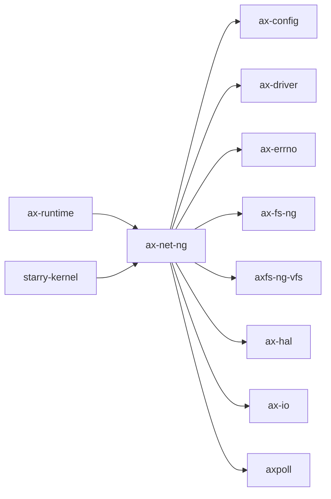

# `ax-net-ng` 技术文档

> 路径：`os/arceos/modules/axnet-ng`
> 类型：库 crate
> 分层：ArceOS 层 / ArceOS 内核模块
> 版本：`0.5.0`
> 文档依据：当前仓库源码、`Cargo.toml` 与 未检测到 crate 层 README

`ax-net-ng` 的核心定位是：ArceOS network module

## 1. 架构设计分析
- 目录角色：ArceOS 内核模块
- crate 形态：库 crate
- 工作区位置：子工作区 `os/arceos`
- feature 视角：主要通过 `vsock` 控制编译期能力装配。
- 关键数据结构：可直接观察到的关键数据结构/对象包括 `ListenTableEntryInner`、`ListenTable`、`UnixCredentials`、`Rule`、`RouteTable`、`Router`、`GetSocketOption`、`SetSocketOption`、`SocketAddrEx`、`Shutdown` 等（另有 8 个关键类型/对象）。

### 1.1 内部模块划分
- `consts`：内部子模块
- `device`：设备抽象、枚举与访问封装
- `general`：内部子模块
- `listen_table`：内部子模块
- `options`：内部子模块
- `router`：内部子模块
- `service`：内部子模块
- `socket`：socket 状态机与收发接口

### 1.2 核心算法/机制
- socket 状态机与连接管理
- 虚拟 socket 通道管理

## 2. 核心功能说明
- 功能定位：ArceOS network module
- 对外接口：从源码可见的主要公开入口包括 `init_network`、`init_vsock`、`poll_interfaces`、`new`、`nonblocking`、`reuse_address`、`send_timeout`、`recv_timeout`、`ListenTableEntryInner`、`ListenTable` 等（另有 11 个公开入口）。
- 典型使用场景：主要作为仓库中的专用支撑 crate 被上层组件调用。
- 关键调用链示例：按当前源码布局，常见入口/初始化链可概括为 `init_network()` -> `init_vsock()` -> `poll_interfaces()` -> `register_waker()` -> `new()`。

## 3. 依赖关系图谱


### 3.1 直接与间接依赖
- `axconfig`
- `ax-driver`
- `ax-errno`
- `ax-fs-ng`
- `axfs-ng-vfs`
- `ax-hal`
- `axio`
- `axpoll`
- `ax-sync`
- `ax-task`
- `smoltcp`

### 3.2 间接本地依赖
- `ax-arm-pl011`
- `ax-arm-pl031`
- `axaddrspace`
- `ax-alloc`
- `axallocator`
- `axbacktrace`
- `ax-config-gen`
- `ax-config-macros`
- `ax-cpu`
- `ax-dma`
- `ax-driver-base`
- `axdriver_block`
- 另外还有 `38` 个同类项未在此展开

### 3.3 被依赖情况
- `ax-runtime`
- `starry-kernel`

### 3.4 间接被依赖情况
- `arceos-affinity`
- `arceos-display`
- `arceos-exception`
- `arceos-fs-shell`
- `arceos-irq`
- `arceos-memtest`
- `arceos-net-echoserver`
- `arceos-net-httpclient`
- `arceos-net-httpserver`
- `arceos-net-udpserver`
- `arceos-parallel`
- `arceos-priority`
- 另外还有 `17` 个同类项未在此展开

### 3.5 关键外部依赖
- `async-channel`
- `async-trait`
- `bitflags`
- `cfg-if`
- `enum_dispatch`
- `event-listener`
- `hashbrown`
- `lazy_static`
- `log`
- `ringbuf`
- `spin`

## 4. 开发指南
### 4.1 依赖配置
```toml
[dependencies]
ax-net-ng = { workspace = true }

# 如果在仓库外独立验证，也可以显式绑定本地路径：
# ax-net-ng = { path = "os/arceos/modules/axnet-ng" }
```

### 4.2 初始化流程
1. 在 `Cargo.toml` 中接入该 crate，并根据需要开启相关 feature。
2. 若 crate 暴露初始化入口，优先调用 `init`/`new`/`build`/`start` 类函数建立上下文。
3. 在最小消费者路径上验证公开 API、错误分支与资源回收行为。

### 4.3 关键 API 使用提示
- 优先关注函数入口：`init_network`、`init_vsock`、`poll_interfaces`、`new`、`nonblocking`、`reuse_address`、`send_timeout`、`recv_timeout` 等（另有 23 项）。
- 上下文/对象类型通常从 `ListenTableEntryInner`、`ListenTable`、`UnixCredentials`、`Rule`、`RouteTable`、`Router` 等（另有 7 项） 等结构开始。

## 5. 测试策略
### 5.1 当前仓库内的测试形态
- 当前 crate 目录中未发现显式 `tests/`/`benches/`/`fuzz/` 入口，更可能依赖上层系统集成测试或跨 crate 回归。

### 5.2 单元测试重点
- 建议覆盖公开 API、状态转换和异常分支。

### 5.3 集成测试重点
- 建议补充最小消费者路径，验证该 crate 在真实调用链中可用。

### 5.4 覆盖率要求
- 覆盖率建议：公开 API、边界条件和关键错误处理路径需要显式覆盖。

## 6. 跨项目定位分析
### 6.1 ArceOS
`ax-net-ng` 直接位于 `os/arceos/` 目录树中，是 ArceOS 工程本体的一部分，承担 ArceOS 内核模块。

### 6.2 StarryOS
`ax-net-ng` 不在 StarryOS 目录内部，但被 `starry-kernel` 等 StarryOS crate 直接依赖，说明它是该系统的共享构件或底层服务。

### 6.3 Axvisor
`ax-net-ng` 主要通过 `axvisor` 等上层 crate 被 Axvisor 间接复用，通常处于更底层的公共依赖层。
