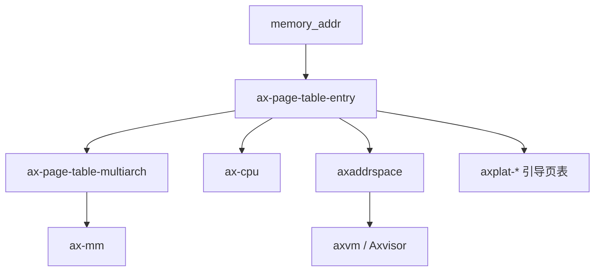

# `ax-page-table-entry` 技术文档

> 路径：`components/page_table_multiarch/page_table_entry`
> 类型：库 crate
> 分层：组件层 / 页表项编码层
> 版本：`0.6.1`
> 文档依据：当前仓库源码、`Cargo.toml`、`README.md`、`src/lib.rs` 与 `src/arch/*`

`ax-page-table-entry` 是多架构页表栈里专门负责“页表项长什么样”的基础库。它不负责遍历页表树、不负责分配页表页，也不负责地址空间策略；它只把不同架构的 PTE/descriptor 编码抽象成统一接口，使上层 `ax-page-table-multiarch`、`axaddrspace`、`axplat-*` 引导页表和 `ax-cpu` 等组件都能在不重复理解每套硬件位语义的前提下构造和查询页表项。

## 1. 架构设计分析

### 1.1 设计定位

该 crate 在页表体系中的职责边界非常清楚：

- `ax-page-table-entry`：定义页表项格式与 flags 编码
- `ax-page-table-multiarch`：实现页表树、cursor、map/query/unmap
- `axaddrspace` / `ax-mm`：组织地址空间与映射策略

因此它的核心价值是“架构相关的位级定义统一化”，而不是高层内存管理。

### 1.2 模块划分

| 模块 | 作用 | 关键内容 |
| --- | --- | --- |
| `lib.rs` | 顶层统一抽象 | `MappingFlags`、`GenericPTE`、`PhysAddr` |
| `arch/mod.rs` | 架构分派 | 条件编译各架构子模块并导出公共类型 |
| `arch/x86_64.rs` | x86_64 页表项 | `X64PTE` 与 `PageTableFlags` 转换 |
| `arch/aarch64.rs` | AArch64 页表项 | `A64PTE`、`DescriptorAttr`、`MemAttr` |
| `arch/arm.rs` | ARMv7 页表项 | `A32PTE` 与 short-descriptor 风格编码 |
| `arch/riscv.rs` | RISC-V 页表项 | `Rv64PTE` 与 `PTEFlags` |
| `arch/loongarch64.rs` | LoongArch64 页表项 | `LA64PTE` 与对应 flags |

### 1.3 通用权限模型：`MappingFlags`

`MappingFlags` 是本 crate 的第一核心抽象。它用统一位语义表达：

- `READ`
- `WRITE`
- `EXECUTE`
- `USER`
- `DEVICE`
- `UNCACHED`

这组 flags 不是任何单一架构原样存在的硬件位，而是“上层能够理解的通用映射语义”。随后，每个架构子模块都负责把它转换成各自的原生 PTE/descriptor 标志组合。

这层抽象的意义在于：

- 上层不需要重复关心 NX/PXN/UXN、AttrIndx、PAT、PTEFlags 等差异
- 不同内存子系统之间可以共享同一套权限语言

### 1.4 通用页表项接口：`GenericPTE`

`GenericPTE` 是第二核心抽象。它约束每种架构页表项都必须提供：

- `new_page()`
- `new_table()`
- `paddr()`
- `flags()`
- `set_paddr()`
- `set_flags()`
- `bits()`
- `is_unused()`
- `is_present()`
- `is_huge()`
- `clear()`

这说明 `GenericPTE` 的目标不是暴露全部硬件细节，而是提供给页表引擎最小但足够的操作面。

### 1.5 各架构 PTE 建模

#### x86_64：`X64PTE`

x86_64 路径基于 `x86_64::PageTableFlags`：

- `MappingFlags` 映射为 x86 原生 `PRESENT`、`WRITABLE`、`USER_ACCESSIBLE`、`NO_EXECUTE` 等组合
- 大页通过 `HUGE_PAGE` 标记
- 设备/不可缓存语义通过 `NO_CACHE` / `WRITE_THROUGH` 近似表达

#### AArch64：`A64PTE`

AArch64 路径除了普通 descriptor bits，还引入：

- `DescriptorAttr`
- `MemAttr`

这里最关键的是把 `MappingFlags::DEVICE` / `UNCACHED` / 普通内存映射到不同 `AttrIndx`，从而与 `MAIR_EL1` 的内存属性布局对应起来。换句话说，它不仅编码权限，也编码缓存属性类别。

#### ARMv7：`A32PTE`

ARMv7 路径同时支持：

- Section（大粒度映射）
- Small Page（4K）

这是本 crate 中少数明显体现“同一架构内两种页表粒度编码差异”的实现路径。

#### RISC-V：`Rv64PTE`

RISC-V 路径基于 Sv39/Sv48 风格的叶子/表项编码：

- `PTEFlags` 负责 V/R/W/X/U 等位
- 物理地址以 PPN 形式编码进页表项
- `xuantie-c9xx` feature 会额外影响设备/普通内存属性位组合

这里有一个容易误解的点：在当前实现语义里，`is_huge()` 更接近“该项是否是叶子页映射”而不是 x86 那种严格意义上的“大页位”，阅读上层代码时要结合架构具体语义理解。

#### LoongArch64：`LA64PTE`

LoongArch64 路径提供：

- 访问权限位
- 用户态等级位
- 缓存属性位
- 大页相关位

它体现了该 crate 的一个重要设计目标：不仅服务当前最常用的 x86/AArch64/RISC-V，也为多架构扩展预留了稳定接口面。

### 1.6 feature 差异

当前显式 feature 只有两个：

- `arm-el2`
- `xuantie-c9xx`

它们的影响点都很集中：

- `arm-el2`：改变 AArch64 页表项的权限编码语义，使其更适配 EL2/hypervisor 场景
- `xuantie-c9xx`：改变 RISC-V PTE 的部分缓存/设备属性编码

这也说明，本 crate 允许“同架构、不同运行级或微架构变体”在页表项编码层出现差异，而不必把这些差异挪到更上层。

## 2. 核心功能说明

### 2.1 主要能力

- 为多架构定义统一的通用映射权限模型
- 为多架构提供统一的页表项构造和查询接口
- 支持普通页、页表指针和大页/块映射的编码
- 向上层页表引擎隐藏架构位级差异

### 2.2 典型使用场景

最典型的消费者有三类：

- `ax-page-table-multiarch`：把 `GenericPTE` 作为页表树操作的底层单元
- `axplat-*` 平台包：在引导页表中直接手工创建 `A64PTE` 等静态项
- `ax-cpu` / `axaddrspace`：在 MMU、嵌套页表或页错误处理中复用 `MappingFlags`

### 2.3 设计边界

本 crate 不承担以下职责：

- 不维护页表树结构
- 不负责分配或释放页表页
- 不实现 `map_region()` / `unmap_region()` 这类高阶操作
- 不提供完整地址空间管理器

也就是说，它是“PTE 语言层”，不是“页表运行时”。

## 3. 依赖关系图谱

### 3.1 直接依赖

| 依赖 | 作用 |
| --- | --- |
| `memory_addr` | 统一物理地址类型 `PhysAddr` |
| `bitflags` | 定义 `MappingFlags` 与架构 flags |
| `aarch64-cpu` | AArch64 内存属性相关常量与语义辅助 |
| `x86_64` | x86_64 原生页表 flags |

### 3.2 主要消费者

- `ax-page-table-multiarch`
- `axaddrspace`
- `ax-cpu`
- `axvm`
- `os/axvisor`
- 多个 `axplat-*` 平台包

### 3.3 关系示意

## 4. 开发指南

### 4.1 新增架构页表项时的步骤

1. 在 `arch/` 下增加架构模块
2. 定义架构原生 flags 与 PTE 类型
3. 实现 `MappingFlags` 与架构 flags 的双向转换
4. 实现 `GenericPTE`
5. 在 `arch/mod.rs` 中挂接条件编译导出

### 4.2 修改现有架构编码时的注意事项

- 优先保证 `MappingFlags` 语义稳定，不要让上层因底层位布局变化而受影响
- 对 `is_huge()`、`is_present()` 这类方法的语义修改尤其要谨慎，因为它们会直接影响页表树遍历逻辑
- 修改 AArch64 缓存属性编码时，需要同步核对 `ax-cpu` 或平台初始化路径中的 MAIR 设定

### 4.3 feature 传播

若上层依赖某一特定 PTE 语义：

- Hypervisor/EL2 路径应确认 `arm-el2` 已正确向下传递
- RISC-V 玄铁路径应确认 `xuantie-c9xx` 在依赖链中没有丢失

## 5. 测试策略

### 5.1 当前已有测试面

目前源码内已有一部分 ARMv7 页表项测试，主要验证：

- Section
- Small Page
- Page Table descriptor

说明作者至少对一种“复杂两级编码”路径做了自测。

### 5.2 推荐补充的测试

- `MappingFlags` 与各架构原生 flags 的表驱动转换测试
- AArch64 `arm-el2` 开关前后的语义差异测试
- RISC-V `xuantie-c9xx` 前后属性位测试
- `is_huge()` / `is_present()` / `clear()` 行为的一致性测试

### 5.3 风险点

- 这是所有页表相关上层的公共位语义来源，一处误改会影响页表引擎、地址空间管理和平台引导页表
- 不同架构上 `is_huge()` 语义并不完全等价，写高层逻辑时不能想当然
- AArch64 路径与 MAIR 语义紧密耦合，文档和实现必须同步维护

## 6. 跨项目定位分析

| 项目 | 位置 | 角色 | 核心作用 |
| --- | --- | --- | --- |
| ArceOS | 页表基础设施底层 | 多架构 PTE 统一定义层 | 为 `ax-cpu`、平台引导页表和 `ax-mm` 路径提供统一的页表项语义 |
| StarryOS | 通过页表栈间接使用 | 底层页表项编码库 | StarryOS 多数通过 `ax-page-table-multiarch` 间接依赖它，但权限语义与页表编码最终仍来自这里 |
| Axvisor | 嵌套页表与虚拟化内存基础件 | 虚拟化页表项语义来源 | `axaddrspace`、`axvm`、x86/AArch64/RISC-V 虚拟化路径都复用它的 `MappingFlags` 与部分架构 PTE 实现 |

## 7. 总结

`ax-page-table-entry` 的价值，在于把最容易碎片化的“架构页表项位语义”统一收拢到一个地方。它让上层页表引擎和地址空间管理器可以围绕统一接口工作，同时又保留了各架构在权限、缓存属性和大页语义上的真实差异，是整个多架构页表栈的编码基座。
