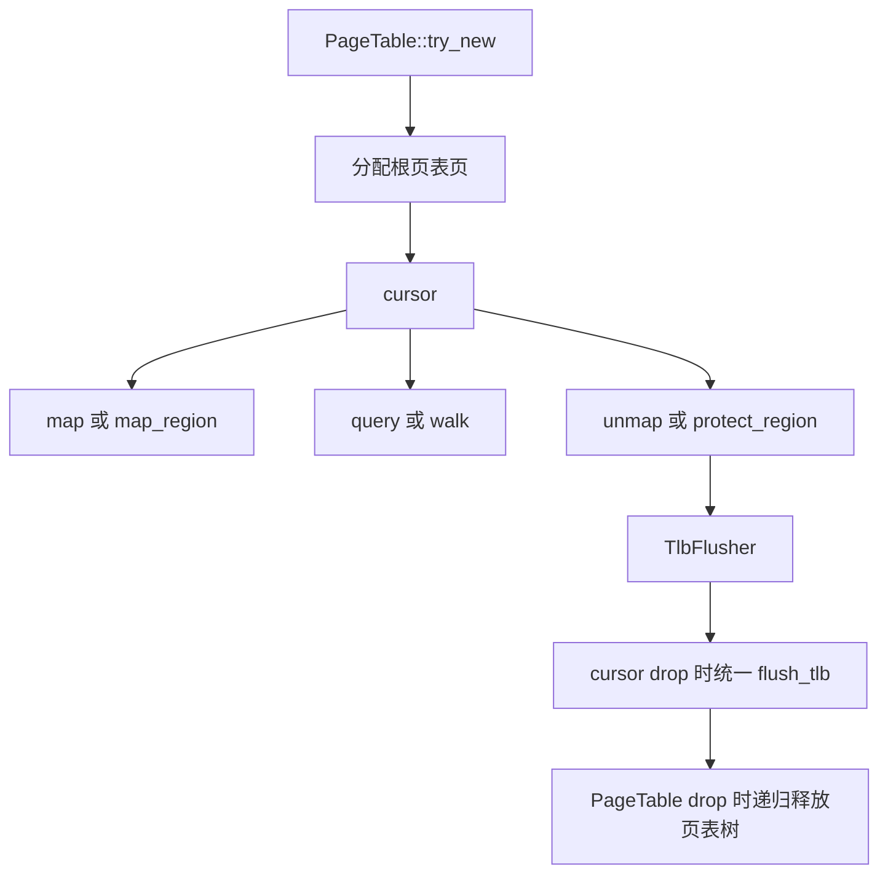
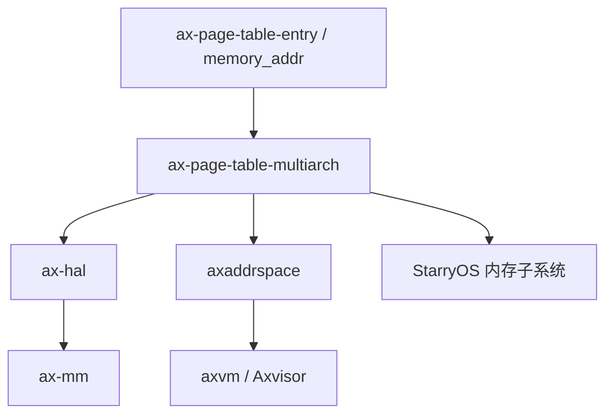

# `ax-page-table-multiarch` 技术文档

> 路径：`components/page_table_multiarch/page_table_multiarch`
> 类型：库 crate
> 分层：组件层 / 通用页表引擎
> 版本：`0.6.1`
> 文档依据：当前仓库源码、`Cargo.toml`、`README.md`、`src/lib.rs`、`src/bits64.rs`、`src/bits32.rs` 与相关上层引用路径

`ax-page-table-multiarch` 是整个仓库中页表抽象最底层的通用实现。它不关心当前是在 ArceOS 内核页表、StarryOS 用户地址空间，还是 Axvisor 嵌套页表场景；它所做的事情是用泛型把“页表元数据”“页表项格式”“页帧分配/物理直映能力”三件事拆开，然后提供统一的建表、映射、撤销、查询、权限修改和 TLB 刷新框架。

## 1. 架构设计分析

### 1.1 设计定位

`ax-page-table-multiarch` 的设计目标是把跨架构页表公共逻辑提炼成一个独立引擎：

- 对内核而言，它是通用页表实现库
- 对 hypervisor 而言，它是构造 NPT/Stage-2/EPT 风格页表的底层积木
- 对上层地址空间管理器而言，它提供可复用的 cursor/map/query 机制

因此它的边界非常清楚：

- 它实现的是“通用树形页表引擎”
- 它不直接负责地址空间策略
- 它不直接实现 VM、进程或 guest 的高级内存管理语义

### 1.2 三个核心泛型

该 crate 的核心抽象由三个泛型参数组成：

- `M: PagingMetaData`
- `PTE: GenericPTE`
- `H: PagingHandler`

它们分别对应三种职责：

| 泛型 | 作用 |
| --- | --- |
| `PagingMetaData` | 架构元数据：页表层数、地址位宽、TLB 刷新方式、虚拟地址类型 |
| `GenericPTE` | 页表项编码与 flags 语义 |
| `PagingHandler` | OS/运行时依赖：页帧分配、释放、物理到虚拟地址映射 |

这个拆分是本 crate 的设计核心。它让“树形页表遍历逻辑”不必绑定到任何具体架构，也不必绑定到具体内存分配器。

### 1.3 模块划分

| 模块 | 作用 | 关键内容 |
| --- | --- | --- |
| `lib.rs` | 顶层 trait 与公共类型 | `PagingMetaData`、`PagingHandler`、`PagingError`、`PageSize`、`TlbFlusher` |
| `bits64.rs` | 64 位页表实现 | `PageTable64`、`PageTable64Cursor`、map/query/walk/protect/copy-from |
| `bits32.rs` | 32 位页表实现 | `PageTable32`、`PageTable32Cursor` |
| `arch/*` | 架构元数据与类型别名 | x86_64、AArch64、RISC-V、ARMv7、LoongArch64 |

从代码组织上看，这是一个典型的“通用骨架 + 架构适配器”结构。

### 1.4 `PagingMetaData`

`PagingMetaData` 定义了页表引擎必须知道、但又不应该写死在实现中的架构信息：

- `LEVELS`
- `PA_MAX_BITS`
- `VA_MAX_BITS`
- `type VirtAddr`
- `flush_tlb(Option<Self::VirtAddr>)`

尤其是 `type VirtAddr` 很关键。它意味着：

- 页表引擎并不强制把输入地址当成 `memory_addr::VirtAddr`
- 上层完全可以为 EPT、NPT 或 Stage-2 场景绑定自定义的“虚拟侧地址类型”

也正因此，`ax-page-table-multiarch` 虽然默认以普通页表元数据命名，但天然具备被 `axaddrspace` 复用到嵌套页表场景的能力。

### 1.5 `PagingHandler`

`PagingHandler` 提供的是“页表引擎与宿主运行时之间的最低耦合面”：

- `alloc_frame()` / `alloc_frames()`
- `dealloc_frame()` / `dealloc_frames()`
- `phys_to_virt()`

页表引擎内部需要访问各级页表页本身，因此只给它“物理页分配”是不够的，还必须给它“宿主如何通过虚拟地址读写某个物理页”的能力，这就是 `phys_to_virt()` 的意义。

### 1.6 页表对象与 cursor 模型

64 位主实现是：

- `PageTable64<M, PTE, H>`
- `PageTable64Cursor<'a, M, PTE, H>`

它们的关系可以理解为：

- `PageTable64`：拥有根页表和生命周期
- `cursor()`：生成一个用于批量修改页表的工作视图

修改操作基本都经由 cursor 进行，例如：

- `map()`
- `unmap()`
- `map_region()`
- `unmap_region()`
- `protect_region()`
- `copy_from()`

这使它在语义上类似“借用期间可修改，离开时统一刷 TLB”的事务式工作流。

### 1.7 TLB 刷新策略

`lib.rs` 中的 `TlbFlusher` 是一个非常值得注意的设计点：

- 少量改动时缓存待刷地址
- 超过阈值后退化为全量刷新
- cursor drop 时统一执行刷新

当前阈值为 `SMALL_FLUSH_THRESHOLD = 32`。这说明该 crate 不只是机械实现页表操作，还显式考虑了修改路径的 TLB 刷新代价。

### 1.8 映射、查询与释放主线

页表主线可以概括为：

从实现细节上看：

- `try_new()` 会分配根页表页并清零
- `query()` 返回 `(PhysAddr, MappingFlags, PageSize)`
- `map_region()` 会根据对齐和 `allow_huge` 决定是否使用大页
- `Drop` 会递归释放页表树

这是一套相当完整的低层页表生命周期管理机制。

### 1.9 Stage-1 与 Stage-2 的边界

这是本 crate 最容易被写错的点。

从当前源码看：

- `arch/aarch64.rs` 等元数据实现的是普通架构页表元数据与 TLB 刷新规则
- `ax-page-table-entry` 中 AArch64 页表项编码也偏向 Stage-1 语义
- crate 本身 **没有** 单独声明“这是 EPT”或“这是 Stage-2”类型

真正的 Stage-2/NPT 语义，是在 `axaddrspace::npt` 里通过：

- 自定义 `PagingMetaData`
- 绑定不同的地址类型
- 使用对应 PTE 类型

组合出来的。

因此更准确的说法是：**`ax-page-table-multiarch` 提供通用页表引擎，Stage-2/NPT 只是它的一种上层用法，而不是它内建的专属模式。**

## 2. 核心功能说明

### 2.1 主要能力

- 提供 64 位和 32 位页表的统一实现
- 提供跨架构统一的映射、查询、撤销、保护和遍历 API
- 支持大页映射与区域映射
- 支持批量修改后的延迟 TLB 刷新
- 通过 feature 支持与 `ax-errno` 集成及页表根项复制能力

### 2.2 架构差异

当前仓库中的主要架构路径包括：

- x86_64
- AArch64
- RISC-V
- ARMv7
- LoongArch64

一些关键差异包括：

- x86_64 典型走 4 级页表
- RISC-V 既有 Sv39 也有 Sv48
- ARMv7 走 32 位页表实现
- LoongArch64 在元数据中包含额外的页表窗口控制常量

### 2.3 Feature 说明

当前 feature 有两个：

- `ax-errno`：把 `PagingError` 转成 `ax_errno::AxError`
- `copy-from`：允许根级条目复制，并依赖 `bitmaps` 记录 borrowed entries

其中 `copy-from` 在 StarryOS 用户地址空间复制场景中很有价值，因为它允许直接复用部分内核映射而避免重复建表。

## 3. 依赖关系图谱

### 3.1 直接依赖

| 依赖 | 作用 |
| --- | --- |
| `ax-page-table-entry` | 页表项抽象与 `MappingFlags` |
| `memory_addr` | 地址类型、对齐与页大小辅助 |
| `arrayvec` | 小规模 TLB 刷新地址缓存 |
| `log` | 调试输出 |
| `ax-errno` | 可选错误桥接 |
| `bitmaps` | `copy-from` feature 下记录 borrowed entries |
| `x86` / `riscv` | 特定架构元数据与辅助指令 |

### 3.2 主要消费者

- `ax-hal`
- `ax-mm`
- `axaddrspace`
- `axvm`
- `os/axvisor`
- `os/StarryOS`

### 3.3 关系示意

## 4. 开发指南

### 4.1 新接入方需要提供什么

任何新接入方都需要明确三件事：

1. 用什么 `PagingMetaData`
2. 用什么 `GenericPTE`
3. 用什么 `PagingHandler`

缺一不可。

### 4.2 典型接入步骤

1. 为目标架构准备合适的 `PagingMetaData`
2. 实现页帧分配和 `phys_to_virt()`，满足 `PagingHandler`
3. 构造 `PageTable64` 或 `PageTable32`
4. 使用 `cursor()` 完成 map/query/protect/unmap 操作
5. 将根页表物理地址交给上层地址空间或硬件寄存器安装路径

### 4.3 使用注意事项

- 若要实现嵌套页表，不应直接把该 crate 文档里的普通架构元数据照搬，而应像 `axaddrspace::npt` 那样重新组合元数据和地址类型。
- `copy-from` 不是默认 feature，依赖它的上层必须显式打开。
- cursor drop 才会统一执行 TLB 刷新，因此修改生命周期应保持清晰，避免异常路径绕开 drop 语义。

## 5. 测试策略

### 5.1 当前已有测试基础

该 crate 本身已具备较好的主机侧测试土壤：

- 分配/释放页表页
- 区域映射和查询
- 大页路径
- 复制路径
- 错误条件

这对一个页表引擎库来说是非常重要的基础。

### 5.2 推荐补充的测试

- 不同架构元数据下的行为一致性测试
- `copy-from` 开关前后的回归测试
- 大页退化为 4K 页的边界条件测试
- TLB 刷新阈值附近的批量修改测试
- 与 `axaddrspace` 组合后的嵌套页表集成测试

### 5.3 风险点

- 这是多条内存主线共用的底层库，任何 API 或语义变化都会同时影响 ArceOS、StarryOS 和 Axvisor。
- `PagingMetaData` / `GenericPTE` / `PagingHandler` 三个维度的组合非常灵活，但也意味着错误组合在编译期不一定总能被完全识别。
- “通用页表引擎”和“具体地址空间策略”边界若写不清，维护者容易把上层问题误修到本 crate。

## 6. 跨项目定位分析

| 项目 | 位置 | 角色 | 核心作用 |
| --- | --- | --- | --- |
| ArceOS | 页表基础设施底座 | 内核分页引擎 | 通过 `ax-hal::paging` 和 `ax-mm` 支撑内核地址空间与映射管理 |
| StarryOS | 内存管理公共引擎 | 页表复制与地址空间操作底层 | 结合 `copy-from` 等能力支撑用户地址空间构建与复制 |
| Axvisor | 嵌套页表底层引擎 | NPT/Stage-2 的通用机械部分 | 不直接决定虚拟化策略，但为 `axaddrspace`、`axvm` 等提供真正的页表数据结构和操作原语 |

## 7. 总结

`ax-page-table-multiarch` 的价值，在于把“页表作为一种树形数据结构”的公共部分最大程度抽离出来：架构元数据、页表项格式和宿主页帧操作都被参数化，而映射、查询、权限更新和刷新逻辑则尽量统一。它不是 Axvisor 独有组件，也不是普通 OS 独有组件，而是整个仓库内多条内存与虚拟化路径共享的底层页表引擎。
