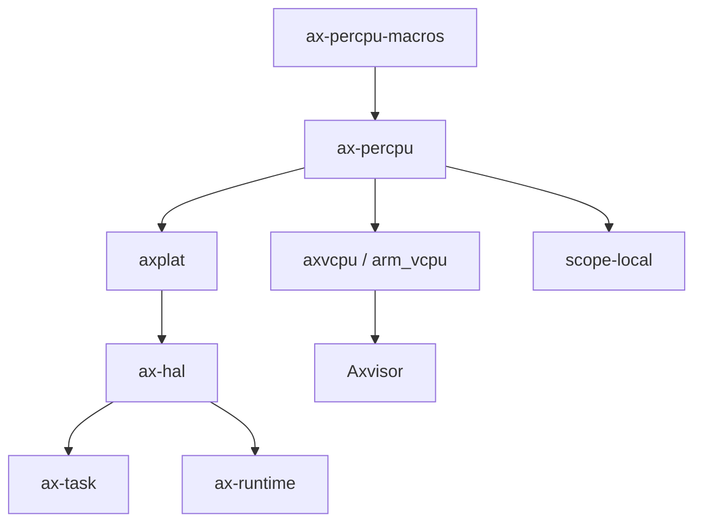

# `ax-percpu-macros` 技术文档

> 路径：`components/percpu/percpu_macros`
> 类型：过程宏 crate
> 分层：组件层 / per-CPU 编译期生成层
> 版本：`0.2.3-preview.1`
> 文档依据：当前仓库源码、`Cargo.toml`、`README.md`、`src/lib.rs`、`src/arch.rs`、`src/naive.rs`

`ax-percpu-macros` 是 `ax-percpu` 运行时体系的编译期一半。它不直接提供 per-CPU 存储区、也不负责初始化每核基址寄存器；它的职责是在编译期把 `#[def_percpu]` 声明展开成 `.percpu` 段内的真实符号、包装类型以及当前 CPU 访问函数。可以把它理解为“per-CPU 数据模型的代码生成器”，而 `ax-percpu` 本体则是“per-CPU 数据模型的运行时承载层”。

## 1. 架构设计分析

### 1.1 设计定位

这个 crate 解决的是 per-CPU 体系中最容易分散且最依赖架构细节的一部分：

- 如何把一个静态变量放进 `.percpu` 段
- 如何为它生成“当前 CPU 的那一份”的访问入口
- 如何在不同架构下把“当前 CPU 基址 + 符号偏移”变成高效代码

因此它的定位不是“声明一个宏方便写代码”，而是“把 per-CPU 访问协议固化到宏展开里”。

### 1.2 模块划分

| 模块 | 作用 | 关键内容 |
| --- | --- | --- |
| `lib.rs` | 过程宏入口 | `#[def_percpu]`、`percpu_symbol_vma!` |
| `arch.rs` | 默认 per-CPU 访问代码生成 | `symbol_vma`、`offset`、`current_ptr`、primitive 快路径读写 |
| `naive.rs` | `sp-naive` 退化实现 | 把 per-CPU 变量退化为普通全局变量访问 |

### 1.3 `#[def_percpu]` 的展开主线

在默认实现路径下，`#[def_percpu] static X: T = INIT;` 不会直接保留为一个普通静态变量，而是被重写为三层结构：

1. `.percpu` 段中的真实存储符号，如 `__PERCPU_X`
2. 对外可见的零大小包装类型
3. 一个同名静态对象，方法全部挂在包装类型上

这些方法通常包括：

- `symbol_vma()`
- `offset()`
- `current_ptr()`
- `current_ref_raw()`
- `current_ref_mut_raw()`
- `with_current()`
- `remote_ptr(cpu_id)`

若底层类型是常见整数类型，还会额外生成：

- `read_current_raw()`
- `write_current_raw()`
- `read_current()`
- `write_current()`

这说明 `ax-percpu-macros` 不是简单把变量加个属性，而是为每个 per-CPU 变量生成一整套访问 API。

### 1.4 架构相关代码生成

`arch.rs` 负责按目标架构生成访问代码，这是本 crate 最有技术含量的部分。

#### `symbol_vma`

它使用内联汇编取出符号在链接视图中的地址/偏移。不同架构采用不同指令模板：

- x86_64：`offset symbol`
- AArch64：`movz` 等绝对地址片段
- ARM：`movw` / `movt`
- RISC-V：`lui` + `addi`
- LoongArch64：高低位拼接

#### `offset`

默认情况下，`offset()` 等价于符号的 VMA；启用 `non-zero-vma` 后，则改为“符号地址减去 `_percpu_load_start`”，以适配 Linux 用户态等 `.percpu` 不从 0 开始映射的场景。

#### `current_ptr`

这是当前 CPU 访问的核心路径：

- x86_64：通过 `gs:[__PERCPU_SELF_PTR]` 取基址，再加目标符号偏移
- AArch64：读 `TPIDR_EL1`，在 `arm-el2` 下改为 `TPIDR_EL2`
- ARMv7：读 `TPIDRURO`
- RISC-V：读 `gp`
- LoongArch64：读专用通用寄存器

这个设计直接对应 `ax-percpu` 运行时里“每核基址寄存器已经被初始化”的假设。

#### primitive 快路径

对 `bool/u8/u16/u32/u64/usize` 这类类型，`arch.rs` 还会按架构生成更直接的读写指令，减少“先拿指针再解引用”的开销。x86_64、riscv64、loongarch64 上尤其明显；其它架构则可能回退到普通 `current_ptr()` 路径。

### 1.5 两条特殊分支

#### `sp-naive`

在单核或测试场景下，`ax-percpu-macros` 可以完全放弃 per-CPU 语义，把变量当成普通全局量访问。这时：

- `mod arch` 切换到 `naive.rs`
- `offset`/`current_ptr` 本质上都退化为对原始静态地址的访问

#### `custom-base`

这条路径下，`#[def_percpu]` 不再生成默认包装器，而是直接展开为 `ax_percpu::PerCpuData<T>`。这意味着：

- 访问模型仍是 per-CPU 的
- 但 per-CPU 基址由外部平台自己维护
- 宏和 `ax-percpu` 运行时之间的契约发生了切换

因此 `custom-base` 不是小修小补，而是“运行时模型切换”。

## 2. 核心功能说明

### 2.1 主要能力

- 把静态变量放入 `.percpu` 段
- 生成当前 CPU 访问函数
- 生成按 CPU 编号远程访问函数
- 为常用整数类型生成更快的读写路径
- 根据 feature 和架构切换不同的代码生成策略

### 2.2 典型使用场景

`ax-percpu-macros` 并不建议业务代码直接依赖，典型场景都是通过 `ax-percpu` 间接使用：

- 平台层定义 `CPU_ID`、`IS_BSP`
- `ax-hal` 定义当前任务指针
- `ax-task` 定义 per-CPU 运行队列
- `axvcpu` 或 `os/axvisor` 定义每核虚拟化状态

### 2.3 与 `ax-percpu` 的分工

需要明确：

- `ax-percpu-macros`：生成代码
- `ax-percpu`：提供 section 布局、初始化、每核基址寄存器操作和运行时 API

只有两者组合起来，整个 per-CPU 机制才成立。

## 3. 依赖关系图谱

### 3.1 直接依赖

| 依赖 | 作用 |
| --- | --- |
| `proc-macro2` | 过程宏 Token 操作 |
| `quote` | 代码生成 |
| `syn` | 语法树解析 |
| `cfg-if` | 选择实现路径 |

### 3.2 主要消费者

直接消费者几乎总是：

- `ax-percpu`

实际最终受益的上层组件包括：

- `axplat`
- `ax-hal`
- `ax-task`
- `axvcpu`
- `arm_vcpu`
- `os/axvisor`
- `scope-local`

### 3.3 关系示意

## 4. 开发指南

### 4.1 新增 per-CPU 变量时的建议

推荐通过 `ax_percpu::def_percpu` 间接使用本宏，而不是直接依赖 `ax-percpu-macros`。这样可以避免上层代码和运行时实现细节耦合。

### 4.2 维护宏展开时需要重点核对

- 生成的 section 名称是否与链接脚本一致
- `offset()` 在 `non-zero-vma` 开关前后是否保持语义正确
- x86_64 的 `gs:[__PERCPU_SELF_PTR]` 自举链路是否被破坏
- `custom-base` 与默认展开路径是否仍兼容现有 `ax-percpu` API

### 4.3 与抢占的关系

启用 `preempt` 后，生成的 `read_current()` / `write_current()` / `with_current()` 会通过 `ax_percpu::__priv::NoPreemptGuard` 在访问当前 CPU 数据前先关抢占。因此：

- 该宏本身不直接依赖 `kernel_guard`
- 但它生成的代码依赖 `ax-percpu` 已正确导出抢占保护能力

## 5. 测试策略

### 5.1 当前验证主线

本 crate 本身没有大规模独立测试矩阵，它更多依赖 `ax-percpu` 的集成测试间接覆盖。因为真正需要验证的是：

- 宏展开是否正确
- 运行时初始化与链接脚本是否匹配
- 每核基址寄存器与访问函数是否协同工作

### 5.2 推荐测试方向

- `sp-naive`、默认模式、`custom-base` 三条路径分别编译回归
- `non-zero-vma` 下的偏移计算测试
- AArch64 `arm-el2` 下的寄存器选择测试
- x86_64、riscv64、loongarch64 的 primitive 快路径读写测试

### 5.3 风险点

- 它属于“编译期生成 + 运行时契约”结合点，错误很难只在本 crate 内暴露
- 任何宏展开格式变动，都可能影响 `ax-percpu`、`ax-hal`、`ax-task` 和 Axvisor 的每核状态访问

## 6. 跨项目定位分析

| 项目 | 位置 | 角色 | 核心作用 |
| --- | --- | --- | --- |
| ArceOS | `ax-percpu` 体系的编译期基础件 | per-CPU 访问代码生成层 | 为平台、HAL、调度器和运行时生成 per-CPU 静态变量访问接口 |
| StarryOS | 通过 `ax-percpu` 间接使用 | 每核状态代码生成基础件 | 为 StarryOS 内核的 per-CPU 状态和局部运行时模型提供统一生成机制 |
| Axvisor | Hypervisor per-CPU 基础设施底层 | EL2/每核状态生成层 | 为 VMM、vCPU 绑定和定时器等每核状态生成访问逻辑 |

## 7. 总结

`ax-percpu-macros` 的价值不在于“定义了一个方便的宏”，而在于它把 per-CPU 变量从“一个普通静态量”提升成了“链接布局、基址寄存器和架构快路径共同驱动的局部状态对象”。它是 `ax-percpu` 机制的编译期前半段，也是 ArceOS、StarryOS 和 Axvisor 多核运行时模型能高效落地的关键一环。
