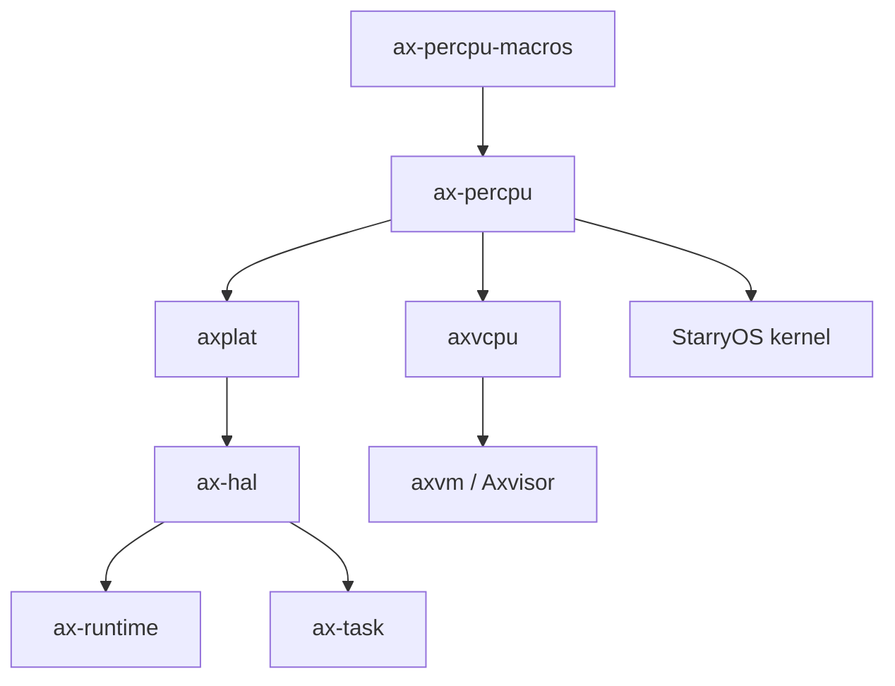

# `ax-percpu` 技术文档

> 路径：`components/percpu/percpu`
> 类型：库 crate
> 分层：组件层 / 每核局部数据基础设施
> 版本：`0.2.3-preview.1`
> 文档依据：当前仓库源码、`Cargo.toml`、`README.md`、`src/lib.rs`、`src/imp.rs`、`src/custom/*`、`components/percpu/percpu_macros/src/*`

`ax-percpu` 是整个仓库里所有“当前 CPU 局部状态”能力的基础设施。它通过 `.percpu` 段、架构相关的每核基址寄存器和过程宏 `#[def_percpu]`，让系统能够为每个逻辑 CPU 保持一份独立数据副本，并在运行时以极低成本访问“当前核”的那份数据。调度器、当前任务指针、CPU ID、虚拟化每核状态、SMP 辅助状态都建立在这套机制之上。

## 1. 架构设计分析

### 1.1 设计定位

`ax-percpu` 解决的是 SMP/多核系统中一个基础而关键的问题：

- 同一静态变量需要每个 CPU 一份副本
- 当前 CPU 访问自己的副本应尽量快
- 初始化阶段要把模板数据复制到各 CPU 私有区域

因此它本质上是“每核局部静态数据运行时”，而不是普通同步原语库。

### 1.2 模块划分

`src/lib.rs` 根据 feature 选择三条实现路径：

| 路径 | 模块 | 场景 |
| --- | --- | --- |
| `sp-naive` | `naive.rs` | 单核或测试环境，退化为普通全局变量 |
| `custom-base` | `custom/mod.rs` | 平台自管每核基址，库只负责访问模型 |
| 默认 | `imp.rs` | 标准 SMP 模式，负责拷贝模板、设置寄存器和运行时访问 |

此外：

| 模块 | 作用 |
| --- | --- |
| `ax-percpu-macros` | `#[def_percpu]`、符号偏移与架构汇编生成 |
| `custom/tp.rs` | custom-base 模式下的线程指针/基址辅助 |

### 1.3 `#[def_percpu]`：最核心的接口

`ax-percpu` 对外最重要的能力不是一个普通函数，而是过程宏：

- `#[def_percpu]`

这个宏负责：

- 把真实存储放入 `.percpu` 段
- 生成当前 CPU 的访问入口
- 生成偏移量与原始指针访问能力
- 在特定架构上生成高效的当前核访问汇编

从使用者视角看，它让“每核静态变量”像普通静态变量一样易用；从实现视角看，它其实是一套链接、初始化和寄存器访问协议。

### 1.4 运行时核心模型

标准 SMP 模式下，运行时模型可概括为：

1. 链接脚本把 `.percpu` 模板放入镜像
2. 系统为所有 CPU 预留若干等大小 per-CPU 区域
3. 启动时把 CPU0 模板复制到每个 CPU 对应区域
4. 每个 CPU 把自己的区域基址写入架构相关寄存器
5. `#[def_percpu]` 生成的访问代码用“基址 + 变量偏移”定位当前核副本

这是一种典型、成熟且高性能的 per-CPU 数据实现方式。

### 1.5 `imp.rs`：标准实现主线

默认实现中最关键的几个能力是：

- `percpu_area_size()`
- `percpu_area_num()`
- `percpu_area_base(cpu_id)`
- `init()`
- `init_percpu_reg(cpu_id)`
- `read_percpu_reg()`
- `write_percpu_reg()`

其中：

- `init()` 负责准备模板复制和整体区域初始化
- `init_percpu_reg()` 负责把某个 CPU 的 per-CPU 基址写入寄存器
- `read/write_percpu_reg()` 是所有“当前 CPU 局部访问”的硬件入口

### 1.6 架构差异

当前仓库里，per-CPU 基址的实现会根据架构切换：

- x86_64：GS base 路径
- AArch64：`TPIDR_EL1`，在 `arm-el2` 下切换到 `TPIDR_EL2`
- ARMv7：`TPIDRURO`
- RISC-V：`gp`
- LoongArch：专用通用寄存器

这说明 `ax-percpu` 虽然是通用基础件，但其运行时性能与正确性高度依赖架构相关寄存器约定。

### 1.7 `custom-base` 与 `sp-naive`

#### `custom-base`

适合平台自己掌管每核基址、而不完全走默认 runtime 模型的场景。此时：

- `ax-percpu` 仍然提供数据布局与访问接口
- 但基址来源由外部符号或平台逻辑提供

这一模式对动态平台、定制 HAL 或特殊引导流程尤其重要。

#### `sp-naive`

这是最轻量的退化路径，用于：

- 单核
- host-side 测试
- 不需要真实每核副本的简单环境

它牺牲真实多核语义，换来更简单的构建和测试体验。

## 2. 核心功能说明

### 2.1 主要能力

- 定义每 CPU 一份的静态数据
- 初始化 per-CPU 数据区
- 设置和读取当前 CPU 的 per-CPU 基址寄存器
- 为当前 CPU 提供高效局部访问接口
- 支持单核退化模式、EL2 模式、非零 VMA 和自定义基址模式

### 2.2 典型使用场景

| 场景 | 用法 |
| --- | --- |
| CPU 标识 | 用 `#[def_percpu]` 保存 `CPU_ID`、是否 BSP |
| 当前任务指针 | 保存当前核正在运行的 task 指针 |
| 调度器状态 | 保存 run queue、idle task、时钟状态等 |
| 虚拟化每核状态 | 保存当前物理核上的 VMM/per-CPU VMX/EL2 状态 |
| SMP 辅助数据 | 保存 IPI、启动辅助或局部缓存数据 |

### 2.3 典型初始化链路

在 ArceOS/Axvisor 体系里，典型主线是：

1. 平台或运行时早期完成基本内存和 CPU 初始化
2. 调用 `ax_percpu::init()` 准备 per-CPU 区域
3. 对主核调用 `init_percpu_reg(cpu_id)`
4. 通过 `#[def_percpu]` 变量写入 CPU ID、当前任务等字段
5. SMP 次核启动后重复设置自己的 per-CPU 基址

### 2.4 与抢占和上下文切换的关系

`preempt` feature 表明 `ax-percpu` 不只是“静态副本容器”，它还需要与：

- 抢占关闭
- 当前任务切换
- 调度器局部状态一致性

这些运行时语义配合。因此它经常与 `kernel_guard`、`ax-task`、`ax-hal` 一起出现。

## 3. 依赖关系图谱

### 3.1 直接依赖

| 依赖 | 作用 |
| --- | --- |
| `ax-percpu-macros` | 生成 per-CPU 静态变量与访问代码 |
| `cfg-if` | 选择不同实现路径 |
| `kernel_guard`（可选） | `preempt` 模式下提供抢占保护 |
| `x86`（x86_64） | x86 per-CPU 基址相关辅助 |
| `spin`（非裸机目标） | host/test 环境辅助初始化 |

### 3.2 主要消费者

仓库内直接或间接依赖 `ax-percpu` 的关键组件包括：

- `axplat`
- `ax-hal`
- `ax-runtime`
- `ax-task`
- `ax-alloc`
- `axvcpu`
- `axvm`
- `arm_vcpu`
- `os/axvisor`
- `os/StarryOS/kernel`

### 3.3 关系示意

## 4. 开发指南

### 4.1 定义一个新的 per-CPU 变量

最常见写法是：

1. 在需要的模块中声明 `#[def_percpu] static XXX: T = ...;`
2. 在主核和次核初始化阶段确保基址寄存器已设置
3. 通过宏生成的 `with_current`、原始读写接口或包装 API 访问当前核变量

### 4.2 选择 feature 的建议

- 真实多核内核/Hypervisor：使用默认路径
- 单元测试或单核：可考虑 `sp-naive`
- EL2 Hypervisor：AArch64 下打开 `arm-el2`
- 平台自己维护 per-CPU 基址：使用 `custom-base`
- 用户态/Linux 测试或非零映射地址：按需使用 `non-zero-vma`

### 4.3 维护时的关键注意事项

- 修改 `.percpu` 布局或符号约定时，要同步核对链接脚本
- 修改寄存器选择逻辑时，要同时核对架构启动路径
- 若改动 `#[def_percpu]` 生成逻辑，必须回归所有依赖它的高层组件
- `custom-base` 和默认实现是两套不同契约，不能混淆

## 5. 测试策略

### 5.1 当前测试覆盖

当前仓库内已经有针对 Linux/测试环境的 per-CPU 测试，覆盖：

- 初始化
- 基址切换
- 当前 CPU 变量访问
- 非零 VMA 相关构建路径

这类测试非常重要，因为 per-CPU 机制往往在裸机外更难直接调试。

### 5.2 推荐继续补充的测试

- `custom-base` 路径的契约测试
- 多核模板复制边界测试
- 二次初始化和错误初始化顺序测试
- `preempt` 模式下访问时序测试

### 5.3 风险点

- 这是启动早期和调度核心路径使用的基础设施，一旦出错通常影响范围极大
- 基址寄存器没设对时，所有 per-CPU 访问都会错位
- 链接脚本、宏展开和运行时初始化三者之间必须严格一致

## 6. 跨项目定位分析

| 项目 | 位置 | 角色 | 核心作用 |
| --- | --- | --- | --- |
| ArceOS | 启动、调度、CPU 局部状态底座 | 每核局部数据基础设施 | 支撑 CPU ID、当前任务、运行队列等核心运行时状态 |
| StarryOS | 内核 SMP 基础件 | 每核状态承载层 | 为 StarryOS 进程调度和 CPU 局部内核状态提供统一机制 |
| Axvisor | Hypervisor 每核状态底座 | EL2/每核虚拟化状态承载层 | 支撑每核 VMM 状态、当前 vCPU 绑定关系和定时器等局部数据 |

## 7. 总结

`ax-percpu` 是一个非常底层、但对整个系统运行时结构影响极大的 crate。它把链接布局、架构寄存器、过程宏和启动初始化组合成一套完整的 per-CPU 数据机制，让上层调度器、平台层和虚拟化组件都能以统一方式持有当前核局部状态。对多核内核和 Hypervisor 来说，它不是便利工具，而是运行时结构能够成立的前提之一。
