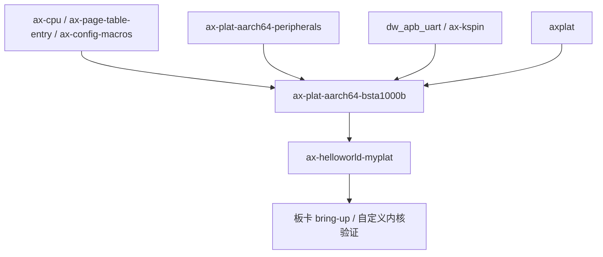

# `ax-plat-aarch64-bsta1000b` 技术文档

> 路径：`components/axplat_crates/platforms/axplat-aarch64-bsta1000b`
> 类型：库 crate
> 分层：组件层 / AArch64 板级平台包
> 版本：`0.3.1-pre.6`
> 文档依据：当前仓库源码、`Cargo.toml`、`README.md`、`axconfig.toml`、`src/boot.rs`、`src/init.rs`、`src/dw_apb_uart.rs`、`src/mem.rs`、`src/power.rs`、`src/mp.rs`、`src/misc.rs`

`ax-plat-aarch64-bsta1000b` 是 Black Sesame A1000B SoC 在 `axplat` 体系里的具体板级实现。它把 A1000B 的启动入口、早期页表、固定地址空间、PSCI 多核拉起、GIC/Generic Timer 接线以及本地 DesignWare APB UART 控制台组织成一组 `axplat` 接口，使上层内核能够按统一平台契约完成 bring-up。它不是通用 AArch64 外设库，也不是完整驱动栈；它解决的是“这块板子怎样从裸机入口走到 `ax_plat::call_main()`，并把最小可运行平台能力交给上层”的问题。

## 1. 架构设计分析

### 1.1 真实定位

这个 crate 在 A1000B 平台栈中的位置可以概括为：

- 向下依赖 `ax-cpu` 提供 EL 切换、MMU 打开、trap 初始化和缓存/停机等 CPU 原语。
- 横向复用 `ax-plat-aarch64-peripherals` 提供的 PSCI、Generic Timer 和 GIC glue。
- 自己补上 A1000B 特有的启动代码、内存布局、CPU 硬件 ID 列表，以及非 PL011 的 `dw_apb_uart` 控制台实现。
- 向上实现 `InitIf`、`MemIf`、`PowerIf`，并通过 `TimeIf` / `IrqIf` 宏展开接入 `axplat`。

这意味着它的核心工作不是“定义抽象”，而是“把板级事实落成 `axplat` 的实现”：

- A1000B 的 RAM 和 MMIO 地址来自 `axconfig.toml`，不是运行时探测。
- 早期页表只负责把 CPU 带进 Rust 世界，不负责最终内核页表策略。
- 设备地址、IRQ 号和 CPU 硬件 ID 已经在配置里写死，当前实现并不依赖设备树完成硬件发现。

### 1.2 模块划分

| 模块 | 作用 | 关键内容 |
| --- | --- | --- |
| `lib.rs` | crate 根与 glue 汇总 | `config` 生成、包名校验、`TimeIf`/`IrqIf` 宏接入 |
| `boot` | 最早期引导 | Linux 风格 ARM64 镜像头、主核/次核入口、引导页表、MMU 打开 |
| `init` | `InitIf` 实现 | trap、PSCI、UART、Generic Timer、GIC 的初始化顺序 |
| `dw_apb_uart` | 本地控制台实现 | `ConsoleIf` 落地、UART 初始化、可选 UART IRQ 使能 |
| `mem` | `MemIf` 实现 | RAM/MMIO 区间、线性映射、地址空间边界 |
| `power` | `PowerIf` 实现 | `system_off()`、`cpu_boot()`、`cpu_num()` |
| `mp` | 次核启动 | 基于 PSCI `cpu_on()` 的次核拉起路径 |
| `misc` | 板级复位辅助 | QSPI/CPU reset、bootmode 读取，但当前未接到 `PowerIf` |

### 1.3 启动主线

`boot.rs` 负责把 A1000B 从裸机入口带到统一的 `axplat` 入口。主线如下：

```mermaid
flowchart TD
    A[_start 带 Linux arm64 镜像头] --> B[_start_primary]
    B --> C[读取 MPIDR 并保存 DTB 指针]
    C --> D[建立 BOOT_STACK]
    D --> E[ax-cpu::init::switch_to_el1]
    E --> F[enable_fp]
    F --> G[init_boot_page_table]
    G --> H[ax-cpu::init::init_mmu]
    H --> I[把栈切到高半区映射]
    I --> J[ax_plat::call_main cpu_id dtb]
    J --> K[内核 #[ax_plat::main] 入口]
```

这个流程里有几个实现层面的重点：

- 入口镜像头遵循 Linux arm64 image header 约定，方便常见引导器识别。
- 主核从 `MPIDR_EL1` 直接截取硬件 CPU ID，并把 `x0` 里的 DTB 指针原样传给 `ax_plat::call_main()`。
- 引导页表只建立 3 个 1 GiB block：低地址设备区、下一段设备区，以及从 `0x8000_0000` 开始的普通内存区。
- 打开 MMU 后，栈通过 `PHYS_VIRT_OFFSET` 平移到高半区，再进入上层内核逻辑。

在 `smp` 打开时，`_start_secondary` 复用同一套引导页表，但次核入口更简单：固件直接给出次核栈顶物理地址，次核完成 EL 切换和 MMU 初始化后就跳入 `ax_plat::call_secondary_main()`。

### 1.4 与相邻层的边界

这份文档最需要澄清的，是它和 `ax-cpu`、`axplat`、`ax-plat-aarch64-peripherals`、`ax-hal` 之间的边界：

| 层 | 负责内容 | 不负责内容 |
| --- | --- | --- |
| `ax-cpu` | EL 切换、MMU 打开、trap 初始化、FP 使能、`halt()` 等 CPU 原语 | A1000B 的 UART/GIC 基地址、RAM 布局、PSCI CPU ID 选择 |
| `ax-plat-aarch64-peripherals` | PSCI、Generic Timer、GIC 的通用 glue 与 `TimeIf`/`IrqIf` 宏 | A1000B 启动汇编、引导页表、DW APB UART、板级内存布局 |
| `ax-plat-aarch64-bsta1000b` | 启动入口、页表、板级地址配置、本地控制台、`MemIf`/`PowerIf` | 调度、页表管理策略、驱动枚举、上层 HAL 聚合 |
| `ax-hal` | 若上层选择接入，则负责 DTB、全局内存视图、运行时初始化顺序整合 | 早期板级寄存器初始化和 SoC 复位寄存器语义 |

尤其需要注意三点：

- 这个 crate 没有展开 `ax-plat-aarch64-peripherals::console_if_impl!`，因为 A1000B 控制台不是 PL011，而是本地 `dw_apb_uart` 实现。
- `boot.rs` 会把 DTB 指针传上去，但本 crate 的 `init.rs` 并不解析 DTB；当前平台描述主要由 `axconfig.toml` 固化。
- `misc.rs` 里确实有 QSPI reset、CPU reset 和 bootmode 读取逻辑，但这些函数没有接入 `ax_plat::power::system_off()`；对上层可见的电源语义仍然是 PSCI `system_off()`。

### 1.5 内存与设备模型

`mem.rs` 把 A1000B 的板级地址布局直接翻译成 `ax_plat::mem::MemIf`：

- `phys_ram_ranges()` 返回单一 RAM 区间：从 `PHYS_MEMORY_BASE` 开始，长度为 `PHYS_MEMORY_SIZE`。
- `reserved_phys_ram_ranges()` 当前为空，表示本层不额外声明保留 RAM。
- `mmio_ranges()` 完全来自 `axconfig.toml` 中的 `MMIO_RANGES`。
- `phys_to_virt()` / `virt_to_phys()` 采用固定偏移的高半区线性映射。
- `kernel_aspace()` 返回内核地址空间基址和大小，而不是最终页表内容。

这也界定了它与“外设驱动层”的边界：

- 它公开 UART、GIC、CPU CSR、CRM 等寄存器窗口。
- 它不在本层枚举设备，更不在本层提供 PCI、块设备或网络驱动。
- 它也不根据 DTB 动态修改这些窗口，当前实现是纯配置驱动的固定布局。

## 2. 核心功能说明

### 2.1 主要能力

- 为 A1000B 提供可直接链接的 ARM64 启动入口。
- 建立最小可用引导页表，并负责 MMU 打开前后的栈切换。
- 提供基于 `dw_apb_uart` 的控制台输入输出。
- 通过 `ax-plat-aarch64-peripherals` 接入 PSCI、Generic Timer 和 GIC。
- 暴露平台 RAM、MMIO、线性映射和内核地址空间边界。
- 在 `smp` 打开时，基于 PSCI `cpu_on()` 拉起次核。

### 2.2 feature 行为与实现落点

| Feature | 作用 | 主要落点 |
| --- | --- | --- |
| `fp-simd` | 启动期提前打开 FP/SIMD，避免早期 Rust 代码触发非法指令 | `boot.rs` |
| `irq` | 编译 GIC glue、定时器 IRQ 和 UART IRQ 使能路径 | `lib.rs`、`init.rs`、`dw_apb_uart.rs` |
| `smp` | 编译次核入口和 `PowerIf::cpu_boot()` 路径 | `boot.rs`、`mp.rs`、`power.rs` |
| `rtc` | Cargo feature 已预留，但当前源码没有对应实现，等价于占位开关 | `Cargo.toml` |

这里最容易误解的是 `rtc`：和 `ax-plat-aarch64-qemu-virt` 不同，A1000B 平台当前并没有在本 crate 内接入 RTC 设备或墙钟偏移逻辑，因此这个 feature 现在不提供新增语义。

### 2.3 最关键的边界澄清

从上层内核视角看，这个 crate 暴露的是 `axplat` 能力，而不是板级私有 API：

- 上层调用的是 `ax_plat::init::init_early()`、`ax_plat::console_println!()`、`ax_plat::power::system_off()`。
- 这些调用最终才会落到本 crate 的 `InitIfImpl`、`ConsoleIfImpl`、`PowerImpl`。
- 因此它的职责是“把 A1000B 接到 `axplat` 上”，不是“定义一套 A1000B 专用内核接口”。

同时，它也不是完整的板级支持包合集：

- 没有 DTB 解析器。
- 没有驱动模型。
- 没有最终内核页表管理。
- 没有把 `misc.rs` 里的复位寄存器语义提升为统一 `ax_plat::power` 接口。

## 3. 依赖关系图谱

### 3.1 直接依赖

| 依赖 | 作用 |
| --- | --- |
| `axplat` | 目标平台抽象接口与 `call_main()` 契约 |
| `ax-cpu` | EL 切换、MMU 初始化、trap 初始化、缓存/停机辅助 |
| `ax-plat-aarch64-peripherals` | PSCI、Generic Timer、GIC 及 `TimeIf`/`IrqIf` glue |
| `dw_apb_uart` | A1000B 控制台所用的 DesignWare 8250 UART 驱动 |
| `ax-page-table-entry` | 构造 AArch64 引导页表项 |
| `ax-config-macros` | 把 `axconfig.toml` 变成 `config` 常量模块 |
| `ax-kspin` | 串口访问的无中断自旋锁 |
| `log` | 启动和错误日志 |

### 3.2 主要消费者

- `os/arceos/examples/helloworld-myplat`：当前仓库里最直接的使用者。
- 仓库外直接链接该 crate 的自定义内核或实验内核。
- 间接上层可以是 ArceOS 风格内核，但当前仓库并未把它接入 `ax-hal::defplat` 默认平台链路。

### 3.3 依赖关系示意



## 4. 开发指南

### 4.1 接入方式

最典型的接入方式仍然是“让它作为平台包参与链接”，而不是直接调用它的内部函数：

```toml
[dependencies]
ax-plat-aarch64-bsta1000b = { workspace = true, features = ["irq", "smp"] }
```

然后在依赖树某处显式链接平台包：

```rust
extern crate axplat_aarch64_bsta1000b;
```

内核入口仍然写成标准 `axplat` 形式：

```rust
#[ax_plat::main]
fn kernel_main(cpu_id: usize, arg: usize) -> ! {
    ax_plat::init::init_early(cpu_id, arg);
    ax_plat::init::init_later(cpu_id, arg);
    ax_plat::power::system_off();
}
```

### 4.2 维护时最容易踩坑的地方

- 修改 `axconfig.toml` 中的 RAM 基址、MMIO 地址或 `PHYS_VIRT_OFFSET` 时，必须同时检查 `boot.rs` 的 1 GiB block 映射假设是否仍成立。
- 修改 `CPU_ID_LIST` 时，必须同步验证 PSCI `cpu_on()` 目标 ID 与真实硬件 MPIDR 的对应关系。
- 若更换控制台 IP，需要同时改动 `dw_apb_uart.rs` 和 `init.rs` 中的初始化与 IRQ 使能顺序。
- 如果想让“重启”成为正式平台能力，不能只改 `misc.rs`；还需要重新设计 `PowerIf` 的对外语义。

### 4.3 适合的调试顺序

对这种板级平台，调试最好按最小 bring-up 主线推进：

1. 先确认 `_start -> ax_plat::call_main()` 能贯通。
2. 再确认早期串口能打印日志。
3. 再打开 `irq` 验证 GIC 和定时器。
4. 最后再打开 `smp` 验证 PSCI 次核启动。

其中最重要的一点是：**不要把 DTB 传进来就默认认为平台已经“设备树化”了。** 当前实现里，DTB 只是被转发给上层入口，本 crate 自己并不消费它。

## 5. 测试策略

### 5.1 当前已有的有效验证面

- 交叉编译：验证 `aarch64-unknown-none` 下 feature 组合可编译。
- `ax-helloworld-myplat`：可覆盖最小启动链和控制台输出。
- 板卡整机冒烟：是这类平台包最有价值的真实验证方式。

### 5.2 推荐测试分层

- 启动冒烟：验证从 `_start` 到 `ax_plat::call_main()` 的完整链路。
- 串口验证：确认 `dw_apb_uart` 早期初始化后能立即输出日志。
- IRQ 验证：启用 `irq` 后确认 GIC 初始化、timer IRQ 和 UART IRQ 能正常工作。
- SMP 验证：启用 `smp` 后确认 `cpu_boot()` 能按 `CPU_ID_LIST` 拉起次核。
- 电源验证：确认 `system_off()` 走 PSCI 关机，而不是错误落入本地 reset 辅助逻辑。

### 5.3 重点风险

- 引导页表只覆盖了非常有限的区域，任何地址布局漂移都可能在极早期直接挂死。
- `CPU_ID_LIST` 错误会表现为“主核能起、次核拉不起来”，调试成本高。
- `rtc` feature 目前是占位性质，如果上层误以为它已提供墙钟语义，会造成测试判断偏差。

## 6. 跨项目定位分析

| 项目 | 位置 | 角色 | 核心作用 |
| --- | --- | --- | --- |
| ArceOS | `myplat`/板卡 bring-up 路径 | A1000B 板级平台包 | 当前仓库里主要通过 `ax-helloworld-myplat` 这类最小示例接入，尚未进入 `ax-hal` 默认平台集 |
| StarryOS | 当前无仓库内直接接入 | 潜在宿主平台包 | 若未来接入，也更可能作为定制平台包直接链接，而不是开箱即用默认平台 |
| Axvisor | 当前无仓库内直接接入 | 潜在宿主板级支持 | 该 crate 不提供虚拟化能力，只能作为宿主板级 bring-up 基础；当前仓库没有直接依赖它 |

## 7. 总结

`ax-plat-aarch64-bsta1000b` 的价值，在于它把 A1000B 这块 SoC 的板级事实准确收敛成 `axplat` 契约：启动从哪里进、页表先怎么铺、控制台走哪个 UART、PSCI 怎样关机和拉起次核、哪些物理地址属于 RAM 或 MMIO。它既复用了 AArch64 通用外设 glue，又保留了 A1000B 自己的启动和串口特性，是一个典型的“板级落地层”而不是“通用硬件抽象层”。
