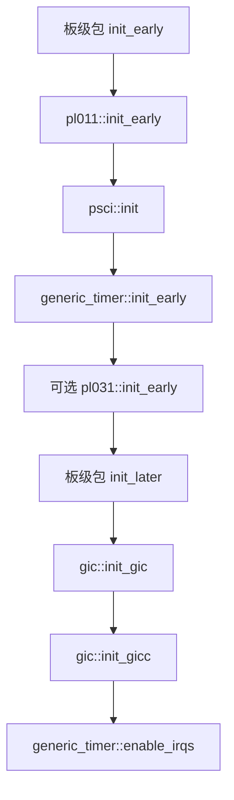
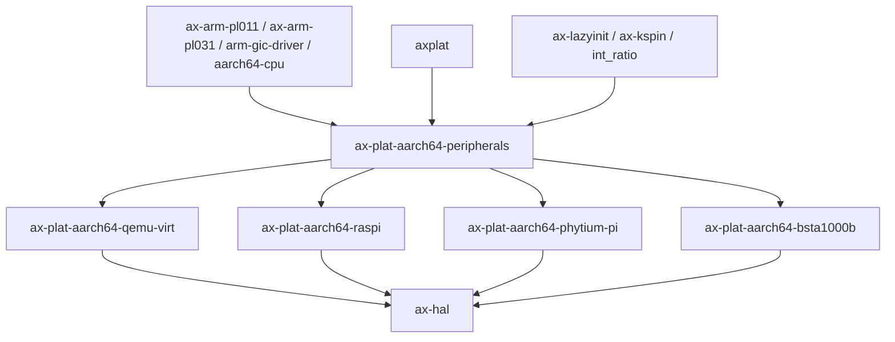

# `ax-plat-aarch64-peripherals` 技术文档

> 路径：`components/axplat_crates/platforms/axplat-aarch64-peripherals`
> 类型：库 crate
> 分层：组件层 / AArch64 通用外设 glue 层
> 版本：`0.3.1-pre.6`
> 文档依据：当前仓库源码、`Cargo.toml`、`README.md` 以及相关平台包的调用路径

`ax-plat-aarch64-peripherals` 是 AArch64 平台包复用的“公共外设适配层”。它并不定义完整的板级平台，也不持有启动页表、内存布局或 boot stub；它的职责是把 PL011、PL031、Generic Timer、GICv2、PSCI 这些通用外设与 `axplat` trait 体系粘合起来，使具体 `axplat-aarch64-*` 平台包只需提供设备地址、IRQ 号和初始化时序即可完成对接。

## 1. 架构设计分析

### 1.1 设计定位

该 crate 解决的是 AArch64 平台族中的“横向复用”问题：

- `ax-plat-aarch64-qemu-virt`、`ax-plat-aarch64-raspi`、`ax-plat-aarch64-phytium-pi` 等平台虽然板级地址不同，但串口、时钟、中断控制器和 PSCI 的接线模式高度相似。
- 如果每个平台包都各自实现 `ConsoleIf`、`TimeIf`、`IrqIf`，会导致大量重复代码。
- 因此这里把“通用外设驱动 + `axplat` 接口实现宏”下沉为独立 crate，板级平台只保留地址与时序绑定。

从职责边界看，它更接近“HAL 外设拼装层”而不是“板级平台包”：

- 它知道怎么初始化 PL011、GIC、PL031、Generic Timer、PSCI。
- 它不知道本机 RAM 布局、内核线性映射、引导入口符号和次核启动栈布局。
- 它不处理 PCI/ECAM/VirtIO MMIO 设备树扫描，这些信息由板级包或更上层驱动体系负责。

### 1.2 模块划分

| 模块 | 作用 | 关键内容 |
| --- | --- | --- |
| `generic_timer` | ARM Generic Timer 适配 | tick 与纳秒换算、oneshot 计时器、定时器 IRQ 使能、`time_if_impl!` |
| `gic` | GICv2 中断控制 | `Gic` 单例、IRQ handler 表、ACK/EOI/DIR、IPI、`irq_if_impl!` |
| `pl011` | PL011 串口 | `Pl011Uart` 单例、字节读写、`console_if_impl!` |
| `pl031` | PL031 RTC | Unix 时间读取、epoch 偏移缓存 |
| `psci` | PSCI 电源管理 | `smc`/`hvc` 路径选择、`cpu_on`、`cpu_off`、`system_off` |
| `lib.rs` | 导出层 | feature 裁剪与模块组织 |

### 1.3 关键全局对象与状态

该 crate 采用“静态单例 + 宏生成接口实现”的风格，典型全局状态包括：

- `pl011`：`LazyInit<SpinNoIrq<Pl011Uart>>`，保证早期串口只初始化一次。
- `gic`：`LazyInit<SpinNoIrq<Gic>>`、`LazyInit<TrapOp>`、`HandlerTable<1024>`，分别负责 GIC 设备访问、trap 辅助操作和 IRQ 分发表。
- `generic_timer`：两组 tick 与纳秒转换比率，用 `CNTFRQ_EL0` 初始化。
- `pl031`：`RTC_EPOCHOFFSET_NANOS`，缓存墙钟相对于单调时钟零点的偏移。
- `psci`：`AtomicBool` 记录当前是走 HVC 还是 SMC 调用约定。

这里的设计选择说明：

- 外设对象在系统范围内天然唯一，使用静态单例比“把设备对象传给平台实现结构体”更符合启动期约束。
- `SpinNoIrq` 保证早期串口与 GIC 操作在尚未建立完整阻塞原语前仍可安全使用。
- 定时器和 RTC 不直接暴露底层寄存器，而是转译成 `ax_plat::time` 需要的统一语义。

### 1.4 初始化主线

该 crate 自身不实现 `InitIf`，但为板级包提供了一套非常清晰的初始化拼装顺序：



这个顺序背后的理由是：

- 早期必须先有串口和时间源，方便打印日志和建立最小时间语义。
- GIC 的 distributor / CPU interface 通常应放到更晚阶段，因为这时内核页表和异常框架已经更完整。
- 定时器 IRQ 依赖 GIC，所以 `enable_irqs()` 必须出现在 `init_gic()` 之后。

### 1.5 宏驱动的接口接入机制

该 crate 的高价值能力不只是驱动函数，还包括三个 glue 宏：

- `console_if_impl!`
- `time_if_impl!`
- `irq_if_impl!`

它们会在调用方平台包中生成 `ConsoleIfImpl`、`TimeIfImpl`、`IrqIfImpl` 等零大小实现体，并通过 `#[impl_plat_interface]` 或 `#[ax_plat::impl_plat_interface]` 挂到 `axplat` 的接口系统上。宏展开时会直接引用调用方 crate 中的 `crate::config::devices::*` 常量，如：

- `UART_PADDR`
- `UART_IRQ`
- `TIMER_IRQ`
- `GICD_PADDR`
- `GICC_PADDR`

这意味着本 crate 不写死任何板级地址；真正的地址与 IRQ 号绑定全部由平台包的 `axconfig` 生成模块决定。

### 1.6 与板级平台包的边界

此 crate 与具体 `axplat-aarch64-*` 平台包之间的边界非常清楚：

| 能力 | 本 crate 负责 | 板级平台包负责 |
| --- | --- | --- |
| 通用外设寄存器访问 | 是 | 否 |
| `axplat` trait 接口 glue | 是 | 触发宏展开 |
| 设备地址与 IRQ 号 | 否 | 是 |
| RAM/MMIO 全局布局 | 否 | 是 |
| boot stub / 早期页表 / 线性映射 | 否 | 是 |
| 次核入口与引导栈 | 否 | 是 |

一个重要结论是：**PCI 不在此 crate 中实现。** 即使某些板级包会在 `axconfig` 中描述 PCI ECAM 或 PCI MMIO 窗口，这里也不会负责枚举、配置或 `axplat` 化暴露 PCI 设备。

## 2. 核心功能说明

### 2.1 主要功能

- 为 PL011 提供统一的控制台读写能力。
- 为 Generic Timer 提供单调时钟、tick/纳秒转换和 oneshot 定时器能力。
- 在 `irq` feature 下为 GICv2 提供 IRQ 注册、分发、EOI/DIR 与 IPI 发送能力。
- 为 PL031 提供墙钟偏移计算。
- 为 PSCI 提供系统关机和 CPU 启动的底层调用接口。
- 通过宏把上述能力直接注册到 `axplat`。

### 2.2 典型使用场景

该 crate 几乎不会被应用或内核主体直接使用，它的典型使用者是板级平台 crate：

```rust
ax_plat_aarch64_peripherals::console_if_impl!();
ax_plat_aarch64_peripherals::time_if_impl!();

#[cfg(feature = "irq")]
ax_plat_aarch64_peripherals::irq_if_impl!();
```

然后在平台包自己的 `init.rs` 中按地址和初始化顺序调用：

```rust
pl011::init_early(uart_vaddr);
psci::init(psci_method);
generic_timer::init_early();
gic::init_gic(gicd_vaddr, gicc_vaddr);
generic_timer::enable_irqs(timer_irq);
```

### 2.3 对上层暴露的实际效果

当平台包完成宏展开后，上层内核将看到的不是 `pl011::write_bytes()` 或 `gic::handle_irq()`，而是统一的：

- `ax_plat::console::write_bytes()`
- `ax_plat::time::current_ticks()`
- `ax_plat::irq::register()`
- `ax_plat::power::system_off()`（通常由板级包中的 `PowerIf` 再调用 `psci`）

因此它在系统中的价值更接近“把外设能力转译进 `axplat` 合约”。

## 3. 依赖关系图谱

### 3.1 直接依赖

| 依赖 | 作用 |
| --- | --- |
| `ax-arm-pl011` | PL011 串口驱动 |
| `ax-arm-pl031` | PL031 RTC 驱动 |
| `arm-gic-driver` | GICv2 控制器访问与 trap 操作 |
| `aarch64-cpu` | 访问系统寄存器和底层 CPU 能力 |
| `ax-cpu` | 与 AArch64 CPU 辅助代码协作 |
| `axplat` | 目标接口定义与 glue 挂接目标 |
| `ax-lazyinit` | 早期单例初始化 |
| `ax-kspin` / `spin` | 自旋锁保护 |
| `int_ratio` | tick 与纳秒换算比例 |
| `log` | 调试与错误日志 |

### 3.2 主要消费者

- `ax-plat-aarch64-qemu-virt`
- `ax-plat-aarch64-raspi`
- `ax-plat-aarch64-phytium-pi`
- `ax-plat-aarch64-bsta1000b`
- 间接上层：`ax-hal` 及其所服务的 ArceOS/StarryOS/Axvisor 宿主环境

### 3.3 依赖关系示意



## 4. 开发指南

### 4.1 新平台如何复用该 crate

1. 在板级平台包中准备 `axconfig` 生成的 `config::devices::*` 常量。
2. 在 `lib.rs` 中展开 `console_if_impl!`、`time_if_impl!`，如支持中断则展开 `irq_if_impl!`。
3. 在 `init_early()` 中初始化 PL011、PSCI、Generic Timer，必要时初始化 PL031。
4. 在 `init_later()` 中初始化 GIC，并在 GIC 就绪后使能定时器中断。
5. 在 `PowerIf` 实现中调用 `psci::cpu_on()`、`psci::system_off()` 完成电源管理接入。

### 4.2 feature 传播策略

该 crate 自身只定义了一个 feature：

- `irq`：启用 `gic` 模块，并同时要求上层打开 `ax-plat/irq`。

需要特别注意：

- `rtc` 和 `smp` 不是本 crate 的 feature，通常由板级平台包控制是否调用 `pl031` 或启用次核路径。
- 板级包需要把自己的 `irq` feature 同时转发到 `axplat` 和本 crate，否则上层会出现接口/实现不一致。

### 4.3 构建与验证

最直接的构建方式是对该 crate 做 AArch64 裸机目标的全 feature 构建：

```bash
cargo build -p ax-plat-aarch64-peripherals --target aarch64-unknown-none --all-features
```

但真正有意义的验证应放到板级平台包上进行，例如通过 `ax-plat-aarch64-qemu-virt` 运行 `hello-kernel`、`irq-kernel` 或多核示例，确认串口输出、时钟推进和中断分发都贯通。

### 4.4 维护时的注意事项

- `pl031` 源码中的注释提到 microseconds，但实现实际是基于 Unix 秒数换算到纳秒；文档和测试应以代码行为为准。
- `gic::handle_irq()` 负责 ACK/EOI/DIR 路径，若改动 trap 逻辑，需要同步验证 spurious interrupt 和中断完成语义。
- `time_if_impl!` 依赖调用方提供 `TIMER_IRQ`；板级配置错误会直接造成时钟中断失效。
- `bsta1000b` 等平台可能不复用 PL011，而是使用自己的 UART glue，不能假设所有 AArch64 平台都展开 `console_if_impl!`。

## 5. 测试策略

### 5.1 当前可见测试基础

- crate 内没有显式单元测试，现阶段主要依赖交叉构建和整机验证。
- CI 已将该 crate 纳入 `cargo clippy` / `cargo build` 检查路径，可覆盖 `irq` 打开时的编译完整性。

### 5.2 推荐测试分层

- 构建测试：`aarch64-unknown-none` 下做 `--all-features` 构建，确认 GIC、timer、PL011、PL031 glue 同时可编译。
- 平台集成测试：在 `ax-plat-aarch64-qemu-virt` 上验证串口输出、定时器 tick、GIC IRQ 和 PSCI 关机。
- 多核测试：启用 `smp` 的平台包应额外验证次核初始化后 `gic::init_gicc()` 与 `generic_timer::enable_irqs()` 是否在每核都生效。
- RTC 测试：启用 `rtc` 的板级包应验证 `epochoffset_nanos()` 是否能让墙钟与单调时钟正确拼接。

### 5.3 风险点

- 该 crate 把大量平台差异隐藏在宏和静态单例后，配置错误通常表现为“运行时无输出”或“IRQ 不到达”，不一定在编译期暴露。
- 中断号、基地址、PSCI 调用方式高度依赖板级常量，最适合通过端到端启动回归覆盖。

## 6. 跨项目定位分析

| 项目 | 位置 | 角色 | 核心作用 |
| --- | --- | --- | --- |
| ArceOS | AArch64 平台包下层 | 通用外设 glue 层 | 为多个 AArch64 板级平台复用串口、时钟、中断和 PSCI 实现，减少板级重复代码 |
| StarryOS | 通过 `ax-hal` 间接使用 | 宿主平台外设适配层 | StarryOS 不直接依赖该 crate，但若运行在 ArceOS 平台栈上，会间接受益于同一套 AArch64 外设 glue |
| Axvisor | 宿主侧平台支持的一部分 | 宿主 bring-up 公共层 | Axvisor 的虚拟中断和虚拟设备核心在 `arm_vgic`/`axdevice`/`axvm`，而本 crate 负责宿主平台侧的串口、计时和 GIC 基础设施，不应与虚拟化设备层混淆 |

## 7. 总结

`ax-plat-aarch64-peripherals` 的真正价值，在于把“跨多个 AArch64 平台都相似的外设接线逻辑”抽成一个稳定复用层：板级平台包只负责地址、IRQ 号和初始化时序，本 crate 负责把这些通用外设可靠地接入 `axplat`。它让 AArch64 平台支持不再是“每个平台重新写一遍 UART/GIC/timer glue”，而是“在统一骨架上替换配置与启动细节”。
