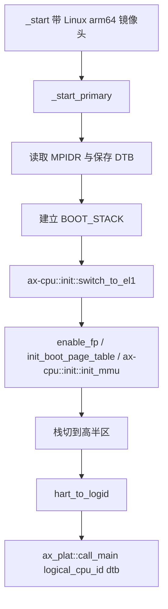
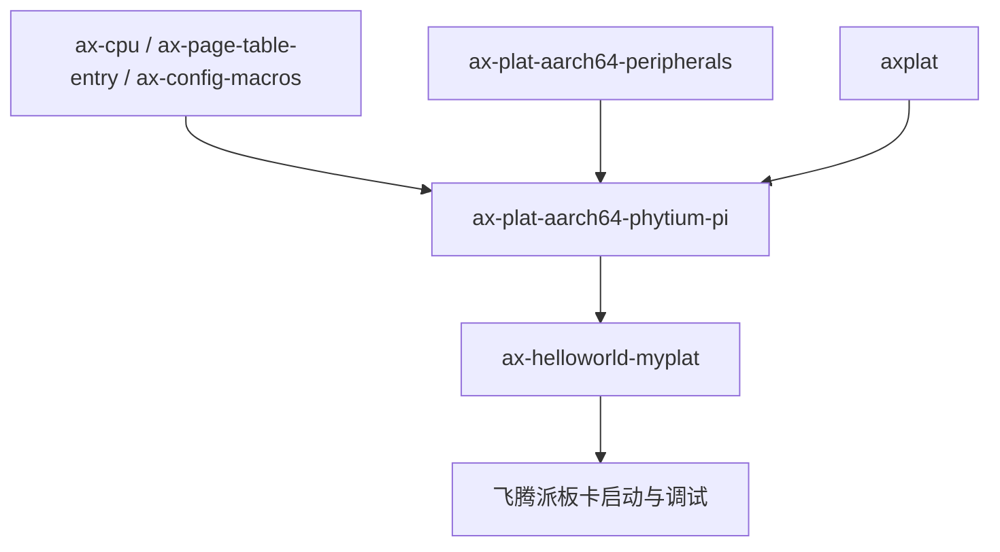

# `ax-plat-aarch64-phytium-pi` 技术文档

> 路径：`components/axplat_crates/platforms/axplat-aarch64-phytium-pi`
> 类型：库 crate
> 分层：组件层 / AArch64 板级平台包
> 版本：`0.3.1-pre.6`
> 文档依据：当前仓库源码、`Cargo.toml`、`README.md`、`axconfig.toml`、`src/boot.rs`、`src/init.rs`、`src/mem.rs`、`src/power.rs`

`ax-plat-aarch64-phytium-pi` 是飞腾派开发板在 `axplat` 体系下的板级平台包。它把启动入口、早期页表、CPU 硬件 ID 到逻辑 CPU ID 的映射、PL011/GIC/Generic Timer/PSCI 接线、固定物理内存布局和 PCIe 地址窗口组织成 `axplat` 可以消费的实现。它不是通用 AArch64 板级抽象，也不是 PCI 子系统；它只负责把“飞腾派这块板子怎么启动、地址在哪里、哪些最小平台能力可用”稳定地交给上层。

## 1. 架构设计分析

### 1.1 真实定位

这个 crate 的职责边界非常清楚：

- 自己负责启动入口、引导页表、内存布局、CPU ID 重映射和 `PowerIf`。
- 复用 `ax-plat-aarch64-peripherals` 提供的 PL011、Generic Timer、GIC 和 PSCI glue。
- 通过 `axconfig.toml` 固化飞腾派的 UART、GIC、PCIe ECAM、GPIO、I2C 和内存地址窗口。
- 向上只暴露 `axplat` 契约，不直接对接调度器、页表管理器或驱动框架。

因此它和其他 AArch64 平台包的差异，不在于“抽象接口不同”，而在于“板级事实不同”：

- 飞腾派使用 PL011，所以控制台完全复用 `ax-plat-aarch64-peripherals::console_if_impl!`。
- 平台有非连续的 CPU 硬件 ID 编号，因此启动阶段必须把 MPIDR 映射成逻辑 CPU ID。
- 平台配置里出现了完整的 PCIe ECAM 和 MMIO 窗口，但这些信息在本 crate 里只是资源描述，不是 PCIe 枚举实现。

### 1.2 模块划分

| 模块 | 作用 | 关键内容 |
| --- | --- | --- |
| `lib.rs` | crate 根与 glue 汇总 | `config` 生成、包名校验、PL011/Timer/GIC 接口宏展开 |
| `boot` | 最早期引导 | Linux 风格 ARM64 镜像头、页表、MMU 打开、CPU ID 映射 |
| `init` | `InitIf` 实现 | trap、PL011、PSCI、Generic Timer、GIC 的初始化顺序 |
| `mem` | `MemIf` 实现 | RAM/MMIO 区间、线性映射、内核地址空间 |
| `power` | `PowerIf` 实现 | PSCI 关机与次核拉起 |

与 `ax-plat-aarch64-bsta1000b` 相比，这个 crate 本地代码更薄，因为控制台也交给了 `ax-plat-aarch64-peripherals`，自己主要承担板级配置和启动职责。

### 1.3 启动主线与 CPU ID 映射

`boot.rs` 的设计重点不是复杂外设，而是“把飞腾派的 CPU 拓扑和地址假设折叠到统一入口”：



这里最关键的板级逻辑是 `hart_to_logid()`：

- `MPIDR_EL1` 读出来的是硬件 CPU ID。
- 飞腾派的 CPU 编号不是简单的 `0..N-1`。
- `CPU_ID_LIST` 把硬件 ID 重排为逻辑 CPU ID，保证 `axplat` 和上层内核看到的是稳定的顺序编号。

这说明本 crate 并不是简单把 `cpu_id = mpidr & mask` 直接上传，而是负责把板级拓扑转译成上层能接受的逻辑编号。

### 1.4 与相邻层的边界

| 层 | 负责内容 | 不负责内容 |
| --- | --- | --- |
| `ax-cpu` | EL 切换、MMU 打开、trap 初始化、FP 使能等 CPU 原语 | 飞腾派的 UART/GIC/PCIe 基地址、CPU ID 重映射 |
| `ax-plat-aarch64-peripherals` | PL011、Generic Timer、GIC、PSCI 的通用实现与接口 glue | 飞腾派启动入口、`CPU_ID_LIST`、RAM/MMIO 窗口、PCI 资源描述 |
| `ax-plat-aarch64-phytium-pi` | 启动页表、CPU 逻辑编号、平台内存模型、`PowerIf` | 设备树解析、PCIe 枚举、驱动注册、上层 HAL 聚合 |
| `ax-hal` | 若被上层接入，则负责统一 DTB、内存区域和运行时初始化顺序 | 飞腾派本地寄存器初始值和板级 boot stub |

几个尤其重要的边界如下：

- `boot.rs` 会把 DTB 指针继续传给 `ax_plat::call_main()`，但本 crate 自己不解析 DTB；地址和 IRQ 仍由 `axconfig.toml` 固化。
- `mem.rs` 会把 PCIe ECAM、32-bit MMIO、GPIO、I2C 等窗口公开给上层，但不会在本层完成总线扫描。
- `power.rs` 的 `cpu_boot()`、`system_off()` 都走 PSCI；它不提供飞腾派专有电源管理协议。

### 1.5 内存、MMIO 与板级事实

`axconfig.toml` 给这个 crate 提供了很完整的资源描述：

- 单一 RAM 区间：从 `0x8000_0000` 开始的 2 GiB。
- 4 路 UART、I2C、GPIO、设备区、PCIe ECAM、32-bit/64-bit PCI MMIO 窗口。
- `CPU_ID_LIST`、`PSCI_METHOD`、GICD/GICC 基地址和 IRQ 号。

但是实现上要区分“描述存在”和“功能落地”：

- `mem.rs` 只负责把这些窗口返回给 `ax_plat::mem`。
- `init.rs` 只真正初始化了 PL011、Generic Timer、PSCI 和可选 GIC。
- PCIe、GPIO、I2C 仍需要上层驱动或总线框架去消费。

还要特别说明一处实现现实：`axconfig.toml` 里有 “GICv3 还未支持” 的注释，而当前代码实际仍按 GICD/GICC 这套 GICv2 风格接口接线。文档应以当前源码行为为准，而不是以板卡硬件理论能力为准。

## 2. 核心功能说明

### 2.1 主要能力

- 提供飞腾派板级启动入口和最小引导页表。
- 在进入上层内核前完成 CPU 硬件 ID 到逻辑 ID 的转换。
- 通过 PL011 提供控制台能力。
- 通过 Generic Timer 提供单调时钟。
- 在 `irq` 打开时接入 GIC 并使能定时器中断。
- 通过 PSCI 提供系统关机和次核启动能力。
- 向上暴露平台 RAM、MMIO、PCIe 窗口和内核地址空间边界。

### 2.2 feature 行为

| Feature | 作用 | 主要落点 |
| --- | --- | --- |
| `fp-simd` | 启动时提前打开 FP/SIMD | `boot.rs` |
| `irq` | 编译并初始化 GIC 相关路径 | `lib.rs`、`init.rs` |
| `smp` | 编译次核入口和 PSCI `cpu_on()` 路径 | `boot.rs`、`power.rs` |
| `rtc` | 当前源码没有 RTC 初始化或墙钟实现，现阶段是占位 feature | `Cargo.toml` |

和这个平台有关的一个现实约束是：虽然 feature 名叫 `rtc`，但当前源码并没有调用 PL031 或其它 RTC 设备，所以上层不应把它当成已经提供墙钟支持。

### 2.3 最关键的边界澄清

这个 crate 既不是“飞腾派设备树解析器”，也不是“飞腾派 PCIe 驱动”：

- `arg`/DTB 只是通过启动链继续向上传递。
- 板级资源描述由 `axconfig.toml` 固定，不靠运行时设备树枚举。
- `pci-ecam-base`、`pci-ranges` 只是对上层说明地址窗口在哪里，不表示此处已经存在 PCI 总线管理逻辑。

从 `axplat` 视角看，它真正贡献的是：

- `InitIf`：初始化时序。
- `MemIf`：地址空间描述。
- `PowerIf`：关机与次核启动。
- 以及通过宏展开提供的 `ConsoleIf`、`TimeIf`、`IrqIf`。

## 3. 依赖关系图谱

### 3.1 直接依赖

| 依赖 | 作用 |
| --- | --- |
| `axplat` | 平台抽象接口与 `call_main()` 契约 |
| `ax-cpu` | EL 切换、MMU 初始化、trap 初始化 |
| `ax-plat-aarch64-peripherals` | PL011、Generic Timer、GIC、PSCI glue |
| `ax-page-table-entry` | AArch64 引导页表项构造 |
| `ax-config-macros` | 把 `axconfig.toml` 生成为 `config` 常量 |
| `log` | 启动日志 |

### 3.2 主要消费者

- `os/arceos/examples/helloworld-myplat`：当前仓库内的直接使用者。
- 飞腾派板卡 bring-up 流程：仓库文档中通过 `ostool` / U-Boot 启动最小内核。
- 仓库外直接链接本平台包的定制内核。

### 3.3 依赖关系示意



## 4. 开发指南

### 4.1 接入方式

典型依赖方式如下：

```toml
[dependencies]
ax-plat-aarch64-phytium-pi = { workspace = true, features = ["irq", "smp"] }
```

在依赖树某处显式链接平台包：

```rust
extern crate axplat_aarch64_phytium_pi;
```

如果走当前仓库里的 ArceOS 板卡流程，则通常会配合：

- `MYPLAT=ax-plat-aarch64-phytium-pi`
- `ax-helloworld-myplat`
- 文档里的 `ostool run uboot` 启动方式

但这些是“如何把镜像送上板”的流程；本 crate 自己只负责镜像上板后的平台 bring-up。

### 4.2 修改时的关注点

- 调整 `CPU_ID_LIST` 时，必须验证主核和次核逻辑编号是否仍和上层预期一致。
- 修改 `PHYS_VIRT_OFFSET`、内核基址或 RAM 大小时，要同步验证 `boot.rs` 里的 block mapping 假设。
- 修改 UART/GIC 基地址时，既要验证 `init.rs` 的初始化路径，也要验证 `mmio_ranges()` 对上层驱动仍正确。
- 若要真正支持 GICv3，不能只改配置注释，必须连同中断控制器接线和初始化语义一起重构。

### 4.3 一个容易误判的问题

`axconfig.toml` 里列出了很多设备窗口，容易让人误以为“平台 crate 已经把整块板子的主要外设都支持了”。实际上并非如此：

- 本 crate 只是把地址和最小控制台/中断/时间能力接到 `axplat`。
- 更高层的 GPIO、I2C、PCIe 控制器驱动仍然在别处，或者还没有实现。

## 5. 测试策略

### 5.1 当前有效验证面

- 交叉构建可验证 `aarch64-unknown-none` 下的编译完整性。
- `ax-helloworld-myplat` 可覆盖最小启动、串口输出和平台初始化主线。
- 真正有价值的验证仍然是飞腾派实板 bring-up。

### 5.2 推荐测试矩阵

- 启动冒烟：验证 `_start -> ax_plat::call_main()` 能贯通。
- 控制台验证：确认 PL011 在早期初始化后可立即打印。
- IRQ 验证：启用 `irq` 后验证 GIC 初始化和 timer IRQ。
- SMP 验证：启用 `smp` 后验证 `cpu_boot()` 和逻辑 CPU ID 映射。
- 电源验证：确认 `system_off()` 通过 PSCI 正确关机。
- 配置验证：故意改错 `CPU_ID_LIST` 或 GIC 地址，确认问题能在早期显现。

### 5.3 高风险点

- CPU 硬件 ID 映射错误会造成 SMP 问题，但单核场景可能仍能“看起来可用”。
- 当前中断路径依赖 GICv2 风格接线，若板卡配置向 GICv3 漂移，现有实现不会自动适配。
- `rtc` feature 目前没有真实实现，文档和测试必须避免把它写成既成能力。

## 6. 跨项目定位分析

| 项目 | 位置 | 角色 | 核心作用 |
| --- | --- | --- | --- |
| ArceOS | `myplat`/板卡 bring-up 路径 | 飞腾派板级平台包 | 当前仓库内主要通过 `ax-helloworld-myplat` 和板卡启动文档使用，不在 `ax-hal::defplat` 默认平台列表中 |
| StarryOS | 当前无仓库内直接接入 | 潜在宿主平台包 | 若未来接入，更可能作为定制板级平台直接链接，而不是默认平台能力 |
| Axvisor | 当前无仓库内直接接入 | 潜在宿主 bring-up 层 | 本 crate 不提供虚拟化能力，只能提供飞腾派宿主板级初始化基础；当前仓库没有直接依赖 |

## 7. 总结

`ax-plat-aarch64-phytium-pi` 的核心价值，不在于“覆盖了多少飞腾派外设”，而在于它把飞腾派启动所必需的那部分板级事实准确翻译成了 `axplat` 契约：入口怎么进、CPU 编号怎么规整、控制台和时钟怎么接、GIC/PSCI 怎样初始化、哪些地址属于 RAM 或 MMIO。它是一个偏板卡 bring-up 的平台包，而不是运行时驱动总线或设备树解释层。
