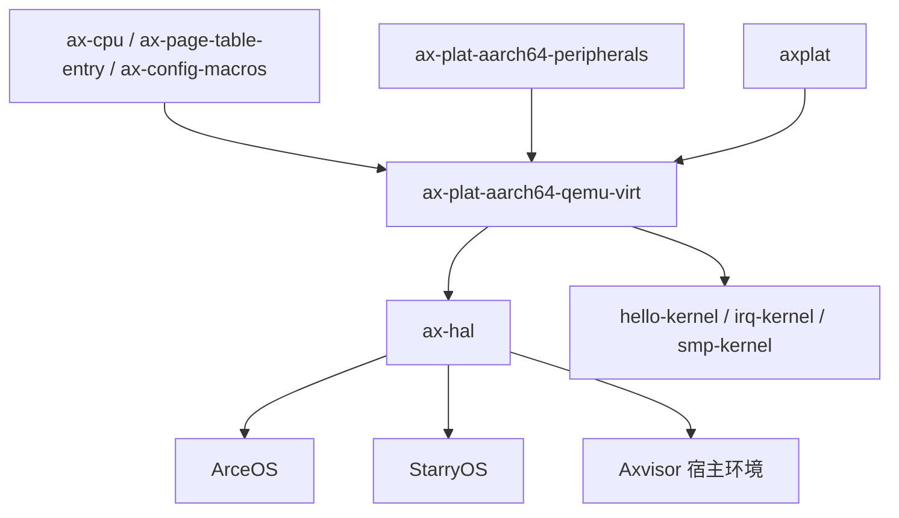

# `ax-plat-aarch64-qemu-virt` 技术文档

> 路径：`components/axplat_crates/platforms/axplat-aarch64-qemu-virt`
> 类型：库 crate
> 分层：组件层 / AArch64 板级平台包
> 版本：`0.3.1-pre.6`
> 文档依据：当前仓库源码、`Cargo.toml`、`README.md`、`axconfig.toml` 及相关上层调用路径

`ax-plat-aarch64-qemu-virt` 是 QEMU ARM64 `virt` 机器在 `axplat` 体系下的具体板级实现。它不是通用外设驱动库，而是把启动入口、早期页表、物理内存布局、PSCI 启停、QEMU `virt` 设备地址表以及 `ax-plat-aarch64-peripherals` 提供的 PL011/GIC/Generic Timer/PL031 glue 组合成一个可以直接被内核链接的完整平台包。

## 1. 架构设计分析

### 1.1 设计定位

该 crate 在 AArch64 平台栈中的位置可以概括为：

- 向下：依赖 `ax-cpu`、`ax-page-table-entry` 和 `ax-plat-aarch64-peripherals`，完成 CPU 模式切换、早期页表和通用外设接入。
- 向上：实现 `InitIf`、`MemIf`、`PowerIf` 等 `axplat` 契约，并通过 `ax_plat::call_main()` 把控制权交给内核主函数。
- 向旁：通过 `axconfig.toml` 固化 QEMU `virt` 板级的 RAM、MMIO、UART、GIC、RTC、PCI ECAM 等地址空间信息。

它与 `ax-plat-aarch64-peripherals` 的区别在于：

- `ax-plat-aarch64-peripherals` 只负责“通用外设怎么接进 `axplat`”；
- 本 crate 负责“QEMU `virt` 这块板子从哪启动、地址在哪里、次核怎么拉起、内核线性映射怎么建”。

### 1.2 模块划分

| 模块 | 作用 | 关键内容 |
| --- | --- | --- |
| `lib.rs` | 导出层与 glue 入口 | `config` 生成、平台包名校验、展开 `console_if_impl!` / `time_if_impl!` / `irq_if_impl!` |
| `boot` | 早期引导与页表 | ARM64 Linux-style 镜像头、主核/次核入口、早期页表、MMU 打开、切到 `call_main()` |
| `init` | `InitIf` 实现 | 主核/次核的早期与后期初始化顺序 |
| `mem` | `MemIf` 实现 | RAM/MMIO 区间、线性映射、内核地址空间范围 |
| `power` | `PowerIf` 实现 | `cpu_boot()`、`system_off()`、`cpu_num()` |
| `config` | 平台常量 | `axconfig.toml` 经 `ax_config_macros::include_configs!` 生成的 `plat` / `devices` / `mem` 常量 |

### 1.3 关键数据结构与全局对象

#### 引导期对象

- `BOOT_STACK`：放在 `.bss.stack` 的主引导栈，大小来自配置。
- `BOOT_PT_L0` / `BOOT_PT_L1`：两个 4K 对齐页表页，使用 `A64PTE` 构造最小可用页表。

这两个页表页承担的是“只够把 CPU 带到 Rust 世界”的职责，而不是最终内核页表：

- L0 指向一页 L1 表。
- 一段映射低地址设备区域。
- 一段映射 QEMU 默认 RAM 起始区。

#### 配置对象

`config` 模块由 `axconfig.toml` 自动展开，至少包含以下几类信息：

- `PACKAGE`、`PHYS_MEMORY_BASE`、`PHYS_MEMORY_SIZE`
- `UART_PADDR`、`GICD_PADDR`、`GICC_PADDR`、`RTC_PADDR`
- `UART_IRQ`、`TIMER_IRQ`
- `MMIO_RANGES`
- `PHYS_VIRT_OFFSET`
- `KERNEL_ASPACE_BASE`、`KERNEL_ASPACE_SIZE`
- `MAX_CPU_NUM`
- `PSCI_METHOD`

`lib.rs` 用 `assert_str_eq!` 校验 `PACKAGE` 与 crate 名一致，防止误绑配置。

#### 外设单例

虽然这些对象定义在 `ax-plat-aarch64-peripherals` 中，但在本平台运行时构成其实际外设后端：

- PL011 串口单例
- GIC 控制器与 IRQ 分发表
- Generic Timer 比率缓存
- PL031 墙钟偏移缓存

### 1.4 启动主线

`boot.rs` 是本 crate 最核心的部分之一，其启动链路如下：

```mermaid
flowchart TD
    A[_start 带 Linux-style 镜像头] --> B[_start_primary]
    B --> C[读取 MPIDR 得到 CPU ID]
    C --> D[保存 DTB 地址与引导参数]
    D --> E[切换到 EL1]
    E --> F[构造早期页表]
    F --> G[打开 MMU]
    G --> H[把 SP 调整到高半区线性映射]
    H --> I[ax_plat::call_main cpu_id dtb]
    I --> J[内核 #[ax_plat::main] 入口]
```

其关键步骤包括：

- 入口镜像头采用 Linux arm64 boot image 风格，便于 QEMU 和常见引导流程识别。
- 主核启动时从 `x0` 保存 DTB 指针，从 `MPIDR_EL1` 抽取逻辑 CPU ID。
- 先在物理地址视角下建立引导栈，再切到 EL1。
- 构造最小页表并打开 MMU，随后按 `PHYS_VIRT_OFFSET` 将栈切换到高半区虚拟地址。
- 最终统一跳转到 `ax_plat::call_main()`。

在 `smp` 打开时，`_start_secondary` 为次核提供类似但更精简的路径：次核栈由上层传入，复用引导页表，打开 MMU 后调用 `ax_plat::call_secondary_main()`。

### 1.5 早期页表与地址空间策略

早期页表的设计故意保持极简，只为了完成从“裸机入口”到“可运行 Rust 初始化代码”的过渡：

- 低地址设备区被映射为 device memory。
- 从 `0x4000_0000` 起的 RAM 区被映射为 normal memory。
- 页表层级只用到 L0/L1，不追求精细权限与完整内核地址空间。

这与最终内核页表的分工非常明确：

- 引导页表：保证启动。
- 上层页表管理：由后续内核内存子系统接管。

### 1.6 初始化与外设接入

`init.rs` 实现了 `ax_plat::init::InitIf`，把板级初始化切成四段：

- `init_early(cpu_id, arg)`：初始化异常向量、PL011、PSCI、Generic Timer，以及可选的 PL031。
- `init_later(cpu_id, arg)`：在 `irq` 打开时初始化 GIC，并使能定时器 IRQ。
- `init_early_secondary(cpu_id)`：次核早期 trap 初始化。
- `init_later_secondary(cpu_id)`：次核 GICC 初始化与定时器 IRQ 使能。

这里最关键的编排是：

- PL011 必须早于绝大多数初始化，以保证故障可打印。
- PSCI 在主核早期就应初始化，便于后续 `cpu_boot()` 和 `system_off()` 使用。
- GIC 必须在后期阶段初始化，因为它依赖更完整的地址映射与异常处理框架。

### 1.7 物理内存与 MMIO 模型

`mem.rs` 直接把 QEMU `virt` 的地址布局转译成 `ax_plat::mem::MemIf`：

- `phys_ram_ranges()` 返回从 `PHYS_MEMORY_BASE` 开始的 RAM 区。
- `reserved_phys_ram_ranges()` 当前为空，表示该平台包不在此层单独声明保留 RAM。
- `mmio_ranges()` 返回配置文件中的 MMIO 窗口集合。
- `phys_to_virt()` / `virt_to_phys()` 使用固定偏移线性映射。
- `kernel_aspace()` 给出内核地址空间基址与大小。

需要特别注意的是，`axconfig.toml` 中会列出：

- UART
- GIC
- RTC
- VirtIO MMIO
- PCI 32-bit MMIO 窗口
- PCI ECAM

但本 crate 只负责把它们作为 MMIO 区间公开，不在此层进行 PCI 枚举或 VirtIO 驱动初始化。

### 1.8 电源管理与多核

`power.rs` 通过 PSCI 完成三件事：

- `system_off()`：关闭整机。
- `cpu_num()`：读取配置中的 CPU 数。
- `cpu_boot(cpu_id, stack_top_paddr)`：使用 `psci::cpu_on()` 拉起次核，并把 `_start_secondary` 的物理地址作为入口传给固件。

这里的设计说明该 crate 不是“被动等待 bootloader 拉起所有核”，而是主动承担 AArch64 QEMU `virt` 多核 bring-up 的板级职责。

## 2. 核心功能说明

### 2.1 主要能力

- 为 QEMU ARM64 `virt` 提供可链接的 `axplat` 平台实现。
- 提供主核和次核入口，负责最小页表和 MMU 打开。
- 暴露 QEMU `virt` 的 RAM、MMIO、线性映射和内核地址空间布局。
- 接入 PL011、GICv2、Generic Timer、PL031 和 PSCI。
- 为 `ax-hal`、示例内核和上层系统提供统一板级运行基础。

### 2.2 典型使用场景

- ArceOS 在 AArch64/QEMU 上作为默认开发和回归平台运行。
- StarryOS 通过 `ax-hal` 间接使用同一板级 bring-up 栈。
- Axvisor 在 AArch64/QEMU 上运行宿主环境时，依赖这套板级支持完成最底层启动。

### 2.3 feature 行为

该 crate 的 feature 很直接地对应到板级能力：

| Feature | 作用 |
| --- | --- |
| `irq` | 编译 GIC glue，并在初始化阶段启用定时器中断路径 |
| `smp` | 编译次核入口、次核初始化和 `cpu_boot()` 路径 |
| `rtc` | 在早期初始化中接入 PL031，为墙钟提供 epoch 偏移 |
| `fp-simd` | 在引导阶段显式打开浮点/SIMD 使用能力 |

这些 feature 的实现位置也很清晰：

- `boot.rs` 处理 `fp-simd`、`smp`
- `init.rs` 处理 `irq`、`rtc`
- `power.rs` 处理 `smp`

## 3. 依赖关系图谱

### 3.1 直接依赖

| 依赖 | 作用 |
| --- | --- |
| `axplat` | 平台抽象接口目标 |
| `ax-cpu` | EL 切换、MMU 初始化和 CPU 辅助操作 |
| `ax-plat-aarch64-peripherals` | PL011/GIC/Generic Timer/PL031/PSCI glue |
| `ax-page-table-entry` | AArch64 页表项构造 |
| `ax-config-macros` | 编译期导入 `axconfig.toml` 配置 |
| `log` | 调试输出 |

### 3.2 主要消费者

- `os/arceos/modules/axhal`：AArch64 默认平台之一。
- `components/axplat_crates/examples/hello-kernel`
- `components/axplat_crates/examples/irq-kernel`
- `components/axplat_crates/examples/smp-kernel`
- Axvisor 宿主侧经 `ax-hal` 间接引入的 AArch64 QEMU 平台栈

### 3.3 关系示意



## 4. 开发指南

### 4.1 配置与裁剪

本 crate 的板级参数来自 `axconfig.toml`，维护时优先关注：

- 物理内存基址与大小
- `PHYS_VIRT_OFFSET`
- UART/GIC/RTC/PPI/SPI 编号
- CPU 数
- PSCI 调用方式
- PCI 与其它 MMIO 窗口

若要为变体平台做实验，可通过自定义配置文件路径覆盖默认配置；同时必须保证 `PACKAGE` 仍与 crate 名匹配。

### 4.2 平台接入主线

1. 链接本 crate，让它作为 AArch64 QEMU `virt` 的板级包进入镜像。
2. 启动入口从 `_start` 进入，在最小页表和 MMU 建立后跳入 `ax_plat::call_main()`。
3. 内核入口通过 `#[ax_plat::main]` 触发 `init_early()` 和 `init_later()`。
4. 上层通过 `axplat` 统一接口访问串口、时间、中断和关机能力。

### 4.3 构建与调试

仅验证 crate 本身时，可做裸机构建：

```bash
cargo build -p ax-plat-aarch64-qemu-virt --target aarch64-unknown-none --features "irq smp rtc"
```

更有意义的调试路径通常是选择依赖它的示例或系统镜像，在 QEMU `virt` 上验证：

- 早期串口是否立即可用
- DTB 是否被正确传到内核
- GIC 和 timer IRQ 是否正常触发
- `cpu_boot()` 是否能拉起次核
- `system_off()` 是否能通过 PSCI 退出 QEMU

### 4.4 维护注意事项

- 引导页表只映射最小区域，若改动 RAM 基址或设备区布局，需要同步检查 `boot.rs` 中的块映射假设。
- `mmio_ranges()` 只是公开窗口，不代表这些设备已经在本层初始化或可直接驱动。
- 若修改 `PHYS_VIRT_OFFSET`，需要同时检查引导栈、次核入口和上层页表安装逻辑。
- `irq`、`smp`、`rtc` 的行为跨越 `boot.rs`、`init.rs` 和 `power.rs`，改动任一处都应做整机回归。

## 5. 测试策略

### 5.1 推荐测试覆盖

- 启动冒烟：验证 `_start` 到 `ax_plat::call_main()` 的完整引导链。
- 中断验证：在 `irq` 打开时验证 GIC 初始化、定时器 IRQ 和 UART IRQ 路径。
- 多核验证：在 `smp` 打开时验证次核能进入 `call_secondary_main()`。
- RTC 验证：在 `rtc` 打开时验证 `epochoffset_nanos()` 能使墙钟合理推进。
- 配置验证：故意构造错误 `PACKAGE` 或错误 IRQ 号，确认构建或运行能尽早暴露问题。

### 5.2 现有有效验证面

- 示例内核 `hello-kernel`、`irq-kernel`、`smp-kernel` 可以覆盖主启动链、IRQ 和多核路径。
- 该平台是 ArceOS AArch64/QEMU 的主力默认平台之一，因此实际回归频率通常高于专用板卡平台。

### 5.3 风险点

- 该 crate 同时承担“引导代码”和“平台抽象实现”两类职责，回归面大。
- 启动页表与最终内核地址空间之间存在阶段切换，任何地址计算错误都可能在极早期导致静默故障。
- PSCI 方法和 GIC/PPI 编号都依赖配置，配置漂移会直接破坏关机、多核或时钟中断。

## 6. 跨项目定位分析

| 项目 | 位置 | 角色 | 核心作用 |
| --- | --- | --- | --- |
| ArceOS | AArch64 默认平台包之一 | QEMU `virt` 板级实现 | 为 ArceOS 提供最常用的 ARM64 开发/回归环境，覆盖启动、串口、时间、中断和多核基础设施 |
| StarryOS | 通过 `ax-hal` 间接接入 | 宿主板级运行底座 | StarryOS 在 AArch64/QEMU 上运行时，底层仍复用这套平台初始化和硬件布局描述 |
| Axvisor | 宿主环境的板级基础 | AArch64 hypervisor 宿主 bring-up 层 | Axvisor 的虚拟化核心不在本 crate 中，但若其宿主环境跑在 AArch64/QEMU 上，最低层启动、串口、时钟和 PSCI 基础能力由该 crate 提供 |

## 7. 总结

`ax-plat-aarch64-qemu-virt` 把 QEMU ARM64 `virt` 机器的“板级事实”转译成 `axplat` 可以消费的形式：它知道从哪里启动、如何打开 MMU、哪些地址属于 RAM 或 MMIO、如何通过 PSCI 拉起次核、如何把 PL011/GIC/Timer/RTC 接上统一接口。对 ArceOS 生态而言，它不仅是一个可用平台包，更是 AArch64 开发和回归的主力参考实现。
