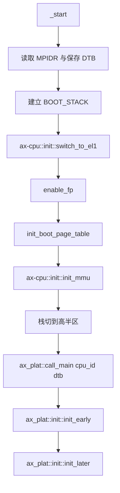
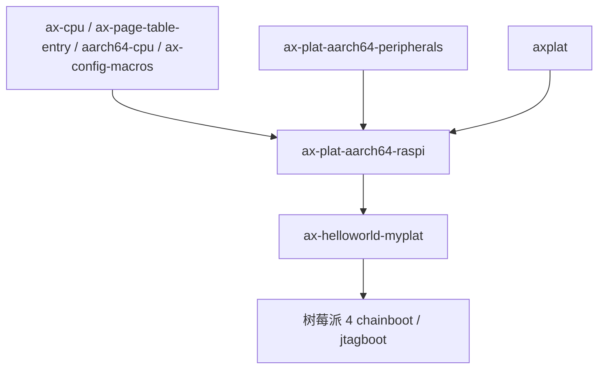

# `ax-plat-aarch64-raspi` 技术文档

> 路径：`components/axplat_crates/platforms/axplat-aarch64-raspi`
> 类型：库 crate
> 分层：组件层 / AArch64 板级平台包
> 版本：`0.3.1-pre.6`
> 文档依据：当前仓库源码、`Cargo.toml`、`README.md`、`axconfig.toml`、`src/boot.rs`、`src/init.rs`、`src/mem.rs`、`src/power.rs`、`src/mp.rs`，以及仓库内 Raspberry Pi 4 启动/调试说明

`ax-plat-aarch64-raspi` 是 Raspberry Pi 4B 在 `axplat` 体系下的板级平台包。它把树莓派 4 的启动入口、早期页表、PL011/GIC/Generic Timer 接线、spin-table 多核唤醒、固定物理内存布局和最小电源语义组织成 `axplat` 接口，使内核能够在这块板子上以统一方式完成 bring-up。它不是树莓派外设全集，也不是设备树解释器；它只负责把“把板子带起来”所需的那一小层能力稳定地交给上层。

## 1. 架构设计分析

### 1.1 真实定位

这个 crate 的平台定位和 `aarch64-qemu-virt`、`aarch64-phytium-pi` 有一个关键区别：**多核和电源路径不是通过 PSCI，而是通过树莓派自己的 spin-table 与本地停机语义完成。**

具体来说：

- 启动、页表和 `MemIf`/`PowerIf` 由本 crate 自己实现。
- 控制台、时间和可选中断路径复用 `ax-plat-aarch64-peripherals` 的 PL011、Generic Timer、GIC glue。
- 次核启动不走固件接口，而是写入固定物理地址的 spin-table，并通过 `sev` 唤醒。
- `system_off()` 当前没有真正的板级关机实现，只是打印日志后停机循环。

因此它更像一个“树莓派 4 bring-up 平台包”，而不是“完整板卡运行时支持层”。

### 1.2 模块划分

| 模块 | 作用 | 关键内容 |
| --- | --- | --- |
| `lib.rs` | crate 根与 glue 汇总 | `config` 生成、包名校验、PL011/Timer/GIC 接口宏展开 |
| `boot` | 最早期引导 | 主核/次核入口、引导页表、MMU 打开 |
| `init` | `InitIf` 实现 | trap、PL011、Generic Timer、可选 GIC 初始化 |
| `mem` | `MemIf` 实现 | RAM/MMIO 描述、线性映射、spin-table 保留区 |
| `power` | `PowerIf` 实现 | 次核启动封装、当前的停机式 `system_off()` |
| `mp` | 树莓派 SMP bring-up | 写 spin-table、刷新 cache、`sev` 唤醒次核 |

### 1.3 启动与次核主线

主核启动链相对直接，没有额外固件接口参与：



与很多 ARM 板卡不同，树莓派 4 的次核路径由 `mp.rs` 显式实现：

- `CPU_SPIN_TABLE` 固定使用物理地址 `0xd8`、`0xe0`、`0xe8`、`0xf0`。
- `SECONDARY_STACK_TOP` 先缓存次核栈顶物理地址。
- `modify_stack_and_start()` 会在次核真正执行 `_start_secondary` 前，把栈顶从高半区虚拟地址转换回物理视角。
- 主核把次核入口地址写进 spin-table 后，调用 `sev()` 发事件唤醒。

这条主线说明：**树莓派 4 的 SMP bring-up 是本 crate 的板级职责，不属于 `ax-plat-aarch64-peripherals`，也不属于 `ax-cpu`。**

### 1.4 与相邻层的边界

| 层 | 负责内容 | 不负责内容 |
| --- | --- | --- |
| `ax-cpu` | EL 切换、MMU 打开、trap 初始化、cache flush、`halt()` | spin-table 地址、PL011/GIC 基地址、树莓派电源语义 |
| `ax-plat-aarch64-peripherals` | PL011、Generic Timer、GIC 的通用 glue | 树莓派启动入口、spin-table SMP、内存保留区、电源管理 |
| `ax-plat-aarch64-raspi` | 启动页表、spin-table 次核启动、`MemIf`/`PowerIf` | 设备树解析、驱动枚举、完整关机流程 |
| `ax-hal` | 若上层接入，则负责更高层的 DTB、内存区域整合和运行时初始化 | 树莓派本地的启动寄存器和次核释放语义 |

这里最值得写清的边界有四点：

- `dtb` 指针会被传给 `ax_plat::call_main()`，但本 crate 的 `init.rs` 并不消费 DTB；板级地址来自 `axconfig.toml`。
- `mem.rs` 会把 `0..0x1000` 标记为保留区，因为这页包含 spin-table；它不是普通可分配 RAM。
- `PowerIf::cpu_boot()` 只是对 `mp::start_secondary_cpu()` 的封装，底层不是 PSCI。
- `PowerIf::system_off()` 当前只是 `halt()` 循环，不能把它理解成真正的硬件掉电。

### 1.5 内存与设备模型

这个平台的 `MemIf` 实现有几个需要精确认识的点：

- RAM 视图是从物理地址 `0x0` 开始的 2 GiB。
- 低 4 KiB 被保留给次核 spin-table，不可分配但仍需映射。
- MMIO 窗口包含 PL011、eMMC 和 GICv2 基地址。
- 线性映射使用固定 `PHYS_VIRT_OFFSET`，并不在本层处理运行时总线枚举。

`boot.rs` 中的引导页表还透露了一个板级假设：

- 低 3 GiB 被映射为普通内存属性。
- `0xC000_0000..0x1_0000_0000` 被映射为 device memory。

这不是最终内核页表的全貌，而只是为了在树莓派 4 上顺利完成“从入口到 Rust 平台初始化”的最小映射。

## 2. 核心功能说明

### 2.1 主要能力

- 提供树莓派 4 的 AArch64 启动入口与引导页表。
- 通过 PL011 提供早期控制台输出。
- 通过 Generic Timer 提供单调时间。
- 在 `irq` 打开时初始化 GIC 并使能定时器中断。
- 通过 spin-table + `sev` 实现次核唤醒。
- 对上暴露 RAM、MMIO、线性映射和内核地址空间边界。

### 2.2 feature 行为

| Feature | 作用 | 主要落点 |
| --- | --- | --- |
| `fp-simd` | 启动期提前打开 FP/SIMD | `boot.rs` |
| `irq` | 编译并初始化 GIC 路径 | `lib.rs`、`init.rs` |
| `smp` | 编译 spin-table 次核路径和 `cpu_boot()` | `boot.rs`、`mp.rs`、`power.rs` |
| `rtc` | `Cargo.toml` 明确标注“Not implemented, currently no effect” | `Cargo.toml` |

也就是说，树莓派平台当前的 `rtc` feature 是显式 no-op；它不是“实现待验证”，而是“源码就还没接”。

### 2.3 最关键的边界澄清

这个 crate 最容易被误解的地方有两个：

第一，它虽然接了 GIC 和 PL011，但并没有完成“树莓派全板外设支持”。例如 eMMC 只是作为 MMIO 窗口暴露，具体驱动不在本 crate 中。

第二，它虽然实现了 `PowerIf`，但其中一半语义是“平台占位”：

- `cpu_boot()` 是真实的树莓派板级 SMP 逻辑。
- `system_off()` 目前不是硬件掉电，只是停机循环。

对上层而言，这意味着：

- 可以把它当作“能启动、能打印、能计时、能处理中断、能拉起次核”的最小平台包。
- 不能把它当作“已经完整支持电源管理和设备树外设发现”的成熟板级支持包。

## 3. 依赖关系图谱

### 3.1 直接依赖

| 依赖 | 作用 |
| --- | --- |
| `axplat` | 平台抽象接口与 `call_main()` 契约 |
| `ax-cpu` | EL 切换、MMU 初始化、trap 初始化、cache flush、停机 |
| `ax-plat-aarch64-peripherals` | PL011、Generic Timer、GIC glue |
| `ax-page-table-entry` | AArch64 引导页表项构造 |
| `aarch64-cpu` | 直接使用 `sev()` 指令唤醒次核 |
| `ax-config-macros` | 把 `axconfig.toml` 生成为 `config` 常量 |
| `log` | 启动与停机日志 |

### 3.2 主要消费者

- `os/arceos/examples/helloworld-myplat`：仓库里的直接使用者。
- 仓库文档中的树莓派 4 chainboot / jtagboot bring-up 路径。
- 仓库外直接链接平台包的树莓派裸机内核。

### 3.3 依赖关系示意



## 4. 开发指南

### 4.1 接入方式

典型依赖方式如下：

```toml
[dependencies]
ax-plat-aarch64-raspi = { workspace = true, features = ["irq", "smp"] }
```

并在依赖树某处显式链接：

```rust
extern crate axplat_aarch64_raspi;
```

若走当前仓库文档里的树莓派开发路径，通常会搭配：

- `MYPLAT=ax-plat-aarch64-raspi`
- `make chainboot`
- 或调试时使用 `make jtagboot`

这些命令属于镜像加载流程，不改变本 crate 的职责边界。

### 4.2 修改时的重点关注

- 若改动 `CPU_SPIN_TABLE` 地址，必须把它当成板级启动协议变更，而不是普通常量调整。
- 若改动 `PHYS_VIRT_OFFSET` 或内核基址，要同步检查 `modify_stack_and_start()` 对栈地址的物理/虚拟换算。
- 若想真正支持关机，不能只改 `power.rs` 里的日志；需要补齐树莓派板级掉电路径。
- 若引入新的外设支持，应优先判断它应该放在本 crate、`ax-plat-aarch64-peripherals`，还是更上层驱动模块里。

### 4.3 一个必须牢记的事实

树莓派平台在仓库里的主要定位仍然是“板卡 bring-up 路径”，不是 `ax-hal` 默认平台。换言之，它更适合：

- 实板启动验证
- myplat 风格实验内核
- 调试早期引导和多核路径

而不是被误认为“已经接到 ArceOS 默认平台栈的全功能树莓派支持”。

## 5. 测试策略

### 5.1 当前有效验证面

- 交叉编译验证 AArch64 裸机构建是否完整。
- `ax-helloworld-myplat` 覆盖最小启动与控制台。
- 树莓派 4 的 chainboot / jtagboot 是最重要的真实验证路径。

### 5.2 推荐测试矩阵

- 启动冒烟：确认 `_start -> ax_plat::call_main()` 能贯通。
- 控制台验证：确认 PL011 在极早期就能输出。
- IRQ 验证：打开 `irq` 后验证 GIC 和 timer IRQ。
- SMP 验证：打开 `smp` 后验证 spin-table + `sev` 能拉起次核。
- 保留区验证：确认 `0..0x1000` 未被错误当作普通可分配 RAM。
- 停机验证：确认 `system_off()` 当前行为确实是停机循环，而不是静默返回。

### 5.3 高风险点

- spin-table 地址和 cache flush 语义错误会直接导致次核“完全没有反应”。
- `rtc` feature 当前无效，若测试脚本据此判断墙钟能力，会得到错误结论。
- `system_off()` 只是占位语义，若上层默认它能掉电，测试和产品化都会踩坑。

## 6. 跨项目定位分析

| 项目 | 位置 | 角色 | 核心作用 |
| --- | --- | --- | --- |
| ArceOS | `myplat`/实板 bring-up 路径 | 树莓派 4 板级平台包 | 当前仓库内主要通过 `ax-helloworld-myplat` 和配套调试文档使用，未进入 `ax-hal::defplat` 默认平台集 |
| StarryOS | 当前无仓库内直接接入 | 潜在宿主平台包 | 若未来接入，也更可能作为定制平台直接链接，而不是现成默认平台 |
| Axvisor | 当前无仓库内直接接入 | 潜在宿主 bring-up 基础 | 本 crate 不提供虚拟化能力，只能承担树莓派宿主板级 bring-up；当前仓库没有直接依赖 |

## 7. 总结

`ax-plat-aarch64-raspi` 的价值，在于它把树莓派 4 这块板子的启动现实准确压缩成了 `axplat` 语义：入口怎么进、页表先怎么铺、PL011 和 GIC 怎样接、次核如何靠 spin-table 被释放、哪些内存必须保留。它目前是一份偏实板 bring-up 的平台包，其中 SMP 路径是真实实现，而关机和 RTC 仍处于未完成状态，这一点必须在使用和维护时讲清楚。
