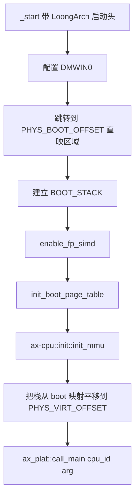
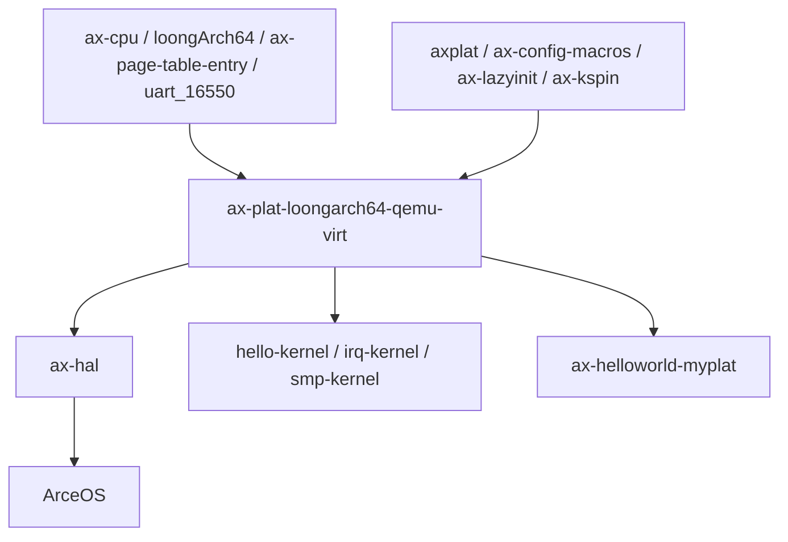

# `ax-plat-loongarch64-qemu-virt` 技术文档

> 路径：`components/axplat_crates/platforms/axplat-loongarch64-qemu-virt`
> 类型：库 crate
> 分层：组件层 / LoongArch64 板级平台包
> 版本：`0.3.1-pre.6`
> 文档依据：当前仓库源码、`Cargo.toml`、`README.md`、`axconfig.toml`、`src/boot.rs`、`src/init.rs`、`src/console.rs`、`src/time.rs`、`src/irq.rs`、`src/mem.rs`、`src/power.rs`、`src/mp.rs`

`ax-plat-loongarch64-qemu-virt` 是 QEMU LoongArch 虚拟机在 `axplat` 体系下的完整平台实现。它不是“只提供启动代码”的薄封装，而是自己承担了控制台、时间、中断、电源、内存和可选多核的全部板级落地工作：从 LoongArch 启动头、DMW 映射和早期页表，到 16550 串口、LoongArch timer CSR、EIOINTC/PCH PIC、GED 关机寄存器，几乎都在本 crate 内部完成。

## 1. 架构设计分析

### 1.1 真实定位

与 AArch64 那几个平台包不同，这个 crate **没有依赖独立的“通用外设 glue crate”**。它自己同时实现了：

- `ConsoleIf`
- `InitIf`
- `TimeIf`
- `IrqIf`
- `MemIf`
- `PowerIf`

这使它在平台栈中的位置非常清晰：

- 向下依赖 `ax-cpu`、`loongArch64`、`uart_16550` 等架构/设备库。
- 向上直接把 LoongArch QEMU virt 的全部最小平台能力暴露给 `axplat`。
- 在仓库里既是 `ax-hal` 的 LoongArch 默认平台之一，也是 `hello-kernel`、`irq-kernel`、`smp-kernel` 的示例平台。

这意味着它不是“仅供样例演示”的平台包，而是当前 LoongArch 路径里的主力参考实现。

### 1.2 模块划分

| 模块 | 作用 | 关键内容 |
| --- | --- | --- |
| `boot` | 最早期引导 | LoongArch 启动头、DMW 配置、引导页表、MMU 打开、主核/次核入口 |
| `console` | `ConsoleIf` 实现 | MMIO 16550 串口单例与收发逻辑 |
| `time` | `TimeIf` 实现 | timer CSR、tick/纳秒换算、可选 LS7A RTC、oneshot timer |
| `irq` | `IrqIf` 实现 | Timer/IPI/外部中断分发、EIOINTC 与 PCH PIC 接线 |
| `init` | `InitIf` 实现 | trap、串口、时钟、中断初始化顺序 |
| `mem` | `MemIf` 实现 | 双线性映射、RAM/MMIO 区间、boot_info/FDT 保留区 |
| `power` | `PowerIf` 实现 | GED 关机、可选次核启动封装 |
| `mp` | SMP bring-up | 通过 CSR mail 和 IPI 传递次核入口与栈顶 |

### 1.3 启动与双映射策略

这个 crate 最关键的设计，不是某个单独设备，而是引导期和运行期并存的两套地址语义：

- `PHYS_BOOT_OFFSET`：引导期使用的直接映射窗口，配合 DMW 工作。
- `PHYS_VIRT_OFFSET`：内核运行期使用的高半区线性映射。

`boot.rs` 中的主线如下：



这套设计带来两个重要后果：

- `virt_to_phys()` 不能简单做一次固定偏移减法，而要区分地址到底来自 boot window 还是运行期 window。
- 早期页表不仅要考虑内核代码所在高内存，还要覆盖 LoongArch QEMU virt 的低地址设备区。

代码里实际的引导页表策略是：

- `0..256 MiB` 映射为普通可执行内存。
- `256 MiB..1 GiB` 在引导页表里按 device memory 处理，用于覆盖低地址设备区。
- `0x8000_0000..0xC000_0000` 额外映射为普通可执行内存。

这说明它的引导页表是在“保证启动成功”和“覆盖平台必要设备”之间做的最小平衡，而不是最终内核页表的完整表示。

### 1.4 中断拓扑与运行期职责

LoongArch QEMU virt 的中断模型在这个 crate 里被明确分层了：

| IRQ 类型 | 来源 | 本 crate 中的实现位置 |
| --- | --- | --- |
| Timer IRQ | LoongArch timer CSR | `time.rs` + `irq.rs` |
| IPI | IOCSR IPI 寄存器 | `irq.rs` |
| 外部中断入口 | EIOINTC | `irq/eiointc.rs` |
| 实际外设 IRQ | PCH PIC | `irq/pch_pic.rs` |

`IrqIf::handle()` 的关键逻辑不是简单查表，而是：

1. 先判断当前 IRQ 是 timer、IPI 还是外部中断入口。
2. 若是 `EIOINTC_IRQ`，再向 EIOINTC 认领真实外部 IRQ。
3. 将真实 IRQ 分发到 `HandlerTable`。
4. 最后按中断类型执行 timer clear 或 EIOINTC completion。

这说明该 crate 并不是“把某个现成中断控制器整体包起来”，而是把 LoongArch virt 的级联中断拓扑消化后，重新对上暴露 `ax_plat::irq` 语义。

### 1.5 与相邻层的边界

| 层 | 负责内容 | 不负责内容 |
| --- | --- | --- |
| `ax-cpu` | trap 初始化、MMU 打开、FP/LSX 使能、停机等 CPU 原语 | 串口、GED、EIOINTC/PCH PIC、平台地址窗口 |
| `ax-plat-loongarch64-qemu-virt` | 启动头、地址映射、中断拓扑、串口、时间、关机、SMP glue | 调度、页表管理策略、驱动枚举、上层 HAL 组合 |
| `ax-hal` | 上层统一内存视图、DTB/bootarg 进一步整合、运行时初始化组织 | LoongArch virt 本地寄存器初始化与外设语义 |

还要额外澄清两点：

- `boot.rs` 当前把第二个参数 `arg` 固定传成 `0`，并留有 `TODO: parse dtb`；也就是说，本 crate 目前并不真正解析设备树。
- `mem.rs` 虽然保留了 `0..0x200000` 作为 `boot_info + fdt` 区，但这只是内存保留语义，不等于平台已经把 FDT 接进运行期配置系统。

## 2. 核心功能说明

### 2.1 主要能力

- 为 LoongArch QEMU virt 提供可直接链接的启动入口。
- 提供基于 MMIO 16550 的控制台实现。
- 提供基于 LoongArch timer CSR 的单调时间与 oneshot timer。
- 在 `irq` 打开时提供 timer、IPI 和外部中断处理。
- 暴露低内存/高内存 RAM 视图、MMIO 窗口和内核地址空间边界。
- 通过 GED syscon 实现关机。
- 在 `smp` 打开时通过 CSR mail + IPI 唤醒次核。

### 2.2 feature 行为

| Feature | 作用 | 主要落点 |
| --- | --- | --- |
| `fp-simd` | 启动期开启 FP/LSX | `boot.rs` |
| `irq` | 编译中断控制器和定时器中断路径 | `irq.rs`、`time.rs`、`init.rs` |
| `rtc` | 通过 `chrono` 和 LS7A RTC 计算墙钟偏移 | `time.rs` |
| `smp` | 编译次核启动路径，并自动依赖 `irq` | `mp.rs`、`init.rs`、`power.rs` |

`smp` 这一项需要特别小心理解：

- 代码里已经有完整的次核启动框架。
- 但默认 `axconfig.toml` 里 `MAX_CPU_NUM = 1`。
- `irq/eiointc.rs` 还写着 `TODO: support smp`。

所以当前实现是“结构上支持 SMP，默认配置和部分中断控制器实现仍偏单核”。

### 2.3 内存与设备模型

`mem.rs` 把平台资源分成三类：

- RAM：低内存与高内存两段。
- 保留区：`0..0x200000` 预留给 boot_info 和 FDT。
- MMIO：PIC、RTC、GED、UART、PCI ECAM 和 PCI RANGES。

但这些描述的含义要分层理解：

- 本 crate 负责把窗口告诉上层。
- 本 crate 只真正初始化了串口、RTC、定时器、中断和 GED。
- PCI 枚举、设备管理和更复杂驱动不在这里。

### 2.4 最关键的边界澄清

这个平台包不是“LoongArch 版本的 `ax-hal`”，也不是“设备树平台层”：

- `axplat` 是它实现的目标接口。
- `ax-hal` 是消费它的更高一层。
- FDT 目前只体现在保留区和 TODO 注释里，尚未成为本 crate 的运行时配置来源。

## 3. 依赖关系图谱

### 3.1 直接依赖

| 依赖 | 作用 |
| --- | --- |
| `axplat` | 平台抽象接口与 `call_main()` 契约 |
| `ax-cpu` | trap/MMU/FP/LSX/停机等 LoongArch CPU 原语 |
| `loongArch64` | CSR、IOCSR、IPI、timer 等底层寄存器访问 |
| `uart_16550` | MMIO 16550 控制台 |
| `ax-page-table-entry` | LoongArch64 引导页表项构造 |
| `ax-config-macros` | 把 `axconfig.toml` 生成为 `config` 常量 |
| `ax-lazyinit` / `ax-kspin` | 串口和全局状态初始化保护 |
| `chrono` | `rtc` 打开时的墙钟时间解析 |
| `log` | 启动与调试日志 |

### 3.2 主要消费者

- `os/arceos/modules/axhal`：当前 LoongArch 默认平台路径之一。
- `components/axplat_crates/examples/hello-kernel`
- `components/axplat_crates/examples/irq-kernel`
- `components/axplat_crates/examples/smp-kernel`
- `os/arceos/examples/helloworld-myplat`

### 3.3 依赖关系示意



## 4. 开发指南

### 4.1 接入方式

作为平台包使用时，最常见的依赖方式如下：

```toml
[dependencies]
ax-plat-loongarch64-qemu-virt = { workspace = true, features = ["irq", "smp", "rtc"] }
```

如果是 ArceOS 默认平台链路，通常由 `ax-hal` 的 `defplat` 和 LoongArch 目标自动带入；如果是示例内核，则直接依赖该平台包即可。

### 4.2 修改时需要成组验证的点

- 改动 `boot.rs` 的地址映射时，必须同步验证 `mem.rs::virt_to_phys()`，否则 boot window 和运行期 window 会出现转换错位。
- 改动 `irq.rs` 时，不能只测 timer IRQ；必须把 timer、IPI、外部中断三条路径分别回归。
- 改动 `time.rs` 的 timer 或 RTC 路径时，要同时验证单调时钟、墙钟和 oneshot timer。
- 若要把 SMP 真正作为常规能力启用，必须同步处理 `MAX_CPU_NUM` 配置和 `eiointc` 的 SMP TODO。

### 4.3 一个很容易忽略的约束

虽然这个 crate 当前已经是 LoongArch 默认平台之一，但它仍保留了明显的“继续演进空间”：

- DTB 尚未解析。
- EIOINTC 的 SMP 支持仍是 TODO。
- SMP 默认配置仍是单核。

因此它是“主力参考实现”，但还不是“所有 LoongArch virt 能力都完全收敛完成”的终局形态。

## 5. 测试策略

### 5.1 当前有效验证面

- `ax-hal` 默认平台链路会持续编译和运行它。
- `hello-kernel`、`irq-kernel`、`smp-kernel` 分别覆盖最小启动、中断和多核路径。
- `ax-helloworld-myplat` 提供额外的直接平台验证入口。

### 5.2 推荐测试矩阵

- 启动冒烟：验证 `_start -> ax_plat::call_main()` 完整链路。
- 控制台验证：确认 MMIO 16550 早期即可工作。
- Timer 验证：确认 tick 递增、oneshot timer 和 timer IRQ 均正确。
- RTC 验证：启用 `rtc` 后确认 `epochoffset_nanos()` 合理。
- 外部 IRQ 验证：验证 EIOINTC 认领与 PCH PIC 屏蔽/使能逻辑。
- GED 验证：确认 `system_off()` 能退出 QEMU。
- SMP 预备验证：启用 `smp` 后至少确认次核入口和 IPI 管道可达。

### 5.3 高风险点

- boot 映射与运行期映射并存，地址换算错误会以非常隐蔽的方式出现。
- `arg` 目前固定为 0，任何假设“FDT 已接入”的上层逻辑都会出错。
- `smp` 代码和默认单核配置之间存在张力，测试必须区分“代码存在”和“默认配置已开启”。

## 6. 跨项目定位分析

| 项目 | 位置 | 角色 | 核心作用 |
| --- | --- | --- | --- |
| ArceOS | LoongArch 默认平台路径 | 主力板级平台包 | 直接进入 `ax-hal` 默认平台链路，并被多个示例内核复用，是当前仓库里最重要的 LoongArch 平台实现之一 |
| StarryOS | 当前无仓库内直接依赖 | 潜在宿主平台基础 | 若未来 StarryOS 走 LoongArch + ArceOS HAL 路线，可复用该平台包，但当前仓库未直接接线 |
| Axvisor | 当前无仓库内直接依赖 | 潜在宿主板级支持 | 本 crate 不提供虚拟化能力，只提供宿主平台 bring-up 基础；当前仓库没有直接依赖 |

## 7. 总结

`ax-plat-loongarch64-qemu-virt` 是一个完整度很高的 LoongArch 平台包：启动、串口、时间、中断、内存和关机都在本 crate 内部自洽落地。它最关键的设计，不是单个设备驱动，而是把 LoongArch virt 的地址映射、中断级联和最小运行环境整理成了稳定的 `axplat` 契约，因此它既适合作为当前仓库的默认 LoongArch 平台，也适合作为后续平台演进的参考基线。
